# GBZ 185.6-2026

<!-- Page 1 -->

ICS 35.100
CCS L 79
中 华 人 民 共 和 国 国 家 标 准 化 指 导 性 技 术 文 件
GB/Z 185.6—2026
人工智能 智能体互联
第 部分 智能体交互
6
：
Artificial intelligence—Agent interconnection—
Part 6： Agent interaction
2026⁃05⁃22 发布
国 家 市 场 监 督 管 理 总 局
发 布
国 家 标 准 化 管 理 委 员 会

<!-- Page 3 -->

GB/Z 185.6—2026
目 次
前言··························································································································Ⅲ
引言··························································································································Ⅳ
1 范围·······················································································································1
2 规范性引用文件········································································································1
3 术语和定义··············································································································1
4 缩略语····················································································································1
5 总体要求·················································································································1
6 智能体交互的模式·····································································································2
7 智能体交互的内容元素及关系······················································································3
8 智能体交互流程········································································································6
附录 A（ 资料性） 智能体交互点对点模式的实现参考···························································8
附录 B（ 资料性） 智能体协作方式及实现参考···································································10
Ⅰ

<!-- Page 5 -->

GB/Z 185.6—2026
前 言
本文件为规范类指导性技术文件。
本文件按照 GB/T 1.1—2020《标准化工作导则 第 1 部分：标准化文件的结构和起草规则》的规
定起草。
本文件是 GB/Z 185《人工智能 智能体互联》的第 6 部分。GB/Z 185 已经发布了以下部分：
——第 1 部分：总体架构；
——第 2 部分：身份码；
——第 3 部分：身份管理；
——第 4 部分：智能体描述；
——第 5 部分：智能体发现；
——第 6 部分：智能体交互；
——第 7 部分：智能体工具调用。
请注意本文件的某些内容可能涉及专利。本文件的发布机构不承担识别专利的责任。
本文件由全国信息技术标准化技术委员会（SAC/TC 28）提出并归口。
本文件起草单位：北京邮电大学、中国电子技术标准化研究院、华为技术有限公司、联通数据智能
有限公司、中移互联网有限公司、阿里云计算有限公司、蚂蚁科技集团股份有限公司、北京浩瀚深度信
息技术股份有限公司、江苏金服数字集团人工智能科技有限公司、中移动信息技术有限公司、京东方科
技集团股份有限公司、亚信科技（中国）有限公司、咪咕文化科技有限公司、中国电力科学研究院有限公
司、浪潮通信信息系统有限公司、联想（北京）有限公司、昆仑数智科技有限责任公司、中国移动通信集
团有限公司、中兴通讯股份有限公司、浙江大学、浙江大华技术股份有限公司、北京火山引擎科技有限
公司、南京理工大学、晨晞数智（北京）科技有限公司、浪潮软件科技有限公司、中移（杭州）信息技术有
限公司、北京宝兰德软件股份有限公司、北京智芯微电子科技有限公司、中移雄安信息通信科技有限公
司、北京兴云数科技术有限公司、浪潮云信息技术股份公司、厦门市美亚柏科信息安全研究所有限公
司、成都理工大学、浪潮通用软件有限公司、中移九天人工智能科技（北京）有限公司、浪潮电子信息产
业股份有限公司、中电信数智科技有限公司。
本文件主要起草人：李珂、范科峰、李晨、陈海锋、邵熠阳、王海波、刘军、徐浩、崔彬、高歌、庞韶敏、
苗宗利、禹可、张其濛、管俊明、孙昊、姜幸群、张联华、马丽萌、李琰、杨语澈、肖红梅、李斌、刘伟东、尚云云、
张宏伟、魏遵博、郝冠亚、孔维生、王靖萱、邵俊谦、曹汐、丁一凡、王珂琛、徐桦、詹年科、程晗蕾、陆仲达、
刘勇、杨佳丽、郑佳佳、阙锦龙。
Ⅲ

<!-- Page 6 -->

GB/Z 185.6—2026
引 言
随着人工智能技术迅猛发展，智能体作为人工智能从概念转化为实际生产力的关键载体，在各领
域应用日益广泛，对赋能新型工业化、塑造新质生产力作用显著。然而，当前智能体产业发展面临诸多
挑战，不同智能体间存在互联互通互操作难题，在基于协议的智能体互联领域，国际上已有 MCP、
A2A、ANP 等智能体通信协议，但并未形成行业完全共识的方案，亟需制定适合国内智能体产业发展
的行业统一共识方案。
为系统化解决上述问题，引导和规范智能体互联技术发展，提升智能体系统的互操作性、可组合性
与整体产业效能，特制定本指导性技术文件。GB/Z 185《人工智能 智能体互联》旨在规定智能体互
联的技术要求和流程，其编制遵循系统性、先进性和可操作性原则，为智能体之间实现跨平台、跨架构
的互联、互通、互操作提供统一的技术框架和标准依据，GB/Z 185 拟由七个部分构成。
——第 1 部分：总体架构。目的在于给出智能体互联环境中的概念模型、功能模型。
——第 2 部分：身份码。目的在于给出智能体身份码定义和应用，给出身份码代码结构和分配原
则的建议。
——第 3 部分：身份管理。目的在于给出智能体互联环境中的身份管理框架和全生命周期过程，
描述身份管理的技术要求。
——第 4 部分：智能体描述。目的在于给出智能体的描述方法，提供智能体描述注册、变更和发布
的参考流程。
——第 5 部分：智能体发现。目的在于给出智能体互联的发现流程。
——第 6 部分：智能体交互。目的在于给出智能体海量互联时的交互模式，描述交互基础元素及
接口定义。
——第 7 部分：智能体工具调用。目的在于给出基于大模型的智能体调用工具的标准化架构、流
程及工具描述，支持智能体与外部工具的无缝集成。
Ⅳ

<!-- Page 7 -->

GB/Z 185.6—2026
人工智能 智能体互联
第 6部分：智能体交互
1 范围
本文件给出了智能体互联系统中智能体交互过程涉及模式、内容元素及关系、交互流程和实现
参考。
本文件适用于为智能体互联系统的设计提供参考。
2 规范性引用文件
下列文件中的内容通过文中的规范性引用而构成本文件必不可少的条款。其中，注日期的引用文
件，仅该日期对应的版本适用于本文件；不注日期的引用文件，其最新版本（包括所有的修改单）适用于
本文件。
GB/Z 185.1—2026 人工智能 智能体互联 第 1 部分：总体架构
GB/Z 185.5—2026 人工智能 智能体互联 第 5 部分：智能体发现
3 术语和定义
GB/Z 185.1—2026 界定的以及下列术语和定义适用于本文件。
3.1
智能体交互 agent interaction
智能体间为达到特定目的，协同作业而进行的信息交换过程。
3.2
请求智能体 requester agent
在智能体交互中发起服务需求的智能体。
3.3
服务智能体 service agent
在智能体交互中提供服务响应与功能支持的智能体。
4 缩略语
下列缩略语适用于本文件。
MIME：多用途互联网邮件扩展（Multipurpose Internet Mail Extensions）
5 总体要求
请求智能体通过智能体发现功能寻获符合能力要求的服务智能体（按 GB/Z 185.5—2026）后，在
双方身份鉴别通过的基础上，遵循本文件与已通过鉴别的服务智能体进行信息交换与协同作业。
1

<!-- Page 8 -->

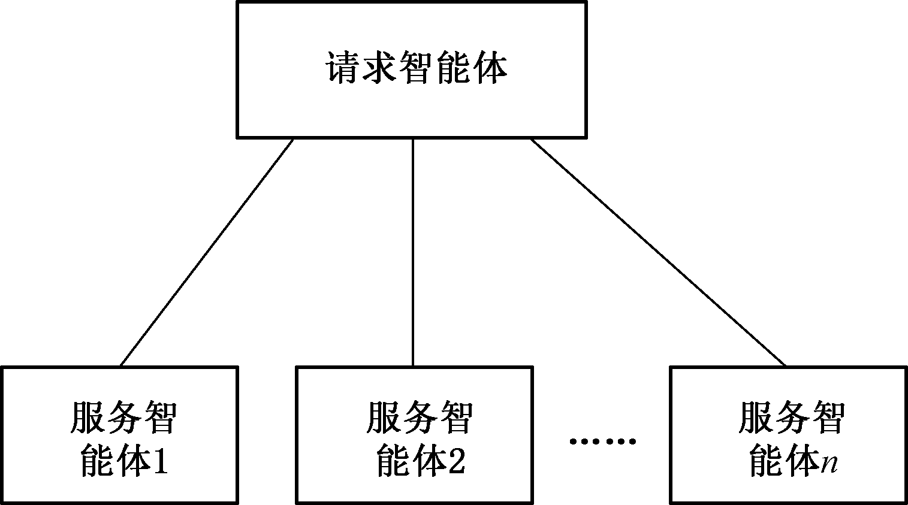

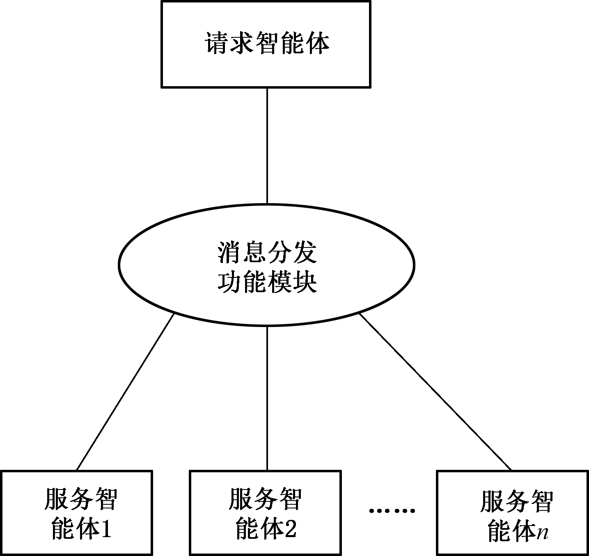

GB/Z 185.6—2026
本文件规定了点对点、群组及混合三种智能体交互模式。各系统在实现时，应支持点对点模式，宜
支持群组模式、混合模式。点对点模式的三种实现参考见附录 A，基于上述三种智能体交互模式实现
的协作模式见附录 B。
6 智能体交互的模式
6.1 概述
智能体交互模式主要包括点对点模式、群组模式及混合模式三种。在一次完整的交互过程中，请
求智能体根据协作需求选择适合的模式与服务智能体进行交互。同一交互任务过程通常仅采用一种
交互模式。此外，智能体在不同交互任务中可承担不同角色（如请求智能体或服务智能体）。
6.2 点对点模式
点对点模式指在一次智能体交互过程中，请求智能体与每一个服务智能体均进行一对一的直接交
互，如图 1 所示。
图 1 点对点模式示意图
6.3 群组模式
群组模式指在一次智能体交互过程中，请求智能体与多个服务智能体通过消息分发功能模块进行
交互，如图 2 所示。在该模式下，同一群组内的所有智能体（包括请求智能体与服务智能体）均可通过
消息分发功能模块发送和接收消息。
群组的创建、配置与管理可由请求智能体发起并维护，也可由第三方机构预先配置。请求智能体
可直接邀请服务智能体加入群组，也可审核处理服务智能体提交的加入申请。第三方机构亦可代为发
起入群邀请或审核加入申请。
图 2 群组模式示意图
2

<!-- Page 9 -->

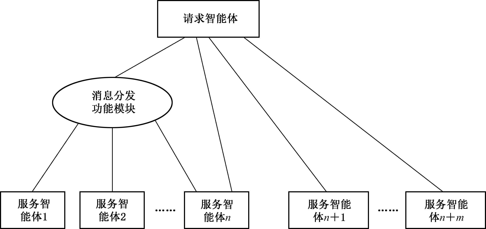

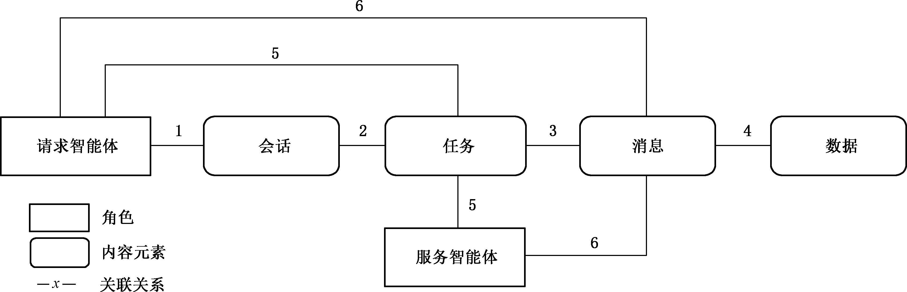

GB/Z 185.6—2026
6.4 混合模式
混合模式指在一次智能体交互任务中，请求智能体与服务智能体之间的交互同时存在点对点模式
与群组模式，如图 3 所示。在该模式下，由请求智能体决定服务智能体参与的交互模式。同一服务智
能体可同时参与点对点交互和群组交互（如图 3 中智能体 n）。
图 3 混合模式示意图
7 智能体交互的内容元素及关系
7.1 智能体交互的内容元素
智能体交互过程中使用的内容元素包括但不限于如下内容。
a） 数据，智能体交互的最小内容单元，可包含多种数据类型，其内容根据传输信息类型的不同而
有所差异，智能体可通过数据中各个字段确定数据类型及具体内容。
b） 消息，智能体交互的基本内容单元，由发送方（可以为请求智能体或服务智能体）、多种标识符
以及所包含的一个或多个数据构成。
c） 任务，智能体交互中的基本工作单元，具有明确定义的生命周期与状态。请求智能体负责任
务的创建与终止，服务智能体负责任务的具体执行与结果反馈。在任务执行过程中，智能体
之间可进行多轮消息交换。
d） 会话，每个会话对应一个多智能体交互过程，由请求智能体创建，具有一个编号标识，用于管
理该过程中涉及的服务智能体、消息及任务。
7.2 内容元素间关系
智能体交互的参与角色和内容元素间的关系如图 4 所示。
图 4 角色和内容元素间关系图
3

<!-- Page 10 -->

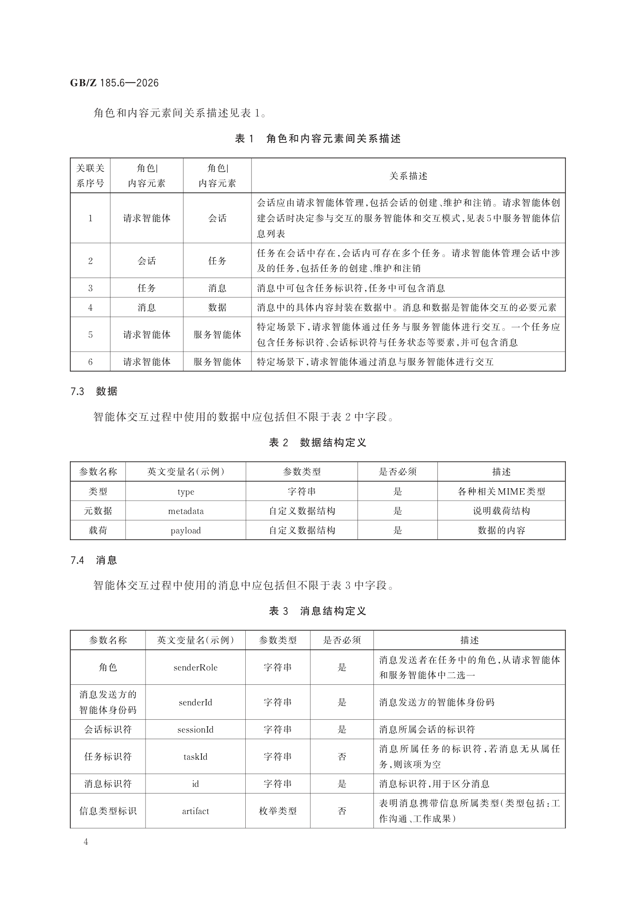

GB/Z 185.6—2026
角色和内容元素间关系描述见表 1。
表 1 角色和内容元素间关系描述
关联关 角色| 角色|
关系描述
系序号 内容元素 内容元素
会话应由请求智能体管理，包括会话的创建、维护和注销。请求智能体创
1 请求智能体 会话 建会话时决定参与交互的服务智能体和交互模式，见表5中服务智能体信
息列表
任务在会话中存在，会话内可存在多个任务。请求智能体管理会话中涉
2 会话 任务
及的任务，包括任务的创建、维护和注销
3 任务 消息 消息中可包含任务标识符，任务中可包含消息
4 消息 数据 消息中的具体内容封装在数据中。消息和数据是智能体交互的必要元素
特定场景下，请求智能体通过任务与服务智能体进行交互。一个任务应
5 请求智能体 服务智能体
包含任务标识符、会话标识符与任务状态等要素，并可包含消息
6 请求智能体 服务智能体 特定场景下，请求智能体通过消息与服务智能体进行交互
7.3 数据
智能体交互过程中使用的数据中应包括但不限于表 2 中字段。
表 2 数据结构定义
参数名称 英文变量名（示例） 参数类型 是否必须 描述
类型 type 字符串 是 各种相关MIME类型
元数据 metadata 自定义数据结构 是 说明载荷结构
载荷 payload 自定义数据结构 是 数据的内容
7.4 消息
智能体交互过程中使用的消息中应包括但不限于表 3 中字段。
表 3 消息结构定义
参数名称 英文变量名（示例） 参数类型 是否必须 描述
消息发送者在任务中的角色，从请求智能体
角色 senderRole 字符串 是
和服务智能体中二选一
消息发送方的
senderId 字符串 是 消息发送方的智能体身份码
智能体身份码
会话标识符 sessionId 字符串 是 消息所属会话的标识符
消息所属任务的标识符，若消息无从属任
任务标识符 taskId 字符串 否
务，则该项为空
消息标识符 id 字符串 是 消息标识符，用于区分消息
表明消息携带信息所属类型（类型包括：工
信息类型标识 artifact 枚举类型 否
作沟通、工作成果）
4

| 关联关
系序号 | 角色|
内容元素 | 角色|
内容元素 | 关系描述                                                                  |
| ------- | -------- | -------- | --------------------------------------------------------------------- |
| 1       | 请求智能体    | 会话       | 会话应由请求智能体管理，包括会话的创建、维护和注销。请求智能体创
建会话时决定参与交互的服务智能体和交互模式，见表5中服务智能体信
息列表 |
| 2       | 会话       | 任务       | 任务在会话中存在，会话内可存在多个任务。请求智能体管理会话中涉
及的任务，包括任务的创建、维护和注销                    |
| 3       | 任务       | 消息       | 消息中可包含任务标识符，任务中可包含消息                                                  |
| 4       | 消息       | 数据       | 消息中的具体内容封装在数据中。消息和数据是智能体交互的必要元素                                       |
| 5       | 请求智能体    | 服务智能体    | 特定场景下，请求智能体通过任务与服务智能体进行交互。一个任务应
包含任务标识符、会话标识符与任务状态等要素，并可包含消息          |
| 6       | 请求智能体    | 服务智能体    | 特定场景下，请求智能体通过消息与服务智能体进行交互                                             |

| 参数名称 | 英文变量名（示例） | 参数类型    | 是否必须 | 描述         |
| ---- | --------- | ------- | ---- | ---------- |
| 类型   | type      | 字符串     | 是    | 各种相关MIME类型 |
| 元数据  | metadata  | 自定义数据结构 | 是    | 说明载荷结构     |
| 载荷   | payload   | 自定义数据结构 | 是    | 数据的内容      |

| 参数名称          | 英文变量名（示例）  | 参数类型 | 是否必须 | 描述                             |
| ------------- | ---------- | ---- | ---- | ------------------------------ |
| 角色            | senderRole | 字符串  | 是    | 消息发送者在任务中的角色，从请求智能体
和服务智能体中二选一 |
| 消息发送方的
智能体身份码 | senderId   | 字符串  | 是    | 消息发送方的智能体身份码                   |
| 会话标识符         | sessionId  | 字符串  | 是    | 消息所属会话的标识符                     |
| 任务标识符         | taskId     | 字符串  | 否    | 消息所属任务的标识符，若消息无从属任
务，则该项为空     |
| 消息标识符         | id         | 字符串  | 是    | 消息标识符，用于区分消息                   |
| 信息类型标识        | artifact   | 枚举类型 | 否    | 表明消息携带信息所属类型（类型包括：工
作沟通、工作成果）  |

<!-- Page 11 -->

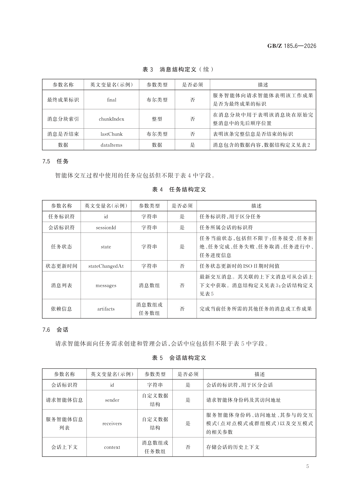

GB/Z 185.6—2026
表 3 消息结构定义（续）
参数名称 英文变量名（示例） 参数类型 是否必须 描述
服务智能体向请求智能体表明该工作成果
最终成果标识 final 布尔类型 否
是否为最终成果的标识
在消息分块中用于表明该消息块在原始完
消息分块索引 chunkIndex 整型 否
整消息中的先后顺序位置
消息是否结束 lastChunk 布尔类型 否 表明该条完整信息是否结束的标识
数据 dataItems 数据 是 消息包含的数据内容，数据结构定义见表2
7.5 任务
智能体交互过程中使用的任务应包括但不限于表 4 中字段。
表 4 任务结构定义
参数名称 英文变量名（示例） 参数类型 是否必须 描述
任务标识符 id 字符串 是 任务标识符，用于区分任务
会话标识符 sessionId 字符串 是 任务所属会话的标识符
任务当前状态，包括但不限于：任务接受、任务拒
任务状态 state 字符串 是 绝、任务完成、任务失败、任务取消、任务进行中、
任务进度信息
状态更新时间 stateChangedAt 字符串 否 任务状态更新时的ISO日期时间值
最新交互消息。其关联的上下文消息可从会话上
消息列表 messages 消息数组 否 下文中获取。消息结构定义见表3；会话结构定义
见表5
消息数组或
依赖信息 artifacts 否 完成当前任务所需的其他任务的消息或工作成果
任务数组
7.6 会话
请求智能体面向任务需求创建和管理会话，会话中应包括但不限于表 5 中字段。
表 5 会话结构定义
参数名称 英文变量名（示例） 参数类型 是否必须 描述
会话标识符 id 字符串 是 会话的标识符，用于区分会话
自定义数据
请求智能体信息 sender 是 请求智能体身份码及其访问地址
结构
服务智能体身份码、访问地址、其参与的交互
服务智能体信息 自定义数据
receivers 是 模式（点对点模式或群组模式）以及交互模式
列表 结构
的相关参数
消息数组或
会话上下文 context 否 存储会话的历史上下文
任务数组
5

| 参数名称   | 英文变量名（示例）  | 参数类型 | 是否必须 | 描述                             |
| ------ | ---------- | ---- | ---- | ------------------------------ |
| 最终成果标识 | final      | 布尔类型 | 否    | 服务智能体向请求智能体表明该工作成果
是否为最终成果的标识  |
| 消息分块索引 | chunkIndex | 整型   | 否    | 在消息分块中用于表明该消息块在原始完
整消息中的先后顺序位置 |
| 消息是否结束 | lastChunk  | 布尔类型 | 否    | 表明该条完整信息是否结束的标识                |
| 数据     | dataItems  | 数据   | 是    | 消息包含的数据内容，数据结构定义见表2            |

| 参数名称   | 英文变量名（示例）      | 参数类型       | 是否必须 | 描述                                                    |
| ------ | -------------- | ---------- | ---- | ----------------------------------------------------- |
| 任务标识符  | id             | 字符串        | 是    | 任务标识符，用于区分任务                                          |
| 会话标识符  | sessionId      | 字符串        | 是    | 任务所属会话的标识符                                            |
| 任务状态   | state          | 字符串        | 是    | 任务当前状态，包括但不限于：任务接受、任务拒
绝、任务完成、任务失败、任务取消、任务进行中、
任务进度信息 |
| 状态更新时间 | stateChangedAt | 字符串        | 否    | 任务状态更新时的ISO日期时间值                                      |
| 消息列表   | messages       | 消息数组       | 否    | 最新交互消息。其关联的上下文消息可从会话上
下文中获取。消息结构定义见表3；会话结构定义
见表5      |
| 依赖信息   | artifacts      | 消息数组或
任务数组 | 否    | 完成当前任务所需的其他任务的消息或工作成果                                 |

| 参数名称       | 英文变量名（示例） | 参数类型       | 是否必须 | 描述                                              |
| ---------- | --------- | ---------- | ---- | ----------------------------------------------- |
| 会话标识符      | id        | 字符串        | 是    | 会话的标识符，用于区分会话                                   |
| 请求智能体信息    | sender    | 自定义数据
结构   | 是    | 请求智能体身份码及其访问地址                                  |
| 服务智能体信息
列表 | receivers | 自定义数据
结构   | 是    | 服务智能体身份码、访问地址、其参与的交互
模式（点对点模式或群组模式）以及交互模式
的相关参数 |
| 会话上下文      | context   | 消息数组或
任务数组 | 否    | 存储会话的历史上下文                                      |

<!-- Page 12 -->

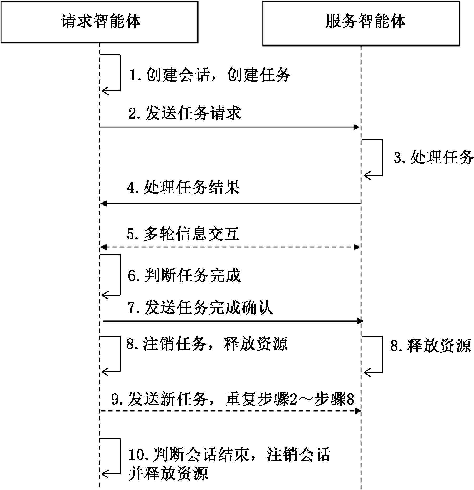

GB/Z 185.6—2026
8 智能体交互流程
8.1 概述
请求智能体与服务智能体在完成双向智能体身份鉴别后，方能进行智能体交互。
8.2 点对点模式交互流程
点对点模式的参考交互流程如图 5 所示。该模式的三种典型实现方法见附录 A，用户可根据实际
应用场景选择适用方法。
图 5 点对点模式参考交互流程

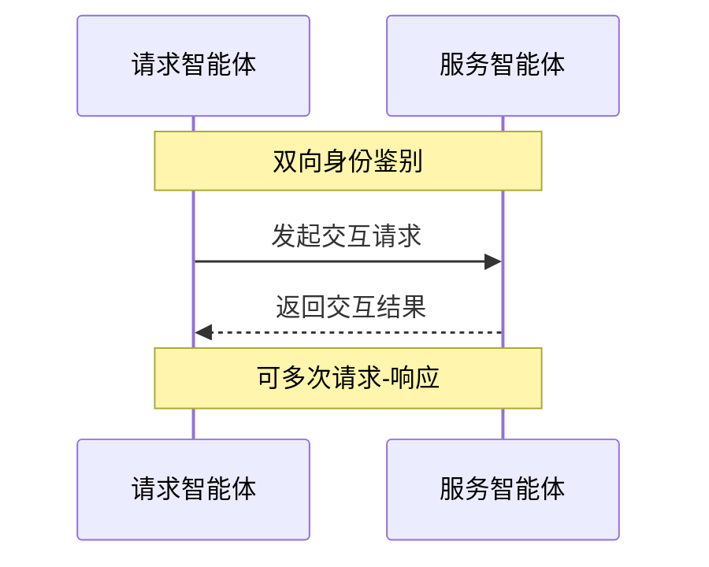
```mermaid
sequenceDiagram
    participant Req as 请求智能体
    participant Svc as 服务智能体

    Note over Req,Svc: 双向身份鉴别
    Req->>Svc: 发起交互请求
    Svc-->>Req: 返回交互结果
    Note over Req,Svc: 可多次请求-响应
```

8.3 群组模式交互流程
请求智能体和多个服务智能体交互可选择群组模式，通过消息分发功能模块进行群组交互，其参
考流程如图 6 所示。
6

<!-- Page 13 -->

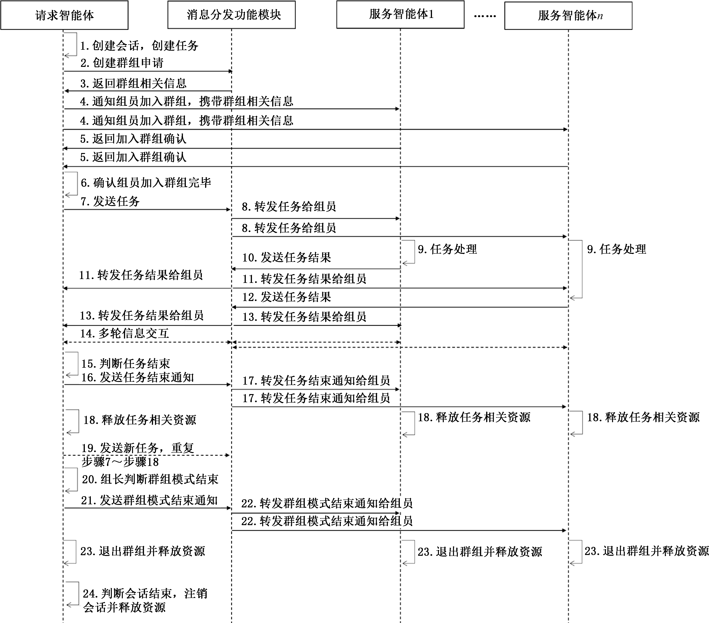

GB/Z 185.6—2026
图 6 群组模式参考交互流程

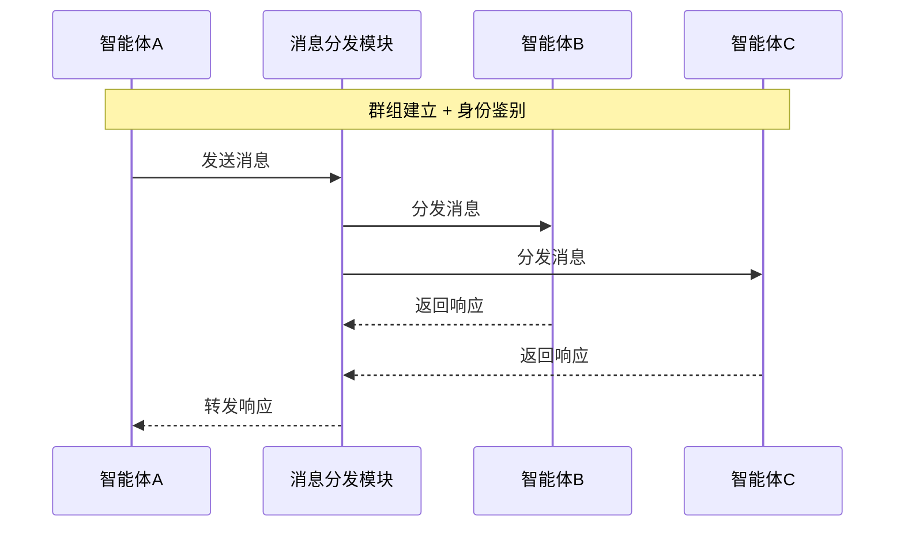
```mermaid
sequenceDiagram
    participant AgentA as 智能体A
    participant Dispatcher as 消息分发模块
    participant AgentB as 智能体B
    participant AgentC as 智能体C

    Note over AgentA,AgentC: 群组建立 + 身份鉴别
    AgentA->>Dispatcher: 发送消息
    Dispatcher->>AgentB: 分发消息
    Dispatcher->>AgentC: 分发消息
    AgentB-->>Dispatcher: 返回响应
    AgentC-->>Dispatcher: 返回响应
    Dispatcher-->>AgentA: 转发响应
```

消息分发功能模块在接收到群组内某一智能体发送的信息后，负责将该信息分发给群组内除信息
发送者以外的所有其他参与智能体。其典型分发流程如图 6中所示的步骤（如步骤 8、步骤 11、步骤 13、
步骤 17、步骤 22）。
7

<!-- Page 14 -->

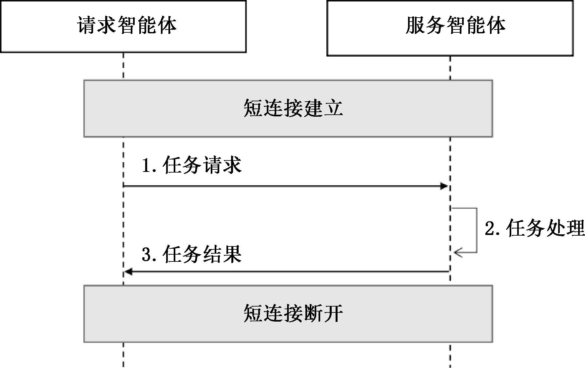

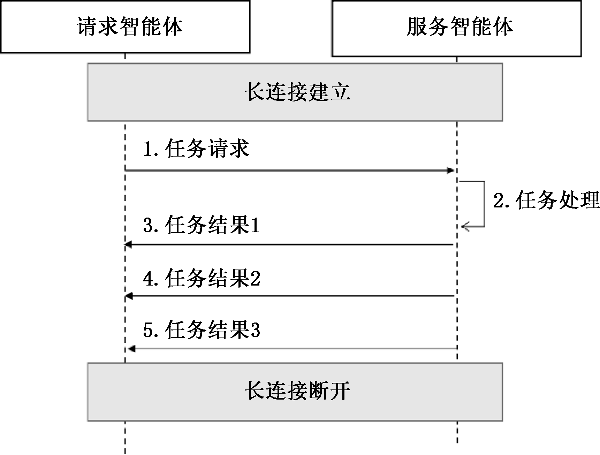

GB/Z 185.6—2026
附 录 A
（资料性）
智能体交互点对点模式的实现参考
有三种方式能够实现请求智能体和服务智能体间的点对点模式交互，分别是远程调用实现方式、
流式实现方式和通知实现方式，这三种实现方式各有特点，适合不同场景。
A.1 远程调用实现方式
远程调用实现方式如下：
远程调用实现方式采用短连接传输模式。在此模式下，请求智能体与服务智能体建立连接，发起
任务请求，服务智能体对任务进行处理并返回结果后，连接断开。此方式适用于请求-响应模型明确
的单次传输场景。其具体流程见图 A.1。
图 A.1 远程调用实现方式流程图
A.2 流式实现方式
流式实现方式如下：
流式实现方式采用长连接传输模式。在此模式下，请求智能体与服务智能体建立连接，发起任务
请求，服务智能体对任务进行处理，并可基于该连接多次、分批地向请求智能体返回任务结果。任务完
成后，连接断开。此方式适用于需要持续数据传输或实时更新的传输场景。其具体流程见图 A.2。
图 A.2 流式实现方式流程图
8

<!-- Page 15 -->

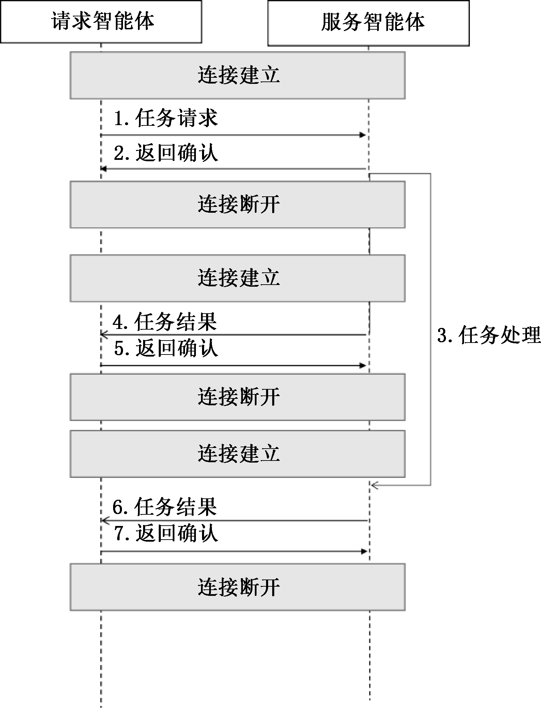

GB/Z 185.6—2026
A.3 通知实现方式
通知实现方式如下：
通知实现方式采用多次连接传输模式。在此模式下，请求智能体与服务智能体建立连接，发起任
务请求，服务智能体返回确认后，连接断开。在任务处理过程中，当满足条件时，服务智能体与请求智
能体建立新的连接，主动向请求智能体发送任务结果，请求智能体返回确认后，连接断开。此方式适合
条件触发的异步通知传输场景。其具体流程见图 A.3。
图 A.3 通知实现方式流程图
9

<!-- Page 16 -->

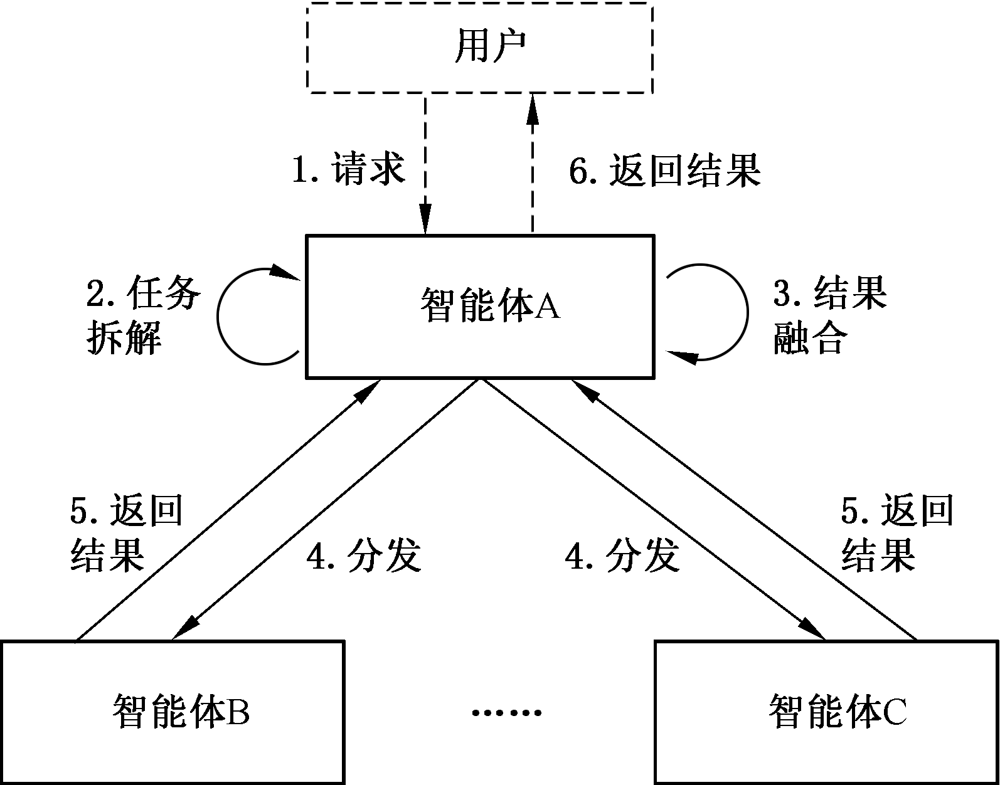

GB/Z 185.6—2026
附 录 B
（资料性）
智能体协作方式及实现参考
B.1 通则
为实现多智能体任务协同，应用系统可使用主从、代理协商、任务订阅，或按需组合使用多种智能
体协作方式。
B.2 主从方式
主从方式中，智能体收到任务后，规划、分发子任务到其他智能体执行，融合执行结果并返回用户。
主从方式的交互过程见图 B.1。
图B.1 主从方式流程图
主从方式流程如下。
a） 用户向主智能体 A 发送请求。
b） 主智能体完成任务规划并拆分任务。
c） 主智能体分发子任务请求到其他多个从智能体（如智能体 B 和智能体 C）。
d） 从智能体执行子任务并返回结果。
e） 分发可按需使用任一方式执行：
1） 同时分发（如主智能体 A 同时分发拆解的子任务到智能体 B 和智能体 C）；
2） 异步分发（如主智能体 A 先分发子任务到智能体 B，智能体 B 执行返回后，主智能体 A
再分发其他子任务到智能体 C）。
f） 主智能体 A 融合结果，返回给用户。
B.3 代理协商方式
代理协商方式中，智能体转发用户任务到能够完成任务的其他智能体，并将执行结果返回给用户。
代理协商方式的交互过程见图 B.2。
10

<!-- Page 17 -->

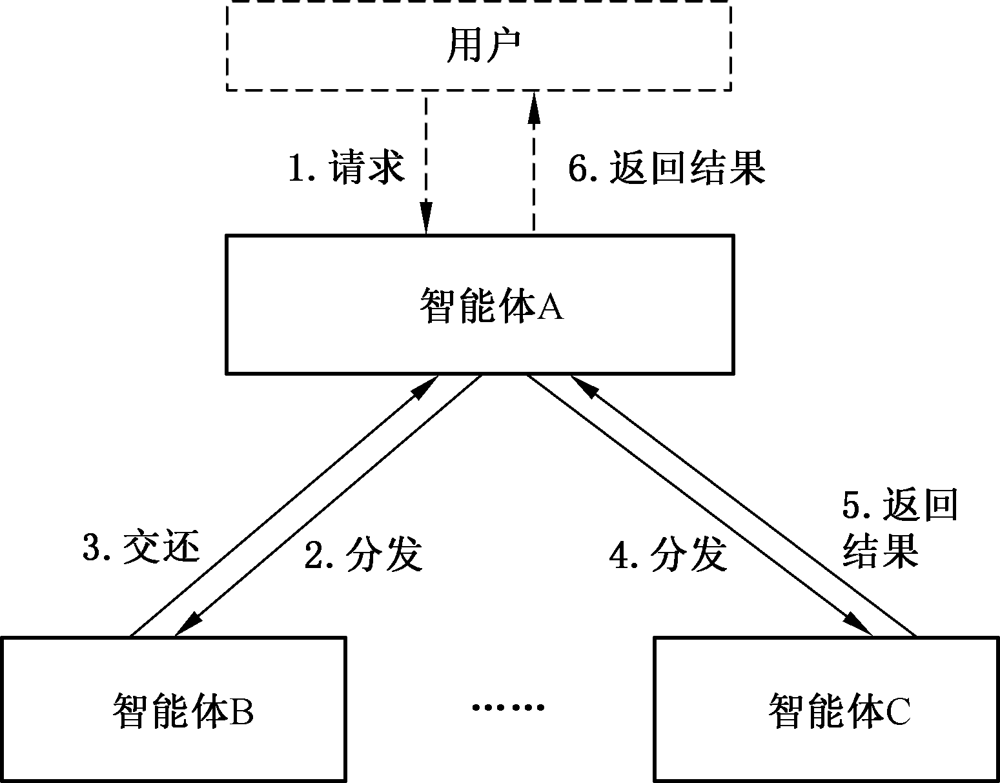

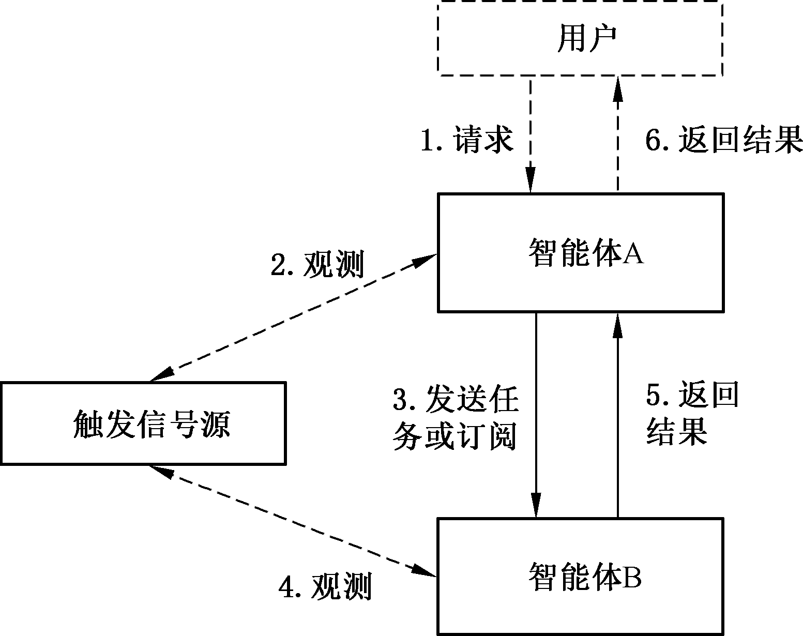

GB/Z 185.6—2026
图B.2 代理协商方式流程
代理协商方式流程如下。
a） 代理智能体 A 接受用户请求。
b） 代理智能体 A 将任务分发给某个智能体 B。
c） 智能体 B 收到任务后，评估自身是否能够完成任务：
1） 如不能完成，则交还任务；
2） 如能够完成，则执行并返回结果。
d） 代理智能体 A 收到交还任务后，选择其他智能体 C，分发任务。
e） 代理智能体 A 收到任务执行结果后，返回给用户。
B.4 任务订阅方式
任务订阅方式中，智能体执行任务由 1 个或多个触发信号源（如时间、地点或事件等）在特定条件
时触发。任务订阅方式的交互过程见图 B.3。
图B.3 任务订阅方式流程
任务订阅方式流程如下。
a） 用户发送任务到智能体 A。
b） 智能体 A，按系统实现需要，实现并执行以下任 1 步骤：
1） 观测、选择触发信号源并检查触发条件，在条件符合时，将任务发送给其他智能体 B；
11

<!-- Page 18 -->

GB/Z 185.6—2026
2） 观测、选择触发信号源，设定触发条件，将任务及触发条件发送给其他智能体 B。
| c） 智能体 B，按系统实现需要，实现并执行以下     | 个步骤中的 | 个：              |
| ---------------------------- | ----- | --------------- |
|                              | 2     | 1               |
| 1） 直接执行任务，并返回结果，条件的检查与触发由智能体 |       | A 在 B.4 b）1）完成； |
2） 按 B.4 b）2）的设定观测触发条件，并在条件符合时执行任务，并返回结果。
d） 智能体 A 返回结果给用户。
———————————
12