# GBZ 185.7-2026

<!-- Page 1 -->

ICS 35.100
CCS L 79
中 华 人 民 共 和 国 国 家 标 准 化 指 导 性 技 术 文 件
GB/Z 185.7—2026
人工智能 智能体互联
第 部分 智能体工具调用
7
：
Artificial intelligence—Agent interconnection—Part 7： Agent tool invocation
2026⁃05⁃22 发布
国 家 市 场 监 督 管 理 总 局
发 布
国 家 标 准 化 管 理 委 员 会

<!-- Page 3 -->

GB/Z 185.7—2026
目 次
前言··························································································································Ⅲ
引言··························································································································Ⅳ
1 范围·······················································································································1
2 规范性引用文件········································································································1
3 术语和定义··············································································································1
4 智能体工具调用总体架构····························································································1
5 智能体工具调用流程··································································································2
6 智能体工具调用数据格式····························································································4
附录 A（ 资料性） 智能体获取工具及调用示例····································································6
参考文献····················································································································10
Ⅰ

<!-- Page 5 -->

GB/Z 185.7—2026
前 言
本文件为规范类指导性技术文件。
本文件按照 GB/T 1.1—2020《标准化工作导则 第 1 部分：标准化文件的结构和起草规则》的规
定起草。
本文件是 GB/Z 185《人工智能 智能体互联》的第 7 部分。GB/Z 185 已经发布了以下部分：
——第 1 部分：总体架构；
——第 2 部分：身份码；
——第 3 部分：身份管理；
——第 4 部分：智能体描述；
——第 5 部分：智能体发现；
——第 6 部分：智能体交互；
——第 7 部分：智能体工具调用。
请注意本文件的某些内容可能涉及专利。本文件的发布机构不承担识别专利的责任。
本文件由全国信息技术标准化技术委员会（SAC/TC 28）提出并归口。
本文件起草单位：中国电子技术标准化研究院、小米通讯技术有限公司、北京邮电大学、北京奇虎
科技有限公司、上海交通大学、阿里云计算有限公司、北京航空航天大学、北京浩瀚深度信息技术股份
有限公司、蚂蚁科技集团股份有限公司、北京火山引擎科技有限公司、江苏金服数字集团人工智能科技
有限公司、人形机器人（上海）有限公司、中移互联网有限公司、华为技术有限公司、中电信数智科技有
限公司、亚信科技（中国）有限公司、北京思谋智能科技有限公司、京东方科技集团股份有限公司、联通
数据智能有限公司、中移雄安信息通信科技有限公司、浪潮通信信息系统有限公司、中国电力科学研究
院有限公司、中国移动通信集团有限公司、咪咕文化科技有限公司、昆仑数智科技有限责任公司、浪潮
软件科技有限公司、联想（北京）有限公司、浙江大华技术股份有限公司、杭州高新区（滨江）区块链与数
据安全研究院、南京理工大学、超聚变数字技术股份有限公司、中兴通讯股份有限公司、北京宝兰德软
件股份有限公司、浪潮云信息技术股份公司、厦门市美亚柏科信息安全研究所有限公司、中移九天人工
智能科技（北京）有限公司、成都理工大学、中移动信息技术有限公司、浪潮通用软件有限公司、晨晞数
智（北京）科技有限公司、浪潮电子信息产业股份有限公司、中移（杭州）信息技术有限公司。
本文件主要起草人：张士宗、周珏嘉、高歌、邹权臣、李珂、郑钊、张伟楠、张向征、杨健、庞韶敏、管俊明、
陈润和、徐浩、林雪琴、杨语澈、张熙、赖燕燕、邵熠阳、陈利明、刘伟东、张联华、张驰、曹汐、姜幸群、李坤彦、
郑庆国、张宏伟、李琰、闫冬、肖红梅、马丽萌、尚云云、梁秉豪、王珂琛、李斌、孔维生、王靖萱、魏遵博、
刘劲楠、郝冠亚、陆仲达、郑佳佳、邵俊谦、阙锦龙、程晗蕾、丁一凡、孙昊、王超、付涛。
Ⅲ

<!-- Page 6 -->

GB/Z 185.7—2026
引 言
随着人工智能技术迅猛发展，智能体作为人工智能从概念转化为实际生产力的关键载体，在各领
域应用日益广泛，对赋能新型工业化、塑造新质生产力作用显著。然而，当前智能体产业发展面临诸多
挑战，不同智能体间存在互联互通互操作难题，在基于协议的智能体互联领域，国际上已有 MCP、
A2A、ANP 等智能体通信协议，但并未形成行业完全共识的方案，亟需制定适合国内智能体产业发展
的行业统一共识方案。
为系统化解决上述问题，引导和规范智能体互联技术发展，提升智能体系统的互操作性、可组合性
与整体产业效能，特制定本指导性技术文件。GB/Z 185《人工智能 智能体互联》旨在规定智能体互
联的技术要求和流程，其编制遵循系统性、先进性和可操作性原则，为智能体之间实现跨平台、跨架构
的互联、互通、互操作提供统一的技术框架和标准依据，GB/Z 185 拟由七个部分构成。
——第 1 部分：总体架构。目的在于给出智能体互联环境中的概念模型、功能模型。
——第 2 部分：身份码。目的在于给出智能体身份码定义和应用，给出身份码代码结构和分配原
则的建议。
——第 3 部分：身份管理。目的在于给出智能体互联环境中的身份管理框架和全生命周期过程，
描述身份管理的技术要求。
——第 4 部分：智能体描述。目的在于给出智能体的描述方法，提供智能体描述注册、变更和发布
的参考流程。
——第 5 部分：智能体发现。目的在于给出智能体互联的发现流程。
——第 6 部分：智能体交互。目的在于给出智能体海量互联时的交互模式，描述交互基础元素及
接口定义。
——第 7 部分：智能体工具调用。目的在于给出基于大模型的智能体调用工具的标准化架构、流
程及工具描述，支持智能体与外部工具的无缝集成。
Ⅳ

<!-- Page 7 -->

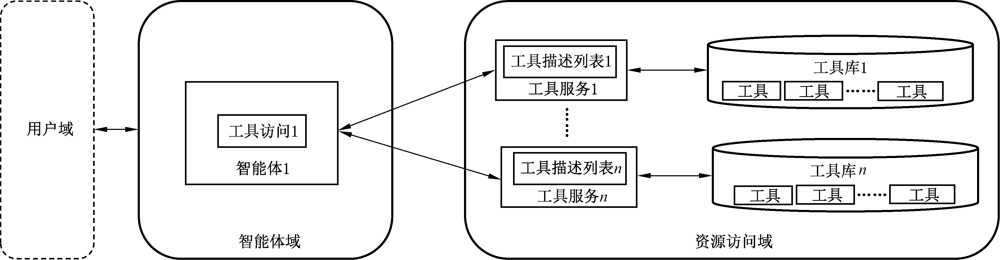

GB/Z 185.7—2026
人工智能 智能体互联
第 7部分：智能体工具调用
1 范围
本文件给出了智能体工具调用的总体架构、工具调用流程和工具调用数据格式。
本文件适用于智能体工具调用的设计、开发与应用。
2 规范性引用文件
下列文件中的内容通过文中的规范性引用而构成本文件必不可少的条款。其中，注日期的引用文
件，仅该日期对应的版本适用于本文件；不注日期的引用文件，其最新版本（包括所有的修改单）适用于
本文件。
GB/T 41867—2022 信息技术 人工智能 术语
3 术语和定义
GB/T 41867—2022 界定的以及下列术语和定义适用于本文件。
3.1
工具 tool
提供特定功能且可被使用的设备、软件或系统。
[来源：ISO/IEC 23000⁃15：2016，3.5.4]
4 智能体工具调用总体架构
智能体根据用户请求，发起工具调用，与资源访问域的工具服务建立一对一、一对多、多对多连接，
实现对资源访问域的工具库的访问和调用。智能体工具调用架构见图 1。
图 1 智能体工具调用架构图

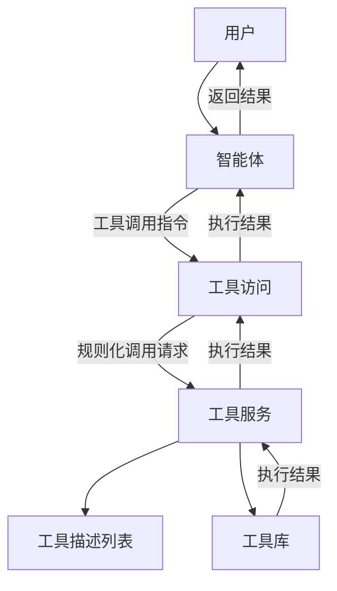

架构中包括了以下功能实体：
a) 智能体：智能体基于大语言模型等能力对用户意图进行理解，生成智能体工具调用需求，并接
收工具访问返回的工具调用执行结果；
1

<!-- Page 8 -->

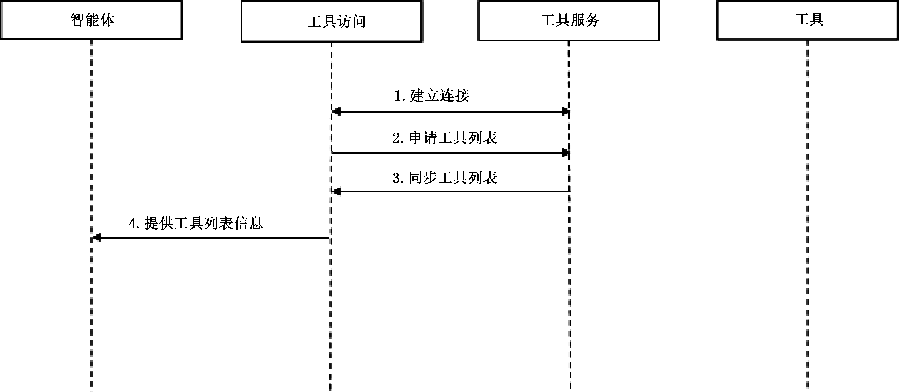

GB/Z 185.7—2026
b) 工具访问：负责与资源访问域进行工具调用的交互，一是接收智能体输出的工具调用指令，二是
将该指令转换为规则化调用请求发送资源访问域的工具服务，三是接收工具服务返回的工具
执行结果并回传至智能体；
c) 工具服务：负责与智能体域进行工具调用的交互，接收来自工具访问的工具调用请求，根据工
具调用请求调用相应工具执行操作，并将工具执行结果回传至工具访问；
d) 工具描述列表：维护当前工具列表中每个工具的具体功能描述、输入输出参数及调用规范，为
工具服务的调用提供依据；
e) 工具：具备特定功能的工具集合，其根据工具服务的调用指令，执行相应工具操作，实现具体
功能逻辑。
智能体获取工具及调用示例见附录 A。
5 智能体工具调用流程
5.1 工具列表获取
智能体工具获取流程见图 2。智能体应按照如下流程执行：
a) 步骤 1，工具访问与工具服务建立连接；
b) 步骤 2，工具访问向工具服务申请工具列表；
c) 步骤 3，工具服务向工具访问同步其支持的工具列表；
d) 步骤 4，工具访问向智能体反馈可用工具列表。
图 2 智能体工具列表获取流程图

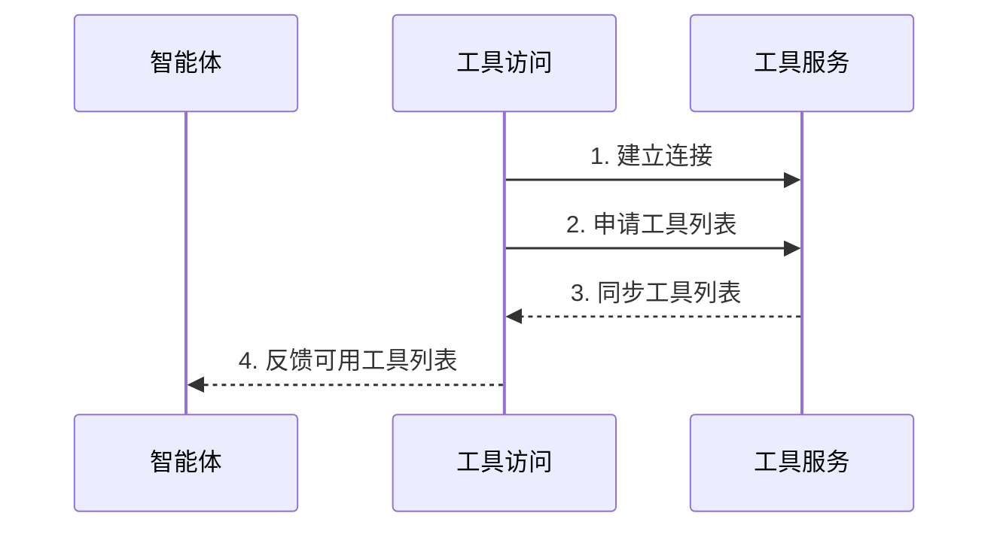

5.2 工具列表更新
智能体工具更新流程见图 3。智能体工具访问与工具服务建立连接后，智能体应按照如下流程
执行：
a) 步骤 1，工具端更新工具，并向工具服务发送更新提醒；
b) 步骤 2，工具服务向工具访问发送工具更新提醒。
当工具访问接收到更新提醒之后，应按 5.1 规定的工具列表获取流程同步工具列表步骤，完成对
工具列表的更新。
2

<!-- Page 9 -->

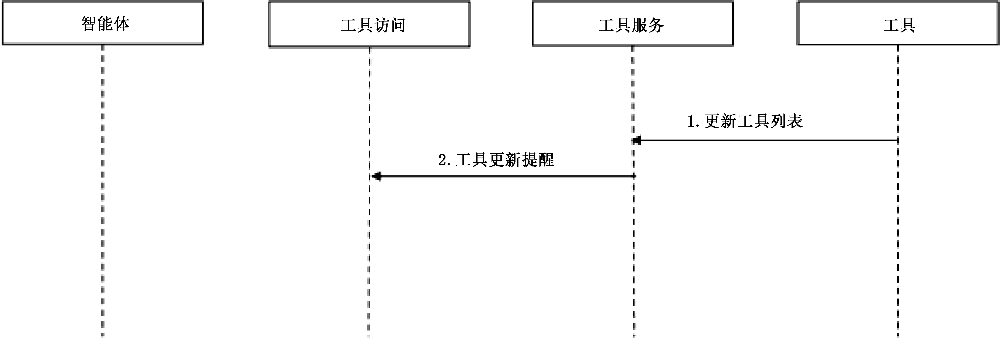

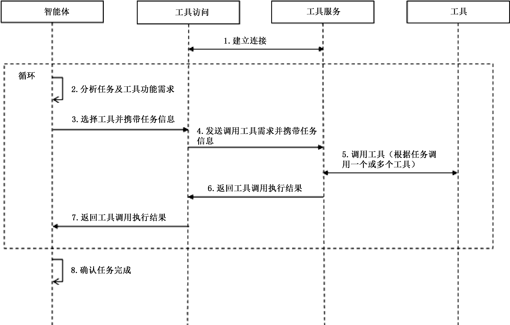

GB/Z 185.7—2026
图 3 智能体工具更新流程图
5.3 工具调用
智能体工具调用流程见图 4。智能体应按照如下流程执行：
a) 步骤 1，工具访问与工具服务建立连接；
b) 步骤 2，智能体基于大语言模型等能力理解用户请求，分析任务和工具功能需求；
c) 步骤 3，智能体在工具列表中选择工具，发送给工具访问并携带任务信息；
d) 步骤 4，工具访问向工具服务发送需要的工具，并携带任务信息；
e) 步骤 5，工具服务根据任务要求调用一个或多个工具；
f) 步骤 6，工具服务将工具调用的执行结果回传至工具访问；
g) 步骤 7，工具访问将工具调用的执行结果回传至智能体；
h) 步骤 8，智能体判断任务是否完成，如完成，则流程结束；如未完成，则循环执行步骤 2~步骤 7，
直至符合终止要求。
图 4 智能体工具调用流程图

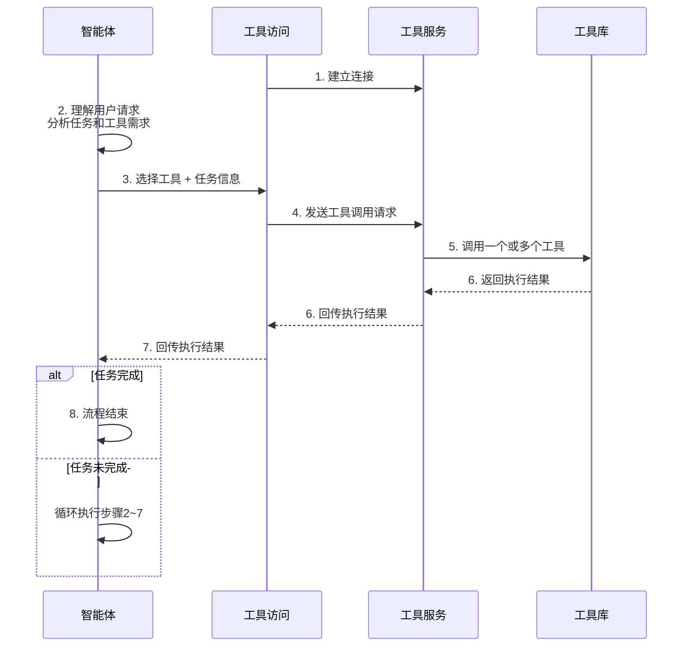

3

<!-- Page 10 -->

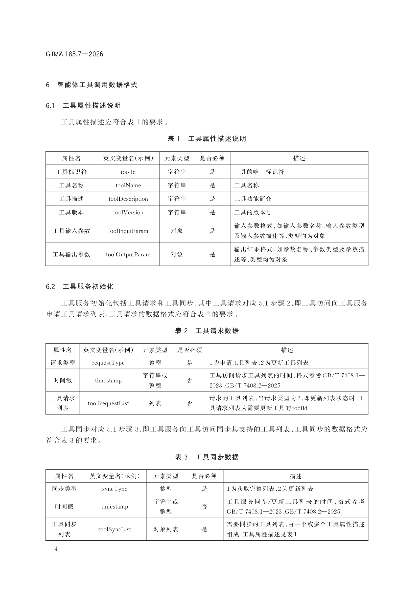

GB/Z 185.7—2026
6 智能体工具调用数据格式
6.1 工具属性描述说明
工具属性描述应符合表 1 的要求。
表 1 工具属性描述说明
属性名 英文变量名（示例） 元素类型 是否必须 描述
工具标识符 toolId 字符串 是 工具的唯一标识符
工具名称 toolName 字符串 是 工具名称
工具描述 toolDescription 字符串 是 工具功能简介
工具版本 toolVersion 字符串 是 工具的版本号
输入参数格式，如输入参数名称、输入参数类型
工具输入参数 toolInputParam 对象 是
及输入参数描述等，类型均为对象
输出结果格式，如参数名称、参数类型及参数描
工具输出参数 toolOutputParam 对象 是
述等，类型均为对象
6.2 工具服务初始化
工具服务初始化包括工具请求和工具同步，其中工具请求对应 5.1 步骤 2，即工具访问向工具服务
申请工具请求列表，工具请求的数据格式应符合表 2 的要求。
表 2 工具请求数据
属性名 英文变量名（示例） 元素类型 是否必须 描述
请求类型 requestType 整型 是 1为申请工具列表，2为更新工具列表
字符串或 工具访问请求工具列表的时间，格式参考GB/T 7408.1—
时间戳 timestamp 否
整型 2023、GB/T 7408.2—2025
工具请求 请求的工具列表，当请求类型为2，即更新列表状态时，工
toolRequestList 列表 否
列表 具请求列表为需要更新工具的toolId
工具同步对应 5.1 步骤 3，即工具服务向工具访问同步其支持的工具列表，工具同步的数据格式应
符合表 3 的要求。
表 3 工具同步数据
属性名 英文变量名（示例） 元素类型 是否必须 描述
同步类型 syncType 整型 是 1为获取完整列表，2为更新列表
字符串或 工具服务同步/更新工具列表的时间，格式参考
时间戳 timestamp 否
整型 GB/T 7408.1—2023、GB/T 7408.2—2025
工具同步 需要同步的工具列表，由一个或多个工具属性描述
toolSyncList 对象列表 是
列表 组成，工具属性描述见表1
4

| 属性名    | 英文变量名（示例）       | 元素类型 | 是否必须 | 描述                                    |
| ------ | --------------- | ---- | ---- | ------------------------------------- |
| 工具标识符  | toolId          | 字符串  | 是    | 工具的唯一标识符                              |
| 工具名称   | toolName        | 字符串  | 是    | 工具名称                                  |
| 工具描述   | toolDescription | 字符串  | 是    | 工具功能简介                                |
| 工具版本   | toolVersion     | 字符串  | 是    | 工具的版本号                                |
| 工具输入参数 | toolInputParam  | 对象   | 是    | 输入参数格式，如输入参数名称、输入参数类型
及输入参数描述等，类型均为对象 |
| 工具输出参数 | toolOutputParam | 对象   | 是    | 输出结果格式，如参数名称、参数类型及参数描
述等，类型均为对象       |

| 属性名     | 英文变量名（示例）       | 元素类型    | 是否必须 | 描述                                                   |
| ------- | --------------- | ------- | ---- | ---------------------------------------------------- |
| 请求类型    | requestType     | 整型      | 是    | 1为申请工具列表，2为更新工具列表                                    |
| 时间戳     | timestamp       | 字符串或
整型 | 否    | 工具访问请求工具列表的时间，格式参考GB/T 7408.1—
2023、GB/T 7408.2—2025 |
| 工具请求
列表 | toolRequestList | 列表      | 否    | 请求的工具列表，当请求类型为2，即更新列表状态时，工
具请求列表为需要更新工具的toolId       |

| 属性名     | 英文变量名（示例）    | 元素类型    | 是否必须 | 描述                                                      |
| ------- | ------------ | ------- | ---- | ------------------------------------------------------- |
| 同步类型    | syncType     | 整型      | 是    | 1为获取完整列表，2为更新列表                                         |
| 时间戳     | timestamp    | 字符串或
整型 | 否    | 工具服务同步/更新工具列表的时间，格式参考
GB/T 7408.1—2023、GB/T 7408.2—2025 |
| 工具同步
列表 | toolSyncList | 对象列表    | 是    | 需要同步的工具列表，由一个或多个工具属性描述
组成，工具属性描述见表1                     |

<!-- Page 11 -->

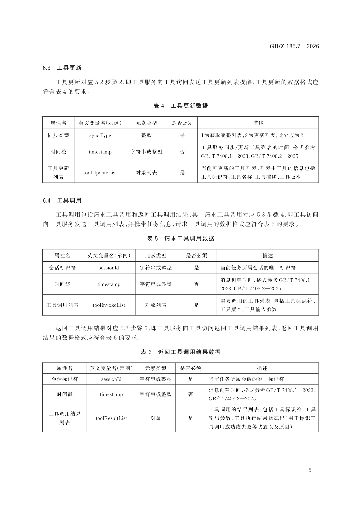

GB/Z 185.7—2026
6.3 工具更新
工具更新对应 5.2 步骤 2，即工具服务向工具访问发送工具更新列表提醒，工具更新的数据格式应
符合表 4 的要求。
表 4 工具更新数据
属性名 英文变量名（示例） 元素类型 是否必须 描述
同步类型 syncType 整型 是 1为获取完整列表，2为更新列表，此处应为2
工具服务同步/更新工具列表的时间，格式参考
时间戳 timestamp 字符串或整型 否
GB/T 7408.1—2023、GB/T 7408.2—2025
工具更新 当前可更新的工具列表，列表中工具的信息包括
toolUpdateList 对象列表 是
列表 工具标识符、工具名称、工具描述、工具版本
6.4 工具调用
工具调用包括请求工具调用和返回工具调用结果，其中请求工具调用对应 5.3 步骤 4，即工具访问
向工具服务发送工具调用列表，并携带任务信息，请求工具调用的数据格式应符合表 5 的要求。
表 5 请求工具调用数据
属性名 英文变量名（示例） 元素类型 是否必须 描述
会话标识符 sessionId 字符串或整型 是 当前任务所属会话的唯一标识符
消息创建时间，格式参考GB/T 7408.1—
时间戳 timestamp 字符串或整型 否
2023、GB/T 7408.2—2025
需要调用的工具列表，包括工具标识符、
工具调用列表 toolInvokeList 对象列表 是
工具版本、工具输入参数
返回工具调用结果对应 5.3 步骤 6，即工具服务向工具访问返回工具调用结果列表，返回工具调用
结果的数据格式应符合表 6 的要求。
表 6 返回工具调用结果数据
属性名 英文变量名（示例） 元素类型 是否必须 描述
会话标识符 sessionId 字符串或整型 是 当前任务所属会话的唯一标识符
消息创建时间，格式参考GB/T 7408.1—2023、
时间戳 timestamp 字符串或整型 否
GB/T 7408.2—2025
工具调用的结果列表，包括工具标识符、工具
工具调用结果
toolResultList 对象 是 输出参数、工具执行结果状态码（用于标识工
列表
具调用成功或失败等状态以及原因）
5

| 属性名     | 英文变量名（示例）      | 元素类型   | 是否必须 | 描述                                                      |
| ------- | -------------- | ------ | ---- | ------------------------------------------------------- |
| 同步类型    | syncType       | 整型     | 是    | 1为获取完整列表，2为更新列表，此处应为2                                   |
| 时间戳     | timestamp      | 字符串或整型 | 否    | 工具服务同步/更新工具列表的时间，格式参考
GB/T 7408.1—2023、GB/T 7408.2—2025 |
| 工具更新
列表 | toolUpdateList | 对象列表   | 是    | 当前可更新的工具列表，列表中工具的信息包括
工具标识符、工具名称、工具描述、工具版本              |

| 属性名    | 英文变量名（示例）      | 元素类型   | 是否必须 | 描述                                            |
| ------ | -------------- | ------ | ---- | --------------------------------------------- |
| 会话标识符  | sessionId      | 字符串或整型 | 是    | 当前任务所属会话的唯一标识符                                |
| 时间戳    | timestamp      | 字符串或整型 | 否    | 消息创建时间，格式参考GB/T 7408.1—
2023、GB/T 7408.2—2025 |
| 工具调用列表 | toolInvokeList | 对象列表   | 是    | 需要调用的工具列表，包括工具标识符、
工具版本、工具输入参数                |

| 属性名       | 英文变量名（示例）      | 元素类型   | 是否必须 | 描述                                                         |
| --------- | -------------- | ------ | ---- | ---------------------------------------------------------- |
| 会话标识符     | sessionId      | 字符串或整型 | 是    | 当前任务所属会话的唯一标识符                                             |
| 时间戳       | timestamp      | 字符串或整型 | 否    | 消息创建时间，格式参考GB/T 7408.1—2023、
GB/T 7408.2—2025              |
| 工具调用结果
列表 | toolResultList | 对象     | 是    | 工具调用的结果列表，包括工具标识符、工具
输出参数、工具执行结果状态码（用于标识工
具调用成功或失败等状态以及原因） |

<!-- Page 12 -->

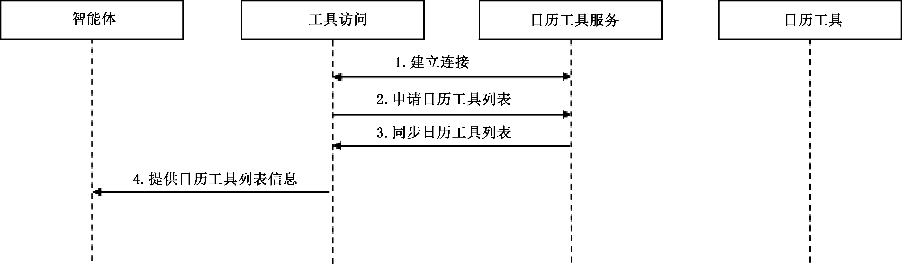

GB/Z 185.7—2026
附 录 A
（资料性）
智能体获取工具及调用示例
A.1 智能体获取日历工具流程
智能体获取日历工具流程见图 A.1。智能体获取日历工具的流程如下：
a） 步骤 1，工具访问与日历工具服务建立连接；
注： 此处工具访问还会和其他工具服务建立连接，该案例仅展示日历工具服务。
b） 步骤 2，工具访问向日历工具服务申请工具列表；
c） 步骤 3，日历工具服务向工具访问同步其支持的工具列表，包括“添加日程“”查询日程”等工具；
d） 步骤 4，工具访问向智能体提供日历工具列表。
图 A.1 智能体获取日历工具
A.2 智能体调用日历工具流程
智能体调用日历工具流程见图 A.2。用户输入“帮我添加一个明天早上 10 点参加会议的日程”，
智能体调用日历工具添加日程的流程如下：
a） 步骤 1，工具访问与日历工具服务建立连接；
注： 此处工具访问还会和其他工具服务建立连接，该案例仅展示日历工具服务。
b） 步骤 2，智能体基于大语言模型等能力理解用户请求，分析任务和工具功能需求；
c） 步骤 3，根据用户意图理解，智能体在日历工具列表信息中选择日历工具中的“添加日程”工
具，发送给工具访问并输入相关参数；
d） 步骤 4，工具访问向日历工具服务发送调用“添加日程”工具需求，并输入相关参数；
e） 步骤 5，日历工具服务调用“添加日程”工具；
f） 步骤 6，日历工具服务将“添加日程”工具调用的执行结果回传至工具访问；
g） 步骤 7，工具访问将工具调用的执行结果回传至智能体；
h） 步骤 8，智能体确认任务完成。
6

<!-- Page 13 -->

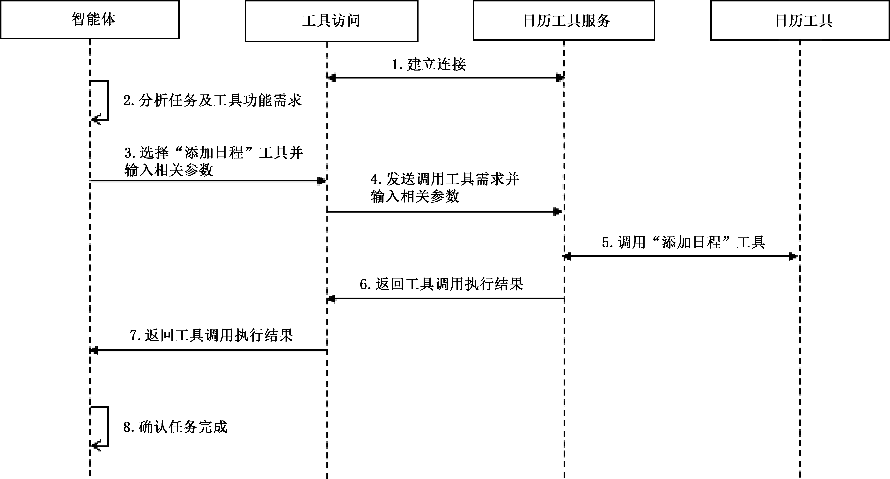

GB/Z 185.7—2026
图 A.2 智能体调用日历工具
A.3 智能体调用日历工具的数据格式
A.3.1 调用日历工具描述
智能体调用日历工具列表信息包括添加日程和查询日程。添加日程按表 1 以 JSON 描述的格式
如下：
{
"toolId": "Aabbcc001",
"toolName": "add_schedule",
"toolDescription": "根据输入日期及事件添加日程",
"toolVersion": "1.0",
"toolInputParam": {
"date": "事件日期，格式：yyyy⁃MM⁃dd",
"time": "开始时间，格式：HH:mm，默认值：00:00",
"event": "日程内容"
},
"toolOutputParam": {
"code": "0 表示成功，非 0 表示失败",
"message": "执行结果描述"
}
}
查询日程按表 1 以 JSON 描述的格式如下：
7

<!-- Page 14 -->

GB/Z 185.7—2026
{
"toolId": "Aabbcc002",
"toolName": "check_schedule",
"toolDescription": "根据输入日期查询当日日程",
"toolVersion": "1.0",
"toolInputParam": {
"date": "查询日期，格式：yyyy⁃MM⁃dd"
},
"toolOutputParam": {
"scheduleList": [
{
"date": "日程日期，格式：yyyy⁃MM⁃dd",
"time": "开始时间，格式：HH:mm",
"event": "日程内容"
}
]
}
}
A.3.2 调用日历工具初始化
调用日历工具初始化包括申请日历工具列表和同步日历工具列表。申请日历工具列表按表 2 以
JSON 描述的格式如下：
{
"requestType": 1,
"timestamp": 1763434694
}
同步日历工具列表按表 3 以 JSON 描述的格式如下：
{
"syncType": 1,
"timestamp": 1763434894,
"toolSyncList": [
{
"toolId": "Aabbcc001",
"toolName": "add_schedule",
"toolVersion": "1.0"
},
{
"toolId": "Aabbcc002",
"toolName": "check_schedule",
8

<!-- Page 15 -->

GB/Z 185.7—2026
"toolVersion": "1.0"
}
]
}
A.3.3 日历工具调用
日历工具调用包括调用日历工具和返回工具调用结果。调用“添加日程”日历工具参数按表 5 以
JSON 描述的格式如下：
{
"sessionId": "session⁃001",
"timestamp": 1763435000,
"toolInvokeList": [
{
"toolId": "Aabbcc001",
"toolVersion": "1.0",
"toolInputParam": {
"date": "2025⁃11⁃20",
"time": "10:00",
"event": "参加会议"
}
}
]
}
返回“添加日程”日程工具调用结果按表 6 以 JSON 描述的格式如下：
{
"sessionId": "session⁃001",
"timestamp": 1763435005,
"toolResultList": [
{
"toolId": "Aabbcc001",
"code": 0,
"message": "success"
}
]
}
9

<!-- Page 16 -->

GB/Z 185.7—2026
参 考 文 献
［1］ GB/T 7408.1—2023 日期和时间 信息交换表示法 第 1 部分：基本原则
［2］ GB/T 7408.2—2025 日期和时间 信息交换表示法 第 2 部分：扩展
［3］ ISO/IEC 23000⁃15：2016 Information technology—Multimedia application format（ MPEG⁃
A)—Part 15：Multimedia preservation application format
———————————
10