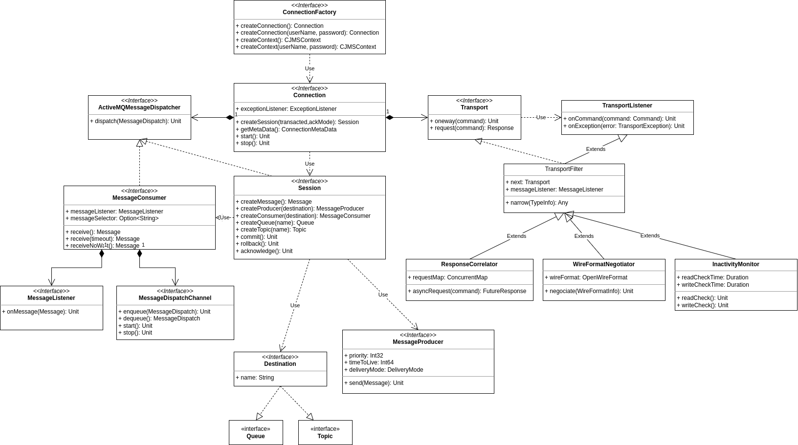

<div align="center">
<h1>ActiveMQ仓颉SDK</h1>
</div>

<p align="center">


</p>

##  1 介绍

### 1.1 项目特性
- 🚀 完全实现JMS2.0规范，支持点对点和发布订阅模式，支持事务消息
- 🚀 消息头和自定义属性支持，支持StreamMessage、MapMessage、BytesMessage、ObjectMessage、TextMessage
- 🚀 支持OpenWire协议，支持OpenWire协议所支持的loose encoding和tight encoding两种序列化方式，支持使用命令缓存
- 🚀 支持失效转移
- 🚀 支持TLS通信
- 🚀 支持单连接多线程模式
- 🚀 完备的单元测试覆盖
- 🚀 架构简洁，易于扩展

用户手册请参考：[用户手册](./docs/ActiveMQ_SDK_User_Guide.md)

## 1.2 仓颉SDK和分支对应关系
| 仓颉SDK版本       | 分支                                                                               |
| -----------------| ---------------------------------------------------------------------------------- |
| 1.0.0 LTS        | [main](https://gitcode.com/Cangjie-TPC/activemq4cj/tree/main) <br> [Branch_cj1.0.0](https://gitcode.com/Cangjie-TPC/activemq4cj/tree/Branch_cj1.0.0)   |
| 0.60.5           | [Branch_cj0.60.5](https://gitcode.com/Cangjie-TPC/activemq4cj/tree/Branch_cj0.60.5)   |
| 0.53.4 Beta      | [develop](https://gitcode.com/Cangjie-TPC/activemq4cj/tree/develop) |


##  2 架构



### 2.1 项目结构

```shell
├── docs
│   └── images
│        └── package.png
├── samples
│   ├── blob_message_example
│   ├── bytes_message_example
│   ├── map_message_example
│   ├── object_message_example
│   ├── stream_message_example
│   ├── text_message_example
├── src
│   ├── cjms
│   ├── client
│   ├── package.cj
├── test
│   ├── test_utils
│   ├── UT
├── cjpm.toml
├── LICENSE
├── README.md
```
- `samples` 示例程序目录
- `src` 库源码目录
- `test` 单元测试目录


### 2.2 接口说明

#### ConnectionFactory
```cangjie
/**
 * 创建连接
 */
func createConnection(userName: String, password: String): Connection

/**
 * 创建CJMSContext
 */
func createContext(userName: String, password: String): CJMSContext
```

#### Connection
```cangjie
/**
 * 创建会话
 */
func createSession(transacted: Bool, ackMode: AcknowledgeMode): Session
```

#### Session
```cangjie
/**
 * 创建一个发送消息到指定目的地的MessageProducer
 */
func createProducer(destination: Destination): MessageProducer

/**
 * 为指定的目的地创建一个MessageConsumer
 */
func createConsumer(destination: Destination): MessageConsumer 

/**
 * 在指定主题上创建一个持久订阅(如果不存在)，指定消息选择器, 并在该持久订阅上创建一个消费者
 */
func createDurableConsumer(destination: Topic, name: String, selector: ?String): MessageConsumer

/**
 * 提交该事务中完成的所有消息
 */
func commit(): Unit

/**
 * 回滚该事务中执行的所有消息
 */
func rollback(): Unit
```

#### CJMSContext
```cangjie
/**
 * 创建一个新的CJMSProducer对象，可以用来配置和发送消息
 */
func createProducer(): CJMSProducer

/**
 * 为一个指定的目的地创建一个CJMSConsumer
*/
func createConsumer(destination: Destination): CJMSConsumer
```

#### MessageProducer: 
```cangjie
/**
 * 使用MessageProducer的默认delivery mode, priority, time to live发送消息
 */
func send(message: Message): Unit

/**
 * 发送消息，指定delivery mode, priority, time to live
 */
func send(message: Message, deliveryMode: DeliveryMode, priority: Int32, timeToLive: Int64): Unit
```

#### MessageConsumer
```cangjie
/**
 * 接收消息
 */
func receive(): ?Message

/**
 * 在指定的超时时间内接收消息
 */
func receive(timeout: Duration): ?Message

/**
 * 立即接收一条消息，如果客户端此时无消息返回None
 */
func receiveNoWait(): ?Message
```

#### CJMSProducer
```cangjie
/** 
 * 向指定的目的地发送消息
 */
func send(destination: Destination, message: Message): CJMSProducer
```

#### CJMSConsumer
```cangjie
/**
 * 接收消息
 */
func receive(): ?Message

/**
 * 在指定的超时时间内接收消息
 */
func receive(timeout: Duration): ?Message

/**
 * 立即接收一条消息，如果客户端此时无消息返回None
 */
func receiveNoWait(): ?Message
```


##  3 使用说明

### 3.1 编译构建（Win/Linux/Mac）

#### 3.1.1 编译

清理项目构建所产生的临时产物，在项目根目录下执行： <br>
`$> cjpm clean`

构建项目，在根目录下执行：<br>
`$> cjpm build`

编译生成的静态库文件存放在 `./target/release/activemq4cj`目录下

#### 3.1.2 运行示例程序

示例程序位于samples目录下，以text_message_example为例，首先编译示例程序，在samples/text_message_example目录下执行：   <br>
`$> cjpm build`

生成的可执行文件位于samples/text_message_example/target/release/bin目录下，使用命令运行可执行文件：   <br>
`$> ./target/release/bin/main`

#### 3.1.3 运行单元测试

在项目`test/UT`目录下运行：<br>
`$> cjpm test`

### 3.2 如何使用

#### 3.2.1 源码导入

在您代码仓的 cjpm.toml 文件中，新增如下源码依赖配置：
```
[dependencies]
  activemq4cj = {git = "https://gitcode.com/Cangjie-TPC/activemq4cj.git", branch = "main"}
```
##### 3.2.2 二进制库依赖导入

导入二进制库依赖需要先对项目进行编译，然后通过package-option导入。package-option的命名规则为target.[target-name].bin-dependencies.package-option，其中target-name是变量，需要通过`cjc-v`命令获取，在x86平台下执行`cjc-v`，可以得到以下内容：
```
Cangjie Compiler: 0.53.4 (cjnative)
Target: x86_64-unknown-linux-gnu
```
将获得的target名称替换target-name即可得到: target.x86_64-unknown-linux-gnu.bin-dependencies.package-option。以下为package-option方式引入ActiveMQ仓颉SDK的示例：

```
[target.x86_64-unknown-linux-gnu.bin-dependencies]
  path-option = ["${path_to_activemq4cj}/target/release/hyperion", "${path_to_activemq4cj}/target/release/activemq4cj"]
```

### 3.3 功能示例

#### 3.3.1 收发消息

##### 在连接URI上配置WireFormat参数

配置例子：
```cangjie
let connectionFactory: ConnectionFactory = ActiveMQConnectionFactory("tcp://localhost:61616?wireFormat.cacheEnabled=false&wireFormat.tightEncodingEnabled=false")
```

##### 在连接URI上配置jms.$PROPERTY参数

配置例子：启用消息体压缩

```cangjie
tcp://localhost:61616?jms.useCompression=true
```

使用示例：

```cangjie
import std.time.Duration
import activemq4cj.client.*
import activemq4cj.client.command.*
import activemq4cj.cjms.*

main(): Unit {
    //创建连接工厂
    let connectionFactory: ConnectionFactory = ActiveMQConnectionFactory("admin", "admin", "tcp://127.0.0.1:61616")

    //创建连接
    try (connection: Connection = connectionFactory.createConnection()) {
        //启动连接，避免无法接收消息
        connection.start()

        //创建会话，模式为自动确认
        try (session: Session = connection.createSession(false, AcknowledgeMode.AUTO_ACKNOWLEDGE)) {

            //使用会话创建一个文本消息
            let textMessage: TextMessage = session.createTextMessage()
            textMessage.text = "Hello"

            //创建一个队列
            let queue: Destination = ActiveMQQueue("TEST")

            //创建消息生产者和消息消费者
            try (producer: MessageProducer = session.createProducer(queue), consumer: MessageConsumer = session.createConsumer(queue)) {
                //使用生产者发送刚刚创建的文本消息
                producer.send(textMessage)

                //接收刚才发送的消息
                let message = consumer.receive(Duration.millisecond * 1000)
                if (let Some(msg) <- message) {
                    if (let Some(msg) <- msg as ActiveMQTextMessage) {
                        println(msg.text)
                    }
                }
            }
        }
    }
}

```
#### 3.3.2 使用失效转移模式

失效转移是在其它传输层之上的重连逻辑，配置语法允许用户指定任意数量的URI。失效转移随机选择一个URI，并尝试建立与它的连接。如果失败或随后失败，则从列表中随机选择其他URI之一建立新的连接。<br>

配置语法：
```cangjie
failover:(uri1,...,uriN)?transportOptions&nestedURIOptions
```

配置例子：
```cangjie
failover:(tcp://localhost:61616,tcp://remotehost:61616)?initialReconnectDelay=100
```

使用示例：

```cangjie
import std.time.Duration
import activemq4cj.client.*
import activemq4cj.client.command.*
import activemq4cj.cjms.*

main(): Unit {
    //创建连接工厂，注意：URI要使用failover语法
    let connectionFactory: ConnectionFactory = ActiveMQConnectionFactory("admin", "admin",
        "failover:(tcp://127.0.0.1:61616,127.0.0.1:61626)?maxReconnectAttempts=5&timeout=3000&nested.wireFormat.cacheEnabled=true&nested.wireFormat.cacheSize=10240")

    //创建连接
    try (connection: Connection = connectionFactory.createConnection()) {
        //启动连接，避免无法接收消息
        connection.start()
        //创建session，模式为自动确认
        try (session: Session = connection.createSession(false, AcknowledgeMode.AUTO_ACKNOWLEDGE)) {

            //使用会话创建一个文本消息
            let textMessage: TextMessage = session.createTextMessage()
            textMessage.text = "Hello"

            //创建一个队列
            let queue: Destination = ActiveMQQueue("TEST")

            //创建消息生产者和消息消费者
            try (producer: MessageProducer = session.createProducer(queue), consumer: MessageConsumer = session.createConsumer(queue)) {
                //使用生产者发送刚刚创建的文本消息
                producer.send(textMessage)
                //接收刚才发送的消息
                let message = consumer.receive(Duration.millisecond * 1000)
                if (let Some(msg) <- message) {
                    if (let Some(msg) <- msg as ActiveMQTextMessage) {
                        println(msg.text)
                    }
                }
            }
        }
    }
}
```

#### 3.3.3 使用TLS通信

首先需要使用TLS证书创建TlsClientConfig
```cangjie
let pem = String.fromUtf8(File("~/user.pem", OpenOption.Open(true, false)).readToEnd())
let keyPem = String.fromUtf8(File("~/user.key", OpenOption.Open(true, false)).readToEnd())
var config = TlsClientConfig()
config.verifyMode = TrustAll
config.alpnProtocolsList = ["h2"]
config.clientCertificate = (X509Certificate.decodeFromPem(pem), PrivateKey.decodeFromPem(keyPem))
```

使用支持TLS通信的ActiveMQTlsConnectionFactory创建连接即可使用TLS收发消息

```cangjie
//创建连接工厂
let connectionFactory = ActiveMQTlsConnectionFactory("admin", "admin", "tcp://127.0.0.1:61616")

//使用刚刚创建的TlsClientConfig
connectionFactory.setTlsClientConfig(config)

try (connection = connectionFactory.createConnection()) {
    connection.start()

    try (session = connection.createSession(false, AcknowledgeMode.AUTO_ACKNOWLEDGE)) {
        let textMessage = session.createTextMessage()
        textMessage.text = "TLS_TEST"

        let queue: Destination = session.createQueue("TEST")

        try (producer = session.createProducer(queue), consumer = session.createConsumer(queue)) {
            producer.send(textMessage)

            let message = consumer.receive()
            if (let Some(msg) <- message) {
                if (let Some(msg) <- msg as ActiveMQTextMessage) {
                    println(msg.text)
                }
            }
        }
    }
}
```

##  4 参与贡献

本项目由[北京宝兰德软件股份有限公司](https://www.bessystem.com)实现并维护。技术支持和意见反馈请提[Issue](https://gitcode.com/Cangjie-TPC/activemq4cj/issues)。

本项目基于 [Apache License 2.0](./LICENSE)，欢迎给我们提交PR，欢迎参与任何形式的贡献。

本项目commiter：[@hxholly](https://gitcode.com/hxholly)