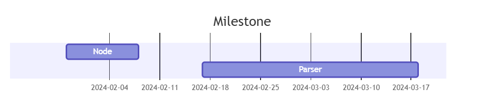
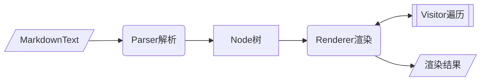

<div align="center">
<h1>commonmark4cj</h1>
</div>

<p align="center">


</p>

## 介绍

用于根据CommonMark规范（以及一些扩展）解析和呈现Markdown文本。

### 特性

- 🚀 解析markdown文本

- 🛠️ Node树状结构

- 💡 遍历/渲染Node树


### 路线




## 软件架构

### 架构



### 源码目录

```shell
├── doc                    #文档目录，包括设计文档，API接口文档等
│   └── feature_api.md     #API接口文档
├── src                    #源码目录
│   └── commonmark         #描述关键代码文件的功能
│   ├── strikethrough      #删除线功能的插件代码
│   └── table              #表格功能的插件代码
├── CHANGELOG.MD           #修改日志
├── cjpm.toml              #编译
├── LICENSE                #license 文件
├── README.md              #整体介绍
├── README.OpenSource      #开源介绍
```

### 接口说明

主要类和函数接口说明详见 [API](./doc/feature_api.md)


## 使用说明

### 编译构建

描述具体的编译过程：

```shell
cjpm build
```

### 功能示例

#### Node

markdown解析得到的节点树，不同类型节点为不同的Node子类

示例代码如下：

```cangjie
import commonmark4cj.commonmark.*

main(): Int64 {
    var tb = Text("bb") // node子类
    var ta = Text("aa")
    ta.appendChild(tb)
    var firstChild: ?Node = ta.getFirstChild()
    var lastChild: ?Node = ta.getLastChild()
    println((firstChild.getOrThrow() as Text).getOrThrow().getLiteral())
    println((lastChild.getOrThrow() as Text).getOrThrow().getLiteral())

    var next: ?Node = firstChild.getOrThrow().getNext()
    var prev: ?Node = lastChild.getOrThrow().getPrevious()
    println(next.isNone())
    println(prev.isNone())
    var tc = Text("cc")
    ta.appendChild(tc)
    lastChild = ta.getLastChild()
    firstChild = ta.getFirstChild()
    println((lastChild.getOrThrow() as Text).getOrThrow().getLiteral())
    println((firstChild.getOrThrow() as Text).getOrThrow().getLiteral())

    next = firstChild.getOrThrow().getNext()
    prev = lastChild.getOrThrow().getPrevious()
    println(next.isNone())
    println(prev.isNone())
    println((next.getOrThrow() as Text).getOrThrow().getLiteral())
    println((prev.getOrThrow() as Text).getOrThrow().getLiteral())

    return 0
}
```

 执行结果如下： 

```
bb
bb
true
true
cc
bb
false
false
cc
bb
```

#### Parse

解析器 用于将markdown格式的文本解析成对应的Node对象

示例代码如下：

```cangjie
import commonmark4cj.commonmark.*

main(): Int64 {
    let parser: Parser = Parser.builder().customBlockParserFactory(DashBlockParserFactory()).build()

    let document: Node = parser.parse("hey\n\n---\n")

    println(document.getFirstChild().getOrThrow().toString())
    println((document.getFirstChild().getOrThrow().getFirstChild().getOrThrow() as Text).getOrThrow().getLiteral())
    println(document.getLastChild().getOrThrow().toString())

    return 0
}

class DashBlockParserFactory <: AbstractBlockParserFactory {
    public override func tryStart(state: ParserState, matchedBlockParser: MatchedBlockParser): ?BlockStart {
        if (state.getLine() == ("---")) {
            return BlockStart.of4Cj(DashBlockParser())
        }
        return BlockStart.none()
    }
}

class DashBlock <: CustomBlock {
    public func getNodeType(): NodeType {
        "DashBlock"
    }
}

class DashBlockParser <: AbstractBlockParser {
    private var dash: DashBlock = DashBlock()

    public override func getBlock(): Block {
        return dash
    }

    public override func tryContinue(parserState: ParserState): ?BlockContinue {
        return BlockContinue.none()
    }
}
```

 执行结果如下： 

```
Paragraph{}
hey
DashBlock{}
```

#### Render

使用Visitor遍历Node节点树，在此过程中可自定义节点渲染

示例代码如下：

```cangjie
import commonmark4cj.commonmark.*

main(): Int64 {
    let rendered: String = htmlAllowingRenderer().render(
        parse("paragraph with <span id='foo' class=\"bar\">inline &amp; html</span>"))
    println(rendered)
    return 0
}

func htmlAllowingRenderer(): HtmlRenderer {
    return HtmlRenderer.builder().escapeHtml(false).build()
}

func parse(source: String): Node {
    return Parser.builder().build().parse(source)
}
```

执行结果如下： 

```
<p>paragraph with <span id='foo' class="bar">inline &amp; html</span></p>
```

## 约束与限制

在下述版本验证通过：

    Cangjie Version: 1.0.0

## 开源协议

本项目基于 [BSD-2-Clause](./LICENSE) ，请自由的享受和参与开源。    

## 参与贡献

欢迎给我们提交PR，欢迎给我们提交Issue，欢迎参与任何形式的贡献。