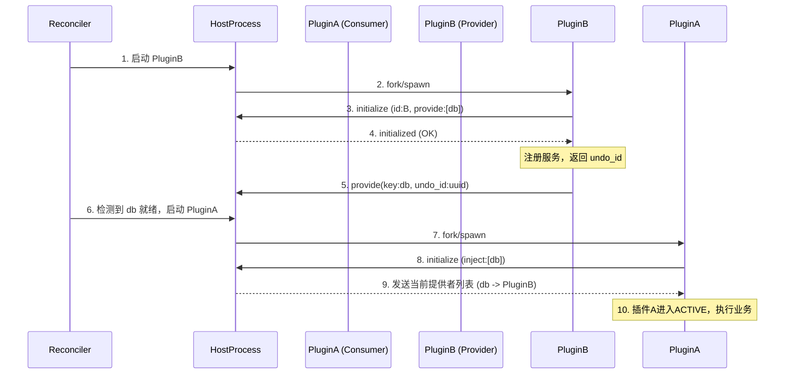
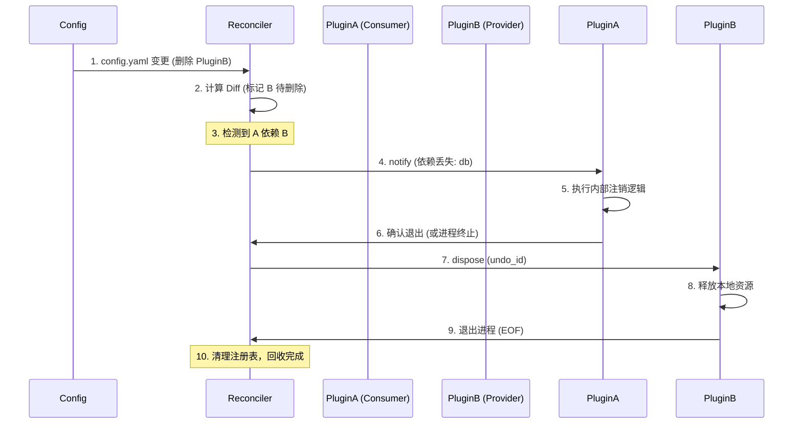

# 仓颉（Cangjie）Cordis 动态组合框架 —— 完整设计文档（v1.0）

**文档状态**：草案
**核心理论依据**：北京大学 & DeepSeek-AI《Revertible Effects and Reactive Coeffects》论文

---

## 1. 引言与设计目标

### 1.1 背景
现代软件（如插件系统、自进化 AI Agent）需要在运行时动态加载/卸载组件。传统方案依赖进程级重启或开发者手写清理钩子，难以保证资源完全回收且容易出错。

### 1.2 仓颉实现的特殊约束与对策
- **约束**：仓颉编译为静态机器码，运行时无法像 JavaScript 那样可靠地卸载 `dlopen` 加载的模块（静态变量无法重置）。
- **对策**：采用 **“微内核 + 进程隔离”** 架构。核心框架（内核）常驻内存，永不卸载；业务插件以**独立子进程**运行，卸载即强制杀进程，利用操作系统（OS）回收全部物理资源。

### 1.3 核心设计原则
1. **声明式优于命令式**：运维只需维护配置文件，框架自动完成差异对比和执行。
2. **零成本抽象**：利用编译时宏（Macro）生成 IPC 胶水代码，开发者感知不到 RPC 的存在。
3. **故障隔离（Failure Isolation）**：一个插件崩溃不影响主进程和其他插件。

---

## 2. 总体架构分层

| 层级 | 组件 | 仓颉实现技术 | 职责 |
| :--- | :--- | :--- | :--- |
| **接入层** | 配置管理 | `YAML/JSON` 解析 | 定义目标状态（哪些插件该跑）。 |
| **调度层（Core）** | 调和器（Reconciler） | `async`/`await` 协程 | 调谐循环：对比期望与实际状态，执行 `Add/Remove/Update` 操作。 |
| **运行时层（Runtime）** | 进程管理 & RPC 引擎 | `os.Process`, `stdio` | 拉起/杀死子进程；封装 JSON-RPC 2.0 协议读写。 |
| **编译期层（Macro）** | 代码生成器 | 仓颉 宏（Macro） | 自动生成 `main` 函数、`stdin`/`stdout` 事件循环、序列化代码。 |
| **插件层（Plugin）** | 业务逻辑 | 普通仓颉类（标注注解） | 实现具体业务，完全无感底层通信。 |

---

## 3. 核心数据模型（仓颉 `struct` 定义）

```java
// 配置条目
struct PluginEntry {
    var id: String
    var source: Path              // 可执行文件路径
    var inject: Array<String>     // 依赖的服务 Key
    var provide: Array<String>    // 提供的服务 Key
    var config: Map<String, Value>
    var enabled: Bool
}

// 运行时实例（纤程/进程句柄）
struct PluginInstance {
    var entry: PluginEntry
    var process: Process
    var status: InstanceStatus    // Starting, Active, Unloading, Failed
    var provideMap: Map<String, String> // Key -> 自身提供
}
```

---

## 4. 进程通信协议（JSON-RPC 2.0 over stdio）

- **通道分工**：`stdin`（接收请求）、`stdout`（发送请求/响应）、`stderr`（仅供插件打日志）。
- **帧协议（Framing）**：采用 `Content-Length: N\r\n\r\n{...}` 格式（与 LSP 一致），便于使用 `BufferedReader` 精确截取。
- **核心 RPC 方法映射**：

| 方向 | 方法 | 说明 |
| :--- | :--- | :--- |
| 插件 -> 宿主 | `initialize` | 启动握手，上报 ID 和依赖清单 |
| 宿主 -> 插件 | `initialized` | 确认依赖满足，允许插件开始工作 |
| 插件 -> 宿主 | `provide` | 注册服务，返回 `undo_id` |
| 宿主 -> 插件 | `dispose` | 携带 `undo_id`，请求插件撤销特定服务 |
| 宿主 -> 插件 | `notify` | 广播依赖图变化（如提供者退出） |
| 插件 -> 宿主 | `log` | 转发内部日志 |

---

## 5. 编译时宏设计（开发者体验核心）

利用仓颉**宏（Macro）**，开发者只需书写纯净业务逻辑，所有 IO 和序列化代码由编译器生成。

- **`@plugin`**：作用于 `class`。生成独立进程的 `main` 函数，启动 RPC 事件循环。
- **`@inject`**：作用于 `var`。生成 `get` 方法，自动发送 `invoke` RPC 并挂起当前协程等待结果。
- **`@provide`**：作用于 `func`。自动注册路由，将 JSON `params` 反序列化为仓颉参数，调用后将返回值序列化为 JSON 响应。

---

## 6. 宿主端调和器（Reconciler）实现

这是框架的“大脑”，以固定周期（如 5 秒）运行一次调谐循环（Reconcile Loop）。

### 6.1 核心流程
1. **读期望**：解析 `config.yaml`，生成 `Desired` 状态集合。
2. **读实际**：扫描系统当前存活子进程列表，生成 `Actual` 状态集合。
3. **计算 Diff**：
   - `ToRemove` = `Actual - Desired`（配置删除了，或 `enabled=false`）。
   - `ToAdd` = `Desired - Actual`（新增插件）。
   - `ToUpdate` = 交叉部分，但 `source` 或 `config` 发生变更。
4. **原子性执行**：**“先加后删”**（若更新）。先启动新进程并等待 `initialize` 成功，再杀死旧进程，确保服务不中断。

### 6.2 依赖顺序保障（拓扑排序）
- 构建有向无环图（DAG）：A 依赖 B -> B 先启动。
- 若依赖的插件启动失败或崩溃，依赖方将保持 `Waiting` 状态，进入降级模式（Degraded）。

---

## 7. 端到端关键交互时序图

### 7.1 插件启动与依赖握手


### 7.2 热卸载与资源回收


---

## 8. 错误处理与可观测性

### 8.1 故障自愈（Self-Healing）
- **进程崩溃**：宿主读取子进程 `stdout` EOF（文件结束符），判定为意外退出。
- **重启策略**：调和器在下一个调谐周期检测到 `Actual` 缺失但 `Desired` 仍存在，自动执行 `spawn` 拉起新进程，实现自动恢复。

### 8.2 日志与监控
- **日志汇聚**：插件通过 `log` RPC 将日志发送给宿主，宿主统一添加时间戳和 `plugin_id` 后写入全局日志文件。
- **探活（Ping/Pong）**：宿主定时发送 `ping`，若插件未在规定时间内返回 `pong`，宿主主动将插件状态标记为 `Unreachable` 并触发重启。

### 8.3 超时与断路保护
- 宿主向插件发送 RPC 请求时，必须设置超时时间（如 30 秒）。若超时，宿主直接返回错误给调用方，并记录告警，避免长时间阻塞调和器主循环。

---

## 9. 构建与部署规范

1. **独立编译**：每个插件项目必须是独立的仓颉可执行文件（`main` 函数由 `@plugin` 宏生成）。
2. **资源隔离**：插件不得操作宿主进程的全局静态变量；所有跨进程交互必须经由 JSON-RPC 通道。
3. **升级策略**：配置中的 `source` 支持 URL（如 `http://repo/plugin-v2`），Reconciler 会先下载替换旧文件，再执行原子性重启。

---

## 10. 局限性讨论（未来工作）

1. **性能开销**：相比进程内直接调用，JSON-RPC 序列化与进程间通信（IPC）存在微秒级延迟。适用于中低频交互场景，不适合超高频实时计算（如需高频计算，建议封装为本地库并由宿主直接调用）。
2. **状态同步**：宿主崩溃重启时，会强制杀死所有子进程。需确保插件设计为**无状态（Stateless）**或支持从宿主传入的快照（Snapshot）恢复。

---

## 11. 总结

本文档设计了一套完整的、基于仓颉语言特性的动态组合框架。通过 **“进程隔离”** 规避了静态语言卸载难题，通过 **“编译时宏”** 掩盖了底层 IPC 复杂性，通过 **“声明式调和器”** 实现了运维自动化。该设计完全保留了原论文关于“可逆效果”和“反应式余效果”的理论精髓，并具备了生产环境可用的工程鲁棒性。

---

这份文档已经包含了从**设计哲学**、**底层协议**、**编码实现**到**运维部署**的全部内容。你可以直接用它作为团队评审或项目开发的技术蓝皮书。如果想针对其中某个具体模块（比如宏生成的详细 AST 操作）继续深挖，随时告诉我。