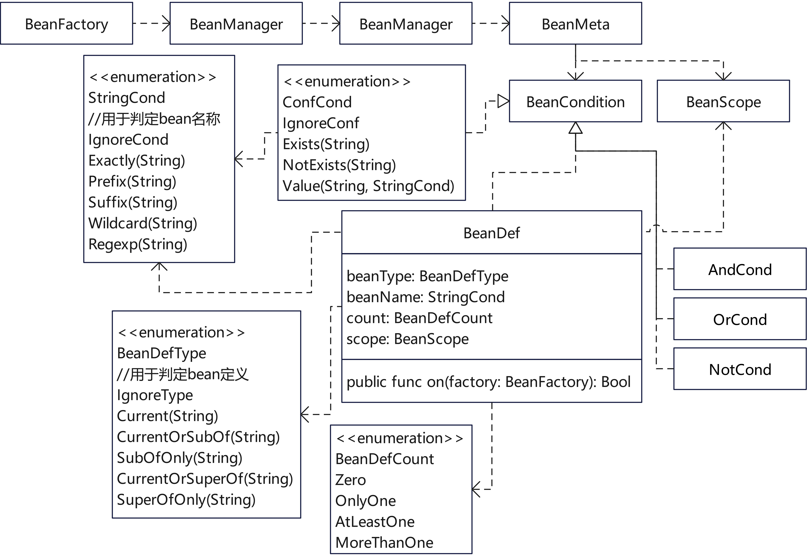

# fountain实现思想与应用第二弹
## ——IOC
# 实现原理
下面是IOC的核心类图。

所有的代码都围绕BeanMeta展开，它维护着受IOC管理的元数据，整个IOC的行为都受BeanMeta控制，下面是BeanMeta的全部代码。@Bean宏展开的代码会将类的无参构造函数或将被@Constructor修饰的公共静态函数作为工厂函数包装成闭包调用注册到单例类BeanFactory。BeanFactory的注册函数通过函数泛型实参确定被注册的类型并用反射获取BeanMeta注解，对于没有BeanMeta修饰的类BeanFactory会创建一个BeanMeta实例作为默认值。BeanFactory会把注册进来的闭包、被注册类的TypeInfo和BeanMeta作为BeanManager的构造函数实参创建BeanManager实例。BeanFactory分别使用bean的name、bean的类型、bean的父类型、父类型的父类型、以及bean的类型实现的所有接口和修饰bean类型的注解、注解的父类型做KEY，BeanManager做值分别保存到三个HashMap当中。第一个HashMap KEY是bean的name，第二个HashMap KEY是类的ClassTypeInfo、父类型的ClassTypeInfo、实现的接口的InterfaceTypeInfo，第三个HashMap KEY是注解的ClassTypeInfo、注解父类型的ClassTypeInfo。这样就可以使用bean的名称、TypeInfo和注解得到被管理类型的实例。
所有类都被注册到BeanFactory以后，调用它的afterRegistered()函数遍历每一个BeanManager，并执行BeanMeta内的BeanCondition，不满足条件的都会从BeanFactory删除。符合条件的会保留下来，并执行第二次遍历初始化BeanMeta.lazy是false且scope是singleton的那些bean。BeanCondition实现如上图所示，并且重载了& | !操作符，可以使用这些操作符将多个BeanCondition组合起来共同起作用。
为了简化使用，工具库提供了fountain.App结构体，它会调用std.reflect.PackageInfo.load函数加载指定目录下文件名符合指定正则表达式的动态链接库。动态链接库加载时就完成了初始化，并将受管理的bean注册到了BeanFactory。最后fountain.App就会调用BeanFactory.instance.afterRegistered()完成IOC的初始化。
```cj
/**
 * bean元数据
 */
@Annotation[target: [MemberFunction, Type]]
public class BeanMeta <: Comparable<BeanMeta> {
    public const BeanMeta(
        public let name!: String = '',
        public let lazy!: Bool = true,
        public let scope!: BeanScope = BeanScope.singleton,
        public let order!: Int64 = 0,
        public let primary!: Bool = false,
        public let condition!: BeanCondition = NoneBeanCondition.instance
    ) {}
    /**
     * BeanFactory.getList<T>()按照这个顺序返回
     */
    public func compare(meta: BeanMeta): Ordering {
        if (this.primary && !meta.primary) {
            LT
        } else if (!this.primary && meta.primary) {
            GT
        } else {
            match (this.order.compare(meta.order)) {
                case EQ where !(this.name.isEmpty() || meta.name.isEmpty()) => this.name.compare(meta.name)
                case x => x
            }
        }
    }
}
```
## 应用
下面是最简单的一个应用方式。需要额外说明的是，由于struct是值类型，如果IOC支持struct，从IOC获取struct实例将会导致大量实例复制，作者认为会导致严重的性能损失，因此本IOC实现只支持管理class。
```cj
import fountain.bean.*
import fountain.bean.macros.*

public interface Tag{}
@Bean
public class Bean1 <: Tag {}
@Bean
public class Bean2 <: Tag{
   private let field = lookup<Bean1>()
}
@Bean
public class Bean3 {
   private let fields = lookupList<Tag>()
}
```
另外@Bean宏还有一个带属性的重载，可以用来修饰泛型类，宏的属性用来指定被修饰类的泛型实参，并且用|分割多组泛型实参。
```cj
import fountain.bean.*
import fountain.bean.macros.*

@Bean[String, Int64|String, string]
public class GenericBean<A, B>{}
```
如果想按照指定bean名称的某种规则获得受管理的bean，可以使用StringCond枚举作lookup函数的实参。
```cj
import fountain.bean.*
import fountain.bean.macros.*

public interface Tag{}
@Bean
@BeanMeta[name: 'abc']
public class Bean4 <: Tag {}
@Bean
@BeanMeta[name: 'aaa']
public class Bean5 <: Tag{
}
@Bean
@BeanMeta[name: 'bean6']
public class Bean6 <: Tag{
}
@Bean
public class Bean7 {
   private let fields = lookupList<Tag>(Prefix('a'))//将返回Bean4 Bean5两个类型的bean，Bean6不会返回
}
```
除了Prefix，StringCond还有IgnoreCond表示所有名称都符合，这也是默认条件。还有Suffix(String)表示名称的后缀条件，Exactly(String)表示一个确切的名称，Wildcard(String)表示带*通配符的规则，Regexp(String)表示正则表达式。