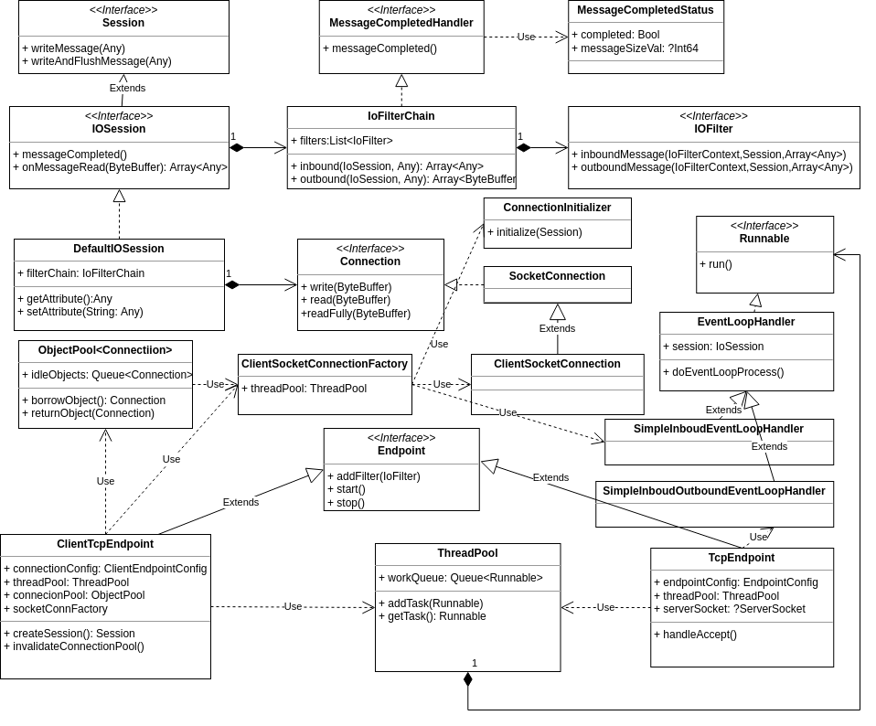
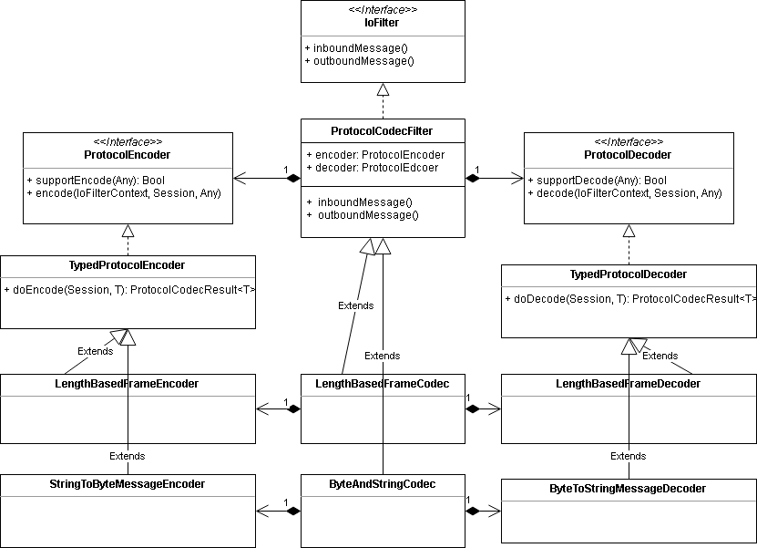

# Hyperion: 一个支持自定义编解码器的TCP通信框架

<p align="center">


</p>

##  1 介绍
## 1.1 特性
1. 支持自定义编解码器
2. 高效的ByteBuffer实现，降低请求处理过程中数据拷贝
3. 自带连接池支持，支持连接重建、连接空闲超时
4. 易于扩展，可以积木式添加IoFilter处理入栈、出栈消息

## 1.2 组件
1. hyperion.buffer： 支持扩容的ByteBuffer实现
2. hyperion.logadapter：支持打印异常堆栈的日志实现，可以适配第三方日志系统
3. hyperion.objectpool：对象池实现
4. hyperion.threadpool：线程池实现
5. hyperion.transport：支持自定义编解码器的TCP通信框架

Redis仓颉语言客户端SDK：[redis-sdk](https://gitcode.com/Cangjie-TPC/redis-sdk/)项目使用了该TCP框架，实现了RESP2、RESP3协议的编解码。<br>
ActiveMQ仓颉语言客户端SDK：[acitvemq4cj](https://gitcode.com/Cangjie-TPC/activemq4cj)项目使用了该TCP框架，实现了OpenWire协议的编解码。<br>

## 1.3 仓颉SDK和分支对应关系
| 仓颉SDK版本       | 分支                                                                               |
| -----------------| ---------------------------------------------------------------------------------- |
| 1.0.0 LTS        | [master](https://gitcode.com/Cangjie-TPC/hyperion/tree/master)                     |
| 0.60.5           | [Branch_cj0.60.5](https://gitcode.com/Cangjie-TPC/hyperion/tree/Branch_cj0.60.5)   |
| 0.53.18 Beta     | [Branch_cj0.53.18](https://gitcode.com/Cangjie-TPC/hyperion/tree/Branch_cj0.53.18) |
| 0.45.2和0.51.4   | [Branch_cj0.51.4](https://gitcode.com/Cangjie-TPC/hyperion/tree/Branch_cj0.51.4)   |

## 1.4 编译和测试
工程目录结构<br>
```shell
|---samples  使用Hyperion TCP框架的示例目录
|---src      Hyperion TCP框架的源码目录
|---cjpm.toml
|---README.md
```

### 1.4.1 编译步骤
清理工程，在工程根目录下运行：<br>
`$> cjpm clean`

编译工程，在工程根目录下运行：<br>
`$> cjpm build`

编译的静态库位于：<br>
`build/release/hyperion/hyperion.buffer.cjo`<br>
`build/release/hyperion/hyperion.logadapter.cjo`<br>
`build/release/hyperion/hyperion.objectpool.cjo`<br>
`build/release/hyperion/hyperion.threadpool.cjo`<br>
`build/release/hyperion/hyperion.transport.cjo`<br>

### 1.4.2 单元测试
在工程根目录下运行：<br>
`$> cjpm test`

### 1.4.3 运行示例程序
编译服务端示例程序，在samples/echo_server目录下运行：<br>
`$> cjpm build`

启动服务端，在samples/echo_server目录下运行：<br>
`$>./build/release/bin/main`

编译客户端示例程序，在samples/echo_client目录下运行：<br>
`$> cjpm build`

启动服务端，在samples/echo_client目录下运行：<br>
`$>./build/release/bin/main`

##  2 架构

### 2.1 Hyperion TCP框架的架构
Hyperion TCP框架的架构图如下：<br>


#### MessageCompletedHandler接口
用于判断消息的报文是否读取完整，提供如下方法：<br>
func messageCompleted(buffer: ByteBuffer, status: MessageCompletedStatus): Unit<br>

#### Session接口
单向会话接口，可以向对端发送消息<br>

#### IoSession接口
双向会话接口，可以从对端收取消息，也可以向对端发送消息<br>

#### IoFilter接口
对TCP框架客户端或者服务端的入栈消息、出栈消息进行加工，提供如下方法：<br>
func inboundMessage(context: IoFilterContext, session: Session, inMessages: ArrayList&lt;Any&gt;): Unit<br>
func outboundMessage(context: IoFilterContext, session: Session, outMessages: ArrayList&lt;Any&gt;): Unit<br>

#### SingularMessageIoFilter类
只处理单个入栈消息和单个出栈消息的IoFilter实现

#### IoFilterChain类
由IoFilter串联而成的链表<br>

#### Connection接口
TCP框架客户端和服务端之间建立的连接<br>

#### ConnectionInitializer接口
用于客户端和服务端初始化TCP连接，提供如下方法：<br>
func initialize(session: Session): Unit

#### EventLoopHandler类
TCP框架客户端或者服务端的事件处理器，循环处理入栈消息，并按需要将消息出栈<br>

#### TcpEndpoint类
TCP框架服务端实现<br>

#### ClientTcpEndpoint类
TCP框架客户端实现，服务端支持非Hyperion TCP框架的服务端<br>

### 2.1 Hyperion TCP框架编解码模块的架构图
Hyperion TCP框架的的编解码模块的架构图如下：<br>


#### ProtocolEncoder接口
编码器接口

#### ProtocolDecoder接口
解码器接口

#### ProtocolCodecFilter类
一对编码器、解码器的组合，实现了IoFilter接口

#### StringToByteMessageEncoder
字符串编码器

#### ByteToStringMessageDecoder
字符串解码器

#### LengthBasedFrameEncoder
带长度的报文编码器

#### LengthBasedFrameDecoder
带长度的报文解码器

##  3 使用说明

### 3.1 通过源码方式Hyperion TCP框架

仓颉1.0.0 LTS版本：在项目的cjpm.toml中添加dependencies引入Hyperion TCP框架依赖：

```
[dependencies]
  hyperion = {git = "https://gitcode.com/Cangjie-TPC/hyperion.git", branch = "master", version = "3.0.0"}
```


仓颉0.53.18 beta版本：在项目的cjpm.toml中添加dependencies引入Hyperion TCP框架依赖：

```
[dependencies]
  hyperion = {git = "https://gitcode.com/Cangjie-TPC/hyperion.git", branch = "Branch_cj0.53.18", version = "2.0.0"}
```

仓颉0.45.2和0.51.4版本，请参考[Branch_cj0.51.4](https://gitcode.com/Cangjie-TPC/hyperion/tree/Branch_cj0.51.4)分支中的说明。

更新依赖，运行cjpm update会自动下载依赖hyperion项目到~/.cjpm目录下<br>
`$> cjpm update`

### 3.2 编译Hyperion TCP框架并导入静态库依赖

编译Hyperion TCP框架请参考"1.3.1 编译步骤"

引入编译好的静态库依赖和通过源码方式引入依赖，任意选取一种方式即可。 参考"3.1 通过源码方式引入Redis客户端依赖"。

仓颉0.53.4以上版本，需要先确定平台对应的target-name：<br>

例如Windows X64平台执行`cjc -v`命令返回如下：

```
$cjc -v
Cangjie Compiler: 0.53.4 (cjnative)
Target: x86_64-w64-mingw32
```

例如Linux X64平台执行`cjc -v`命令返回如下：

```
$cjc -v
Cangjie Compiler: 0.53.4 (cjnative)
Target: x86_64-unknown-linux-gnu
```

仓颉0.53.4版本，在工程的cjpm.toml中添加平台对应的二进制依赖，以Linux X64为例：

```
[target.x86_64-unknown-linux-gnu.bin-dependencies.package-option]
  "hyperion.buffer" = "${path_to_hyperion}/build/release/hyperion/hyperion.buffer.cjo"
  "hyperion.logadapter" = "${path_to_hyperion}/build/release/hyperion/hyperion.logadapter.cjo"
  "hyperion.objectpool" = "${path_to_hyperion}/build/release/hyperion/hyperion.objectpool.cjo"
  "hyperion.threadpool" = "${path_to_hyperion}/build/release/hyperion/hyperion.threadpool.cjo"
  "hyperion.transport" = "${path_to_hyperion}/build/release/hyperion/hyperion.transport.cjo"
  "hyperion.transport.server" = "${path_to_hyperion}/build/release/hyperion/hyperion.transport.server.cjo"
```

仓颉0.45.2和0.51.4版本，请参考[Branch_cj0.51.4](https://gitcode.com/Cangjie-TPC/hyperion/tree/Branch_cj0.51.4)分支中的说明。

### 3.3 TCP框架客户端和服务端支持的配置
#### 1. 客户端和服务端都支持的配置

###### Socket配置

| TcpSocketOptions类的属性           | 作用            |
| ------------------------------ | ------------- |
| prop port: UInt16              | 设置TCP服务端的监听端口 |
| prop receiveBufferSize: ?Int64 | 接收缓冲区大小       |
| prop sendBufferSizeVal: ?Int64 | 发送缓冲区大小       |
| prop noDelay: ?Bool            | TCP_NODELAY选项 |
| prop linger: ?Duration         | SO_LINGER选项   |
| prop readTimeout: ?Duration    | Socket读超时时间   |
| prop writeTimeout: ?Duration   | Socket写超时时间   |
| prop idleTimeout: Duration     | 连接空闲超时时间      |

###### Hyperion TCP框架配置

| TcpSocketOptions类的属性                  | 作用                 | 默认值   |
| ------------------------------------- | ------------------ | ----- |
| prop asyncWrite: Bool                 | 是否开启每个连接一个写线程      | true  |
| prop sliceExceedBuffer: Bool          | 是否通过切片方式减少数组拷贝     | true  |
| prop maxMessageSizeInBytes: Int64     | 支持处理的消息的最大长度       | 64M   |
| prop bufferAllocateSize: Int64        | 分配的ByteBuffer大小    | 8192  |
| * prop usePooledBufferAllocator: Bool | 是否将ByteBuffer池化重用  | false |
| * prop maxPooledBuffers: Int64        | 缓存的ByteBuffer的最大数量 | 2048  |

 标*的为实验性质配置，目前不建议在生产环境中修改这些配置的默认值

#### 2. 服务端特有的配置

| EndpointConfig类的属性             | 作用              |
| ------------------------------ | --------------- |
| prop address: String           | 设置TCP服务端的监听地址   |
| prop backlogSize: ?Int64       | backlog队列大小     |
| prop reuseAddress: ?Bool       | SO_REUSE_ADDR选项 |
| prop sendBufferSizeVal: ?Int64 | 发送缓冲区大小         |
| prop reusePort: ?Bool          | SO_REUSE_PORT选项 |
| prop acceptTimeout: ?Duration  | Accept超时时间      |

#### 3. 客户端特有的配置

| ClientEndpointConfig类的属性             | 作用            |
| ------------------------------------ | ------------- |
| prop host: String                    | 设置TCP服务端的监听地址 |
| prop minConnections: Int64           | 连接池的最小连接数     |
| prop maxConnections: Int64           | 连接池的最大连接数     |
| prop waitConnectionTimeout: Duration | 等待连接超时时间      |

### 3.4 实现一个回写消息的服务端
#### 3.4.1 需求
需求： 回写客户端发送过来的字符串消息<br>
传输报文：4字节的字符串二进制数组长度+字符串的二进制数组<br>

| 长度  | 说明                     |
| --- | ---------------------- |
| 4字节 | 使用utf8编码的字符串的Byte数组的长度 |
| n字节 | 使用utf8编码的字符串的Byte数组    |

#### 3.4.2 服务定义
编写一个回写字符串消息的服务：
```cangjie
public class EchoService {

    public func processMessage(message: String) {
        return message
    }

}
```

#### 3.4.3 实现编解码和调用服务的IoFilter
编写一个IoFilter，将入栈消息交给EchoService处理：
```cangjie
public class EchoHanlder <: SingularMessageIoFilter {
    private let service = EchoService()

    /**
     * 处理入栈消息
     */
    public func processInboundMessage(context: IoFilterContext, session: Session, inMessage: Any): Unit {
        if (let Some(text) <- (inMessage as String)) {
            println("Received Message: ${text}")
            // 调用业务处理逻辑
            let result = service.processMessage(text)
            context.offerMessage(result)
        } else {
            let exception = Exception("Only accept string message")
            context.exceptionCaught(exception)
        }
    }

    public func processInboundException(context: IoFilterContext, session: Session, ex: Exception) {
        context.exceptionCaught(ex)
    }

    /**
     *  处理出栈消息
     */
    public func processOutboundMessage(context: IoFilterContext, session: Session, outMessage: Any): Unit {
        // 转交给下一个IoFilter处理
        context.offerMessage(outMessage)
    }

    public func processOutboundException(context: IoFilterContext, session: Session, ex: Exception): Unit {
        context.exceptionCaught(ex)
    }

    public func toString() {
        return "EchoHanlder"
    }
}
```
编写一个将字符串转换为二进制数组的IoFilter，由于hyperion.transport.ByteAndStringCodec已经实现该功能，可以直接选用ByteAndStringCodec<br>
编写一个给二进制数组添加报文长度的IoFilter，由于hyperion.transport.LengthBasedFrameCodec已经实现该功能，可以直接选用LengthBasedFrameCodec<br>

#### 3.4.4 编写TCP服务端
编写服务端，并添加编解码和调用服务使用的IoFilter：
```cangjie
    let config = EndpointConfig()
    config.address = "127.0.0.1"
    config.port = 8090

    // 服务端使用的线程池
    let threadPool = ThreadPoolFactory.createThreadPool(3, 128, 4096, Duration.minute * 2)
    // 创建服务端Endpoint
    let tcpEndpoint = TcpEndpoint(config, threadPool)

    // 使用4字节记录报文长度的编解码器
    let lengthFrameEncoder = LengthBasedFrameEncoder(4)
    let lengthFrameDecoder = LengthBasedFrameDecoder(4)
    // 判断报文是否包含完整消息的MessageCompletedHandler
    tcpEndpoint.setMessageCompletedHandler(lengthFrameDecoder)
    // 解析报文长度的IoFilter
    tcpEndpoint.addFilter(LengthBasedFrameCodec(lengthFrameEncoder, lengthFrameDecoder))
    // 字符串和二进制数组转换的IoFilter
    tcpEndpoint.addFilter(ByteAndStringCodec())
    // 调用服务的IoFilter
    tcpEndpoint.addFilter(EchoHanlder())

    // 启动服务端Endpoint
    tcpEndpoint.start()
```

### 3.5 实现一个收发字符串消息的客户端
#### 3.5.1 需求
需求： 向服务端发送字符串，并收取字符串响应<br>
传输报文：4字节的字符串二进制数组长度+字符串的二进制数组<br>

| 长度  | 说明                     |
| --- | ---------------------- |
| 4字节 | 使用utf8编码的字符串的Byte数组的长度 |
| n字节 | 使用utf8编码的字符串的Byte数组    |

#### 3.5.2 实现接收响应消息的类
```cangjie
public class EchoResponse {
    private var exception: ?Exception = None

    private var message: ?String = None

    public func setException(exception: Exception) {
        this.exception = exception
    }

    public func getException(): ?Exception {
        return this.exception
    }

    public func setMessage(message: String) {
        this.message = message
    }

    public func getMessage(): String {
        if (let Some(ex) <- exception) {
            throw ex
        }

        if (let Some(message) <- message) {
            return message
        }

        throw Exception("No response message")
    }
}
```

#### 3.5.3 实现编解码和调用服务的IoFilter
编写一个IoFilter，将收取到的消息放入队列中，以便后续获取使用：
```cangjie
public class ClientHandler <: SingularMessageIoFilter {
    private let messages = LinkedBlockingQueue<EchoResponse>()

    public func takeMessage(): String {
        let echoResponse = messages.remove()
        return echoResponse.getMessage()
    }

    public func takeMessage(timeout: Duration): ?String {
        if (let Some(echoResponse) <- messages.remove(timeout)) {
            return echoResponse.getMessage()
        }

        return None
    }

    /**
     * 处理入栈消息
     */
    public func processInboundMessage(context: IoFilterContext, session: Session, inMessage: Any): Unit {
        let echoResponse = EchoResponse()
        if (let Some(text) <- (inMessage as String)) {
            echoResponse.setMessage(text)
        } else {
            let exception = Exception("Only accept string message")
            echoResponse.setException(exception)
        }

        // 添加到messages队列中，不再交给下一个IoFilter处理
        messages.enqueue(echoResponse)
    }

    public func processInboundException(context: IoFilterContext, session: Session, ex: Exception) {
        let echoResponse = EchoResponse()
        echoResponse.setException(ex)
        // 添加到messages队列中，不再交给下一个IoFilter处理
        messages.enqueue(echoResponse)
    }

    /**
     *  处理出栈消息
     */
    public func processOutboundMessage(context: IoFilterContext, session: Session, outMessage: Any): Unit {
        if (let Some(text) <- (outMessage as String)) {
            // 直接发给下个IoFilter处理
            context.offerMessage(text)
        } else {
            let exception = Exception("Only accept string message")
            context.exceptionCaught(exception)
        }
    }

    public func processOutboundException(context: IoFilterContext, session: Session, ex: Exception): Unit {
        context.exceptionCaught(ex)
    }

    public func toString() {
        return "ClientHanlder"
    }
}
```
编写一个将字符串转换为二进制数组的IoFilter，由于hyperion.transport.ByteAndStringCodec已经实现该功能，可以直接选用ByteAndStringCodec<br>
编写一个给二进制数组添加报文长度的IoFilter，由于hyperion.transport.LengthBasedFrameCodec已经实现该功能，可以直接选用LengthBasedFrameCodec<br>

#### 3.5.4 编写TCP客户端
编写服务端，并添加编解码和调用服务使用的IoFilter：
```cangjie
    let config = ClientEndpointConfig()
    config.host = "127.0.0.1"
    config.port = 8090

    // 客户端使用的线程池
    let threadPool = ThreadPoolFactory.createThreadPool(3, 128, 4096, Duration.minute * 2)
    // 创建客户端Endpoint
    let tcpEndpoint = ClientTcpEndpoint(config, threadPool)

    // 使用4字节记录报文长度的编解码器
    let lengthFrameEncoder = LengthBasedFrameEncoder(4)
    let lengthFrameDecoder = LengthBasedFrameDecoder(4)
    // 判断报文是否包含完整消息的MessageCompletedHandler
    tcpEndpoint.setMessageCompletedHandler(lengthFrameDecoder)
    // 解析报文长度的IoFilter
    tcpEndpoint.addFilter(LengthBasedFrameCodec(lengthFrameEncoder, lengthFrameDecoder))
    // 字符串和二进制数组转换的IoFilter
    tcpEndpoint.addFilter(ByteAndStringCodec())
    // 接收消息并缓存消息到队列中的IoFilter
    let clientHandler = ClientHandler()
    tcpEndpoint.addFilter(clientHandler)
     // 启动客户端Endpoint
    tcpEndpoint.start()

    // 创建会话，并使用会话发送消息
    try (session = tcpEndpoint.createSession()) {
        // 发送消息，并收取对应的响应
        for (i in 1..=100) {
            let message = "Message${i}"
            println("Send message: ${message}")
            session.writeAndFlushMessage(message)
            let receiveMsg = clientHandler.takeMessage()
            println("Client receive message: ${receiveMsg}")
        }
    }
```

##  4 参与贡献

hyperion项目由[北京宝兰德软件股份有限公司](https://www.bessystem.com)中间件团队实现并维护。 技术支持和意见反馈请提[Issue](https://gitcode.com/Cangjie-TPC/hyperion/issues)。<br>
本项目基于 [Apache License 2.0](./LICENSE)，欢迎给我们提交PR，欢迎参与任何形式的贡献。<br>
本项目commiter：[@hapinwater](https://gitcode.com/hapinwater)