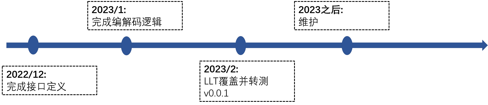
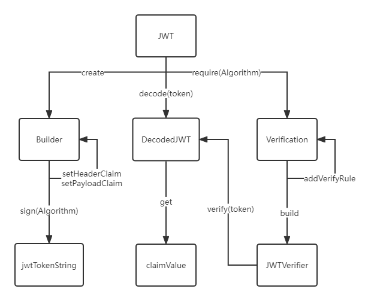

<div align="center">
<h1>jwt4cj</h1>
</div>

<p align="center">


</p>

## 介绍

一个基于 RFC 7519 的 JSON Web Token 和 JSON Web Signature的仓颉库。

### 特性

- 支持 JWT 创建与解析
- 支持 Payload 校验
- 支持 HMAC 算法签名及验证
- 支持 RSA 算法签名及验证
- 支持 ECDSA 算法签名及验证

### 路线

<p align="center">

</p>

## 架构

### 源码目录

```shell
.
├── README.md
├── doc
├── src
└── test   
    ├── HLT
    └── LLT
```

- `doc`存放库的设计文档、提案、库的使用文档
- `src`存放库源码目录
- `test`存放存放测试用例，包括HLT用例、LLT 用例和UT用例 (运行用例参考[TPC-Test-Framework](https://gitcode.com/Cangjie-TPC/TPC-Test-Framework))

### 接口说明

主要是核心类和成员函数说明,详情见 [API](./doc/feature_api.md)

## 使用说明

### 编译（win/linux）

两种编译方式

1. 使用脚本编译 
    1. 下载配置[编译脚本](https://gitcode.com/Cangjie-TPC/TPC-Test-Framework.git)
    2. ciTest build
2. 使用cjpm编译 
    1. 该三方库依赖stdx，请参考[stdx](https://gitcode.com/Cangjie/Cangjie-STDX#%E4%BD%BF%E7%94%A8%E6%8C%87%E5%AF%BC)文档配置`CANGJIE_STDX_PATH`路径
    2. cjpm build

### 功能示例
<p align="center">

</p>

#### jwt创建功能示例
``` cangjie
import std.collection.*
import std.time.*
import stdx.encoding.json.*
import jwt4cj.*

main(){
    let jwtStr = JWT.create()
        .withHeader(HashMap<String, Any>([("k1","v1")]))
        .withKeyId("keyId")
        .withIssuer("issuer")
        .withSubject("subject")
        .withAudience(["aud1", "aud2"])
        .withExpiresAt(DateTime.ofEpoch(second: 3673835050, nanosecond: 0))
        .withNotBefore(DateTime.ofEpoch(second: 1673835050, nanosecond: 0))
        .withIssuedAt(DateTime.ofEpoch(second: 1673835050, nanosecond: 0))
        .withJWTId("jwtId")
        .withClaim("bool", true)
        .withClaim("ddd", "dfdddff")
        .withClaim("int64", 64)
        .withClaim("float64", 3.14)
        .withClaim("String", "abaaba")
        .withClaim("time", DateTime.ofEpoch(second: 1673850000, nanosecond: 0))
        .withClaim("map", HashMap<String, Any>([("mk2","mv2")]))
        .withClaim("list", ArrayList<Any>([56.51,41.96]))
        .withNullClaim("null")
        .withArrayClaim("arraystring", ["astr1","astr2"])
        .withArrayClaim("arrayint", [684,64])
        .withPayload(HashMap<String, Any>([("pk1","pv1"),("pk2","pv2")]))
        .sign(Algorithm.HMAC256("admin"))
    println(jwtStr)
    0
}
```

```
ewogICJrMSI6ICJ2MSIsCiAgImtpZCI6ICJrZXlJZCIsCiAgImFsZyI6ICJIUzI1NiIsCiAgInR5cCI6ICJKV1QiCn0.ewogICJpc3MiOiAiaXNzdWVyIiwKICAic3ViIjogInN1YmplY3QiLAogICJhdWQiOiBbCiAgICAiYXVkMSIsCiAgICAiYXVkMiIKICBdLAogICJleHAiOiAzNjczODM1MDUwLAogICJuYmYiOiAxNjczODM1MDUwLAogICJpYXQiOiAxNjczODM1MDUwLAogICJqdGkiOiAiand0SWQiLAogICJib29sIjogdHJ1ZSwKICAiZGRkIjogImRmZGRkZmYiLAogICJpbnQ2NCI6IDY0LAogICJmbG9hdDY0IjogMy4xNCwKICAiU3RyaW5nIjogImFiYWFiYSIsCiAgInRpbWUiOiAxNjczODUwMDAwLAogICJtYXAiOiB7CiAgICAibWsyIjogIm12MiIKICB9LAogICJsaXN0IjogWwogICAgNTYuNTEsCiAgICA0MS45NgogIF0sCiAgIm51bGwiOiBudWxsLAogICJhcnJheXN0cmluZyI6IFsKICAgICJhc3RyMSIsCiAgICAiYXN0cjIiCiAgXSwKICAiYXJyYXlpbnQiOiBbCiAgICA2ODQsCiAgICA2NAogIF0sCiAgInBrMSI6ICJwdjEiLAogICJwazIiOiAicHYyIgp9.faVUD-cYR4nvaMYv5HMYk0pVfR9qRsCOWz28tgPoqdM
```

#### jwt解析功能示例
```
import jwt4cj.*

let token = 
    "CnsKICAiazEiOiAidjEiLAogICJraWQiOiAiYWxnb3JpdGhtLmdldFNpZ25pbmdLZXlJZCgpIiwKICAiYWxnIjogIm5vbmUiLAogICJ0eXAiOiAiSldUIiwKICAiY3R5IjogIkpXVCIKfQo.ewogICJpc3MiOiAiaXNzdWVyIiwKICAic3ViIjogInN1YmplY3QiLAogICJhdWQiOiBbCiAgICAiYXVkMSIsCiAgICAiYXVkMiIKICBdLAogICJleHAiOiAxNjczODM1MDkwLAogICJuYmYiOiAxNjczODM1MDUwLAogICJpYXQiOiAxNjczODM1MDAwLAogICJqdGkiOiAiand0SWQiLAogICJib29sIjogdHJ1ZSwKICAiaW50NjQiOiA2NCwKICAiZmxvYXQ2NCI6IDMuMTQwMDAwLAogICJTdHJpbmciOiAiYWJhYWJhIiwKICAidGltZSI6IDE2NzM4NTAwMDAsCiAgIm1hcCI6IHsKICAgICJtazIiOiAibXYyIgogIH0sCiAgImxpc3QiOiBbCiAgICA1Ni41MTAwMDAsCiAgICA0MS45NjAwMDAKICBdLAogICJudWxsIjogbnVsbCwKICAiYXJyYXlzdHJpbmciOiBbCiAgICAiYXN0cjEiLAogICAgImFzdHIyIgogIF0sCiAgImFycmF5aW50IjogWwogICAgNjg0LAogICAgNjQKICBdLAogICJwazEiOiAicHYxIiwKICAicGsyIjogInB2MiIKfQ==."

main() {
    let decoder = JWT.decode(token)
    println(decoder.getAlgorithm())             // none
    println(decoder.getType())                  // JWT
    println(decoder.getContentType())           // JWT
    println(decoder.getHeaderClaim("k1").asString()) // v1
    println(decoder.getIssuer())                // issuer
    println(decoder.getSubject())               // subject
    println(decoder.getAudience().size)         // 2
    println(decoder.getExpiresAt())             // 
    println(decoder.getNotBefore())             // 
    println(decoder.getIssuedAt())              // 
    println(decoder.getId())                    // jwtId
    println(decoder.getClaim("bool").asBool())  // true
    println(decoder.getClaims().size)           // 19
    0
}
```

```
none
JWT
JWT
v1
issuer
subject
2
2023-01-16T10:11:30+08:00
2023-01-16T10:10:50+08:00
2023-01-16T10:10:00+08:00
jwtId
true
19
```

#### jwt校验功能示例
```
import jwt4cj.*

let token = "ewogICJrMSI6ICJ2MSIsCiAgImtpZCI6ICJrZXlJZCIsCiAgImFsZyI6ICJub25lIiwKICAidHlwIjogIkpXVCIKfQ.ewogICJpc3MiOiAiaXNzdWVyIiwKICAic3ViIjogInN1YmplY3QiLAogICJhdWQiOiBbCiAgICAiYXVkMSIsCiAgICAiYXVkMiIKICBdLAogICJleHAiOiAzNjczODM1MDUwLAogICJuYmYiOiAxNjczODM1MDUwLAogICJpYXQiOiAxNjczODM1MDAwLAogICJqdGkiOiAiand0SWQiLAogICJib29sIjogdHJ1ZSwKICAiZGRkIjogImRmZGRkZmYiLAogICJpbnQ2NCI6IDY0LAogICJmbG9hdDY0IjogMy4xNDAwMDAsCiAgIlN0cmluZyI6ICJhYmFhYmEiLAogICJ0aW1lIjogMTY3Mzg1MDAwMCwKICAibWFwIjogewogICAgIm1rMiI6ICJtdjIiCiAgfSwKICAibGlzdCI6IFsKICAgIDU2LjUxMDAwMCwKICAgIDQxLjk2MDAwMAogIF0sCiAgIm51bGwiOiBudWxsLAogICJhcnJheXN0cmluZyI6IFsKICAgICJhc3RyMSIsCiAgICAiYXN0cjIiCiAgXSwKICAiYXJyYXlpbnQiOiBbCiAgICA2ODQsCiAgICA2NAogIF0sCiAgInBrMSI6ICJwdjEiLAogICJwazIiOiAicHYyIgp9."
main() {
    try {
        let require = JWT.require(Algorithm.none())
        require.withClaim("String","abaaba")
            .withArrayClaim("arraystring",["astr1","astr2"])
            .withArrayClaim("arrayint", [684,64])
            .withClaim("time", DateTime.ofEpoch(second: 1673850000, nanosecond: 0))
            .withClaim("bool", true)
            .withClaim("int64", 64)
            .withClaim("float64", 3.14)
            .withIssuer("issuer") // 签发对象
            .withAudience(["aud1"]) // 接收全部对象   ["aud1", "aud3"] false
            .withAnyOfAudience(["aud1", "aud3"]) // 接收部分对象
            .withSubject("subject")
            .withJWTId("jwtId")
            .withClaimPresence("ddd")
            .acceptExpiresAt(111111)
            .acceptLeeway(111111) // 设置默认时间
        let verifier: JWTVerifier = require.build()
        verifier.verify(token)
        return 0
    } catch (e: TokenExpiredException) {
        println(e.message)
        return 2
    } catch (e: Exception) {
        return 3
    }
    0
}
```

## 开源协议

本项目基于 [MIT License](LICENSE) , 请自由享受和参与开源

## 参与贡献

欢迎给我们提交PR，欢迎给我们提交Issue，欢迎参与任何形式的贡献。
