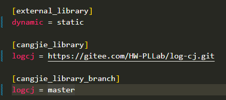
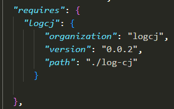

# 如何引用 log-cj 项目

## 前提

项目 A 调用 Log-cj master 分支代码，项目 A 路径 xxx/workspace/A/

## 复制 PLLab 社区中 ci_tools 项目的 ci_test 文件夹到 A 项目的根目录下

ci_tools 项目地址：https://gitee.com/HW-PLLab/testJekins/<br/>
ci_test 文件夹所在位置：https://gitee.com/HW-PLLab/testJekins/tree/dev/src/<br/>

**注意**：是整个 ci_test 文件夹包括整个文件夹带其下面的所有文件，不是只复制 ci_test 下的所有文件<br/>

## 配置项目 A 的 gitee_gate.cfg 文件

添加内容如下：<br/>
<br/>

如果项目 A 中没有 gitee_gate.cfg 文件，可参考 PLLab 社区 okhttp 项目的 gitee_gate.cfg 文件添加一个<br/>

**解释**：external_library，因为 log-cj 是输出静态编译结果文件，所以配置为 static=lib<br/>
静态还是动态输出查看 log-cj 项目的 module.json 文件中 output_type 字段的值，动态则是 dynamic=lib<br/>

## 配置项目 A 的 module.json 文件中的 requires 字段

添加内容如下：<br/>
<br/>

`logcj`同要引用的 log-cj 的分支代码的 module.json 中 name 的值保持一致<br/>
`organization`同要引用的 log-cj 的分支代码的 module.json 中 organization 的值保持一致<br/>
`version`同要引用的 log-cj 的分支代码的 module.json 中 version 的值保持一致<br/>
`path`直接按照上述截图中的配置就行，因为最终拉取的 log-cj 代码就是位于 A 项目的根目录下<br/>

## A 项目所在环境安装 python3

因为后续要执行 py 文件，所以需要提前安装 python3<br/>
python3 版本目前经自测 3.6.9 可用，其他版本需要测试<br/>

## 拉取 log-cj 项目并且编译项目 A

```
cd xxx/workspace/A/
python3 ci_test/main.py build
```

执行完上述命令，直至出现`cjpm build success!!`，则表示 log-cj 项目拉取成功，并且跟随项目 A 一起编译成功<br/>

## 引用log-cj

在需要引用的仓颉文件中引用log-cj，代码片段如下：<br/>

```
import logcj.logger.*
...
let logger = Logger_Manager.getLogger("com.test")
logger.info("test info")
...
```
log-cj默认日志输出级别为INFO，可输出INFO，WARN，ERROR，FATAL，OFF五种级别日志<br/>
log-cj日志级别关系：ALL<TRACE<DEBUG<INFO<WARN<ERROR<FATAL<OFF<br/>

可修改日志输出级别，修改logcj.xml中`root`节点的`level`属性即可<br/>
logcj.xml文件路径：xxx/workspace/A/logcj/src/resources/logcj.xml<br/>

注意：logger的另外一种引用方法如下，可自定义logcj.xml位置，确保可以找到就行<br/>

```
import logcj.logger.*
...
let logger = LoggerManager("xxx/logcj.xml").getLogger("com.test")
logger.info("test info")
...
```

## 重新编译项目A

```
cd xxx/workspace/A/
cjpm build -V
```
直至出现`cjpm build --verbose success`，则表示项目A重新编译成功（包含logcj）<br/>

## 查找日志文件

```
cd xxx/workspace/A/build/bin
./main
```
执行完上述命令，查看bin目录下是否产生`.log`文件<br/>
正确情况下产生`root.log`文件，查看`root.log`文件内容和你在引用出编写的信息是否匹配<br/>

**注意** 如果出现xxx.so file can not shared类似报错，请执行以下命令<br/>

```
export LD_LIBRARY_PATH=xxx/workspace/A/build/zip4cj/:$LD_LIBRARY_PATH
export LD_LIBRARY_PATH=xxx/workspace/A/build/charset/:$LD_LIBRARY_PATH
```
继续执行main文件就行<br/>

## 切分文件压缩说明

压缩机制<br/>
如果日志产生切分文件，则压缩每一个切分文件，格式为zip

引用的三方库<br/>
zip4cj[https://gitee.com/HW-PLLab/zip4cj]<br/>

压缩比测试结果：<br/>
logcj.xml中配置maxsize为10000，单位默认是字节，大约是10kb<br/>
调用log方法写入500条日志，大小约为28kb,2个切分文件的压缩文件大小约为2kb<br/>
得出压缩比大约为5:1

可调节og4cj.xml中maxsize的大小自测压缩比

## 屏蔽压缩

第一种方式：
调大logcj.xml中maxsize的值，例如：10M，20M等等

第二种方式：
如果不是正式生产环境或者日志大小不是很大，可选择屏蔽压缩<br/>
屏蔽文件：xxx/workspace/A/log-cj/src/appender/file_logger_appender.cj<br/>
屏蔽位置：注释掉compressRollingFile()方法即可
