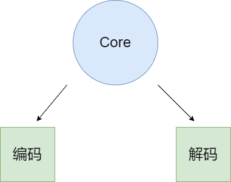

<div align="center">
<h1>yaml4cj</h1>
</div>

<p align="center">


</p>

##  简介

yaml4cj 包使 cangjie 程序能够轻松地编码和解码 YAML 值，可以快速可靠地解析和生成 YAML 数据。

### 特性

- 🚀 yaml4cj 包支持 YAML 1.1 和 1.2 的大部分内容，包括对锚点，标签，地图合并等的支持。

- 🚀 多文档解组尚未实现，并且故意不支持来自 YAML 1.1 的 base-60 浮点数，因为它们设计很差，并在 YAML 1.2 中消失了。

- 💪 yaml4cj v2 的包 API 将保持稳定。
  
- 🛠️ v0.0.1版本迁移自 [https://github.com/go-yaml/yaml](https://github.com/go-yaml/yaml) Tags: v2.0.0

### 路线

<p align="center">

</p>

##  架构

### 架构图

<p align="center">

</p>

- 编码并且解码 YAML 值。

- 快速解析并生成 YAML 数据。

### 源码目录

```shell
.
├── README.md
├── doc 
├── src
│   └── yaml
│       ├── alias_data.cj
│       ├── break_type.cj
│       ├── document.cj
│       ├── emitter_state_type.cj
│       ├── encoding_type.cj
│       ├── error.cj
│       ├── error_type.cj
│       ├── event_type.cj
│       ├── helper.cj
│       ├── mark.cj
│       ├── node.cj
│       ├── node_pair.cj
│       ├── node_type.cj
│       ├── parser.cj
│       ├── parser_state_type.cj
│       ├── privateh.cj
│       ├── simple_key.cj
│       ├── style_type.cj
│       ├── tag_directive.cj
│       ├── token.cj
│       ├── token_type.cj
│       ├── util.cj
│       ├── version_directive.cj
│       └── yaml_event.cj
│       ├── api.cj
│       ├── decode.cj
│       ├── emitter.cj
│       ├── encode.cj
│       ├── extends.cj
│       ├── parser.cj
│       ├── reader.cj
│       ├── resolve.cj
│       └── scanner.cj
└── test   
    ├── HLT
    ├── LLT
    └── UT
```

- `doc` 存放库的设计文档、使用文档、LLT 用例覆盖报告(1.由于仓颉的编码自动转成 UTF8 ，所以有很多与编码格式相关的都覆盖不到；2.做冗余校验无法实际覆盖到)
- `src` 是库源码目录
- `test` 存放 HLT 测试用例、LLT 自测用例和 UT 单元测试用例

### 接口说明

主要核心类和全局函数说明,详情见 [API](./doc/feature_api.md)

##  使用说明

### 编译

两种编译方式

1. 使用脚本编译 
    1. 下载配置[编译脚本](https://gitcode.com/Cangjie-TPC/TPC-Test-Framework.git)
    2. ciTest build
2. 使用cjpm编译 
    1. 该三方库依赖stdx，请参考[stdx](https://gitcode.com/Cangjie/Cangjie-STDX#%E4%BD%BF%E7%94%A8%E6%8C%87%E5%AF%BC)文档配置`CANGJIE_STDX_PATH`路径
    2. cjpm build


### 功能示例

#### yaml 解码示例

test_all.yaml 文件内容为

```
#注释
#1-字典  键: 值
username: xiaoming  #冒号后面是空格
password: 123456
info: 配置  #中文---不建议使用，有可能会乱码
#字典嵌套
NAME_PSW:
  name: xiaoming
  password: 123456
#2-列表格式
list:
  - Ruby
  - Perl
  - Python 
#表嵌套
lists:
- 10
- 20
-
 - 100
 - 200
#3-列表中套字典
- 10
- 20
-
 name: tom
 password: 123456

#4-字典套列表
name: TOM
info1:
   - 10
   - 20
   - 30

#5-引号,果是有英文字母或者中文的，不加引号也是字符串
info2: "HELLO word"  #引号可以不加 

#什么加引号:如果有特俗字符\n 不加引号就原字符样式输出    如果显示特殊字符效果:就加双引号
info3: "HELLO\nwoord"

#6-引用 一个数据可以使用很多地方，使用变量
#& 变量名   定义变量
#*变量名   引用变量
name1: &a tom
name2: *a

#8-yamL文件可以有YAML
DATA: conf.yaml

# YAML格式
key: |+
  a
  b
  c
# 实际效果
"key": "a\nb\nc\n"

# YAML格式
key: |-
  a
  b
  c
# 实际效果
"key": "a\nb\nc"

# YAML格式
key: >+
  a
  b
  c
# 实际效果
"key": "a b c\n"

# YAML格式
key: >-
  a
  b
  c
# 实际效果
"key": "a b c"
```

```cangjie
import yaml4cj.yaml.*
import std.os.posix.*
import std.io.*
import std.fs.*

main() {
    var path: String = getcwd()
    let pathname: String = "${path}/test_all.yaml"
    var fs: File = File(pathname, Open(true, true))
    if (fs.canRead()) {
        var res: Array<UInt8> = fs.readToEnd()
        fs.close()
        var jv = decode(res)
        println("---解码后---${jv.toString()}")
    } else {
        println("open fail")
    }
    return 0
}
```
执行结果如下：

```shell
---解码后---{"username":"xiaoming","password":123456,"info":"配置","NAME_PSW":{"name":"xiaoming","password":123456},"list":["Ruby","Perl","Python"],"lists":[10,20,[100,200],10,20,{"name":"tom","password":123456}],"name":"TOM","info1":[10,20,30],"info2":"HELLO word","info3":"HELLO\nwoord","name1":"tom","name2":"tom","DATA":"conf.yaml","key":"a b c"}
```

#### yaml 编码示例

test_all.json 文件内容为

```
{"username":"xiaoming","password":123456,"info":"配置","NAME_PSW":{"name":"xiaoming","password":123456},"list":["Ruby","Perl","Python"],"lists":[10,20,[100,200],10,20,{"name":"tom","password":123456}],"name":"TOM","info1":[10,20,30],"info2":"HELLO word","info3":"HELLO\nwoord","name1":"tom","name2":"tom","DATA":"conf.yaml","key111":true}
```

```cangjie
import yaml4cj.yaml.*
import std.os.posix.*
import std.io.*
import std.fs.*
import encoding.json.*

main() {
    var path: String = getcwd()
    let pathname: String = "${path}/test_all.json"
    var fs: File = File(pathname, Open(true, true))
    if (fs.canRead()) {
        var res: String = String.fromUtf8(fs.readToEnd())
        fs.close()
        var encodeRes: Array<UInt8> = encode(JsonValue.fromStr(res))
        var decodeRes: String = decode(encodeRes).toString()
        if(res == decodeRes) {
            println("---success---")
        }

    } else {
        println("open fail")
    }
    return 0
}
```
执行结果如下：

```shell
---success---
```

## 约束与限制

在下述版本验证通过：

    Cangjie Version: 1.0.0

## 开源协议

本项目基于 [Apache License 2.0](./LICENSE) 和 [MIT License](./LICENSE.libyaml) ，请自由的享受和参与开源。 

## 参与贡献

欢迎给我们提交PR，欢迎给我们提交Issue，欢迎参与任何形式的贡献。
