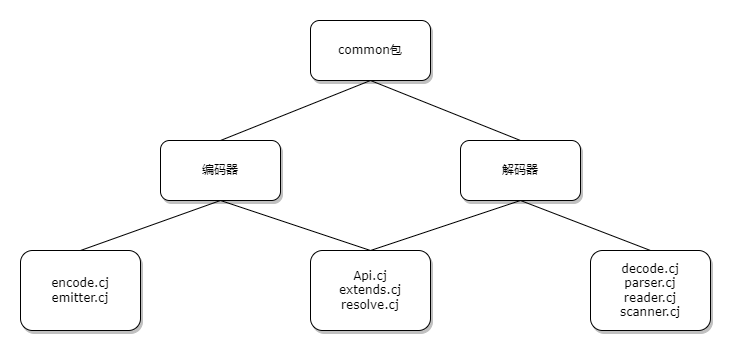
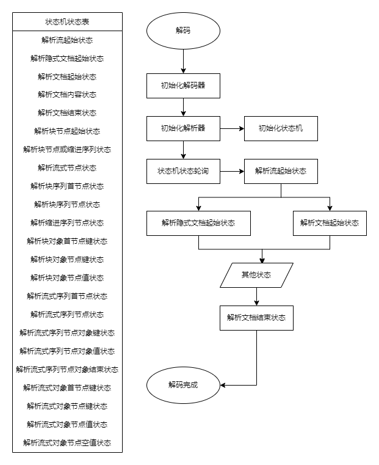
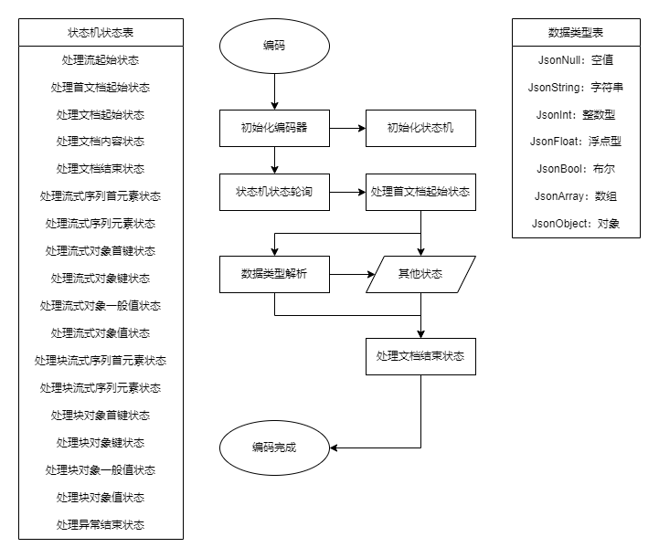

# 库 / 模块 / 类设计介绍

## 🚀 描述

    yaml 包使 cangjie 程序能够轻松地编码和解码 YAML 值，可以快速可靠地解析和生成 YAML 数据。

- 🚀 yaml 包支持 YAML 1.1 和 1.2 的大部分内容，包括对锚点，标签，地图合并等的支持。

- 🚀 多文档解组尚未实现，并且故意不支持来自 YAML 1.1 的 base-60 浮点数，因为它们设计很差，并在 YAML 1.2 中消失了。

## 🚀 API

### 💡 解码器

    可对Array<UInt8>数据进行YAML解码，并返回一个解码后的JsonValue。若解码失败或无有效YAML值，则返回JsonNull。

#### 💡 解码器API

```cangjie
/**
 * 以默认方式进行解码
 *
 * @param data of Array<UInt8> 传入用于进行YAML解码的字节数组
 *
 * @return Type of JsonValue   返回一个解码后的JsonValue，若解码失败或无有效YAML值，则返回JsonNull。
 * 
 */
public func decode(data: Array<UInt8>): JsonValue

/**
 * 以可选方式进行解码
 *
 * @param data of Array<UInt8> 传入用于进行YAML解码的字节数组
 * @param strict of Bool       传入是否以严格模式进行解码，true则为严格模式，false则为默认模式
 *
 * @return Type of JsonValue   返回一个解码后的JsonValue，若解码失败或无有效YAML值，则返回JsonNull。
 * @since 0.30.4
 */
public func decode(data: Array<UInt8>, strict: Bool): JsonValue
```

### 💡 编码器

    可对一个JsonValue进行YAML编码，并返回编码后的YAML格式字节数组数据。若编码失败或无有效Json键值，则返回空数组。

#### 💡 编码器API

```cangjie
/**
 * 对JsonValue进行YAML编码
 *
 * @param input of JsonValue     传入用于进行YAML编码的JsonValue
 *
 * @return Type of Array<UInt8>  返回一个编码后的字节数组，若编码失败或无有效Json键值，则返回空数组。
 * @since 0.30.4
 */
public func encode(input: JsonValue): Array<UInt8>
```

## 🚀 架构图

### 💡 依赖关系



### 💡 架构图设计描述

#### 解码器设计



#### 编码器设计



## 🚀 展示示例

### 解码示例

```cangjie
// demo No.1
from yaml4cj import yaml.*

main () {
    let data : Array<UInt8>= [97, 58, 10, 32, 32, 32, 98, 58, 10, 32, 32, 32, 32, 32, 32, 45, 32, 99, 10, 32, 32, 32, 32, 32, 32, 45, 32, 32, 100, 10, 32, 32, 32, 32, 32, 32, 45, 32, 101, 10, 102, 58, 10, 32, 32, 32, 32, 32, 32, 34, 103, 104, 105, 34]
    let jsonValue = yaml.decode(data)
    println(jsonValue)
}
```

执行结果

```
{"a":{"b":["c","d","e"]},"f":"ghi"}
```
### 编码示例

```cangjie
// demo No.2
from std import collection.*
from encoding import json.*
from yaml4cj import yaml.*

main () {
    let jsonValue = JsonObject(HashMap<String, JsonValue>([("strKey", JsonString("strValue")), ("intKey", JsonInt(1008))]))
    let data = yaml.encode(jsonValue)
    println(String.fromUtf8(data))
}

```
执行结果

```
strKey: strValue
intKey: 1008
```
