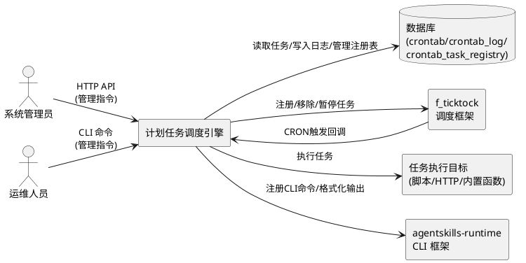
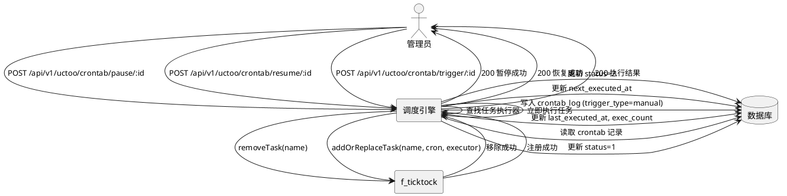
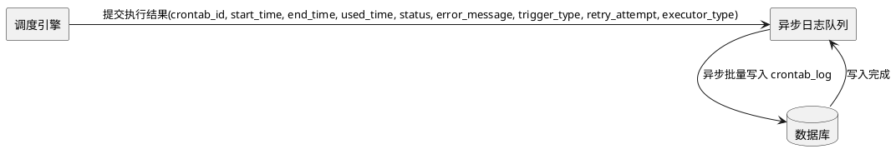
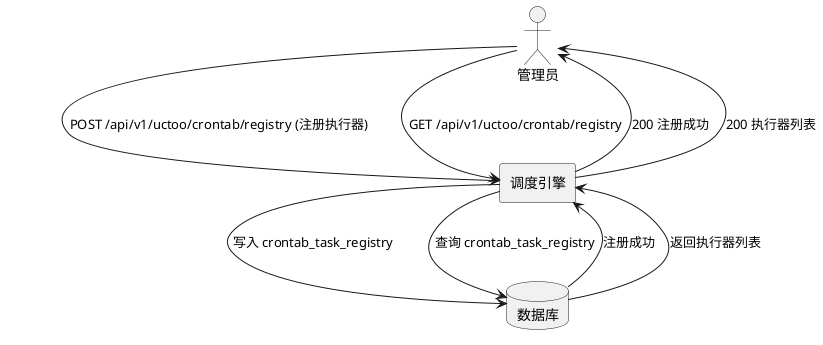
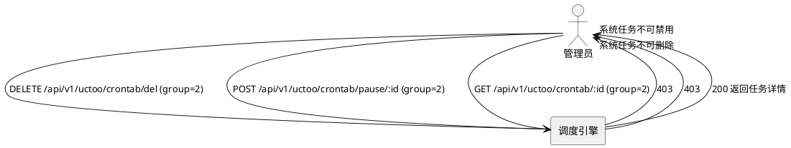
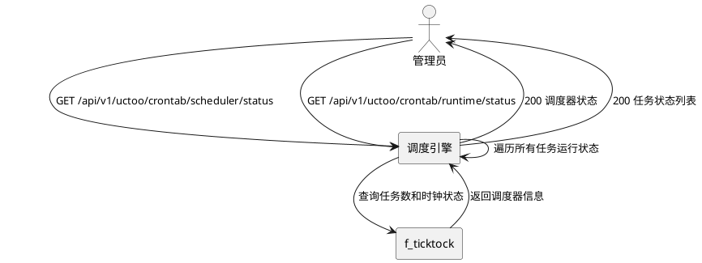
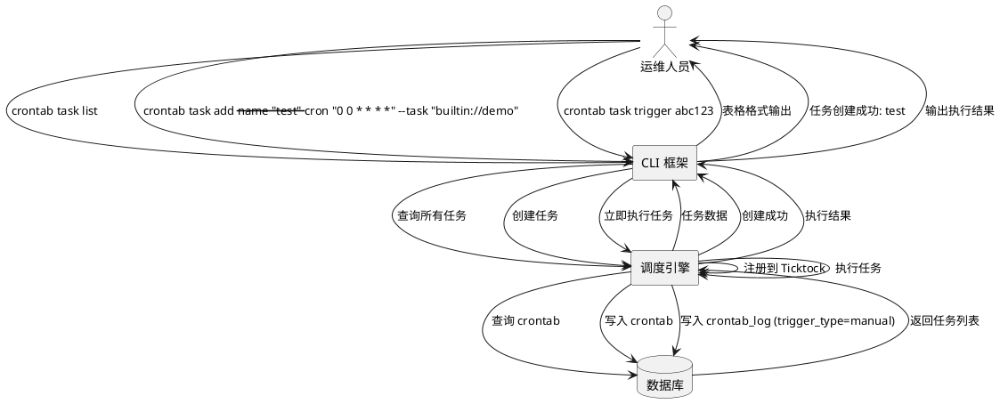
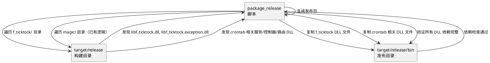

# 计划任务调度引擎需求规格

# **1. 组件定位**

## **1.1 核心职责**

本组件负责驱动计划任务的定时调度与执行，实现从数据管理到运行时调度的完整闭环。

## **1.2 核心输入**

1. 应用启动事件：触发调度器初始化与数据库任务加载
2. HTTP API 请求：来自管理前端或外部系统的任务管理指令（添加/移除/暂停/恢复/立即执行/状态查询）
3. CLI 命令请求：来自终端命令行的任务管理指令（列出/添加/暂停/恢复/删除/查看状态/手动触发）
4. CRON 时钟脉冲：f_ticktock Chrono 每秒触发的时钟信号
5. 任务执行结果：任务执行器返回的成功/失败/异常结果

## **1.3 核心输出**

1. 任务执行动作：调用对应的任务执行器（脚本执行器/HTTP调用器/内置函数执行器）
2. 执行日志写入：每次执行完成后向 crontab_log 表写入执行记录
3. HTTP API 响应：返回任务管理操作的结果和调度器运行状态
4. CLI 命令输出：在终端以格式化文本/表格返回操作结果和状态信息
5. 调度器生命周期事件：启动完成/优雅关闭/任务错过执行等事件

## **1.4 职责边界**

1. 不负责任务业务逻辑的具体实现，仅负责调度和分发到对应的执行器
2. 不负责 crontab/crontab_log 的基础 CRUD 管理（已由现有模块实现）
3. 不负责用户认证与权限校验（复用现有 PermissionLevel 行级权限机制）
4. 不负责任务编排/工作流/依赖链（超出单任务调度范围）
5. 不负责分布式调度协调（单实例调度，不做集群分片）
6. 不负责 CLI 框架的底层实现（复用 agentskills-runtime 已有的 CLI 基础设施）

# **2. 领域术语**

**计划任务（Crontab）**
: 一个可被调度引擎按 CRON 表达式周期性触发的任务定义，包含名称、分组、执行标识、调度策略、重试策略、并发策略等元数据。

**调度引擎（Scheduler）**
: 基于 f_ticktock 时间轮机制运行的核心组件，负责任务的注册、触发和生命周期管理。

**任务执行器（Task Executor）**
: 根据任务标识执行具体逻辑的组件，支持脚本执行、HTTP调用、内置函数三种类型。

**任务执行器注册表（Task Registry）**
: 系统中所有可用任务执行器的注册信息，包含执行器类型、标识、描述、参数模板等，用于执行时的分发和白名单校验。

**错过执行策略（Tactics）**
: 当调度引擎在任务应触发时刻因系统原因（如停机/暂停）未能触发时，恢复后采取的处理策略。

**系统任务（System Task）**
: group=2 的计划任务，属于系统核心任务，受保护不可通过 API/CLI 删除或禁用。

**执行日志（Crontab Log）**
: 每次任务执行完成后记录的日志条目，包含执行起止时间、耗时、成功/失败状态、触发类型、重试次数和错误信息。

**任务运行状态（Task Runtime State）**
: 任务在调度引擎中的实时状态，包括已注册/已暂停/执行中/已移除等状态。

**一次性任务（One-off Task）**
: once=true 的计划任务，执行成功一次后自动标记为已完成（status=3），不再参与后续调度。

**失败重试（Retry on Failure）**
: 当任务执行失败时，根据 max_retries 配置自动重试执行的机制，每次重试均记录独立的执行日志。

**并发策略（Concurrency Policy）**
: 由 concurrentable 字段控制，决定同一任务的新触发到达时，是否允许与前一次执行并发运行。

**任务优先级（Task Priority）**
: 由 priority 字段定义，当多个任务同时到达触发时间时，优先级数值越大的任务越先被调度执行。

# **3. 角色与边界**

## **3.1 核心角色**

- **系统管理员**：通过 HTTP API 或 CLI 管理计划任务的生命周期（添加/编辑/删除/暂停/恢复/立即执行/查询状态）
- **调度引擎自身**：按 CRON 表达式自动触发任务执行，无需人工干预
- **运维人员**：通过 CLI 在服务器终端快速查看和管理计划任务状态

## **3.2 外部系统**

- **f_ticktock 调度框架**：提供时间轮、CRON 编译器、任务注册等核心调度能力
- **PostgreSQL/OpenGauss 数据库**：持久化任务定义、执行日志和执行器注册信息
- **f_orm ORM 框架**：数据库访问层，提供 CRUD 和事务能力
- **任务执行目标**：脚本进程、HTTP 服务端点、内置函数等外部执行目标
- **agentskills-runtime CLI 框架**：提供 CLI 命令注册、参数解析和输出格式化能力

## **3.3 交互上下文**



# **4. DFX约束**

## **4.1 性能**

1. 调度引擎初始化时间（从数据库加载任务到调度器就绪）不得超过 5 秒
2. 单次任务触发到执行器调用的延迟不得超过 100 毫秒
3. 调度引擎支持至少 1000 个并发注册的计划任务
4. 执行日志写入不得阻塞任务调度线程，写入超时为 3 秒
5. 状态查询 API 响应时间不得超过 200 毫秒
6. CLI 命令响应时间不得超过 1 秒（不含任务执行等待时间）

## **4.2 可靠性**

1. 调度引擎可用性目标为 99.9%（按月统计）
2. 单个任务执行失败不得影响其他任务的调度和执行
3. 任务执行异常必须记录完整的错误信息到 crontab_log 表
4. 应用异常重启后，调度引擎必须自动恢复所有启用状态的任务
5. 优雅关闭时，正在执行的任务必须等待完成，最长等待时间为 30 秒
6. 失败重试必须保证幂等性，重试次数不得超过 max_retries 配置上限
7. 一次性任务执行成功后必须可靠地更新 status=3，不得因异常导致重复执行

## **4.3 安全性**

1. 系统任务（group=2）禁止通过 API 或 CLI 执行删除和禁用操作
2. 任务管理 API 必须复用现有行级权限校验机制
3. 任务执行器禁止执行未在 crontab_task_registry 中注册的任务标识
4. 执行日志中的错误信息不得泄露系统内部路径和凭证信息
5. CLI 命令必须遵循 agentskills-runtime 的鉴权机制

## **4.4 可维护性**

1. 调度引擎必须输出结构化日志，包含任务名称、触发时间、执行耗时等关键信息
2. 必须提供运行状态监控 API 和 CLI 命令，可查询调度器和各任务的实时状态
3. 任务执行器必须支持扩展注册，新增执行器类型无需修改调度引擎核心代码
4. 执行器注册信息必须持久化到 crontab_task_registry 表，支持动态注册和注销

## **4.5 兼容性**

1. 新增的调度管理 API 和 CLI 命令不得破坏现有 crontab/crontab_log CRUD API 的兼容性
2. CRON 表达式必须兼容 f_ticktock 的 6 位格式（秒 分 时 日 月 周）
3. 数据库中已存在的 crontab 记录必须能被调度引擎正确加载和注册（新增字段须提供合理默认值）
4. CLI 命令须兼容 agentskills-runtime 已有的命令注册和输出规范

# **5. 核心能力**

## **5.1 调度引擎集成与初始化**

### **5.1.1 业务规则**

1. **依赖声明**：必须在项目 cjpm.toml 中声明 f_ticktock 依赖
   - 验收条件：[cjpm.toml 中包含 f_ticktock 依赖声明] → [项目可正常编译构建]

2. **启动初始化**：应用启动时必须初始化 Ticktock 调度器实例
   - 验收条件：[应用启动完成] → [Ticktock.instance 可获取且非空]

3. **任务自动加载**：调度引擎启动时必须从数据库加载所有 status=1（正常）且未软删除的 crontab 记录，注册到 Ticktock 调度器
   - 验收条件：[数据库中存在 N 条启用的 crontab 记录] → [调度器中注册 N 个 CronTicktockTask]

4. **CRON 表达式校验**：加载任务时必须校验 crontab.cron 字段是否为合法的 6 位 CRON 表达式，不合法则跳过注册并记录警告日志
   - 验收条件：[crontab.cron 值为非法表达式] → [该任务不被注册，日志输出警告信息]

5. **执行器白名单加载**：调度引擎启动时必须从 crontab_task_registry 表加载所有已注册的执行器信息，构建执行器分发映射
   - 验收条件：[crontab_task_registry 中有 M 条注册记录] → [调度引擎可分发 M 种任务标识]

6. **一次性任务识别**：加载任务时，if crontab.once=true 且该任务已有成功执行记录，the 调度引擎 shall 不注册该任务
   - 验收条件：[once=true 的任务已有成功执行日志] → [该任务不被注册到调度器]

7. **禁止项**：调度引擎初始化不得阻塞应用主线程的 HTTP 服务启动
   - 验收条件：[调度引擎初始化耗时 > 5秒] → [HTTP 服务仍正常启动，调度引擎异步完成初始化]

### **5.1.2 交互流程**

```plantuml
@startuml
actor "应用启动" as app
rectangle "调度引擎" as scheduler
database "数据库" as db
rectangle "f_ticktock" as ticktock

app -> scheduler : 启动事件
scheduler -> db : 查询 crontab_task_registry
db --> scheduler : 返回执行器注册表
scheduler -> db : 查询 status=1 的 crontab
db --> scheduler : 返回任务列表
scheduler -> ticktock : Ticktock.instance 初始化
loop 每条启用的任务
    alt once=true 且已有成功执行记录
        scheduler -> scheduler : 跳过注册
    else 正常任务
        scheduler -> ticktock : addOrReplaceTask(name, cron, executor)
    end
end
ticktock --> scheduler : 注册完成
scheduler --> app : 调度引擎就绪
@enduml
```

### **5.1.3 异常场景**

1. **数据库连接失败**
   - 触发条件：调度引擎初始化时数据库不可达
   - 系统行为：记录错误日志，调度引擎以空任务列表启动，HTTP 服务正常提供
   - 用户感知：日志中输出数据库连接错误信息，管理 API 可查询到调度器已启动但任务数为 0

2. **CRON 表达式编译失败**
   - 触发条件：某条 crontab 记录的 cron 字段不合法
   - 系统行为：跳过该任务的注册，记录警告日志，继续处理其他任务
   - 用户感知：该任务不参与调度，状态查询 API 中该任务显示为"未注册"

3. **Ticktock 实例初始化失败**
   - 触发条件：f_ticktock 框架内部初始化异常
   - 系统行为：记录错误日志，标记调度引擎为不可用状态
   - 用户感知：调度管理 API 返回调度引擎不可用错误码

4. **执行器注册表为空**
   - 触发条件：crontab_task_registry 表中无任何注册记录
   - 系统行为：调度引擎正常启动，但所有任务触发时将因执行器未找到而失败
   - 用户感知：所有 crontab_log 均为 status=0，errorMessage 为"执行器未注册"

## **5.2 任务注册与动态管理**

### **5.2.1 业务规则**

1. **创建任务自动注册**：When 通过 API 或 CLI 创建一条 status=1 的 crontab 记录，the 调度引擎 shall 立即将该任务注册到 Ticktock 调度器
   - 验收条件：[创建 crontab 记录且 status=1] → [Ticktock 中新增同名 CronTicktockTask]

2. **编辑任务自动更新**：When 通过 API 或 CLI 编辑 crontab 记录的 cron、task、timeout、max_retries、concurrentable 等调度相关字段，the 调度引擎 shall 移除旧任务并注册新配置
   - 验收条件：[编辑 crontab 的 cron 表达式] → [Ticktock 中该任务的调度规则更新为新表达式]

3. **删除任务自动移除**：When 通过 API 或 CLI 删除 crontab 记录，the 调度引擎 shall 从 Ticktock 调度器中移除该任务
   - 验收条件：[删除 crontab 记录] → [Ticktock 中不再包含该任务]

4. **暂停任务**：When 管理员通过 API 或 CLI 暂停任务，the 调度引擎 shall 从 Ticktock 调度器中移除该任务，但保留数据库中的任务定义
   - 验收条件：[暂停任务 X] → [任务 X 从调度器移除，数据库中 status 变为 2]

5. **恢复任务**：When 管理员通过 API 或 CLI 恢复任务，the 调度引擎 shall 将任务重新注册到 Ticktock 调度器
   - 验收条件：[恢复任务 X] → [任务 X 重新注册到调度器，数据库中 status 变为 1]

6. **立即执行**：When 管理员通过 API 或 CLI 触发立即执行，the 调度引擎 shall 立即触发该任务的执行器，不受 CRON 调度约束
   - 验收条件：[立即执行任务 X] → [任务 X 的执行器被立即调用，并写入执行日志（trigger_type=manual）]

7. **下次触发时间更新**：When 任务注册或更新后，the 调度引擎 shall 计算并更新 crontab.next_executed_at 字段
   - 验收条件：[任务 X 注册到调度器] → [crontab 表中 next_executed_at 更新为下次触发时间]

8. **禁止项**：禁止通过调度管理 API 修改 crontab 的基础字段（name/group/task/cron/tactics），这些修改必须通过现有 CRUD API 完成
   - 验收条件：[调用调度管理 API 的暂停/恢复/立即执行接口] → [仅修改运行时状态，不修改任务定义字段]

### **5.2.2 交互流程**



### **5.2.3 异常场景**

1. **暂停不存在的任务**
   - 触发条件：调用暂停 API/CLI 时指定的 crontab ID 不存在
   - 系统行为：返回错误响应
   - 用户感知：API 返回 HTTP 404，CLI 输出"任务不存在"错误信息

2. **重复恢复已启用的任务**
   - 触发条件：对 status=1 的任务调用恢复 API/CLI
   - 系统行为：返回成功但标记为幂等操作
   - 用户感知：API 返回 HTTP 200 标记"任务已在运行中"，CLI 输出"任务已在运行中"

3. **立即执行时任务执行器未找到**
   - 触发条件：任务的 task 标识未在 crontab_task_registry 中注册
   - 系统行为：记录错误日志，写入失败执行日志
   - 用户感知：API 返回 HTTP 200 执行结果中 status=0，CLI 输出"执行失败：执行器未注册"

## **5.3 任务执行与执行器**

### **5.3.1 业务规则**

1. **执行器分发**：When CRON 调度器触发任务，the 调度引擎 shall 根据 crontab.task 字段的前缀分发到对应的执行器
   - 验收条件：[task 字段以 "script://" 开头] → [分发到脚本执行器]
   - 验收条件：[task 字段以 "http://" 或 "https://" 开头] → [分发到 HTTP 调用器]
   - 验收条件：[task 字段以 "builtin://" 开头] → [分发到内置函数执行器]

2. **脚本执行器**：Where 任务类型为脚本执行，the 脚本执行器 shall 执行指定的脚本命令并捕获退出码和标准输出
   - 验收条件：[task="script:///path/to/script.sh"] → [执行该脚本并返回执行结果]

3. **HTTP 调用器**：Where 任务类型为 HTTP 调用，the HTTP 调用器 shall 向指定 URL 发送请求并记录响应状态码
   - 验收条件：[task="http://example.com/api/job"] → [发送 HTTP GET/POST 请求并记录响应]

4. **内置函数执行器**：Where 任务类型为内置函数，the 内置函数执行器 shall 调用注册的内置函数并获取返回值
   - 验收条件：[task="builtin://cleanup_temp_files"] → [调用已注册的 cleanup_temp_files 函数]

5. **并发控制**：While 某任务正在执行中，if 该任务的 concurrentable 属性为 false，the 调度引擎 shall 跳过本次触发
   - 验收条件：[任务 A 正在执行，且 concurrentable=false，新触发到达] → [跳过本次执行，记录跳过日志]

6. **并发允许**：While 某任务正在执行中，if 该任务的 concurrentable 属性为 true，the 调度引擎 shall 允许新触发并发执行
   - 验收条件：[任务 A 正在执行，且 concurrentable=true，新触发到达] → [启动新的并发执行]

7. **执行超时**：If 任务执行超过配置的 timeout 时间，the 调度引擎 shall 终止执行并标记为超时失败
   - 验收条件：[任务执行时间 > timeout 阈值] → [终止执行，写入 status=0 的执行日志，errorMessage 包含超时信息]

8. **执行后元数据更新**：When 任务执行完成，the 调度引擎 shall 更新 crontab 表的 last_executed_at、exec_count 和 next_executed_at 字段
   - 验收条件：[任务 X 执行完成] → [crontab 表中 last_executed_at=当前时间, exec_count=原值+1, next_executed_at=下次触发时间]

9. **任务参数传递**：Where crontab.parameters 不为空，the 执行器 shall 将 parameters 作为执行参数传递给任务执行目标
   - 验收条件：[parameters='{"key":"value"}' 的任务触发执行] → [执行器收到包含该参数的执行上下文]

10. **优先级调度**：When 多个任务同时到达触发时间，the 调度引擎 shall 按 priority 数值从大到小依次调度执行
    - 验收条件：[任务 A priority=10，任务 B priority=5，同时触发] → [任务 A 先于任务 B 被调度]

11. **禁止项**：禁止执行不在 crontab_task_registry 注册表中的任务标识
    - 验收条件：[task 字段不匹配任何已注册执行器] → [记录错误并跳过执行]

### **5.3.2 交互流程**

```plantuml
@startuml
rectangle "f_ticktock" as ticktock
rectangle "调度引擎" as scheduler
rectangle "执行器分发" as dispatcher
rectangle "脚本执行器" as script
rectangle "HTTP调用器" as http
rectangle "内置函数执行器" as builtin
database "数据库" as db

ticktock -> scheduler : CRON 触发回调(taskName)
scheduler -> scheduler : 优先级排序
scheduler -> dispatcher : 分发(task 标识, parameters)
alt task 以 script:// 开头
    dispatcher -> script : 执行脚本(parameters)
    script --> dispatcher : 返回结果
else task 以 http:// 开头
    dispatcher -> http : 发送请求(parameters)
    http --> dispatcher : 返回响应
else task 以 builtin:// 开头
    dispatcher -> builtin : 调用函数(parameters)
    builtin --> dispatcher : 返回结果
end
dispatcher --> scheduler : 执行结果
scheduler -> db : 写入 crontab_log (trigger_type=cron)
scheduler -> db : 更新 last_executed_at, exec_count, next_executed_at
@enduml
```

### **5.3.3 异常场景**

1. **脚本执行失败**
   - 触发条件：脚本进程返回非零退出码
   - 系统行为：捕获退出码和标准错误输出，写入失败执行日志
   - 用户感知：crontab_log 中 status=0，errorMessage 包含退出码和错误输出

2. **HTTP 调用失败**
   - 触发条件：HTTP 请求超时或返回 5xx 状态码
   - 系统行为：记录 HTTP 状态码和响应体，写入失败执行日志
   - 用户感知：crontab_log 中 status=0，errorMessage 包含 HTTP 错误详情

3. **内置函数执行异常**
   - 触发条件：内置函数抛出未捕获异常
   - 系统行为：捕获异常堆栈信息，写入失败执行日志
   - 用户感知：crontab_log 中 status=0，errorMessage 包含异常信息

4. **执行器注册为空**
   - 触发条件：crontab_task_registry 表中无对应 task 标识的注册记录
   - 系统行为：调度引擎跳过执行，写入失败日志
   - 用户感知：crontab_log 中 status=0，errorMessage 为"执行器未注册"

5. **并发冲突跳过**
   - 触发条件：任务 concurrentable=false 且当前正在执行中
   - 系统行为：跳过本次触发，记录跳过日志（trigger_type=skipped_concurrent）
   - 用户感知：crontab_log 中有一条 trigger_type=skipped_concurrent 的跳过记录

6. **任务参数格式错误**
   - 触发条件：parameters 字段不是合法的 JSON 格式
   - 系统行为：按空参数执行任务，记录警告日志
   - 用户感知：任务正常执行但未收到参数，日志中有参数解析警告

## **5.4 失败重试机制**

### **5.4.1 业务规则**

1. **重试触发**：When 任务执行失败且 retry_count < max_retries，the 调度引擎 shall 自动触发重试执行
   - 验收条件：[任务 A 执行失败，retry_count=0，max_retries=3] → [自动触发第 1 次重试，retry_count 更新为 1]

2. **重试次数递增**：When 每次重试执行，the 调度引擎 shall 递增 crontab.retry_count 字段
   - 验收条件：[第 N 次重试执行] → [retry_count 更新为 N]

3. **重试达到上限**：If retry_count >= max_retries 且任务仍然失败，the 调度引擎 shall 停止重试并标记任务为重试耗尽
   - 验收条件：[retry_count=3, max_retries=3，任务仍然失败] → [不再重试，执行日志中标记为"重试耗尽"]

4. **重试成功重置**：When 重试执行成功，the 调度引擎 shall 将 retry_count 重置为 0
   - 验收条件：[第 2 次重试执行成功] → [retry_count 重置为 0，后续正常调度]

5. **正常执行成功重置**：When 非重试的正常执行成功，the 调度引擎 shall 将 retry_count 重置为 0
   - 验收条件：[正常调度执行成功] → [retry_count 重置为 0]

6. **重试执行日志**：When 重试执行完成，the 调度引擎 shall 写入独立的 crontab_log 记录，retry_attempt 字段标记当前重试序号
   - 验收条件：[第 2 次重试执行] → [crontab_log 中 retry_attempt=2]

7. **禁止项**：禁止对 max_retries=0 的任务执行重试
   - 验收条件：[max_retries=0，任务执行失败] → [不触发重试，直接记录失败日志]

### **5.4.2 交互流程**

```plantuml
@startuml
rectangle "调度引擎" as scheduler
rectangle "任务执行器" as executor
database "数据库" as db

scheduler -> executor : 执行任务
executor --> scheduler : 执行失败
scheduler -> db : 写入 crontab_log (status=0, retry_attempt=0)
scheduler -> scheduler : 判断 retry_count < max_retries

loop retry_count < max_retries
    scheduler -> db : 更新 retry_count = retry_count + 1
    scheduler -> executor : 重试执行(retry_attempt)
    alt 重试成功
        executor --> scheduler : 执行成功
        scheduler -> db : 写入 crontab_log (status=1, retry_attempt=N)
        scheduler -> db : 重置 retry_count = 0
    else 重试失败
        executor --> scheduler : 执行失败
        scheduler -> db : 写入 crontab_log (status=0, retry_attempt=N)
    end
end

alt 重试耗尽
    scheduler -> db : 标记重试耗尽
end
@enduml
```

### **5.4.3 异常场景**

1. **重试期间应用重启**
   - 触发条件：任务正在重试执行中，应用收到关闭信号
   - 系统行为：等待当前重试完成，重启后根据 retry_count 和 max_retries 判断是否继续重试
   - 用户感知：重启后任务从中断的重试位置继续

2. **所有重试均失败**
   - 触发条件：达到 max_retries 上限后任务仍然失败
   - 系统行为：停止重试，记录最终失败日志，下次 CRON 触发时 retry_count 重置为 0 开始新一轮调度
   - 用户感知：crontab_log 中有 max_retries+1 条失败记录（首次+重试），后续正常调度周期继续执行

## **5.5 一次性任务管理**

### **5.5.1 业务规则**

1. **一次性任务识别**：Where crontab.once=true，the 调度引擎 shall 在任务首次成功执行后将其 status 更新为 3（已完成）
   - 验收条件：[once=true 的任务首次成功执行] → [status 更新为 3，从调度器移除]

2. **一次性任务失败不完成**：If 一次性任务执行失败，the 调度引擎 shall 不更新 status 为 3，允许后续调度继续触发
   - 验收条件：[once=true 的任务执行失败] → [status 保持为 1，下次触发继续执行]

3. **已完成任务不注册**：When 调度引擎加载任务时，if crontab.once=true 且 status=3，the 调度引擎 shall 不注册该任务
   - 验收条件：[once=true, status=3 的任务] → [不被注册到调度器]

4. **已完成任务可重置**：When 管理员通过 API 或 CLI 将已完成的一次性任务 status 改回 1，the 调度引擎 shall 重新注册该任务
   - 验收条件：[将 once=true, status=3 的任务 status 改为 1] → [任务重新注册到调度器]

### **5.5.2 交互流程**

```plantuml
@startuml
rectangle "调度引擎" as scheduler
rectangle "任务执行器" as executor
database "数据库" as db

scheduler -> executor : 触发一次性任务
alt 执行成功
    executor --> scheduler : 成功
    scheduler -> db : 更新 status=3, last_executed_at
    scheduler -> scheduler : 从调度器移除
    scheduler -> db : 写入 crontab_log
else 执行失败
    executor --> scheduler : 失败
    scheduler -> db : 写入 crontab_log (status=0)
    note right : status 保持 1，下次继续触发
end
@enduml
```

### **5.5.3 异常场景**

1. **一次性任务状态更新失败**
   - 触发条件：任务成功执行后更新 status=3 时数据库写入失败
   - 系统行为：记录错误日志，任务仍在调度器中，下次触发时再次尝试更新
   - 用户感知：任务可能被执行两次，日志中有状态更新失败的告警

## **5.6 执行日志记录**

### **5.6.1 业务规则**

1. **执行完成记录**：When 任务执行完成（无论成功或失败），the 调度引擎 shall 向 crontab_log 表写入一条执行记录
   - 验收条件：[任务 X 执行完成] → [crontab_log 表新增一条 crontab_id=X.id 的记录]

2. **成功日志**：Where 任务执行成功，the 执行日志 shall 记录 status=1、start_time、end_time、used_time 为实际耗时（毫秒）、error_message 为空、executor_type 为实际执行器类型
   - 验收条件：[任务执行成功，开始时间 T1，结束时间 T2，耗时 150ms，使用脚本执行器] → [crontab_log: status=1, start_time=T1, end_time=T2, used_time=150, error_message="", executor_type="script"]

3. **失败日志**：Where 任务执行失败，the 执行日志 shall 记录 status=0、start_time、end_time、used_time 为实际耗时、error_message 包含错误详情、executor_type 为实际执行器类型
   - 验收条件：[任务执行抛出异常 "connection timeout"，使用 HTTP 调用器] → [crontab_log: status=0, executor_type="http", error_message 包含 "connection timeout"]

4. **触发类型记录**：The 执行日志 shall 记录 trigger_type 字段标识触发来源
   - 验收条件：[CRON 定时触发] → [trigger_type="cron"]
   - 验收条件：[管理员手动触发] → [trigger_type="manual"]
   - 验收条件：[错过执行补充触发] → [trigger_type="misfire"]
   - 验收条件：[失败重试触发] → [trigger_type="retry"]
   - 验收条件：[并发冲突跳过] → [trigger_type="skipped_concurrent"]

5. **异步写入**：The 执行日志写入 shall 采用异步方式，不得阻塞调度线程
   - 验收条件：[日志写入数据库耗时 500ms] → [下一个 CRON 触发不受影响]

6. **禁止项**：禁止删除 7 天内的执行日志，禁止批量删除未归档的日志
   - 验收条件：[尝试删除 5 天内的 crontab_log] → [操作被拒绝，返回错误提示]

### **5.6.2 交互流程**



### **5.6.3 异常场景**

1. **日志写入数据库失败**
   - 触发条件：crontab_log 表写入时数据库不可达
   - 系统行为：将失败的日志条目缓存到内存队列，后续重试写入
   - 用户感知：crontab_log 中暂时缺少该条记录，恢复后补写

2. **异步队列溢出**
   - 触发条件：日志写入速度持续低于任务执行频率，内存队列达到上限
   - 系统行为：丢弃最早的日志条目，记录告警日志
   - 用户感知：crontab_log 中缺少部分历史记录，告警日志中有丢弃信息

## **5.7 错过执行策略处理**

### **5.7.1 业务规则**

1. **策略 1 - 立即执行**：Where crontab.tactics=1，When 调度引擎发现任务有错过的触发点，the 调度引擎 shall 立即补充执行一次
   - 验收条件：[任务 X 的 tactics=1，启动时发现 3 个错过的触发点] → [立即执行 1 次任务 X]

2. **策略 2 - 执行一次**：Where crontab.tactics=2，When 调度引擎发现任务有错过的触发点，the 调度引擎 shall 仅补充执行一次（不论错过多少次）
   - 验收条件：[任务 X 的 tactics=2，启动时发现 5 个错过的触发点] → [补充执行 1 次任务 X]

3. **策略 3 - 放弃执行**：Where crontab.tactics=3，When 调度引擎发现任务有错过的触发点，the 调度引擎 shall 跳过所有错过的触发点，仅按当前时间继续调度
   - 验收条件：[任务 X 的 tactics=3，启动时发现多个错过的触发点] → [不补充执行，等待下一个触发点]

4. **错过检测时机**：When 应用启动完成且调度引擎加载任务时，the 调度引擎 shall 对每个任务检查 last_executed_at 与当前时间的间隔，判断是否存在错过的触发点
   - 验收条件：[任务 last_executed_at 为 T1，当前时间为 T2，T1 到 T2 之间存在 N 个应触发点] → [按 tactics 策略处理]

5. **错过执行阈值**：Where crontab.misfire_threshold 不为空，if 错过时间超过 misfire_threshold，the 调度引擎 shall 视为过期错过，不再补充执行
   - 验收条件：[错过时间 > misfire_threshold] → [跳过补充执行，记录过期错过日志]

6. **错过执行日志标记**：When 补充执行错过任务，the 执行日志 shall 标记 trigger_type=misfire
   - 验收条件：[错过执行补充触发] → [crontab_log 中 trigger_type="misfire"]

### **5.7.2 交互流程**

```plantuml
@startuml
rectangle "调度引擎" as scheduler
database "数据库" as db

scheduler -> db : 查询每个任务的 last_executed_at
db --> scheduler : 返回最后执行时间

alt tactics=1 (立即执行)
    scheduler -> scheduler : 立即补充执行1次 (trigger_type=misfire)
else tactics=2 (执行一次)
    scheduler -> scheduler : 补充执行1次 (trigger_type=misfire)
else tactics=3 (放弃执行)
    scheduler -> scheduler : 跳过，继续正常调度
end
@enduml
```

### **5.7.3 异常场景**

1. **无法判断错过次数**
   - 触发条件：crontab_log 中没有任何历史执行记录且 last_executed_at 为空
   - 系统行为：视为无错过触发点，按当前时间正常调度
   - 用户感知：任务从当前时间开始正常调度

2. **策略执行失败**
   - 触发条件：补充执行时任务执行器返回失败
   - 系统行为：记录失败执行日志（trigger_type=misfire），不影响后续正常调度
   - 用户感知：crontab_log 中有一条失败记录，后续任务正常调度

3. **错过时间超过阈值**
   - 触发条件：last_executed_at 距当前时间超过 misfire_threshold
   - 系统行为：跳过补充执行，记录过期错过日志
   - 用户感知：任务等待下一个正常触发点

## **5.8 任务执行器注册与管理**

### **5.8.1 业务规则**

1. **执行器注册**：When 应用启动或通过 API/CLI 注册执行器，the 系统 shall 向 crontab_task_registry 表写入执行器注册信息
   - 验收条件：[注册 script:// 类型执行器] → [crontab_task_registry 新增一条注册记录]

2. **执行器信息**：The 执行器注册记录 shall 包含执行器类型（script/http/builtin）、标识前缀、描述、参数模板、状态等信息
   - 验收条件：[注册执行器] → [registry 记录包含 type、prefix、description、parameters_template、status]

3. **执行器注销**：When 通过 API/CLI 注销执行器，the 系统 shall 将 crontab_task_registry 中对应记录的 status 设为禁用
   - 验收条件：[注销执行器 X] → [crontab_task_registry 中 X 的 status 变为 2]

4. **执行器白名单校验**：When 任务触发执行，the 调度引擎 shall 校验 task 标识是否匹配 crontab_task_registry 中 status=1 的注册记录
   - 验收条件：[task 标识匹配已注册执行器] → [允许执行]
   - 验收条件：[task 标识不匹配任何已注册执行器] → [拒绝执行，记录错误]

5. **执行器类型查询**：When 查询执行器列表，the 系统 shall 返回所有已注册执行器的信息
   - 验收条件：[GET /api/v1/uctoo/crontab/registry] → [返回执行器注册列表]

### **5.8.2 交互流程**



### **5.8.3 异常场景**

1. **重复注册同标识执行器**
   - 触发条件：注册已存在的执行器标识前缀
   - 系统行为：更新已有注册记录（幂等操作）
   - 用户感知：API 返回 200，标记为"更新"

2. **注销正在使用的执行器**
   - 触发条件：注销的执行器仍有关联的启用任务
   - 系统行为：允许注销但发出警告，关联任务下次触发时将因执行器不可用而失败
   - 用户感知：API 返回 200 并附带警告信息"有 N 个任务使用此执行器"

## **5.9 系统任务保护**

### **5.9.1 业务规则**

1. **删除保护**：If 请求删除的 crontab 记录 group=2，the 系统 shall 拒绝删除操作并返回错误
   - 验收条件：[尝试通过 API 或 CLI 删除 group=2 的任务] → [返回 403 错误，提示"系统任务不可删除"]

2. **禁用保护**：If 请求将 crontab 记录的 status 改为禁用（2）且 group=2，the 系统 shall 拒绝禁用操作并返回错误
   - 验收条件：[尝试通过 API 或 CLI 禁用 group=2 的任务] → [返回 403 错误，提示"系统任务不可禁用"]

3. **允许编辑**：While crontab.group=2，the 系统 shall 允许修改任务的 cron 表达式和 task 字段（仅限系统管理员）
   - 验收条件：[系统管理员修改系统任务的 cron 表达式] → [修改成功，调度器同步更新]

4. **允许查看**：The 系统 shall 允许所有有权限的用户查看系统任务的配置和执行日志
   - 验收条件：[普通用户查询 group=2 的任务列表] → [返回任务配置和日志，不可修改]

### **5.9.2 交互流程**



### **5.9.3 异常场景**

1. **非管理员尝试修改系统任务**
   - 触发条件：非系统管理员角色尝试编辑 group=2 的任务
   - 系统行为：行级权限校验拒绝
   - 用户感知：API 返回 HTTP 403，CLI 输出"权限不足"

## **5.10 优雅关闭**

### **5.10.1 业务规则**

1. **关闭信号处理**：When 应用收到关闭信号（SIGTERM/SIGINT），the 调度引擎 shall 停止接受新的任务触发，等待正在执行的任务完成
   - 验收条件：[应用收到 SIGTERM] → [调度器不再触发新任务，等待执行中任务完成]

2. **超时强制关闭**：If 等待时间超过 30 秒仍有任务未完成，the 调度引擎 shall 强制终止并记录警告日志
   - 验收条件：[等待超过 30 秒，任务 A 仍在执行] → [强制终止任务 A，记录警告日志]

3. **Ticktock 关闭**：When 调度引擎完成等待或超时，the 调度引擎 shall 调用 Ticktock.shutdown() 释放资源
   - 验收条件：[优雅关闭流程完成] → [Ticktock.shutdown() 已被调用]

4. **禁止项**：禁止在优雅关闭期间接受新的调度管理 API 请求和 CLI 命令
   - 验收条件：[优雅关闭期间调用暂停 API] → [返回 503 服务不可用]
   - 验收条件：[优雅关闭期间执行 CLI 命令] → [输出"服务正在关闭，请稍后重试"]

### **5.10.2 交互流程**

```plantuml
@startuml
actor "系统信号" as signal
rectangle "调度引擎" as scheduler
rectangle "f_ticktock" as ticktock

signal -> scheduler : SIGTERM
scheduler -> scheduler : 停止新任务触发
scheduler -> scheduler : 等待执行中任务完成
alt 所有任务在 30s 内完成
    scheduler -> ticktock : shutdown()
else 超时 30s
    scheduler -> scheduler : 强制终止未完成任务
    scheduler -> ticktock : shutdown()
end
scheduler -> signal : 关闭完成
@enduml
```

### **5.10.3 异常场景**

1. **关闭期间新任务被触发**
   - 触发条件：优雅关闭期间 CRON 时钟脉冲到达
   - 系统行为：跳过该触发，不启动新执行
   - 用户感知：该次执行被跳过，无 crontab_log 记录

2. **Ticktock.shutdown() 抛出异常**
   - 触发条件：调用 Ticktock.shutdown() 时框架内部异常
   - 系统行为：记录错误日志，继续关闭流程
   - 用户感知：应用正常退出，日志中有 shutdown 异常记录

## **5.11 运行状态监控**

### **5.11.1 业务规则**

1. **调度器状态查询**：When 管理员通过 API 或 CLI 查询调度器状态，the 系统 shall 返回调度器的运行状态（运行中/关闭中/不可用）、已注册任务数、时钟运行时长
   - 验收条件：[GET /api/v1/uctoo/crontab/scheduler/status] → [返回调度器状态、任务数、运行时长]
   - 验收条件：[CLI: crontab scheduler status] → [终端输出调度器状态信息]

2. **任务运行状态查询**：When 管理员通过 API 或 CLI 查询任务状态，the 系统 shall 返回每个任务的运行状态（已注册/已暂停/执行中/已完成）、下次触发时间、上次执行时间、执行次数、重试次数
   - 验收条件：[GET /api/v1/uctoo/crontab/runtime/status] → [返回所有任务的运行时状态列表]
   - 验收条件：[CLI: crontab task list] → [终端以表格输出任务状态列表]

3. **单任务状态查询**：When 管理员查询单个任务状态，the 系统 shall 返回该任务的详细运行信息
   - 验收条件：[GET /api/v1/uctoo/crontab/:id/runtime] → [返回该任务的状态、next_executed_at、last_executed_at、exec_count、retry_count、执行中标志]
   - 验收条件：[CLI: crontab task status :id] → [终端输出该任务详细信息]

4. **禁止项**：状态查询 API 和 CLI 命令必须为只读操作，禁止通过状态查询修改任何调度器或任务状态
   - 验收条件：[调用状态查询] → [不产生任何副作用]

### **5.11.2 交互流程**



### **5.11.3 异常场景**

1. **调度器未初始化时查询状态**
   - 触发条件：调度引擎初始化失败后查询状态
   - 系统行为：返回调度器不可用状态
   - 用户感知：API 返回 HTTP 200 状态为"不可用"，CLI 输出"调度器不可用"

2. **Ticktock 实例获取失败**
   - 触发条件：Ticktock.getInstance(anyway: false) 返回 None
   - 系统行为：返回调度器未启动状态
   - 用户感知：状态为"未启动"

## **5.12 CLI 命令行管理**

### **5.12.1 业务规则**

1. **命令注册**：When 应用启动，the 调度引擎 shall 通过 agentskills-runtime CLI 框架注册 `crontab` 命令组及其子命令
   - 验收条件：[应用启动完成] → [CLI 中可使用 crontab 命令组]

2. **列出任务**：When 执行 `crontab task list` 命令，the 系统 shall 以表格格式输出所有计划任务的概要信息（ID、名称、分组、CRON 表达式、状态、上次执行时间、下次执行时间）
   - 验收条件：[执行 crontab task list] → [终端输出任务表格，包含 ID/name/group/cron/status/last_executed_at/next_executed_at]

3. **添加任务**：When 执行 `crontab task add` 命令并提供必要参数，the 系统 shall 创建新的计划任务并注册到调度器
   - 验收条件：[crontab task add --name "test" --cron "0 0 * * * *" --task "builtin://demo"] → [创建任务并注册到调度器]

4. **暂停任务**：When 执行 `crontab task pause :id` 命令，the 系统 shall 暂停指定任务
   - 验收条件：[crontab task pause abc123] → [任务 abc123 从调度器移除，status 变为 2]

5. **恢复任务**：When 执行 `crontab task resume :id` 命令，the 系统 shall 恢复指定任务
   - 验收条件：[crontab task resume abc123] → [任务 abc123 重新注册到调度器，status 变为 1]

6. **删除任务**：When 执行 `crontab task delete :id` 命令，the 系统 shall 删除指定任务
   - 验收条件：[crontab task delete abc123] → [任务 abc123 从数据库删除并从调度器移除]

7. **查看任务状态**：When 执行 `crontab task status :id` 命令，the 系统 shall 输出指定任务的详细运行信息
   - 验收条件：[crontab task status abc123] → [输出任务详细信息，包含状态/CRON/下次触发/执行次数/重试次数等]

8. **手动触发任务**：When 执行 `crontab task trigger :id` 命令，the 系统 shall 立即触发指定任务执行
   - 验收条件：[crontab task trigger abc123] → [立即执行任务 abc123，输出执行结果]

9. **查看调度器状态**：When 执行 `crontab scheduler status` 命令，the 系统 shall 输出调度引擎的运行状态
   - 验收条件：[crontab scheduler status] → [输出调度器状态/任务数/运行时长]

10. **查看执行日志**：When 执行 `crontab log list --task :id` 命令，the 系统 shall 输出指定任务的最近执行日志
    - 验收条件：[crontab log list --task abc123 --limit 10] → [输出最近 10 条执行日志]

11. **管理执行器注册表**：When 执行 `crontab registry list` 或 `crontab registry register` 命令，the 系统 shall 支持查看和注册执行器
    - 验收条件：[crontab registry list] → [输出已注册执行器列表]
    - 验收条件：[crontab registry register --type script --prefix "script://"] → [注册新执行器]

12. **输出格式支持**：The CLI 命令 shall 支持 `--format json` 参数输出 JSON 格式结果，默认为表格格式
    - 验收条件：[crontab task list --format json] → [输出 JSON 格式的任务列表]

13. **禁止项**：禁止 CLI 命令绕过权限校验直接操作，必须复用现有鉴权机制
    - 验收条件：[未认证用户执行 crontab 命令] → [输出"权限不足"错误]

### **5.12.2 交互流程**



### **5.12.3 异常场景**

1. **CLI 命令参数缺失**
   - 触发条件：执行 `crontab task add` 未提供必填参数
   - 系统行为：CLI 框架输出参数用法提示
   - 用户感知：终端显示命令用法和参数说明

2. **CLI 指定的任务 ID 不存在**
   - 触发条件：执行 `crontab task status abc123` 但 ID 不存在
   - 系统行为：返回错误信息
   - 用户感知：终端输出"任务不存在: abc123"

3. **调度引擎未启动时执行 CLI 命令**
   - 触发条件：调度引擎初始化失败后执行 CLI 命令
   - 系统行为：返回调度器不可用错误
   - 用户感知：终端输出"调度引擎不可用"

4. **CLI 输出内容过多**
   - 触发条件：`crontab task list` 返回大量任务记录
   - 系统行为：支持分页参数 `--limit` 和 `--offset`，默认限制 20 条
   - 用户感知：终端显示前 20 条记录，提示使用 `--limit` 和 `--offset` 查看更多

# **6. 数据约束**

## **6.1 计划任务（Crontab）**

1. **id**：UUID 格式，全局唯一，系统自动生成
2. **name**：任务名称，必填，最大长度 100 字符，同一 group 内唯一
3. **group**：任务分组，取值为 "1"（默认任务）或 "2"（系统任务），必填
4. **task**：任务执行标识，必填，格式为 `协议://路径`（script:// | http:// | https:// | builtin://），最大长度 500 字符
5. **cron**：CRON 调度表达式，必填，必须为合法的 6 位格式（秒 分 时 日 月 周），最大长度 100 字符
6. **tactics**：错过执行策略，取值为 "1"（立即执行）、"2"（执行一次）、"3"（放弃执行），必填，默认 "1"
7. **timeout**：执行超时时间，单位秒，非负整数，选填，默认 0（表示不限超时）
8. **max_retries**：最大重试次数，非负整数，选填，默认 0（表示不重试）
9. **retry_count**：当前重试计数，非负整数，系统自动维护，初始值 0
10. **concurrentable**：是否允许并发执行，布尔值，选填，默认 false
11. **once**：是否为一次性任务，布尔值，选填，默认 false
12. **priority**：任务优先级，整数，选填，默认 0，数值越大优先级越高
13. **parameters**：任务执行参数，JSON 格式字符串，选填，最大长度 2000 字符
14. **misfire_threshold**：错过执行阈值，单位秒，非负整数，选填，默认 0（表示不限阈值）
15. **last_executed_at**：上次执行时间，时间戳，系统自动更新，初始值为空
16. **next_executed_at**：下次预计执行时间，时间戳，系统自动计算，初始值为空
17. **exec_count**：累计执行次数，非负整数，系统自动递增，初始值 0
18. **remark**：备注说明，选填，最大长度 500 字符
19. **creator**：创建者 ID，系统自动填入当前用户 ID
20. **created_at**：创建时间，系统自动填入
21. **updated_at**：更新时间，系统自动更新
22. **deleted_at**：软删除时间，删除时填入当前时间，未删除时为空
23. **status**：任务状态，取值为 1（正常/启用）、2（禁用/暂停）、3（已完成，仅 once=true 的任务），必填，默认 1

## **6.2 执行日志（Crontab Log）**

1. **id**：UUID 格式，全局唯一，系统自动生成
2. **crontab_id**：关联的计划任务 ID，必填，必须引用存在的 crontab.id
3. **start_time**：执行开始时间，时间戳，系统自动记录
4. **end_time**：执行结束时间，时间戳，系统自动记录
5. **used_time**：执行消耗时间，单位毫秒，非负整数，等于 end_time - start_time
6. **trigger_type**：触发类型，取值为 "cron"（定时触发）、"manual"（手动触发）、"misfire"（错过执行补充）、"retry"（失败重试）、"skipped_concurrent"（并发冲突跳过），必填，默认 "cron"
7. **retry_attempt**：重试序号，非负整数，0 表示首次执行，N 表示第 N 次重试，默认 0
8. **executor_type**：执行器类型，取值为 "script"（脚本执行器）、"http"（HTTP 调用器）、"builtin"（内置函数执行器），系统自动记录
9. **result_summary**：执行结果摘要，最大长度 500 字符，选填，用于记录执行输出的简要信息
10. **error_message**：错误信息，任务成功时为空字符串，失败时包含错误详情，最大长度 2000 字符
11. **status**：执行结果状态，取值为 1（成功）或 0（失败），必填
12. **creator**：执行触发者，系统自动填入 "scheduler"（自动触发）或用户 ID（手动触发时）
13. **created_at**：记录创建时间，系统自动填入
14. **updated_at**：记录更新时间，系统自动更新
15. **deleted_at**：软删除时间，正常情况下为空

## **6.3 任务执行器注册表（Crontab Task Registry）**

1. **id**：UUID 格式，全局唯一，系统自动生成
2. **type**：执行器类型，取值为 "script"（脚本执行器）、"http"（HTTP 调用器）、"builtin"（内置函数执行器），必填
3. **prefix**：标识前缀，必填，最大长度 50 字符，唯一，对应 task 字段的协议前缀（如 "script://"、"http://"、"builtin://"）
4. **name**：执行器名称，必填，最大长度 100 字符，唯一
5. **description**：执行器描述，选填，最大长度 500 字符
6. **parameters_template**：参数模板，JSON 格式字符串，定义该执行器接受的参数结构，选填，最大长度 2000 字符
7. **status**：注册状态，取值为 1（已启用）或 2（已禁用），必填，默认 1
8. **creator**：注册者 ID，系统自动填入
9. **created_at**：注册时间，系统自动填入
10. **updated_at**：更新时间，系统自动更新
11. **deleted_at**：软删除时间，注销时填入当前时间，未注销时为空

## **6.4 调度器运行状态（运行时数据，非持久化）**

1. **scheduler_state**：调度器状态，取值为 "running"（运行中）、"shutting_down"（关闭中）、"unavailable"（不可用）
2. **registered_task_count**：已注册到 Ticktock 的任务数量，非负整数
3. **uptime_seconds**：调度器运行时长，单位秒，非负整数
4. **task_runtime_state**：单个任务的运行时状态，取值为 "registered"（已注册）、"paused"（已暂停）、"executing"（执行中）、"completed"（已完成，仅 once=true 的任务）

---

# **7. 补充需求：打包发布修复与测试脚本**

本章节为计划任务调度引擎功能开发完成后的补充需求，涵盖打包发布程序的DLL依赖修复和计划任务模块的自动化测试脚本创建。

## **7.1 打包发布程序DLL依赖修复**

### **7.1.1 业务规则**

1. **f_ticktock 框架DLL复制**：When 打包发布程序执行DLL复制步骤，the package_release 脚本 shall 将 `target/release/f_ticktock/` 目录下的所有 DLL 文件复制到 `target/release/bin/` 目录
   - 验收条件：[package_release 执行完成] → [bin/ 目录中包含 libf_ticktock.dll 和 libf_ticktock.exception.dll]

2. **crontab 服务模块DLL覆盖**：When 打包发布程序执行 magic DLL 复制步骤，the package_release 脚本 shall 确保以下 crontab 相关服务模块的 DLL 被正确复制到 bin/ 目录：
   - libmagic.app.services.crontab.dll
   - libmagic.app.services.crontab.executor.dll
   - libmagic.app.services.crontab.executor.builtin.dll
   - libmagic.app.services.crontab.log.dll
   - libmagic.app.services.crontab.misfire.dll
   - libmagic.app.services.crontab.model.dll
   - libmagic.app.services.crontab.retry.dll
   - libmagic.app.controllers.uctoo.crontab.dll
   - libmagic.app.controllers.uctoo.crontab_log.dll
   - libmagic.app.controllers.uctoo.crontab_task_registry.dll
   - libmagic.app.routes.uctoo.crontab.dll
   - libmagic.app.routes.uctoo.crontab_log.dll
   - libmagic.app.routes.uctoo.crontab_task_registry.dll
   - 验收条件：[package_release 执行完成] → [bin/ 目录中包含上述所有 DLL 文件]

3. **DAO 模块DLL复制**：When 打包发布程序执行 DLL 复制步骤，the package_release 脚本 shall 确保 CrontabDAO 和 CrontabLogDAO 所在的 DAO 模块 DLL 被正确复制到 bin/ 目录
   - 验收条件：[运行发布包中的 magic.app.exe] → [不再报错"无法定位程序输入点 CrontabDAO.ti"]

4. **f_ticktock 加入 fountain 模块列表**：Where package_release 脚本中维护 fountainModules 数组，the fountainModules 数组 shall 包含 "f_ticktock" 条目
   - 验收条件：[fountainModules 数组包含 "f_ticktock"] → [f_ticktock DLL 随其他 Fountain 模块一同被复制]

5. **发布包启动验证**：When 使用 package_release 生成的发布包启动 agentskills-runtime，the 应用 shall 正常启动且不报 DLL 依赖缺失错误
   - 验收条件：[从发布包启动 agentskills-runtime.exe] → [应用正常启动，无"无法定位程序输入点"错误]

6. **禁止项**：禁止在 package_release 脚本中硬编码特定 DLL 文件名进行单独复制，应通过目录遍历机制自动发现和复制
   - 验收条件：[新增 crontab 相关模块后重新执行 package_release] → [新模块 DLL 自动被复制，无需手动修改脚本]

### **7.1.2 交互流程**



### **7.1.3 异常场景**

1. **f_ticktock 目录不存在**
   - 触发条件：target/release/f_ticktock/ 目录不存在（未编译或编译失败）
   - 系统行为：输出 WARN 日志，跳过 f_ticktock DLL 复制，其余模块正常复制
   - 用户感知：日志中输出 "[WARN] Directory not found: f_ticktock"，发布包中缺少计划任务调度能力

2. **DLL 文件被占用无法复制**
   - 触发条件：目标 bin/ 目录中同名 DLL 被其他进程占用
   - 系统行为：记录错误日志，跳过该文件，继续复制其他文件
   - 用户感知：日志中输出复制失败信息，发布包可能不完整

3. **CrontabDAO DLL 缺失**
   - 触发条件：magic/ 目录中不存在包含 CrontabDAO 的 DLL（编译不完整）
   - 系统行为：DLL 复制步骤无法发现该文件，发布包中缺少该依赖
   - 用户感知：启动发布包时仍报"无法定位程序输入点 CrontabDAO.ti"错误

## **7.2 计划任务模块测试脚本**

### **7.2.1 业务规则**

1. **测试脚本创建**：The 测试脚本 shall 以 Python 编写，放置于 `apps/agentskills-runtime/tests/` 目录，文件名为 `test_crontab_scheduler.py`
   - 验收条件：[tests 目录下存在 test_crontab_scheduler.py 文件] → [测试脚本可被 Python 解释器执行]

2. **登录认证**：When 测试脚本启动执行，the 测试脚本 shall 使用 admin/123456 帐号登录获取 access_token
   - 验收条件：[脚本使用 admin/123456 调用登录 API] → [成功获取 access_token 并用于后续请求]

3. **CRUD 操作测试 - 创建任务**：When 测试脚本执行创建任务测试，the 测试脚本 shall 调用 `POST /api/v1/uctoo/crontab/add` 接口创建测试计划任务并验证返回结果
   - 验收条件：[POST /api/v1/uctoo/crontab/add 传入合法任务数据] → [返回 HTTP 200 且包含新创建的任务 ID]

4. **CRUD 操作测试 - 查询任务**：When 测试脚本执行查询任务测试，the 测试脚本 shall 调用 `GET /api/v1/uctoo/crontab/:id` 和 `GET /api/v1/uctoo/crontab/:limit/:page` 接口并验证返回数据
   - 验收条件：[GET /api/v1/uctoo/crontab/:id 传入已创建的任务 ID] → [返回 HTTP 200 且包含正确的任务详情]
   - 验收条件：[GET /api/v1/uctoo/crontab/10/1] → [返回 HTTP 200 且包含分页任务列表]

5. **CRUD 操作测试 - 编辑任务**：When 测试脚本执行编辑任务测试，the 测试脚本 shall 调用 `POST /api/v1/uctoo/crontab/edit` 接口修改任务字段并验证更新结果
   - 验收条件：[POST /api/v1/uctoo/crontab/edit 修改任务的 cron 表达式] → [返回 HTTP 200 且后续查询返回新 cron 值]

6. **CRUD 操作测试 - 删除任务**：When 测试脚本执行删除任务测试，the 测试脚本 shall 调用 `POST /api/v1/uctoo/crontab/del` 接口删除非系统任务并验证删除结果
   - 验收条件：[POST /api/v1/uctoo/crontab/del 传入非系统任务 ID] → [返回 HTTP 200 且后续查询不再返回该任务]

7. **调度控制测试 - 触发任务**：When 测试脚本执行触发任务测试，the 测试脚本 shall 调用 `POST /api/v1/uctoo/crontab/trigger/:id` 接口并验证立即执行结果
   - 验收条件：[POST /api/v1/uctoo/crontab/trigger/:id 传入合法任务 ID] → [返回 HTTP 200 且执行日志中新增一条 trigger_type=manual 的记录]

8. **调度控制测试 - 暂停任务**：When 测试脚本执行暂停任务测试，the 测试脚本 shall 调用 `POST /api/v1/uctoo/crontab/pause/:id` 接口并验证任务状态变为暂停
   - 验收条件：[POST /api/v1/uctoo/crontab/pause/:id] → [返回 HTTP 200 且任务 status 变为 2]

9. **调度控制测试 - 恢复任务**：When 测试脚本执行恢复任务测试，the 测试脚本 shall 调用 `POST /api/v1/uctoo/crontab/resume/:id` 接口并验证任务状态恢复为启用
   - 验收条件：[POST /api/v1/uctoo/crontab/resume/:id] → [返回 HTTP 200 且任务 status 变为 1]

10. **调度控制测试 - 重载任务**：When 测试脚本执行重载任务测试，the 测试脚本 shall 调用 `POST /api/v1/uctoo/crontab/reload` 接口并验证调度器重新加载所有任务
    - 验收条件：[POST /api/v1/uctoo/crontab/reload] → [返回 HTTP 200 且调度器状态正常]

11. **日志查询测试**：When 测试脚本执行日志查询测试，the 测试脚本 shall 调用 crontab_log 相关查询接口获取执行日志并验证日志字段完整性
    - 验收条件：[查询执行日志] → [返回包含 crontab_id、start_time、end_time、used_time、trigger_type、status 等字段的日志记录]

12. **调度器状态查询测试**：When 测试脚本执行状态查询测试，the 测试脚本 shall 调用 `GET /api/v1/uctoo/crontab/scheduler/status` 接口并验证返回调度器运行状态
    - 验收条件：[GET /api/v1/uctoo/crontab/scheduler/status] → [返回 HTTP 200 且包含 scheduler_state、registered_task_count 等字段]

13. **运行任务查询测试**：When 测试脚本执行运行任务查询测试，the 测试脚本 shall 调用 `GET /api/v1/uctoo/crontab/running` 接口并验证返回运行中任务列表
    - 验收条件：[GET /api/v1/uctoo/crontab/running] → [返回 HTTP 200 且包含正在执行的任务信息]

14. **执行器查询测试**：When 测试脚本执行执行器查询测试，the 测试脚本 shall 调用 `GET /api/v1/uctoo/crontab/executors` 接口并验证返回已注册执行器列表
    - 验收条件：[GET /api/v1/uctoo/crontab/executors] → [返回 HTTP 200 且包含执行器类型和标识信息]

15. **内置任务查询测试**：When 测试脚本执行内置任务查询测试，the 测试脚本 shall 调用 `GET /api/v1/uctoo/crontab/builtin-tasks` 接口并验证返回内置任务列表
    - 验收条件：[GET /api/v1/uctoo/crontab/builtin-tasks] → [返回 HTTP 200 且包含可用的内置任务信息]

16. **系统任务保护测试**：When 测试脚本执行系统任务保护测试，the 测试脚本 shall 尝试删除和禁用 group=2 的系统任务，验证操作被拒绝
    - 验收条件：[POST /api/v1/uctoo/crontab/del 传入 group=2 的任务] → [返回 HTTP 403 或错误信息，任务未被删除]
    - 验收条件：[POST /api/v1/uctoo/crontab/pause/:id 传入 group=2 的任务] → [返回 HTTP 403 或错误信息，任务未被暂停]

17. **测试数据清理**：When 测试脚本执行完毕，the 测试脚本 shall 清理所有测试过程中创建的非系统任务数据，恢复测试前状态
    - 验收条件：[测试脚本执行结束] → [测试创建的计划任务记录被删除，系统任务未被修改]

18. **测试报告生成**：When 测试脚本执行完毕，the 测试脚本 shall 生成包含所有测试用例结果的测试报告文件（JSON + Markdown 格式）
    - 验收条件：[测试脚本执行结束] → [tests 目录下生成 test_crontab_scheduler_result.json 和 test_crontab_scheduler_report.md]

19. **测试报告内容**：The 测试报告 shall 包含：测试总数、通过数、失败数、跳过数、每个测试用例的名称/状态/耗时/错误信息
    - 验收条件：[打开测试报告] → [报告包含所有测试用例的详细结果和汇总统计]

20. **禁止项**：禁止测试脚本修改或删除系统任务（group=2），禁止测试脚本依赖外部未提供的测试数据
    - 验收条件：[测试脚本运行] → [系统任务数据保持不变，测试自包含创建和清理数据]

### **7.2.2 交互流程**

```plantuml
@startuml
actor "测试脚本" as test
rectangle "agentskills-runtime\nAPI 服务" as api
database "数据库" as db

test -> api : POST /api/v1/uctoo/uctoo_user/signin (admin/123456)
api --> test : access_token

test -> api : POST /api/v1/uctoo/crontab/add (创建测试任务)
api --> test : 200 任务创建成功

test -> api : GET /api/v1/uctoo/crontab/:id (查询任务)
api --> test : 200 任务详情

test -> api : POST /api/v1/uctoo/crontab/edit (编辑任务)
api --> test : 200 编辑成功

test -> api : POST /api/v1/uctoo/crontab/pause/:id (暂停任务)
api --> test : 200 暂停成功

test -> api : POST /api/v1/uctoo/crontab/resume/:id (恢复任务)
api --> test : 200 恢复成功

test -> api : POST /api/v1/uctoo/crontab/trigger/:id (触发任务)
api --> test : 200 执行结果

test -> api : POST /api/v1/uctoo/crontab/reload (重载)
api --> test : 200 重载成功

test -> api : GET /api/v1/uctoo/crontab/scheduler/status (调度器状态)
api --> test : 200 调度器状态

test -> api : GET /api/v1/uctoo/crontab/running (运行中任务)
api --> test : 200 运行中任务列表

test -> api : GET /api/v1/uctoo/crontab/executors (执行器列表)
api --> test : 200 执行器列表

test -> api : GET /api/v1/uctoo/crontab/builtin-tasks (内置任务)
api --> test : 200 内置任务列表

test -> api : POST /api/v1/uctoo/crontab/del (group=2, 系统任务)
api --> test : 403 拒绝删除

test -> api : POST /api/v1/uctoo/crontab/del (清理测试数据)
api --> test : 200 删除成功

test -> test : 生成测试报告 (JSON + Markdown)
@enduml
```



### **7.2.3 异常场景**

1. **API 服务未启动**
   - 触发条件：测试脚本执行时 agentskills-runtime 服务未运行
   - 系统行为：所有测试用例标记为失败，输出连接错误信息
   - 用户感知：测试报告显示所有用例失败，错误信息为"Connection refused"

2. **登录认证失败**
   - 触发条件：admin/123456 帐号不存在或密码错误
   - 系统行为：测试脚本输出认证失败信息，跳过所有需认证的测试用例
   - 用户感知：测试报告显示登录失败，所有需认证用例标记为 SKIP

3. **测试创建任务失败**
   - 触发条件：创建测试任务 API 返回非 200 状态码
   - 系统行为：标记创建测试为失败，跳过依赖该任务的后续测试（查询/编辑/暂停/恢复/触发）
   - 用户感知：测试报告显示创建失败和跳过的用例

4. **系统任务保护测试未找到系统任务**
   - 触发条件：数据库中无 group=2 的系统任务记录
   - 系统行为：跳过系统任务保护测试，标记为 SKIP
   - 用户感知：测试报告中该用例标记为 SKIP，备注"无系统任务可测试"

5. **清理失败**
   - 触发条件：测试数据清理时删除 API 返回错误
   - 系统行为：记录清理失败警告，不影响测试报告的通过/失败统计
   - 用户感知：测试报告末尾有清理失败警告信息
