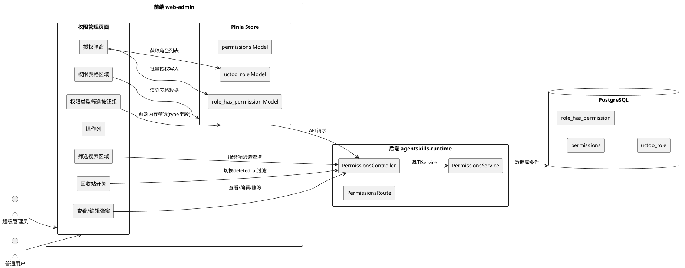

# 权限管理系统实现方案

# **1. 实现模型**

## **1.1 上下文视图**



## **1.2 服务/组件总体架构**

### 前端组件架构

```
views/permission/
├── index.vue                        # 路由入口(<router-view />)
└── info/
    ├── index.vue                    # 页面容器(GeneralLayout)
    └── components/
        ├── info-tab.vue             # 主组件(重构): 类型筛选+按钮栏+表格+弹窗
        ├── permission-table.vue     # 新增: 权限表格组件(树形/普通切换)
        ├── permission-tree-table.vue # 新增: 菜单权限树形表格(含圆形复选框)
        ├── edit-form.vue            # 新增: 查看/编辑表单组件(readonly控制)
        └── authorize-dialog.vue     # 新增: 批量授权弹窗组件
```

### 后端架构（已有，需新增方法）

```
agentskills-runtime/src/app/
├── routes/uctoo/permissions/
│   └── PermissionsRoute.cj          # 新增路由: /permissions/all, /permissions/authorize
├── controllers/uctoo/permissions/
│   └── PermissionsController.cj     # 新增: getAllPermissions, batchAuthorize
└── services/uctoo/
    └── PermissionsService.cj        # 新增: 全量查询, 批量授权逻辑
```

### Store模型（已有permissions.ts，需新增API方法）

```
store/models/uctoo/
├── permissions.ts                   # 新增: getAllPermissions, batchAuthorize, batchRestorePermission, emptyRecycleBinPermissions
├── role_has_permission.ts           # 已有: addRoleHasPermission(用于批量授权)
└── uctoo_role.ts                    # 已有: getUctooRoleList(授权弹窗获取角色列表)
```

### pinia-orm 使用模式（参考旧版本项目 uctoo-app-client-pc）

> **参考项目**: `apps/uctoo-app-client-pc/src/store/uctoo/uctoo_permissions.ts`
> **当前项目**: `apps/web-admin/web/src/store/models/uctoo/permissions.ts`

本项目采用 `pinia-orm` + `@pinia-orm/axios` 实现 ORM 状态管理，核心使用模式如下：

#### 1. Model 定义方式

- 每个数据库表对应一个 Model 类，继承自 `pinia-orm` 的 `Model`
- 使用装饰器声明字段类型：`@Uid()` (主键/UUID)、`@Str()` (字符串)、`@Num()` (数值)、`@Attr()` (任意类型/日期时间)、`@Bool()` (布尔)
- `static entity` 声明实体名（对应数据库表名）
- `static config.axiosApi.actions` 中定义所有 API 通信方法，**不在组件中直接调用 axios**

```typescript
import { Model } from 'pinia-orm'
import { Attr, Str, Uid, Num, Bool } from 'pinia-orm/decorators'
import { useAxiosRepo } from '@pinia-orm/axios'

const apiURL = import.meta.env.VITE_BACKEND_URL || 'https://localhost:443'

export class permissions extends Model {
  static override entity = 'permissions'

  @Uid() declare id: string
  @Str('') declare permission_name: string
  @Str('') declare level: string | null
  @Str('') declare icon: string | null
  @Str('') declare module: string | null
  @Str('') declare component: string | null
  @Str('') declare redirect: string | null
  @Num(1) declare type: number
  @Num(1) declare hidden: number
  @Num(0) declare weight: number
  @Num(1) declare keepalive: number
  @Str('') declare path: string
  @Str('') declare title: string | null
  @Str('') declare parent_id: string | null
  @Str('') declare method: string | null
  @Str('') declare menu_type: string | null
  @Str('') declare locale: string | null
  @Attr(null) declare meta: any
  @Str('') declare creator: string | null
  @Attr('') declare created_at: string
  @Attr('') declare updated_at: string
  @Attr('') declare deleted_at: string | null

  static override config = {
    axiosApi: {
      actions: {
        // API 方法在此定义...
      }
    }
  }
}
```

#### 2. API 方法定义规范

- 在 `static config.axiosApi.actions` 中定义，使用 `useAxiosRepo(ModelClass).api().get/post()` 调用
- 每个 API 方法必须配置：`headers`（含 Authorization Bearer token）、`baseURL`（从 `import.meta.env.VITE_BACKEND_URL` 获取）、`dataKey`（指定响应数据中实体数组的 key 名，如 `'permissionss'`）
- 方法命名约定：`getXxxList`（分页列表）、`getXxx`（单条查询）、`addXxx`（新增）、`editXxx`（编辑）、`deleteXxx`（删除）

```typescript
// 典型API方法定义（参考旧版本 uctoo_permissions.ts）
getPermissionsList(page: number, pageSize: number, searchParams?: any) {
  return useAxiosRepo(permissions).api().get(`/api/v1/uctoo/permissions/${pageSize}/${page}`, {
    params: searchParams,
    headers: {
      'Content-Type': 'application/json;charset=utf-8',
      'Authorization': `Bearer ${localStorage.getItem('accessToken')}`
    },
    baseURL: apiURL,
    dataKey: 'permissionss'  // 响应数据中实体数组的key
  })
}
```

#### 3. Store 注册方式

在 `store/index.ts` 中统一注册所有 Model：

```typescript
import { createPinia } from 'pinia'
import { createORM } from 'pinia-orm'
import { createPiniaOrmAxios } from '@pinia-orm/axios'
import * as uctooModels from './models/uctoo'

const allModels = [
  ...Object.values(uctooModels).filter((item) => {
    return item && typeof item === 'function' && item.entity
  }),
]

const pinia = createPinia()
const orm = createORM({
  model: allModels as any,
  plugins: [
    createPiniaOrmAxios({
      axios: axiosInstance,
      baseURL: apiURL,
      headers: { 'Content-Type': 'application/json;charset=utf-8' },
    }),
  ],
})
pinia.use(orm)
```

Model 在 `store/models/uctoo/index.ts` 中统一导出：

```typescript
export * from './permissions'
export * from './uctoo_role'
export * from './role_has_permission'
export * from './user_has_roles'
```

#### 4. 组件中的使用方式

- **远程API调用**：`useAxiosRepo(ModelClass).api().方法名(参数)` — 用于与服务端通信
- **本地数据操作**：`useRepo(ModelClass)` — 用于读取/写入 pinia-orm 本地仓库数据（`.all()`, `.save()`, `.find()`, `.flush()` 等）
- **导入方式**：`import { permissions } from '@/store/models/uctoo'`，然后通过 `useAxiosRepo(permissions)` 或 `useRepo(permissions)` 使用

```typescript
// 组件中典型用法（参考旧版本 home.vue 和当前 info-tab.vue）
import { permissions } from '@/store/models/uctoo'
import { useAxiosRepo } from '@pinia-orm/axios'
import { useRepo } from 'pinia-orm'

// 远程API调用（如：分页查询）
const result = await useAxiosRepo(permissions).api().getPermissionsList(page, pageSize, searchParams)
const res = result.response.data as unknown as PermissionsResponse

// 远程API调用（如：刷新API权限节点）
await useAxiosRepo(permissions).api().loadRouteFromApp()

// 远程API调用（如：编辑/恢复）
await useAxiosRepo(permissions).api().editPermission({ deleted_at: '0', id: record.id })

// 本地数据操作（如：获取本地缓存的全部权限数据）
const permRepo = useRepo(permissions)
const allLocalPerms = permRepo.all()
```

## **1.3 实现设计文档**

### 1.3.1 权限类型筛选按钮组实现

**组件**: `info-tab.vue` 顶部区域

**实现方案**:
- 使用 `TinyButtonGroup` 组件（参考card-list模块），数据驱动的筛选按钮组
- 按钮配置数组定义在组件内，4个固定按钮：菜单(type=1)、按钮(type=2)、路由(type=3)、工具(type=4)
- 默认选中 `type=1`（菜单）
- 切换类型时前端内存筛选，从store中过滤对应type的数据，不发起服务端请求
- 切换类型时分页重置到第1页

**关键代码结构**:
```typescript
// 权限类型筛选选项
const permissionTypeOptions = [
  { text: '菜单', value: 1 },
  { text: '按钮', value: 2 },
  { text: '路由', value: 3 },
  { text: '工具', value: 4 },
]
const currentType = ref(1) // 默认选中菜单

function onTypeChange(val: number) {
  currentType.value = val
  // 前端内存筛选，不请求服务端
  filterTableData()
  // 重置分页
  resetPager()
}
```

### 1.3.2 圆形复选框（权限持有状态）实现

**组件**: `permission-tree-table.vue` 菜单树名称列

**实现方案**:
- 在菜单树形表格的名称列（title列）左侧添加圆形复选框
- 使用CSS自定义圆形复选框样式（3种状态：选中/未选中/半选中）
- 圆形复选框为只读展示，`pointer-events: none` 禁止交互
- 状态计算逻辑在store中完成，基于"所有权限节点"与"用户已有权限"的对比

**圆形复选框渲染方案**:
```html
<!-- 在TinyGridColumn的#default slot中 -->
<template #default="{ row }">
  <span 
    class="circle-checkbox" 
    :class="getCheckState(row)"
  />
  <span>{{ row.title || row.locale }}</span>
</template>
```

**CSS实现**:
```css
.circle-checkbox {
  display: inline-block;
  width: 16px;
  height: 16px;
  border-radius: 50%;  /* 圆形 */
  border: 2px solid #dcdfe6;
  margin-right: 8px;
  vertical-align: middle;
  pointer-events: none; /* 只读 */
}
.circle-checkbox.checked {
  background-color: #1890ff;
  border-color: #1890ff;
}
.circle-checkbox.checked::after {
  content: '✓';
  color: #fff;
  font-size: 10px;
  display: block;
  text-align: center;
  line-height: 12px;
}
.circle-checkbox.indeterminate {
  border-color: #1890ff;
}
.circle-checkbox.indeterminate::after {
  content: '';
  display: block;
  width: 8px;
  height: 8px;
  border-radius: 50%;
  background-color: #1890ff;
  margin: 1px auto;
}
```

**状态计算函数**:
```typescript
function getCheckState(row: Permission): 'checked' | 'unchecked' | 'indeterminate' {
  const checkStates = permissionCheckStates.value // 从store获取
  return checkStates[row.permission_name] || 'unchecked'
}
```

**圆形复选框状态计算逻辑（在store或组件中）**:
```typescript
function computeCheckStates(
  allPermissions: Permission[],   // 所有权限节点
  userPermissions: string[]       // 用户已有权限的permission_name列表
): Record<string, 'checked' | 'unchecked' | 'indeterminate'> {
  const states: Record<string, 'checked' | 'unchecked' | 'indeterminate'> = {}
  
  // 构建用户权限集合
  const userPermSet = new Set(userPermissions)
  
  // 构建父子关系映射
  const childrenMap = buildChildrenMap(allPermissions)
  
  // 先计算叶子节点
  for (const perm of allPermissions) {
    if (isLeaf(perm, childrenMap)) {
      states[perm.permission_name] = userPermSet.has(perm.permission_name) ? 'checked' : 'unchecked'
    }
  }
  
  // 自底向上计算父节点状态
  for (const perm of allPermissions) {
    if (!isLeaf(perm, childrenMap)) {
      const children = childrenMap.get(perm.id) || []
      const childStates = children.map(c => states[c.permission_name])
      const allChecked = childStates.every(s => s === 'checked')
      const allUnchecked = childStates.every(s => s === 'unchecked')
      
      if (allChecked) states[perm.permission_name] = 'checked'
      else if (allUnchecked) states[perm.permission_name] = 'unchecked'
      else states[perm.permission_name] = 'indeterminate'
    }
  }
  
  return states
}
```

### 1.3.3 方形复选框列（授权多选）实现

**组件**: `permission-table.vue` 和 `permission-tree-table.vue`

**实现方案**:
- 仅超级管理员可见，通过 `v-if="isSuperAdmin"` 控制列显示
- 菜单类型：在树形表格id列之前添加方形复选框列（TinyGridColumn type="selection"）
- 其他类型：在普通表格id列之前添加方形复选框列
- 选中计数显示在按钮栏，如"已选3项"
- "批量授权"按钮在选中数量>0时可点击

**关键代码**:
```typescript
const isSuperAdmin = computed(() => {
  return userStore.rolePermission.includes('*')
})

// 选中行变更
function onSelectionChange(selection: Permission[]) {
  selectedPermissions.value = selection
  selectedCount.value = selection.length
}
```

```html
<!-- 方形复选框列 - 仅超级管理员可见 -->
<TinyGridColumn 
  v-if="isSuperAdmin" 
  type="selection" 
  width="30px" 
/>
```

### 1.3.4 不同类型权限的展示方式实现

**菜单类型(type=1)**: 树形表格
- 使用 `permission-tree-table.vue` 组件
- 基于 TinyGrid + `tree-config="{ children: 'children' }"` 实现（参考menu-tree.vue）
- 数据需先构建树形结构：前端根据parent_id递归构建children数组
- 名称列左侧添加圆形复选框
- id列之前添加方形复选框列（超级管理员可见）

**按钮/路由/工具类型(type=2,3,4)**: 普通表格
- 使用 `permission-table.vue` 组件
- 基于TinyGrid，无tree-config
- 无圆形复选框
- id列之前添加方形复选框列（超级管理员可见）

**表格切换方案**:
```html
<!-- 根据当前类型切换展示组件 -->
<permission-tree-table
  v-if="currentType === 1"
  :data="filteredData"
  :check-states="permissionCheckStates"
  :is-super-admin="isSuperAdmin"
  :is-recycle-bin="isRecycleBin"
  @selection-change="onSelectionChange"
  @view="onView"
  @edit="onEdit"
  @delete="onDelete"
  @restore="onRestore"
  @hard-delete="onHardDelete"
/>
<permission-table
  v-else
  :data="pagedData"
  :is-super-admin="isSuperAdmin"
  :is-recycle-bin="isRecycleBin"
  :fetch-data="fetchData"
  :pager-config="pagerConfig"
  @selection-change="onSelectionChange"
  @view="onView"
  @edit="onEdit"
  @delete="onDelete"
  @restore="onRestore"
  @hard-delete="onHardDelete"
/>
```

### 1.3.5 回收站功能实现

**参考**: entity模块的回收站实现模式

**实现方案**:

1. **回收站开关**: 在按钮栏右侧，使用 `TinySwitch` 组件，显示文本"回收站"

2. **按钮状态切换**: 使用 `v-if="!isRecycleBin"` / `v-else` 切换按钮栏
   - 正常模式：显示"添加权限"、"刷新API"、"批量授权"
   - 回收站模式：显示"清空"、"批量恢复"、"批量彻底删除"

3. **数据过滤**: 切换回收站状态时重新请求数据，通过filter参数传递deleted_at条件
   - 正常视图：`filter: { deleted_at: null }`
   - 回收站视图：`filter: { deleted_at: { not: null } }`

4. **操作列切换**: 操作列根据isRecycleBin状态切换按钮
   - 正常模式：查看、编辑、删除（软删除，Popconfirm确认）
   - 回收站模式：恢复、彻底删除（Popconfirm确认）

5. **恢复操作**: 调用 `editPermission({ id, deleted_at: '0' })`，将deleted_at清空

6. **清空回收站**: 调用 `emptyRecycleBinPermissions()`，二次确认使用 `TinyModal.confirm`

**按钮栏实现**（参考add-entity.vue模式）:
```html
<div class="permission-btn-container">
  <div class="permission-btn-group">
    <!-- 正常模式按钮 -->
    <template v-if="!isRecycleBin">
      <TinyButton v-permission="'uctoo:permission:add'" type="primary" round @click="handleAddPermission">
        添加权限
      </TinyButton>
      <TinyButton v-permission="'uctoo:permissions:loadRouteFromApp'" round @click="handleRefreshApi">
        刷新API
      </TinyButton>
      <TinyButton 
        v-if="isSuperAdmin && selectedCount > 0"
        v-permission="'*'" 
        type="primary" 
        round 
        @click="openAuthorizeDialog"
      >
        批量授权({{ selectedCount }})
      </TinyButton>
    </template>
    <!-- 回收站模式按钮 -->
    <template v-else>
      <TinyButton v-permission="'uctoo:permission:remove'" type="danger" round @click="onEmptyRecycleBin">
        清空
      </TinyButton>
      <TinyButton v-permission="'uctoo:permission:edit'" round @click="onBatchRestore">
        批量恢复
      </TinyButton>
      <TinyButton v-permission="'uctoo:permission:remove'" type="danger" round @click="onBatchPermanentDelete">
        批量彻底删除
      </TinyButton>
    </template>
  </div>
  <div class="recycle-bin-switch">
    <TinySwitch
      v-model="isRecycleBin"
      :show-text="true"
      :checked-text="'回收站'"
      :unchecked-text="'回收站'"
      @change="handleRecycleBinChange"
    />
  </div>
</div>
```

### 1.3.6 操作列实现

**参考**: entity-table.vue操作列模式

**实现方案**:
- 操作列使用 `fixed="right"` 固定在右侧
- 操作列宽度设为 `14%`
- 使用 `v-if="isRecycleBin"` / `v-else` 切换正常/回收站模式按钮
- 所有操作按钮使用 `v-permission` 指令控制可见性
- 删除和彻底删除使用 `TinyPopconfirm` 二次确认

**操作列模板**:
```html
<TinyGridColumn :title="$t('permissionInfo.table.operations')" width="14%" fixed="right">
  <template #default="data">
    <template v-if="isRecycleBin">
      <!-- 回收站模式 -->
      <TinyButton v-permission="'uctoo:permission:edit'" type="text" @click="onRestore(data.row)">
        <IconRestore class="operation-icon" />恢复
      </TinyButton>
      <TinyPopconfirm title="确定要彻底删除此权限吗？删除后无法恢复！" type="info" trigger="click" @confirm="onHardDelete(data.row)">
        <template #reference>
          <TinyButton v-permission="'uctoo:permission:remove'" type="text">
            <IconDel class="operation-icon" />彻底删除
          </TinyButton>
        </template>
      </TinyPopconfirm>
    </template>
    <template v-else>
      <!-- 正常模式 -->
      <TinyButton v-permission="'uctoo:permission:all'" type="text" @click="onView(data.row)">
        查看
      </TinyButton>
      <TinyButton v-permission="'uctoo:permission:edit'" type="text" @click="onEdit(data.row)">
        编辑
      </TinyButton>
      <TinyPopconfirm title="确定要删除此权限吗？" type="info" trigger="click" @confirm="onDelete(data.row)">
        <template #reference>
          <TinyButton v-permission="'uctoo:permission:remove'" type="text">
            <IconDel class="operation-icon" />删除
          </TinyButton>
        </template>
      </TinyPopconfirm>
    </template>
  </template>
</TinyGridColumn>
```

### 1.3.7 查看/编辑弹窗实现

**参考**: entity模块的edit-form.vue模式

**实现方案**:
- 创建 `edit-form.vue` 组件，复用同一表单
- 通过 `readonly` prop 控制只读/可编辑状态
- 使用 `TinyForm` 的 `:display-only="readonly"` 属性实现只读
- 表单字段包含permissions表的核心可编辑字段
- 编辑提交时使用 `getChangedFields` 工具函数检测变更，仅提交变更字段

**edit-form.vue关键结构**:
```typescript
const props = defineProps<{
  permissionData: Partial<permissions>
  readonly: boolean
}>()

const formData = reactive<Partial<permissions>>({
  id: props.permissionData.id,
  permission_name: props.permissionData.permission_name || '',
  type: props.permissionData.type || 1,
  path: props.permissionData.path || '',
  title: props.permissionData.title || '',
  component: props.permissionData.component || '',
  icon: props.permissionData.icon || '',
  method: props.permissionData.method || '',
  parent_id: props.permissionData.parent_id || '',
  weight: props.permissionData.weight || 0,
  menu_type: props.permissionData.menu_type || '',
  locale: props.permissionData.locale || '',
  hidden: props.permissionData.hidden ?? 1,
  keepalive: props.permissionData.keepalive ?? 1,
})

// 保存原始数据用于变更检测
const originalData = ref<Partial<permissions>>({})

function getFormData(): Partial<permissions> | null {
  const changedFields = getChangedFields(originalData.value, { ...formData })
  if (Object.keys(changedFields).length <= 1 && changedFields.id) {
    return null // 没有修改
  }
  return removeNull(changedFields)
}

defineExpose({ getFormData, valid: async () => editFormRef.value.validate() })
```

**弹窗调用**:
```html
<TinyModalComponent
  v-model="editModal"
  show-footer
  :mask-closable="true"
  width="800px"
  height="auto"
  resize
  :title="readonly ? '查看权限' : '编辑权限'"
  @close="onEditCancel"
>
  <EditForm
    v-if="editModal"
    ref="editFormRef"
    :permission-data="currentPermission"
    :readonly="readonly"
  />
  <template #footer>
    <TinyButton v-if="!readonly" type="primary" :loading="loading" @click="onEditConfirm">
      确认
    </TinyButton>
    <TinyButton @click="onEditCancel">取消</TinyButton>
  </template>
</TinyModalComponent>
```

### 1.3.8 批量授权弹窗实现

**组件**: `authorize-dialog.vue`

**实现方案**:
- 弹窗左侧显示已选权限列表（permission_name）
- 弹窗右侧显示角色列表（从 `uctoo_role` 获取），使用TinyCheckbox多选
- 确认按钮调用批量授权API
- 授权成功后刷新权限数据和圆形复选框状态

**authorize-dialog.vue关键结构**:
```typescript
import { permissions, uctoo_role } from '@/store/models/uctoo'
import { useAxiosRepo } from '@pinia-orm/axios'

const props = defineProps<{
  visible: boolean
  selectedPermissions: Permission[]
}>()

const roleList = ref<uctoo_role[]>([])
const selectedRoles = ref<string[]>([]) // 选中的角色ID列表

// 加载角色列表（使用 pinia-orm API）
async function loadRoles() {
  const result = await useAxiosRepo(uctoo_role).api().getUctooRoleList(1, 100)
  const items = extractData(result)
  roleList.value = items
}

// 批量授权（使用 pinia-orm API）
async function onConfirm() {
  const permissionNames = props.selectedPermissions.map(p => p.permission_name)
  const roleIds = selectedRoles.value
  
  setLoading(true)
  try {
    await useAxiosRepo(permissions).api().batchAuthorize({
      permission_names: permissionNames,
      role_ids: roleIds,
    })
    TinyModal.message({ message: '授权成功', status: 'success' })
    emits('success')
    emits('update:visible', false)
  } catch (error) {
    // 错误处理
  } finally {
    setLoading(false)
  }
}
```

### 1.3.9 筛选搜索区域实现

**参考**: entity-table.vue的筛选搜索实现

**实现方案**:
- 完全复用entity模块的筛选搜索代码模式
- 筛选字段列表替换为permissions表字段：permission_name、type、path、title、component、method、parent_id、weight、menu_type、locale、icon、hidden、keepalive
- 操作符列表复用：等于、不等于、包含、开头是、结尾是、大于、小于等
- 类型筛选条件作为隐含AND条件参与服务端过滤

**筛选搜索区域模板**（参考entity-table.vue）:
```html
<div class="search-filter-container">
  <div class="filter-header">
    <TinyButton type="text" :icon="IconPlus" @click="addFilterCondition">
      添加筛选条件
    </TinyButton>
    <div style="display: flex; gap: 12px;">
      <TinyButton type="default" @click="resetFilters">重置</TinyButton>
      <TinyButton type="primary" @click="applyFilters">搜索</TinyButton>
    </div>
  </div>
  <div class="filter-conditions">
    <div class="filter-row" v-for="condition in filterConditions" :key="condition.id">
      <TinySelect v-model="condition.field" style="width: 150px; margin-right: 10px">
        <TinyOption v-for="field in availableFields" :key="field.value" :value="field.value">
          {{ field.label }}
        </TinyOption>
      </TinySelect>
      <TinySelect v-model="condition.operator" style="width: 120px; margin-right: 10px">
        <TinyOption v-for="op in operators" :key="op.value" :value="op.value">
          {{ op.label }}
        </TinyOption>
      </TinySelect>
      <TinyInput v-model="condition.value" style="width: 150px; margin-right: 10px" />
      <TinyButton type="text" :icon="IconMinus" @click="removeFilterCondition(condition.id)"
        v-if="filterConditions.length > 1" />
    </div>
  </div>
</div>
```

**权限表筛选字段**:
```typescript
const availableFields = [
  { label: '权限名称', value: 'permission_name' },
  { label: '类型', value: 'type' },
  { label: '路径', value: 'path' },
  { label: '标题', value: 'title' },
  { label: '组件', value: 'component' },
  { label: '方法', value: 'method' },
  { label: '父级ID', value: 'parent_id' },
  { label: '排序', value: 'weight' },
  { label: '菜单类型', value: 'menu_type' },
  { label: '国际化', value: 'locale' },
  { label: '图标', value: 'icon' },
  { label: '隐藏', value: 'hidden' },
  { label: '缓存', value: 'keepalive' },
]
```

### 1.3.10 全量权限数据与用户权限数据对比渲染方案

**数据流（遵循 pinia-orm 使用模式）**:
1. 页面加载时，通过 `useAxiosRepo(permissions).api().getUserAllPermissions()` 获取当前用户权限列表
2. 若为超级管理员，通过 `useAxiosRepo(permissions).api().getAllPermissions()` 获取所有权限节点
3. 前端计算圆形复选框状态（见1.3.2）
4. 非超级管理员仅根据用户已有权限渲染，圆形复选框仅标记已持有权限
5. 分页查询通过 `useAxiosRepo(permissions).api().getPermissionsList(page, pageSize, searchParams)` 发起
6. 编辑/删除/恢复等操作均通过 `useAxiosRepo(permissions).api().editPermission()` / `.deletePermission()` 发起，**不直接在组件中调用 axios**

**Store数据结构（组件中结合 pinia-orm 使用）**:
```typescript
import { permissions } from '@/store/models/uctoo'
import { useAxiosRepo } from '@pinia-orm/axios'
import { useRepo } from 'pinia-orm'

// 组件级响应式数据（用于视图渲染和交互状态）
const allPermissions = ref<Permission[]>([])      // 所有权限节点(超级管理员)
const userPermissionNames = ref<string[]>([])     // 用户已有权限的permission_name列表
const permissionCheckStates = ref<Record<string, 'checked' | 'unchecked' | 'indeterminate'>>({})

// pinia-orm 本地仓库（用于前端内存筛选和本地缓存操作）
const permRepo = useRepo(permissions)
```

**初始化流程（严格遵循 pinia-orm 模式）**:
```typescript
async function initPermissionData() {
  // 1. 通过 pinia-orm API 获取用户权限
  const userPermRes = await useAxiosRepo(permissions).api().getUserAllPermissions()
  const userPerms = extractData(userPermRes)
  userPermissionNames.value = userPerms.map(p => p.permission_name)
  
  // 2. 判断是否超级管理员
  isSuperAdmin.value = userPermissionNames.value.includes('*')
  
  // 3. 超级管理员通过 pinia-orm API 获取所有权限节点
  if (isSuperAdmin.value) {
    try {
      const allPermRes = await useAxiosRepo(permissions).api().getAllPermissions()
      allPermissions.value = extractData(allPermRes)
      // 将全量数据保存到 pinia-orm 本地仓库，支持前端内存筛选
      permRepo.save(allPermissions.value)
    } catch (e) {
      // 接口调用失败，圆形复选框默认未选中
      allPermissions.value = userPerms
      permRepo.save(userPerms)
    }
  } else {
    allPermissions.value = userPerms
    permRepo.save(userPerms)
  }
  
  // 4. 计算圆形复选框状态
  permissionCheckStates.value = computeCheckStates(allPermissions.value, userPermissionNames.value)
}

// 前端内存筛选（从 pinia-orm 本地仓库过滤，不请求服务端）
function filterByType(type: number): Permission[] {
  return permRepo.all().filter(p => p.type === type)
}
```

**分页查询流程（服务端筛选，使用 pinia-orm API）**:
```typescript
async function fetchData(page: number, size: number, searchParams?: any) {
  // 通过 pinia-orm API 发起服务端分页查询
  const result = await useAxiosRepo(permissions).api().getPermissionsList(page, size, searchParams)
  const res = result.response.data as unknown as PermissionsResponse
  // 分页数据直接用于渲染，不保存到本地仓库（全量数据才保存到仓库）
  return { items: res.permissionss, meta: res.meta }
}
```

**操作流程（恢复/删除/编辑，使用 pinia-orm API）**:
```typescript
// 恢复权限（参考旧版本 home.vue 中的 handleRestore）
async function onRestore(record: Permission) {
  await useAxiosRepo(permissions).api().editPermission({ deleted_at: '0', id: record.id })
  TinyModal.message({ message: '恢复成功', status: 'success' })
  fetchData(currentPage, pageSize) // 刷新表格数据
}

// 删除权限（参考旧版本 home.vue 中的 handleDelete）
async function onDelete(record: Permission) {
  await useAxiosRepo(permissions).api().deletePermission({ id: record.id })
  TinyModal.message({ message: '删除成功', status: 'success' })
  fetchData(currentPage, pageSize)
}

// 彻底删除（回收站模式）
async function onHardDelete(record: Permission) {
  await useAxiosRepo(permissions).api().deletePermission({ id: record.id, force: 1 })
  TinyModal.message({ message: '已彻底删除', status: 'success' })
  fetchData(currentPage, pageSize)
}

// 刷新API权限节点（参考当前 info-tab.vue 中的 handleRefreshApi）
async function handleRefreshApi() {
  await useAxiosRepo(permissions).api().loadRouteFromApp()
  TinyModal.message({ message: 'API权限节点刷新成功', status: 'success' })
  fetchData(currentPage, pageSize)
}
```

# **2. 接口设计**

## **2.1 总体设计**

| 序号 | 接口 | 方法 | 说明 | 状态 |
|------|------|------|------|------|
| 1 | `/api/v1/uctoo/permissions/user/all` | POST | 获取当前用户所有权限 | 已有 |
| 2 | `/api/v1/uctoo/permissions/all` | GET | 获取所有权限节点(仅超级管理员) | **新增** |
| 3 | `/api/v1/uctoo/permissions/authorize` | POST | 批量授权(权限→角色) | **新增** |
| 4 | `/api/v1/uctoo/permissions/:limit/:page` | GET | 权限分页查询(支持筛选) | 已有 |
| 5 | `/api/v1/uctoo/permissions/add` | POST | 添加权限 | 已有 |
| 6 | `/api/v1/uctoo/permissions/edit` | POST | 编辑权限(含恢复:deleted_at='0') | 已有 |
| 7 | `/api/v1/uctoo/permissions/del` | POST | 删除权限(软删除/硬删除) | 已有 |
| 8 | `/api/v1/uctoo/permissions/empty-recycle-bin` | POST | 清空回收站 | 已有 |
| 9 | `/api/v1/uctoo/permissions/loadRouteFromApp` | GET | 刷新API权限节点 | 已有 |
| 10 | `/api/v1/uctoo/uctoo_role/:limit/:page` | GET | 角色列表(授权弹窗) | 已有 |

## **2.2 接口清单**

### 2.2.1 获取所有权限节点（新增）

**接口**: `GET /api/v1/uctoo/permissions/all`

**权限**: 仅超级管理员（持有"*"权限）可调用，其他用户返回403

**请求**:
```
GET /api/v1/uctoo/permissions/all
Authorization: Bearer {accessToken}
```

**响应**:
```json
{
  "errno": "0",
  "errmsg": "success",
  "data": {
    "permissions": [
      {
        "id": "uuid-1",
        "permission_name": "uctoo:permission:all",
        "type": 2,
        "path": "/api/v1/uctoo/permissions",
        "title": "权限查看",
        "component": "",
        "icon": "",
        "parent_id": "uuid-parent",
        "weight": 0,
        "menu_type": null,
        "locale": null,
        "method": "GET",
        "hidden": 1,
        "keepalive": 1,
        "deleted_at": null
      }
    ]
  }
}
```

**错误响应**:
```json
// 非超级管理员
{ "errno": "40300", "errmsg": "无权限执行此操作" }

// 未登录
{ "errno": "40100", "errmsg": "未登录或登录已过期" }
```

### 2.2.2 批量授权（新增）

**接口**: `POST /api/v1/uctoo/permissions/authorize`

**权限**: 仅超级管理员（持有"*"权限）可调用

**请求**:
```json
{
  "permission_names": ["uctoo:permission:all", "uctoo:permission:edit"],
  "role_ids": ["role-uuid-1", "role-uuid-2"],
  "creator": "user-uuid"
}
```

**响应**:
```json
{
  "errno": "0",
  "errmsg": "success",
  "data": {
    "authorized_count": 4,
    "skipped_count": 0,
    "message": "授权成功"
  }
}
```

**错误响应**:
```json
// 非超级管理员
{ "errno": "40300", "errmsg": "无权限执行此操作" }

// 权限名称不存在
{ "errno": "40002", "errmsg": "部分权限记录不存在" }

// 角色不存在
{ "errno": "40003", "errmsg": "目标角色不存在" }
```

**后端处理逻辑**:
1. JWT认证 + 校验"*"权限
2. 遍历 permission_names × role_ids，写入 role_has_permission 表
3. 利用(role_id, permission_name)联合主键保证幂等性（INSERT ON CONFLICT DO NOTHING）
4. 记录creator和created_at
5. 返回成功写入数量

### 2.2.3 权限分页查询（已有，增强筛选）

**接口**: `GET /api/v1/uctoo/permissions/:limit/:page`

**请求参数**（增强）:
```
GET /api/v1/uctoo/permissions/10/1?filter={"type":{"equals":1},"permission_name":{"contains":"uctoo"},"deleted_at":null}
Authorization: Bearer {accessToken}
```

**filter参数说明**:
- `type: { equals: 1 }` - 权限类型筛选
- `permission_name: { contains: "uctoo" }` - 权限名称模糊搜索
- `deleted_at: null` - 正常数据
- `deleted_at: { not: null }` - 回收站数据

**响应**: 与现有格式一致

### 2.2.4 清空回收站（已有）

**接口**: `POST /api/v1/uctoo/permissions/empty-recycle-bin`

**后端处理**:
1. JWT认证 + 校验删除权限
2. 查询所有 deleted_at 不为空的权限记录
3. 同步清理 role_has_permission 表中对应的关联记录
4. 物理删除所有 deleted_at 不为空的权限记录
5. 返回删除数量

# **4. 数据模型**

## **4.1 设计目标**

本设计在现有数据模型基础上，不新增数据库表，仅通过新增API接口和前端Store方法实现功能需求。核心数据模型已有：

1. **permissions** - 权限节点表（已有）
2. **role_has_permission** - 角色-权限关联表（已有）
3. **uctoo_role** - 角色表（已有）

## **4.2 模型实现**

### 4.2.1 permissions Model（已有，需新增API方法）

**Store文件**: `store/models/uctoo/permissions.ts`

**pinia-orm Model 定义（当前项目实际代码，已有字段）**:

```typescript
import { Model } from 'pinia-orm'
import { Attr, Str, Uid, Num, Bool } from 'pinia-orm/decorators'
import { useAxiosRepo } from '@pinia-orm/axios'

const apiURL = import.meta.env.VITE_BACKEND_URL || 'https://localhost:443'

export class permissions extends Model {
  static override entity = 'permissions'

  @Uid() declare id: string
  @Str('') declare permission_name: string
  @Str('') declare level: string | null
  @Str('') declare icon: string | null
  @Str('') declare module: string | null
  @Str('') declare component: string | null
  @Str('') declare redirect: string | null
  @Num(1) declare type: number
  @Num(1) declare hidden: number
  @Num(0) declare weight: number
  @Num(1) declare keepalive: number
  @Str('') declare path: string
  @Str('') declare title: string | null
  @Str('') declare parent_id: string | null
  @Str('') declare method: string | null
  @Str('') declare menu_type: string | null
  @Str('') declare locale: string | null
  @Attr(null) declare meta: any
  @Str('') declare creator: string | null
  @Attr('') declare created_at: string
  @Attr('') declare updated_at: string
  @Attr('') declare deleted_at: string | null

  static override config = {
    axiosApi: {
      actions: {
        // === 已有API方法（保持不变） ===
        getPermissionsList(page: number, pageSize: number, searchParams?: any) { /* ...已有... */ },
        getPermission(id: string) { /* ...已有... */ },
        addPermission(data: any) { /* ...已有... */ },
        editPermission(data: any) { /* ...已有... */ },
        deletePermission(data: any) { /* ...已有... */ },
        getUserMenuTree(userId?: string) { /* ...已有... */ },
        getAllMenuTree() { /* ...已有... */ },
        getRoleMenuTree(roleId: string) { /* ...已有... */ },
        getUserAllPermissions(userId?: string) { /* ...已有... */ },
        loadRouteFromApp() { /* ...已有... */ },

        // === 新增API方法 ===
        // (详见下方"新增API方法"部分)
      }
    }
  }
}
```

**新增API方法**（在 `static config.axiosApi.actions` 中添加）:

```typescript
// 1. 获取所有权限节点（仅超级管理员）
getAllPermissions() {
  return useAxiosRepo(permissions).api().get('/api/v1/uctoo/permissions/all', {
    headers: {
      'Content-Type': 'application/json;charset=utf-8',
      'Authorization': `Bearer ${localStorage.getItem('accessToken')}`
    },
    baseURL: apiURL,
    dataKey: 'permissions'
  })
},

// 2. 批量授权
batchAuthorize(data: { permission_names: string[], role_ids: string[], creator?: string }) {
  return useAxiosRepo(permissions).api().post('/api/v1/uctoo/permissions/authorize', data, {
    headers: {
      'Content-Type': 'application/json;charset=utf-8',
      'Authorization': `Bearer ${localStorage.getItem('accessToken')}`
    },
    baseURL: apiURL,
  })
},

// 3. 批量恢复权限
batchRestorePermission(ids: string[]) {
  return useAxiosRepo(permissions).api().post('/api/v1/uctoo/permissions/edit', 
    { ids: JSON.stringify(ids), deleted_at: '0' }, 
    {
      headers: {
        'Content-Type': 'application/json;charset=utf-8',
        'Authorization': `Bearer ${localStorage.getItem('accessToken')}`
      },
      baseURL: apiURL,
    }
  )
},

// 4. 清空回收站（已有路由，补充store方法）
emptyRecycleBinPermissions() {
  return useAxiosRepo(permissions).api().post('/api/v1/uctoo/permissions/empty-recycle-bin', {}, {
    headers: {
      'Content-Type': 'application/json;charset=utf-8',
      'Authorization': `Bearer ${localStorage.getItem('accessToken')}`
    },
    baseURL: apiURL,
  })
},

// 5. 批量删除权限（含force参数）
batchDeletePermission(params: { ids: string, force?: number }) {
  return useAxiosRepo(permissions).api().post('/api/v1/uctoo/permissions/del', params, {
    headers: {
      'Content-Type': 'application/json;charset=utf-8',
      'Authorization': `Bearer ${localStorage.getItem('accessToken')}`
    },
    baseURL: apiURL,
  })
},
```

### 4.2.2 role_has_permission Model（已有，用于批量授权）

**Store文件**: `store/models/uctoo/role_has_permission.ts`

**当前项目实际定义**:

```typescript
import { Model } from 'pinia-orm'
import { Attr, Str, Uid, Num } from 'pinia-orm/decorators'
import { useAxiosRepo } from '@pinia-orm/axios'

const apiURL = import.meta.env.VITE_BACKEND_URL || 'https://localhost:443'

export class role_has_permission extends Model {
  static override entity = 'role_has_permission'

  @Uid() declare role_id: string
  @Str('') declare permission_name: string
  @Num(0) declare status: number
  @Str('') declare creator: string | null
  @Attr('') declare created_at: string
  @Attr('') declare updated_at: string
  @Attr('') declare deleted_at: string | null

  static override config = {
    axiosApi: {
      actions: {
        getRoleHasPermissionList(page: number, pageSize: number, searchParams?: any) {
          return useAxiosRepo(role_has_permission).api().get(`/api/v1/uctoo/role_has_permission/${pageSize}/${page}`, {
            params: searchParams,
            headers: {
              'Content-Type': 'application/json;charset=utf-8',
              'Authorization': `Bearer ${localStorage.getItem('accessToken')}`
            },
            baseURL: apiURL,
            dataKey: 'role_has_permissions'
          })
        },
        addRoleHasPermission(data: any) { /* ...已有... */ },
        deleteRoleHasPermission(data: any) { /* ...已有... */ },
      }
    }
  }
}
```

### 4.2.3 uctoo_role Model（已有，用于授权弹窗获取角色列表）

**Store文件**: `store/models/uctoo/uctoo_role.ts`

**当前项目实际定义**:

```typescript
import { Model } from 'pinia-orm'
import { Attr, Str, Uid, Num } from 'pinia-orm/decorators'
import { useAxiosRepo } from '@pinia-orm/axios'

const apiURL = import.meta.env.VITE_BACKEND_URL || 'https://localhost:443'

export class uctoo_role extends Model {
  static override entity = 'uctoo_role'

  @Uid() declare id: string
  @Str('') declare name: string
  @Str('') declare description: string | null
  @Num(0) declare status: number
  @Uid() declare creator: string
  @Attr('') declare created_at: string
  @Attr('') declare updated_at: string
  @Attr('') declare deleted_at: string | null

  static override config = {
    axiosApi: {
      actions: {
        getUctooRoleList(page: number, pageSize: number, searchParams?: any) {
          return useAxiosRepo(uctoo_role).api().get(`/api/v1/uctoo/uctoo_role/${pageSize}/${page}`, {
            params: searchParams,
            headers: {
              'Content-Type': 'application/json;charset=utf-8',
              'Authorization': `Bearer ${localStorage.getItem('accessToken')}`
            },
            baseURL: apiURL,
            dataKey: 'uctoo_roles'
          })
        },
        // getUctooRole, addUctooRole, editUctooRole, deleteUctooRole 等已有方法
      }
    }
  }
}
```

### 4.2.4 pinia-orm 组件交互规范总结

> 以下规范确保组件与 Store 交互方式与旧版本项目 `uctoo-app-client-pc` 保持一致

| 操作类型 | 调用方式 | 示例 |
|----------|----------|------|
| 分页查询 | `useAxiosRepo(Model).api().getXxxList(page, size, params)` | `useAxiosRepo(permissions).api().getPermissionsList(0, 10, {filter: ...})` |
| 单条查询 | `useAxiosRepo(Model).api().getXxx(id)` | `useAxiosRepo(permissions).api().getPermission('uuid')` |
| 新增 | `useAxiosRepo(Model).api().addXxx(data)` | `useAxiosRepo(permissions).api().addPermission({...})` |
| 编辑/恢复 | `useAxiosRepo(Model).api().editXxx(data)` | `useAxiosRepo(permissions).api().editPermission({id, deleted_at:'0'})` |
| 删除 | `useAxiosRepo(Model).api().deleteXxx(data)` | `useAxiosRepo(permissions).api().deletePermission({id})` |
| 彻底删除 | `useAxiosRepo(Model).api().deleteXxx({id, force:1})` | `useAxiosRepo(permissions).api().deletePermission({id, force:1})` |
| 本地查询 | `useRepo(Model).all()` / `.find(id)` / `.where(...)` | `useRepo(permissions).all().filter(p => p.type === 1)` |
| 本地写入 | `useRepo(Model).save(data)` / `.flush()` | `useRepo(permissions).save(allPermissions)` |

**关键约束**：
- 所有与后端的 API 通信必须通过 Model 的 `static config.axiosApi.actions` 中定义的方法进行
- **禁止**在组件中直接调用 `axios` 或 `requestClient`，统一使用 `useAxiosRepo(Model).api().方法名()`
- 每个 API 方法必须包含 `headers.Authorization` 和 `baseURL` 配置
- `dataKey` 参数必须与服务端响应格式匹配（如 `permissionss`、`role_has_permissions`、`uctoo_roles`）

### 4.2.5 权限类型筛选配置数据

```typescript
interface PermissionTypeOption {
  text: string
  value: number  // 对应permissions.type字段
}

const PERMISSION_TYPE_OPTIONS: PermissionTypeOption[] = [
  { text: '菜单', value: 1 },
  { text: '按钮', value: 2 },
  { text: '路由', value: 3 },
  { text: '工具', value: 4 },
]
```

### 4.2.6 圆形复选框状态数据

```typescript
type CheckState = 'checked' | 'unchecked' | 'indeterminate'

// permission_name → 状态映射
type PermissionCheckStates = Record<string, CheckState>
```

### 4.2.7 筛选条件数据

```typescript
interface FilterCondition {
  id: string
  field: string     // 字段名
  operator: string  // 操作符
  value: string     // 值
}
```

### 4.2.8 批量授权请求数据

```typescript
interface BatchAuthorizeRequest {
  permission_names: string[]  // 权限名称列表
  role_ids: string[]          // 目标角色ID列表
  creator?: string            // 操作人(服务端从JWT获取)
}
```

---

# **5. 文件变更清单**

## **5.1 前端新增文件**

| 序号 | 文件路径 | 说明 |
|------|----------|------|
| 1 | `views/permission/info/components/permission-table.vue` | 非菜单类型权限表格(普通TinyGrid+筛选+操作列+方形复选框) |
| 2 | `views/permission/info/components/permission-tree-table.vue` | 菜单类型权限树形表格(TinyGrid+tree-config+圆形复选框+方形复选框+操作列) |
| 3 | `views/permission/info/components/edit-form.vue` | 查看/编辑权限表单(readonly控制) |
| 4 | `views/permission/info/components/authorize-dialog.vue` | 批量授权弹窗(已选权限+角色选择+确认) |

## **5.2 前端修改文件**

| 序号 | 文件路径 | 修改内容 |
|------|----------|----------|
| 1 | `views/permission/info/components/info-tab.vue` | 重构: 添加类型筛选按钮组、筛选搜索区域、回收站开关、按钮状态切换、批量授权按钮、查看/编辑弹窗、授权弹窗、数据初始化逻辑 |
| 2 | `store/models/uctoo/permissions.ts` | 新增API方法: getAllPermissions, batchAuthorize, batchRestorePermission, emptyRecycleBinPermissions, batchDeletePermission |

## **5.3 后端修改文件**

| 序号 | 文件路径 | 修改内容 |
|------|----------|----------|
| 1 | `src/app/routes/uctoo/permissions/PermissionsRoute.cj` | 新增路由: GET /permissions/all, POST /permissions/authorize |
| 2 | `src/app/controllers/uctoo/permissions/PermissionsController.cj` | 新增方法: getAllPermissions(全量查询+权限校验), batchAuthorize(批量授权+事务) |
| 3 | `src/app/services/uctoo/PermissionsService.cj` | 新增方法: 全量查询逻辑, 批量授权写入逻辑(INSERT ON CONFLICT DO NOTHING) |
