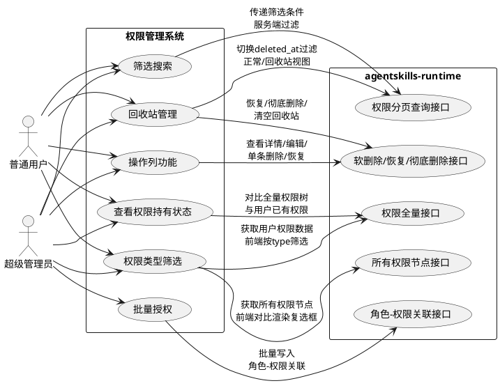
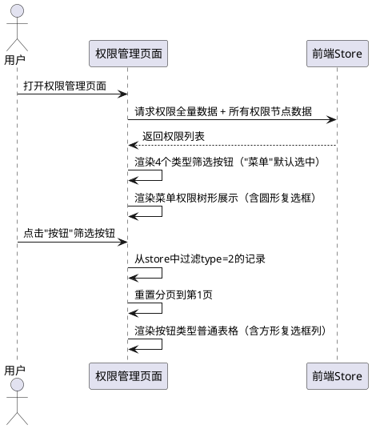
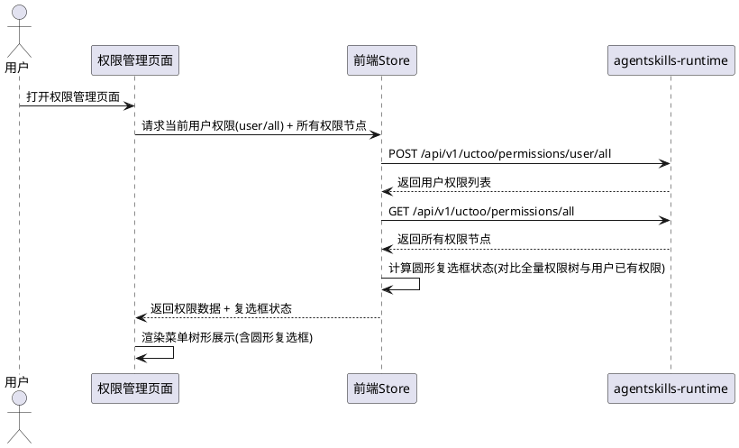
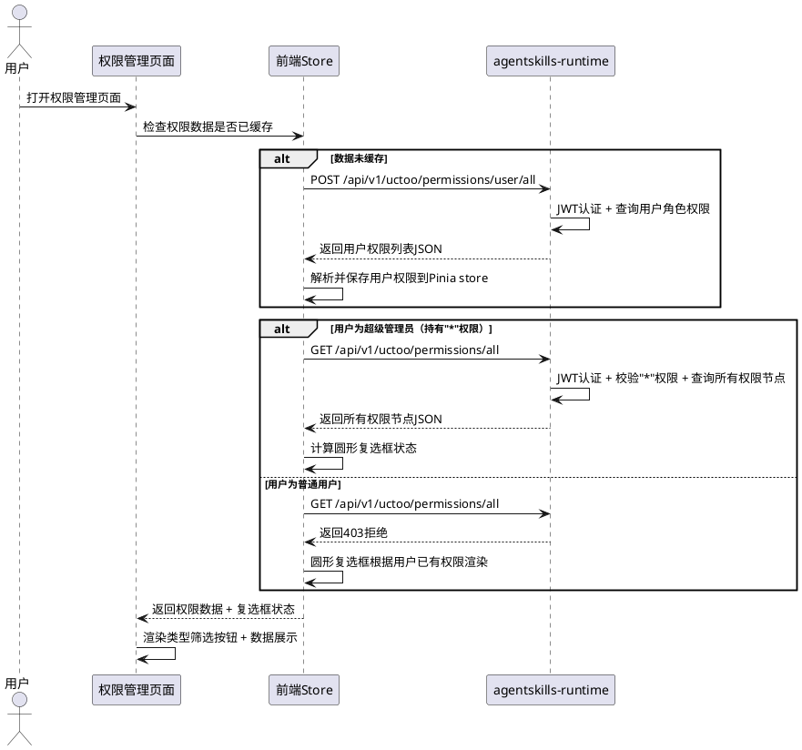
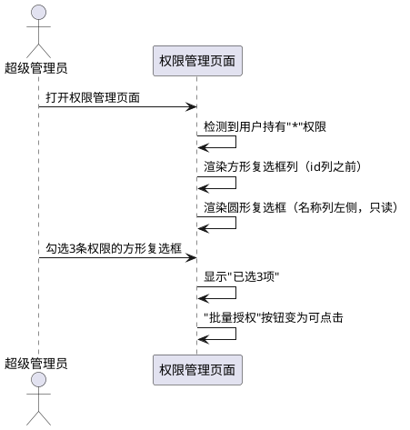
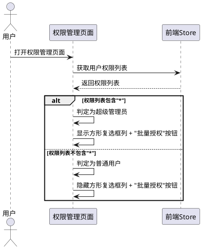
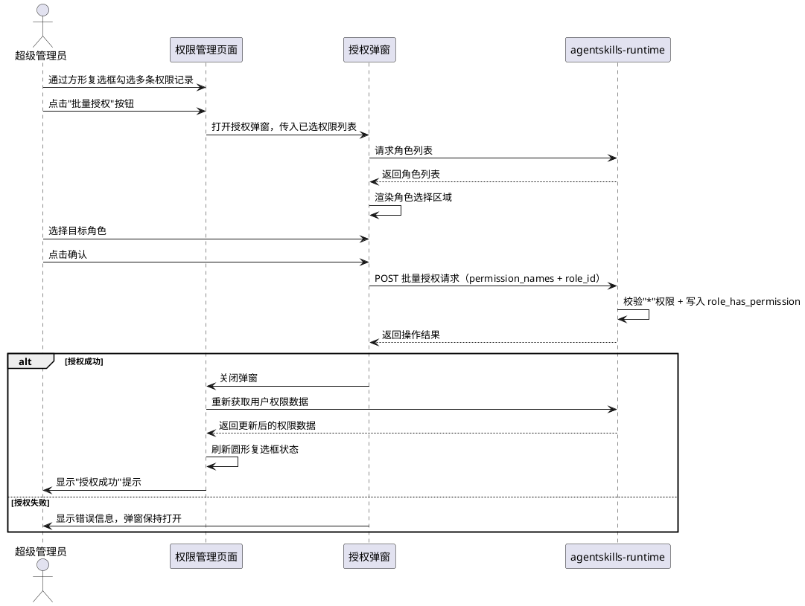
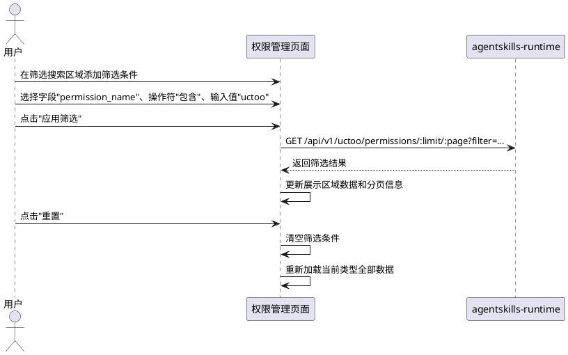
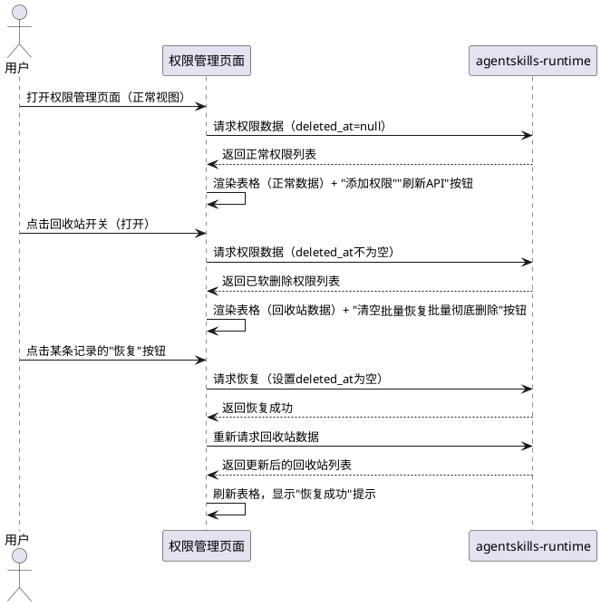
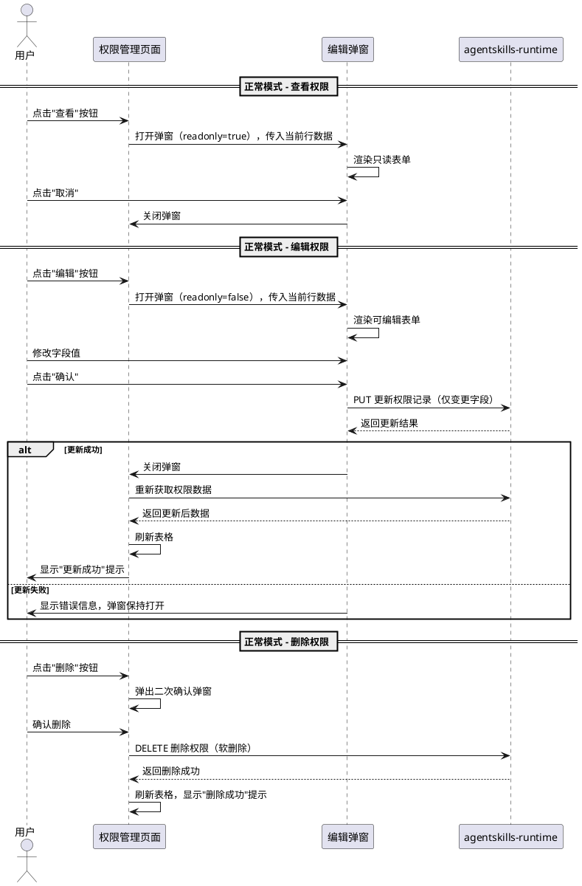

# 权限管理系统需求规格

# **1. 组件定位**

## **1.1 核心职责**

本组件负责权限管理界面的数据筛选、搜索与授权操作，实现权限节点按类型切换浏览（菜单树形/其他表格）、多条件筛选搜索、批量授权给角色、回收站软删除恢复、以及单条权限查看与编辑的能力。

## **1.2 核心输入**

1. 用户在权限管理页面点击权限类型筛选按钮（菜单/按钮/路由/工具）
2. 用户在筛选搜索区域输入搜索条件和选择筛选字段/操作符/值
3. 超级管理员在权限管理表格中选择多条权限记录，触发批量授权操作
4. 超级管理员在批量授权弹窗中选择目标角色并确认授权
5. 服务端返回的权限全量数据（通过 `/api/v1/uctoo/permissions/user/all` 接口获取当前用户已有权限）
6. 服务端返回的所有权限节点数据（通过新增接口获取，用于渲染圆形复选框状态）
7. 当前用户是否持有"*"通配符权限（决定授权操作可见性）
8. 用户切换回收站开关（正常数据/已软删除数据视图切换）
9. 用户点击操作列中的"查看"、"编辑"按钮查看或修改单条权限记录
10. 用户在回收站视图中点击"恢复"或"彻底删除"操作

## **1.3 核心输出**

1. 根据筛选条件过滤后的权限列表数据展示（菜单类型为树形表格，其他类型为普通表格）
2. 选定权限类型后，表格仅显示对应 type 的权限记录
3. 圆形复选框显示当前用户对每个权限节点的持有状态（选中/未选中/半选中）
4. 方形复选框列供超级管理员多选权限节点进行授权
5. 批量授权成功后，role_has_permission 表新增关联记录
6. 授权操作结果反馈（成功/失败提示信息）
7. 回收站视图切换后，表格显示已软删除（deleted_at不为空）的权限记录
8. 恢复操作后，权限记录的 deleted_at 清空，重新出现在正常列表中
9. 操作列靠右冻结，提供"查看"、"编辑"（正常模式）或"恢复"、"彻底删除"（回收站模式）按钮
10. 查看/编辑弹窗展示权限详情表单（查看为只读，编辑为可修改）

## **1.4 职责边界**

1. 不负责权限节点的增删改操作中涉及的非本页面功能（添加权限和刷新API由现有功能覆盖）
2. 不负责用户-角色关联管理（由用户管理模块负责）
3. 不负责JWT认证和API权限中间件的鉴权逻辑（由服务端安全层负责）
4. 不负责通配符权限（*、/*、menu:*等）的匹配判定逻辑（由服务端PermissionService负责）
5. 不负责非超级管理员的授权操作（非超级管理员仅浏览权限管理页面）
6. 回收站仅管理 permissions 表的软删除数据，不负责 role_has_permission 等关联表的回收站功能

# **2. 领域术语**

**权限节点（Permission）**
: permissions 表中的一条记录，代表系统中的一个可授权单元，包含菜单权限、按钮权限、路由权限、工具权限四种类型。

**权限类型（Permission Type）**
: permissions 表中 type 字段的取值，1=菜单权限，2=按钮权限，3=路由权限，4=工具权限。

**权限类型筛选**
: 在权限管理数据表格上方，通过按钮组切换显示不同 type 值的权限节点列表的交互方式。仅包含4个筛选按钮：菜单、按钮、路由、工具，不包含"全部"选项。

**圆形复选框（权限持有状态指示器）**
: 显示在菜单树名称列左侧的圆形复选框，用于只读展示当前用户对权限节点的持有状态。选中表示用户持有该权限，未选中表示用户未持有，半选中表示用户持有部分子权限。

**方形复选框（授权选择器）**
: 显示在id列之前的方形复选框列，用于超级管理员多选权限节点执行授权操作。可勾选/取消勾选，与圆形复选框相互独立。

**超级管理员**
: 持有通配符权限节点"*"的用户，拥有权限管理页面的全部操作权限，包括将权限授权给用户角色。

**普通用户**
: 不持有通配符权限节点"*"的用户，仅可浏览权限管理页面，无授权操作功能。

**批量授权**
: 超级管理员选择多条权限记录，一次性将它们授权给一个或多个角色的操作。

**角色-权限关联（role_has_permission）**
: 角色与权限节点的多对多关联关系，通过 role_id 和 permission_name 联合主键标识。

**权限全量接口**
: 服务端接口 `POST /api/v1/uctoo/permissions/user/all`，返回当前登录用户角色关联的所有权限节点数据。

**所有权限节点接口**
: 服务端新增接口，返回 permissions 表中所有权限节点数据（不区分用户角色），用于与用户已有权限对比，渲染圆形复选框状态。仅超级管理员可调用此接口。

**回收站（Recycle Bin）**
: 权限管理页面中用于查看和管理已软删除（deleted_at不为空）的权限记录的视图模式。通过开关切换正常数据视图和回收站视图。

**软删除（Soft Delete）**
: 删除权限记录时，不物理删除记录，而是设置 deleted_at 字段为当前时间戳，使记录在正常视图中不可见，但在回收站视图中可见。

**恢复（Restore）**
: 将已软删除的权限记录的 deleted_at 字段清空（设为'0'或null），使其重新出现在正常列表中的操作。

**彻底删除（Hard Delete / Permanent Delete）**
: 物理删除权限记录，从数据库中永久移除，不可恢复。仅在回收站视图或明确选择硬删除时执行。

**操作列（Operations Column）**
: 表格最右侧固定列，包含对单条权限记录的操作按钮。正常模式显示"查看"、"编辑"、"删除"；回收站模式显示"恢复"、"彻底删除"。

# **3. 角色与边界**

## **3.1 核心角色**

- **超级管理员**：持有"*"权限节点的用户，可查看所有权限节点、查看所有用户的权限持有状态、执行批量授权操作、切换回收站视图、恢复和彻底删除权限记录、查看和编辑权限详情。页面显示方形复选框列和授权操作按钮。
- **普通用户**：不持有"*"权限节点的用户，可浏览权限管理页面、查看自身权限持有状态、切换回收站视图（只读）、查看权限详情，无授权操作功能。页面不显示方形复选框列和授权操作按钮。

## **3.2 外部系统**

- **agentskills-runtime**：仓颉语言实现的后端服务，提供权限数据CRUD接口、用户权限查询接口、所有权限节点查询接口、角色-权限关联管理接口、软删除/恢复/彻底删除接口。
- **前端权限指令（v-permission）**：Vue 自定义指令，根据当前用户权限控制按钮等元素的显示/隐藏。

## **3.3 交互上下文**

# **4. DFX约束**

## **4.1 性能**

1. 权限类型筛选切换响应时间不超过 200ms（前端内存筛选，无需请求服务端）
2. 筛选搜索区域条件提交后，服务端响应时间不超过 1s（标准分页查询）
3. 批量授权操作（单次最多100条权限记录）响应时间不超过 3s
4. 权限全量数据接口数据量不超过 500 条时，前端 store 初始化时间不超过 500ms
5. 圆形复选框状态计算时间不超过 100ms（全量权限树与用户权限列表对比）
6. 回收站视图切换响应时间不超过 200ms（重新请求数据，服务端按deleted_at过滤）
7. 单条权限恢复操作响应时间不超过 1s
8. 清空回收站操作响应时间不超过 3s
9. 查看/编辑弹窗打开响应时间不超过 300ms

## **4.2 可靠性**

1. 批量授权操作必须保证事务一致性：全部成功或全部失败，不允许部分写入
2. 前端筛选状态在页面刷新后可恢复到默认状态（菜单类型、无搜索条件）
3. 权限全量数据与分页查询数据来源为同一服务端，确保数据一致性
4. 圆形复选框状态必须与用户实际权限保持一致，授权/取消授权后需即时刷新
5. 软删除操作必须保证 deleted_at 字段正确设置，记录在正常视图中不可见
6. 恢复操作必须保证 deleted_at 字段正确清空，记录重新出现在正常视图中
7. 彻底删除操作不可恢复，必须经过二次确认
8. 回收站视图与正常视图的数据必须互斥：正常视图仅显示 deleted_at 为空的记录，回收站仅显示 deleted_at 不为空的记录

## **4.3 安全性**

1. 权限全量接口 `/api/v1/uctoo/permissions/user/all` 必须经过 JWT 认证，未登录用户返回 401
2. 所有权限节点接口必须经过 JWT 认证，且仅允许持有"*"权限的超级管理员调用，其他用户返回 403
3. 批量授权操作必须限制仅超级管理员（持有"*"权限）可执行，非超级管理员无授权按钮和方形复选框
4. 权限管理页面所有操作按钮必须使用 v-permission 指令进行前端权限控制
5. 批量授权操作必须记录操作人（creator 字段）和操作时间，支持审计追溯
6. 禁止非超级管理员角色的用户获取其他用户的权限数据
7. 返回全部权限节点数据的接口安全性分析：该接口返回的是权限配置型数据（菜单名、路径、图标等），不包含敏感业务数据；前端获取全量权限列表不等于获得访问授权，实际访问仍由服务端鉴权中间件控制；因此对已认证的超级管理员返回全量权限节点数据是安全的
8. 彻底删除操作必须经过二次确认弹窗（Popconfirm），防止误操作
9. 清空回收站操作必须经过二次确认弹窗（Modal.confirm），并提示"无法恢复"

## **4.4 可维护性**

1. 权限类型筛选按钮组配置数据化，新增权限类型时仅需修改配置数组
2. 筛选搜索区域组件与 entity 模块采用相同代码模式，保持一致性
3. 批量授权操作必须记录操作日志，包含操作人、时间、授权的权限列表和目标角色
4. web项目中统一采用在store中添加api通信的方法，不直接在组件中调用axios
5. runtime端使用cangjie-coder技能编写仓颉代码，遵循仓颉项目规范
6. 回收站功能参考entity模块（views/database/uctoo/entity）的实现模式，保持代码一致性
7. 操作列参考entity模块中操作列的实现模式（fixed="right"、查看/编辑/删除按钮组）

## **4.5 兼容性**

1. 权限全量接口保持与现有 `/api/v1/uctoo/permissions/user/all` 接口兼容，不改变返回格式
2. 新增的"所有权限节点接口"为新增接口，不影响现有接口
3. 新增的筛选搜索功能不影响现有权限表格的远程筛选（TinyGrid remote-filter）功能
4. 批量授权功能不影响现有单条权限编辑和删除操作
5. 菜单类型树形展示参考现有菜单管理模块（views/menu）的展示模式，保持视觉和交互一致性
6. 回收站功能为新增功能，不影响现有权限管理页面的正常数据展示和操作
7. 操作列新增的"查看"、"编辑"按钮为新增功能，不影响现有操作列中的删除操作
8. 现有的"添加权限"和"刷新API"按钮保持不变，回收站开关在按钮栏右侧

# **5. 核心能力**

## **5.1 权限类型筛选**

### **5.1.1 业务规则**

1. **筛选按钮组显示**：权限管理数据表格上方必须显示4个筛选按钮，按顺序为：菜单(type=1)、按钮(type=2)、路由(type=3)、工具(type=4)，不包含"全部"筛选项

   a. 验收条件：[用户打开权限管理页面] → [表格上方显示4个筛选按钮："菜单""按钮""路由""工具"，无"全部"按钮]

2. **默认选中状态**：页面初始化时，"菜单"按钮必须为选中状态，显示菜单权限树形数据

   a. 验收条件：[页面首次加载] → ["菜单"按钮高亮，显示菜单类型权限树形展示]

3. **切换筛选类型**：用户点击某个类型按钮后，展示区域必须切换为对应类型的权限展示方式

   a. 验收条件：[用户点击"按钮"筛选按钮] → [展示区域切换为按钮类型的普通表格展示，"按钮"按钮高亮]

4. **前端内存筛选**：类型切换必须在前端完成，通过权限全量数据按 type 字段过滤，不发起额外服务端请求

   a. 验收条件：[用户在"菜单"和"按钮"类型间切换] → [不产生新的网络请求，展示区域即时更新]

5. **分页重置**：切换权限类型时，分页必须重置到第1页

   a. 验收条件：[用户在第3页点击"路由"筛选按钮] → [分页回到第1页，显示路由类型第1页数据]

6. **禁止项**：筛选按钮组不允许出现"全部"按钮；不允许出现除菜单/按钮/路由/工具之外的其他类型按钮

   a. 验收条件：[页面渲染完成] → [筛选按钮组有且仅有4个按钮，不包含"全部"]

### **5.1.2 交互流程**

### **5.1.3 异常场景**

1. **权限全量数据加载失败**

   a. 触发条件：服务端 `/api/v1/uctoo/permissions/user/all` 接口返回错误或网络异常

   b. 系统行为：显示错误提示信息，保持页面可操作状态

   c. 用户感知：页面显示"权限数据加载失败"错误提示，筛选按钮组正常显示但无数据

2. **权限数据为空**

   a. 触发条件：用户无任何权限，或对应类型下无权限记录

   b. 系统行为：展示区域显示空状态

   c. 用户感知：展示区域显示"暂无数据"空状态提示

## **5.2 不同类型权限的展示方式**

### **5.2.1 业务规则**

1. **菜单类型展示**：type=1的权限必须使用树形表格展示，参考现有菜单管理模块（views/menu）的 TinyGrid + tree-config 实现方式

   a. 验收条件：[用户选中"菜单"筛选按钮] → [展示区域显示树形表格，包含展开/折叠按钮，父子节点通过parent_id关联]

2. **菜单树名称列**：菜单树形展示的名称列左侧必须添加圆形复选框，用于只读显示用户权限持有状态

   a. 验收条件：[菜单树形展示渲染完成] → [每个菜单节点名称左侧显示圆形复选框，反映用户权限持有状态]

3. **圆形复选框选中状态**：用户持有的权限节点，圆形复选框必须为选中状态

   a. 验收条件：[用户持有权限"uctoo:uctoo_user:add"] → [该权限节点名称左侧圆形复选框为选中状态]

4. **圆形复选框未选中状态**：用户未持有的权限节点，圆形复选框必须为未选中状态

   a. 验收条件：[用户未持有权限"uctoo:i18:del"] → [该权限节点名称左侧圆形复选框为未选中状态]

5. **圆形复选框半选中状态**：用户持有部分子权限的父级节点，圆形复选框必须为半选中状态

   a. 验收条件：[父级菜单下有3个子权限，用户持有其中2个] → [父级节点圆形复选框为半选中状态]

6. **圆形复选框只读**：圆形复选框为只读展示，用户不可通过点击圆形复选框改变选中状态

   a. 验收条件：[用户点击某个圆形复选框] → [选中状态不改变，无交互响应]

7. **按钮类型展示**：type=2的权限必须使用普通表格展示，不使用树形结构

   a. 验收条件：[用户选中"按钮"筛选按钮] → [展示区域显示普通表格，无展开/折叠按钮，无树形缩进]

8. **路由类型展示**：type=3的权限必须使用普通表格展示，不使用树形结构

   a. 验收条件：[用户选中"路由"筛选按钮] → [展示区域显示普通表格，无展开/折叠按钮，无树形缩进]

9. **工具类型展示**：type=4的权限必须使用普通表格展示，不使用树形结构

   a. 验收条件：[用户选中"工具"筛选按钮] → [展示区域显示普通表格，无展开/折叠按钮，无树形缩进]

10. **禁止项**：按钮、路由、工具类型不允许使用树形展示；圆形复选框不允许在按钮/路由/工具类型中出现

    a. 验收条件：[用户选中"按钮"筛选按钮] → [展示区域为普通表格，无圆形复选框]

### **5.2.2 交互流程**

### **5.2.3 异常场景**

1. **所有权限节点接口调用失败**

   a. 触发条件：服务端所有权限节点接口返回错误

   b. 系统行为：圆形复选框默认全部显示为未选中状态，仅根据用户已有权限渲染选中

   c. 用户感知：圆形复选框无法正确反映用户权限持有状态，页面提示"权限状态加载不完整"

2. **权限数据量过大导致前端性能问题**

   a. 触发条件：权限记录超过 1000 条，前端渲染卡顿

   b. 系统行为：自动切换为服务端分页查询模式，不在前端全量缓存

   c. 用户感知：类型筛选切换时发起服务端请求，响应时间略有增加但仍可用

## **5.3 权限全量数据接口与安全性**

### **5.3.1 业务规则**

1. **用户权限接口复用**：权限管理页面必须使用现有接口 `POST /api/v1/uctoo/permissions/user/all` 获取当前登录用户角色关联的所有权限数据

   a. 验收条件：[已登录用户访问权限管理页面] → [调用 /api/v1/uctoo/permissions/user/all 获取用户权限列表]

2. **所有权限节点接口（新增）**：为渲染圆形复选框状态，需要新增接口返回 permissions 表中所有权限节点数据，供前端与用户已有权限对比

   a. 验收条件：[超级管理员访问权限管理页面] → [调用所有权限节点接口获取全量权限树数据]

3. **安全性分析**：返回全部权限节点数据的安全性分析结论
   - 该接口必须限制仅超级管理员（持有"*"权限）可调用
   - 返回的是权限配置型数据（菜单名、路径、图标等），不包含敏感业务数据（密码、令牌等）
   - 前端获取全量权限列表不等于获得访问授权，实际访问仍由服务端 RequirePermissionMiddleware 鉴权控制
   - 前端路由守卫和 v-permission 指令已基于权限数据做访问控制，获取权限列表不等于获得执行授权
   - 非超级管理员调用该接口时，服务端返回 403 拒绝
   - 综合结论：对已认证的超级管理员返回全量权限节点数据是安全的

   a. 验收条件：[非超级管理员调用所有权限节点接口] → [返回 403 拒绝]
   b. 验收条件：[超级管理员调用所有权限节点接口] → [返回 permissions 表所有记录]

4. **前端Store存储**：权限全量数据和所有权限节点数据必须保存到前端 Pinia store 中，支持类型筛选时内存过滤和圆形复选框状态计算

   a. 验收条件：[权限数据加载成功] → [数据写入 Pinia store，可在 DevTools 中查看]

5. **圆形复选框状态计算**：前端必须对比"所有权限节点"和"用户已有权限"两份数据，计算每个节点的选中/未选中/半选中状态
   - 叶子节点：用户已有权限中包含该节点的 permission_name → 选中；否则 → 未选中
   - 父级节点：所有子节点均选中 → 选中；所有子节点均未选中 → 未选中；部分子节点选中 → 半选中

   a. 验收条件：[全量权限树有5个叶子节点，用户持有其中3个] → [3个叶子节点圆形复选框选中，2个未选中，父节点半选中]

6. **禁止项**：禁止在服务端新增不区分角色且不限制超级管理员的权限查询接口；禁止非超级管理员获取所有权限节点数据

   a. 验收条件：[非超级管理员调用所有权限节点接口] → [返回 403，不返回任何权限数据]

### **5.3.2 交互流程**

### **5.3.3 异常场景**

1. **JWT Token 过期**

   a. 触发条件：用户登录 Token 已过期，调用权限接口时返回 401

   b. 系统行为：触发前端全局 401 拦截逻辑

   c. 用户感知：跳转到登录页面，提示"登录已过期，请重新登录"

2. **非超级管理员调用所有权限节点接口**

   a. 触发条件：非超级管理员用户调用所有权限节点接口

   b. 系统行为：前端不显示方形复选框列和授权按钮，不调用该接口

   c. 用户感知：页面仅显示圆形复选框（权限持有状态），无授权操作功能

## **5.4 方形复选框列（授权多选）**

### **5.4.1 业务规则**

1. **方形复选框列位置**：方形复选框列必须位于id列之前，作为表格的第一列

   a. 验收条件：[表格渲染完成] → [从左到右列顺序为：方形复选框列 → id列 → 其他列]

2. **方形复选框仅超级管理员可见**：方形复选框列仅对持有"*"权限的超级管理员显示，普通用户不显示该列

   a. 验收条件：[超级管理员打开权限管理页面] → [表格显示方形复选框列]
   b. 验收条件：[普通用户打开权限管理页面] → [表格不显示方形复选框列]

3. **方形复选框与圆形复选框独立**：方形复选框（id前列，用于授权多选）和圆形复选框（名称前，用于显示权限持有状态）必须相互独立，互不影响

   a. 验收条件：[用户勾选某权限的方形复选框] → [该权限的圆形复选框状态不改变]
   b. 验收条件：[用户点击某权限的圆形复选框] → [无交互响应（圆形复选框只读）]

4. **方形复选框全选功能**：表头方形复选框支持全选/全不选当前页所有权限记录

   a. 验收条件：[超级管理员点击表头方形复选框] → [当前页所有记录的方形复选框变为选中/取消选中]

5. **选中计数与批量授权联动**：选中方形复选框后，必须显示已选中数量，并激活"批量授权"操作按钮

   a. 验收条件：[超级管理员勾选3条权限记录的方形复选框] → [显示"已选3项"，"批量授权"按钮可点击]

6. **禁止项**：普通用户不允许看到方形复选框列；方形复选框不允许影响圆形复选框状态

   a. 验收条件：[普通用户查看权限页面] → [无方形复选框列，无"批量授权"按钮]

### **5.4.2 交互流程**

### **5.4.3 异常场景**

1. **非超级管理员绕过前端限制**

   a. 触发条件：非超级管理员通过修改前端代码等方式尝试显示方形复选框

   b. 系统行为：服务端授权接口校验"*"权限，无权限返回 403

   c. 用户感知：授权操作被服务端拒绝

## **5.5 授权操作权限控制**

### **5.5.1 业务规则**

1. **超级管理员授权权限**：只有持有通配符权限"*"的超级管理员可以操作将权限授权给用户角色

   a. 验收条件：[持有"*"权限的用户访问权限管理页面] → [页面显示方形复选框列和"批量授权"按钮]

2. **普通用户浏览权限**：不持有"*"权限的用户只能浏览权限管理页面，没有授权功能

   a. 验收条件：[不持有"*"权限的用户访问权限管理页面] → [页面不显示方形复选框列和"批量授权"按钮，仅可浏览和筛选]

3. **服务端权限校验**：授权相关接口必须在服务端校验调用者是否持有"*"权限，前端权限控制仅为体验优化

   a. 验收条件：[无"*"权限的用户直接调用授权API] → [服务端返回 403 拒绝]

4. **权限判断依据**：前端判断当前用户是否为超级管理员，必须基于用户权限列表中是否包含"*"权限节点

   a. 验收条件：[用户权限列表包含"*"] → [前端判定为超级管理员，显示授权操作功能]
   b. 验收条件：[用户权限列表不包含"*"] → [前端判定为普通用户，隐藏授权操作功能]

### **5.5.2 交互流程**

### **5.5.3 异常场景**

1. **权限列表获取失败**

   a. 触发条件：用户权限接口返回错误

   b. 系统行为：默认按普通用户处理，隐藏授权功能

   c. 用户感知：页面仅显示浏览功能，无授权操作

## **5.6 权限节点授权给用户角色**

### **5.6.1 业务规则**

1. **批量授权入口**：超级管理员通过方形复选框选中权限记录后，必须显示"批量授权"操作按钮

   a. 验收条件：[超级管理员在表格中勾选2条权限记录的方形复选框] → [表格上方显示"批量授权"按钮，可点击]

2. **授权弹窗**：点击"批量授权"按钮必须弹出授权操作弹窗，显示已选权限列表和角色选择区域

   a. 验收条件：[超级管理员点击"批量授权"按钮] → [弹出弹窗，左侧显示已选权限名称列表，右侧显示可授权角色列表]

3. **角色列表加载**：授权弹窗中的角色列表必须从服务端获取当前系统所有角色

   a. 验收条件：[授权弹窗打开] → [角色选择区域显示系统所有角色，包含角色名称和描述]

4. **授权操作确认**：用户选择目标角色并确认后，系统必须将选中的所有权限节点授权给目标角色

   a. 验收条件：[超级管理员选择"运营管理员"角色，选中3条权限记录，点击确认] → [role_has_permission 表新增3条记录，关联该角色与3个permission_name]

5. **幂等性**：对已存在的角色-权限关联重复授权必须不报错，不产生重复记录

   a. 验收条件：[对已有权限关联的角色再次执行相同授权] → [操作成功，不产生重复记录，无错误提示]

6. **通配符权限处理**：授权操作必须正确处理通配符权限（*、/*、menu:*、button:*、tool:*），写入 role_has_permission 表时使用 permission_name 字段

   a. 验收条件：[授权包含通配符权限 "*" 的记录给某角色] → [role_has_permission 表写入 permission_name='*' 的记录]

7. **最小选择校验**：未选择任何权限记录时，"批量授权"按钮必须不可点击；未选择目标角色时，确认按钮必须不可点击

   a. 验收条件：[表格未勾选任何记录的方形复选框] → ["批量授权"按钮 disabled 状态]

8. **操作结果反馈**：授权操作必须返回明确的成功/失败提示

   a. 验收条件：[批量授权成功] → [显示"授权成功"提示，关闭弹窗，刷新表格数据和圆形复选框状态]

9. **授权后刷新**：授权操作完成后，必须刷新圆形复选框状态，以反映目标角色权限的变化

   a. 验收条件：[对某角色授权成功后] → [重新获取用户权限数据，重新计算圆形复选框状态]

10. **禁止项**：禁止非超级管理员执行授权操作；禁止绕过权限校验直接调用授权接口；禁止授权给不存在的角色

    a. 验收条件：[非超级管理员直接调用授权API] → [服务端返回 403 拒绝]

### **5.6.2 交互流程**

### **5.6.3 异常场景**

1. **授权接口调用失败**

   a. 触发条件：服务端批量授权接口返回错误（网络异常、服务端500等）

   b. 系统行为：保持弹窗打开，保留用户选择状态

   c. 用户感知：弹窗内显示错误信息"授权失败：[具体错误原因]"

2. **角色不存在**

   a. 触发条件：授权弹窗打开后，目标角色被其他管理员删除

   b. 系统行为：服务端返回角色不存在错误

   c. 用户感知：显示"目标角色不存在，请刷新后重试"

3. **并发授权冲突**

   a. 触发条件：两个管理员同时对同一权限和角色进行授权操作

   b. 系统行为：利用 role_has_permission 表的联合主键（role_id, permission_name）保证幂等

   c. 用户感知：两个操作均显示成功，不产生数据冲突

4. **选中的权限记录已被删除**

   a. 触发条件：用户勾选权限记录后，其他管理员删除了该记录

   b. 系统行为：服务端校验权限记录存在性，已删除的记录跳过

   c. 用户感知：授权成功，提示"部分权限记录已失效被跳过"

5. **非超级管理员尝试授权**

   a. 触发条件：非超级管理员通过修改前端等方式触发授权操作

   b. 系统行为：服务端校验"*"权限失败，返回 403

   c. 用户感知：显示"无权限执行此操作"

## **5.7 权限管理筛选搜索区域**

### **5.7.1 业务规则**

1. **筛选搜索区域位置**：筛选搜索区域必须位于权限类型筛选按钮组下方、数据表格上方

   a. 验收条件：[页面渲染完成] → [从上到下依次为：类型筛选按钮组 → 筛选搜索区域 → 数据展示区域]

2. **筛选字段列表**：筛选搜索区域必须提供权限表各字段的选择，至少包含：permission_name、type、path、title、component、method

   a. 验收条件：[用户点击字段选择下拉] → [显示 permission_name、type、path、title、component、method 等字段选项]

3. **筛选操作符**：每个筛选条件必须支持操作符选择，包括：等于、不等于、包含、开头是、结尾是、大于、小于

   a. 验收条件：[用户添加一条筛选条件] → [可操作符下拉包含"等于""包含""开头是"等选项]

4. **多条件组合**：筛选搜索区域必须支持添加多条筛选条件，所有条件之间为 AND 关系

   a. 验收条件：[用户添加2条筛选条件：permission_name包含"uctoo" AND type等于1] → [展示区域显示同时满足两个条件的权限记录]

5. **应用筛选**：点击"应用筛选"按钮后，必须将筛选条件提交到服务端查询，展示区域刷新显示筛选结果

   a. 验收条件：[用户设置筛选条件后点击"应用筛选"] → [展示区域数据更新为符合条件的结果，分页重置到第1页]

6. **重置筛选**：点击"重置"按钮后，必须清除所有筛选条件，恢复默认状态，展示区域显示当前类型全部数据

   a. 验收条件：[用户添加筛选条件后点击"重置"] → [筛选条件清空，展示区域恢复显示当前类型全部数据]

7. **添加/删除筛选条件**：筛选搜索区域必须支持动态添加和删除单条筛选条件

   a. 验收条件：[用户点击"+"按钮] → [新增一条筛选条件行；用户点击某条件行的"-"按钮] → [移除该筛选条件]

8. **与类型筛选联动**：筛选搜索区域的条件必须与权限类型筛选按钮联动，类型筛选作为隐含条件参与过滤

   a. 验收条件：[用户选中"菜单"类型按钮，并设置搜索条件 permission_name包含"user"] → [展示区域显示 type=1 且 permission_name 包含"user"的记录]

9. **禁止项**：筛选搜索区域不允许出现与权限表无关的字段选项

   a. 验收条件：[筛选字段下拉列表] → [仅包含 permissions 表中存在的字段]

### **5.7.2 交互流程**

### **5.7.3 异常场景**

1. **筛选条件语法错误**

   a. 触发条件：用户输入的筛选值格式不匹配（如在数字字段输入非数字字符）

   b. 系统行为：前端拦截，不提交无效请求

   c. 用户感知：输入框显示校验错误提示"请输入有效值"

2. **筛选查询服务端错误**

   a. 触发条件：服务端处理筛选查询时返回错误

   b. 系统行为：保持当前展示区域数据不变，显示错误提示

   c. 用户感知：显示"查询失败，请检查筛选条件或稍后重试"

3. **筛选结果为空**

   a. 触发条件：筛选条件组合后无匹配记录

   b. 系统行为：展示区域显示空状态

   c. 用户感知：展示区域显示"暂无数据"，分页器隐藏

## **5.8 回收站功能**

### **5.8.1 业务规则**

1. **回收站开关位置**：回收站开关必须位于按钮栏右侧，与"添加权限"、"刷新API"按钮在同一排，参考entity模块的TinySwitch实现方式

   a. 验收条件：[页面渲染完成] → [按钮栏从左到右依次为："添加权限"按钮 → "刷新API"按钮 → ... → 右侧"回收站"开关]

2. **回收站开关交互**：回收站开关使用开关组件（TinySwitch），显示文本"回收站"，开关状态切换时触发视图切换

   a. 验收条件：[用户点击回收站开关] → [开关状态切换，页面在正常视图和回收站视图之间切换]

3. **正常视图数据过滤**：回收站开关关闭时，表格必须仅显示 deleted_at 为空的权限记录（正常数据）

   a. 验收条件：[回收站开关关闭] → [表格仅显示 deleted_at 为空的权限记录，不显示已软删除的记录]

4. **回收站视图数据过滤**：回收站开关打开时，表格必须仅显示 deleted_at 不为空的权限记录（已软删除数据）

   a. 验收条件：[回收站开关打开] → [表格仅显示 deleted_at 不为空的权限记录，不显示正常数据]

5. **视图切换数据刷新**：切换回收站开关状态时，必须重新请求数据，服务端根据 deleted_at 条件过滤返回数据

   a. 验收条件：[用户从正常视图切换到回收站视图] → [发起数据请求，查询条件包含 deleted_at 不为空，表格显示已软删除数据]

6. **按钮状态切换**：回收站视图下，按钮栏必须切换为回收站专用按钮，隐藏正常模式的"添加权限"、"刷新API"等按钮，显示"清空"、"批量恢复"、"批量彻底删除"按钮

   a. 验收条件：[回收站开关打开] → [按钮栏显示"清空"、"批量恢复"、"批量彻底删除"按钮，隐藏"添加权限"、"刷新API"按钮]
   b. 验收条件：[回收站开关关闭] → [按钮栏显示"添加权限"、"刷新API"按钮，隐藏"清空"、"批量恢复"、"批量彻底删除"按钮]

7. **单条恢复**：回收站视图中，用户点击操作列的"恢复"按钮，必须将该权限记录的 deleted_at 清空，使其重新出现在正常列表中

   a. 验收条件：[用户在回收站视图点击某条记录的"恢复"按钮] → [该记录 deleted_at 清空，从回收站视图中消失，刷新后在正常视图中可见]

8. **批量恢复**：回收站视图中，用户勾选多条记录后点击"批量恢复"按钮，必须将所有选中记录的 deleted_at 清空

   a. 验收条件：[用户在回收站视图勾选3条记录并点击"批量恢复"] → [3条记录 deleted_at 清空，从回收站视图中消失，提示"批量恢复成功"]

9. **清空回收站**：用户点击"清空"按钮，必须弹出二次确认弹窗，确认后彻底删除回收站中所有权限记录

   a. 验收条件：[用户点击"清空"按钮] → [弹出确认弹窗"确定要清空回收站吗？此操作将彻底删除所有回收站中的数据，无法恢复！"]
   b. 验收条件：[用户确认清空回收站] → [所有 deleted_at 不为空的权限记录被物理删除，回收站视图为空]

10. **彻底删除**：回收站视图中，用户点击操作列的"彻底删除"按钮，必须弹出二次确认弹窗，确认后物理删除该记录

    a. 验收条件：[用户在回收站视图点击某条记录的"彻底删除"按钮] → [弹出确认弹窗"确定要彻底删除此权限吗？删除后无法恢复！"]
    b. 验收条件：[用户确认彻底删除] → [该权限记录从数据库中物理删除，不可恢复]

11. **批量彻底删除**：回收站视图中，用户勾选多条记录后点击"批量彻底删除"按钮，必须将所有选中记录物理删除

    a. 验收条件：[用户在回收站视图勾选2条记录并点击"批量彻底删除"] → [2条记录从数据库中物理删除，提示"批量彻底删除成功"]

12. **回收站视图分页**：回收站视图必须支持独立的分页查询，分页逻辑与正常视图一致

    a. 验收条件：[回收站视图数据超过10条] → [分页器正常显示，可翻页]

13. **回收站与类型筛选联动**：回收站视图下，权限类型筛选按钮仍然生效，按 type 字段过滤已软删除的记录

    a. 验收条件：[回收站开关打开，用户选中"按钮"筛选] → [表格显示 type=2 且 deleted_at 不为空的权限记录]

14. **回收站与筛选搜索联动**：回收站视图下，筛选搜索区域的条件仍然生效，与 deleted_not null 条件组合为 AND 关系

    a. 验收条件：[回收站开关打开，用户设置筛选条件 permission_name包含"user"] → [表格显示 deleted_at 不为空且 permission_name 包含"user"的记录]

15. **禁止项**：回收站视图中不允许执行"添加权限"、"刷新API"操作；不允许恢复不存在的记录；彻底删除操作必须经过二次确认

    a. 验收条件：[回收站开关打开] → ["添加权限"和"刷新API"按钮不可见]

### **5.8.2 交互流程**

### **5.8.3 异常场景**

1. **恢复接口调用失败**

   a. 触发条件：服务端恢复接口返回错误

   b. 系统行为：保持当前视图不变，显示错误提示

   c. 用户感知：显示"恢复失败：[具体错误原因]"

2. **清空回收站时部分记录恢复失败**

   a. 触发条件：清空回收站时，部分记录因外键约束等原因无法物理删除

   b. 系统行为：已删除的记录不可恢复，未删除的记录保留在回收站中

   c. 用户感知：显示"部分记录删除失败，请重试"

3. **回收站数据为空**

   a. 触发条件：回收站视图中无已软删除的权限记录

   b. 系统行为：表格显示空状态

   c. 用户感知：表格显示"暂无数据"，"清空"和"批量恢复"按钮为 disabled 状态

4. **并发恢复冲突**

   a. 触发条件：两个用户同时恢复同一条权限记录

   b. 系统行为：先恢复的成功，后恢复的因记录已不在回收站中而返回提示

   c. 用户感知：后操作的用户显示"该记录已被恢复"提示

5. **彻底删除后角色-权限关联处理**

   a. 触发条件：彻底删除的权限记录在 role_has_permission 表中存在关联

   b. 系统行为：服务端必须同步清理 role_has_permission 表中对应的关联记录，避免悬挂引用

   c. 用户感知：权限彻底删除后，持有该权限的角色自动失去此权限，无需额外操作

## **5.9 操作列功能**

### **5.9.1 业务规则**

1. **操作列位置与固定**：操作列必须位于表格最右侧，使用 fixed="right" 固定，水平滚动时操作列始终可见

   a. 验收条件：[表格列数较多出现水平滚动条] → [操作列固定在右侧不随水平滚动移动，始终可见]

2. **操作列宽度**：操作列宽度必须合理设置（建议14%），确保按钮文字不被截断

   a. 验收条件：[操作列渲染完成] → [所有操作按钮文字完整显示，无截断]

3. **正常模式操作按钮**：回收站开关关闭时，操作列必须显示"查看"、"编辑"、"删除"三个按钮

   a. 验收条件：[回收站开关关闭] → [操作列每行显示"查看"、"编辑"、"删除"按钮]

4. **回收站模式操作按钮**：回收站开关打开时，操作列必须显示"恢复"、"彻底删除"两个按钮

   a. 验收条件：[回收站开关打开] → [操作列每行显示"恢复"、"彻底删除"按钮]

5. **查看按钮功能**：点击"查看"按钮，必须弹出Modal弹窗，以只读方式展示该权限记录的详细信息，所有字段不可编辑

   a. 验收条件：[用户点击某条权限记录的"查看"按钮] → [弹出Modal弹窗，标题为"查看权限"，表单所有字段为只读状态]
   b. 验收条件：[查看弹窗打开] → [表单不可编辑，无"确认"提交按钮，仅有"取消"关闭按钮]

6. **编辑按钮功能**：点击"编辑"按钮，必须弹出Modal弹窗，以可编辑方式展示该权限记录的详细信息，修改后提交更新

   a. 验收条件：[用户点击某条权限记录的"编辑"按钮] → [弹出Modal弹窗，标题为"编辑权限"，表单字段可编辑]
   b. 验收条件：[用户修改字段值并点击"确认"] → [提交修改到服务端，成功后刷新表格数据，提示"更新成功"]

7. **编辑变更检测**：编辑提交时，必须检测实际修改的字段，仅提交变更的字段，未修改的字段不提交

   a. 验收条件：[用户打开编辑弹窗但未修改任何字段，点击"确认"] → [提示"没有修改任何字段"，不发起服务端请求]
   b. 验收条件：[用户仅修改了title字段] → [仅提交id和title字段到服务端，其他字段不提交]

8. **删除按钮功能**：点击"删除"按钮，必须弹出二次确认弹窗（Popconfirm），确认后执行软删除（设置 deleted_at）

   a. 验收条件：[用户点击某条记录的"删除"按钮] → [弹出确认弹窗"确定要删除此权限吗？"]
   b. 验收条件：[用户确认删除] → [该权限记录执行软删除（deleted_at设置为当前时间），从正常视图中消失]

9. **恢复按钮功能**：回收站视图中点击"恢复"按钮，将该权限记录的 deleted_at 清空，使其恢复到正常列表

   a. 验收条件：[用户在回收站视图点击"恢复"按钮] → [该记录 deleted_at 清空，从回收站消失，提示"恢复成功"]

10. **彻底删除按钮功能**：回收站视图中点击"彻底删除"按钮，必须弹出二次确认弹窗，确认后物理删除

    a. 验收条件：[用户在回收站视图点击"彻底删除"按钮] → [弹出确认弹窗"确定要彻底删除此权限吗？删除后无法恢复！"]
    b. 验收条件：[用户确认彻底删除] → [该权限记录物理删除，不可恢复]

11. **操作按钮权限控制**：所有操作按钮必须使用 v-permission 指令控制可见性
    - "查看"按钮：权限标识 `uctoo:permission:all`
    - "编辑"按钮：权限标识 `uctoo:permission:edit`
    - "删除"按钮：权限标识 `uctoo:permission:remove`
    - "恢复"按钮：权限标识 `uctoo:permission:edit`
    - "彻底删除"按钮：权限标识 `uctoo:permission:remove`

    a. 验收条件：[用户无 `uctoo:permission:edit` 权限] → ["编辑"和"恢复"按钮不可见]
    b. 验收条件：[用户无 `uctoo:permission:remove` 权限] → ["删除"和"彻底删除"按钮不可见]

12. **编辑弹窗表单字段**：编辑弹窗必须展示 permissions 表的核心可编辑字段，至少包含：permission_name、type、path、title、component、icon、method、parent_id、weight、menu_type、locale、hidden、keepalive

    a. 验收条件：[编辑弹窗打开] → [表单包含 permission_name、type、path、title 等核心字段]

13. **查看弹窗与编辑弹窗复用**：查看和编辑功能必须复用同一个表单组件，通过 readonly 参数控制只读/可编辑状态

    a. 验收条件：[点击"查看"按钮] → [表单组件以 readonly=true 渲染，所有字段不可编辑]
    b. 验收条件：[点击"编辑"按钮] → [表单组件以 readonly=false 渲染，字段可编辑]

14. **禁止项**：操作列不允许出现非定义内的按钮；正常视图中不允许出现"恢复"和"彻底删除"按钮；回收站视图中不允许出现"查看"、"编辑"和软"删除"按钮

    a. 验收条件：[回收站开关关闭] → [操作列无"恢复"和"彻底删除"按钮]
    b. 验收条件：[回收站开关打开] → [操作列无"查看"、"编辑"和"删除"按钮]

### **5.9.2 交互流程**

### **5.9.3 异常场景**

1. **编辑时权限记录已被其他用户修改**

   a. 触发条件：用户打开编辑弹窗后，其他用户修改了同一条记录

   b. 系统行为：提交时服务端返回冲突错误或覆盖更新

   c. 用户感知：显示"该记录已被修改，请刷新后重试"或"更新成功"（覆盖模式）

2. **编辑时权限记录已被删除**

   a. 触发条件：用户打开编辑弹窗后，其他用户删除了该记录

   b. 系统行为：提交时服务端返回记录不存在错误

   c. 用户感知：显示"该权限记录已不存在"，关闭弹窗并刷新表格

3. **查看时权限记录已被删除**

   a. 触发条件：用户点击"查看"按钮时，该记录已被其他用户删除

   b. 系统行为：服务端返回记录不存在错误

   c. 用户感知：弹窗显示"该权限记录已不存在"提示，关闭弹窗

4. **编辑表单校验失败**

   a. 触发条件：用户提交编辑时，必填字段为空或字段格式不合法

   b. 系统行为：前端表单校验拦截，不提交请求

   c. 用户感知：表单对应字段显示红色校验错误提示

5. **编辑接口调用失败**

   a. 触发条件：服务端更新接口返回错误

   b. 系统行为：保持弹窗打开，保留用户修改

   c. 用户感知：弹窗内显示"更新失败：[具体错误原因]"

# **6. 数据约束**

## **6.1 权限节点（Permission）**

1. **id**：UUID格式，系统自动生成，唯一标识一条权限记录
2. **permission_name**：非空字符串，最大255字符，权限名称，遵循三段式命名规范 `{数据库名}:{表名}:{操作名}`，全局唯一
3. **type**：非空整数，取值范围为 {0, 1, 2, 3, 4}，0=通配符，1=菜单，2=按钮，3=路由，4=工具
4. **path**：可选字符串，最大255字符，路由路径或API路径
5. **component**：可选字符串，最大255字符，前端组件路径
6. **icon**：可选字符串，最大255字符，菜单图标标识
7. **title**：可选字符串，最大255字符，权限显示标题
8. **parent_id**：可选UUID，父权限节点的 id，用于构建权限树形结构
9. **weight**：整数，默认值0，排序权重，值越小越靠前
10. **menu_type**：可选字符串，取值范围 {normal, admin}，标识菜单类型
11. **locale**：可选字符串，国际化标识key
12. **method**：可选字符串，最大10字符，HTTP方法（GET/POST/PUT/DELETE/PATCH等），用于路由权限
13. **hidden**：整数，默认值1，取值范围 {0, 1}，0=隐藏，1=显示
14. **keepalive**：整数，默认值1，取值范围 {1, 2}，1=缓存，2=不缓存
15. **deleted_at**：可选时间戳，为空表示记录正常（未软删除），不为空表示记录已软删除（回收站中可见）

## **6.2 角色-权限关联（role_has_permission）**

1. **role_id**：非空UUID，关联 uctoo_role 表的 id 字段
2. **permission_name**：非空字符串，关联 permissions 表的 permission_name 字段
3. **status**：整数，默认值0，取值范围 {0, 1}，0=禁用，1=启用
4. **creator**：可选UUID，执行授权操作的用户 id
5. **联合主键**：(role_id, permission_name) 组合必须唯一，保证同一角色不重复关联同一权限

## **6.3 权限类型筛选选项**

1. **菜单**：value=1，筛选 type=1 的记录，使用树形表格展示
2. **按钮**：value=2，筛选 type=2 的记录，使用普通表格展示
3. **路由**：value=3，筛选 type=3 的记录，使用普通表格展示
4. **工具**：value=4，筛选 type=4 的记录，使用普通表格展示

## **6.4 圆形复选框状态**

1. **选中**：用户持有该权限节点的 permission_name
2. **未选中**：用户未持有该权限节点的 permission_name
3. **半选中**：用户持有该父级节点的部分（非全部也非零）子权限

## **6.5 超级管理员判定**

1. **判定条件**：用户权限列表中包含 permission_name 为 "*" 的记录
2. **判定时机**：页面加载时，根据用户权限数据判定一次
3. **判定结果影响**：决定是否显示方形复选框列和授权操作按钮

## **6.6 回收站状态**

1. **正常视图**：回收站开关关闭（isRecycleBin=false），查询条件 deleted_at=null，显示未软删除的权限记录
2. **回收站视图**：回收站开关打开（isRecycleBin=true），查询条件 deleted_at不为空，显示已软删除的权限记录
3. **恢复操作**：将 deleted_at 清空（设为'0'或null），记录回到正常视图
4. **彻底删除操作**：物理删除记录（force=1），记录从数据库永久移除

## **6.7 操作列模式**

1. **正常模式**：回收站开关关闭时，操作列显示"查看"（readonly弹窗）、"编辑"（可编辑弹窗）、"删除"（软删除，Popconfirm确认）
2. **回收站模式**：回收站开关打开时，操作列显示"恢复"（清空deleted_at）、"彻底删除"（物理删除，Popconfirm确认）

## **6.8 技术规范**

1. **前端API通信**：web项目中统一采用在 Pinia store 中添加 api 通信方法（参考 permissions.ts 中 useAxiosRepo 模式），不直接在组件中调用 axios
2. **后端代码规范**：runtime端使用仓颉语言(cangjie)编写，遵循仓颉项目规范准则，Controller/Service/DAO 三层架构
3. **菜单树形展示参考**：菜单类型权限树形展示参考 views/menu/info/components/menu-tree.vue 的实现方式，使用 TinyGrid + tree-config
4. **回收站实现参考**：回收站功能参考 views/database/uctoo/entity 模块的实现模式，包括 TinySwitch 开关、按钮状态切换、deleted_at 过滤、恢复/彻底删除逻辑
5. **操作列实现参考**：操作列参考 views/database/uctoo/entity/components/entity-table.vue 的实现模式，包括 fixed="right" 固定、查看/编辑 Modal弹窗、edit-form.vue 表单复用、readonly 参数控制
