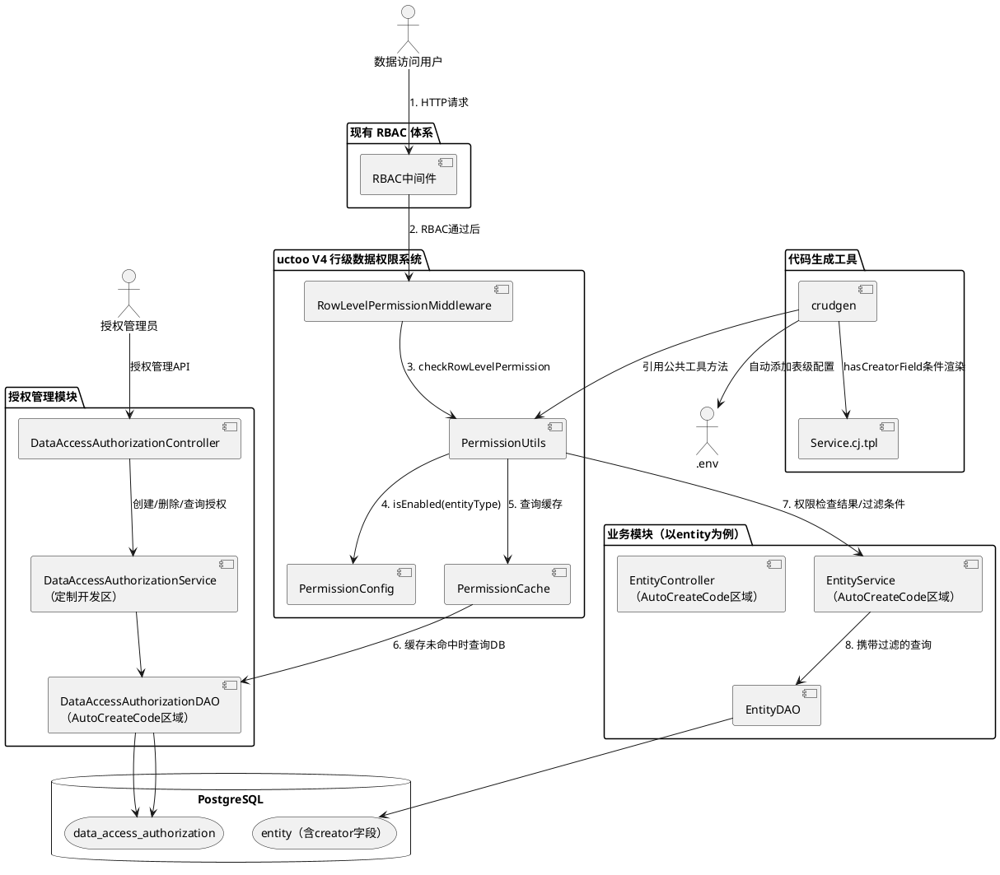
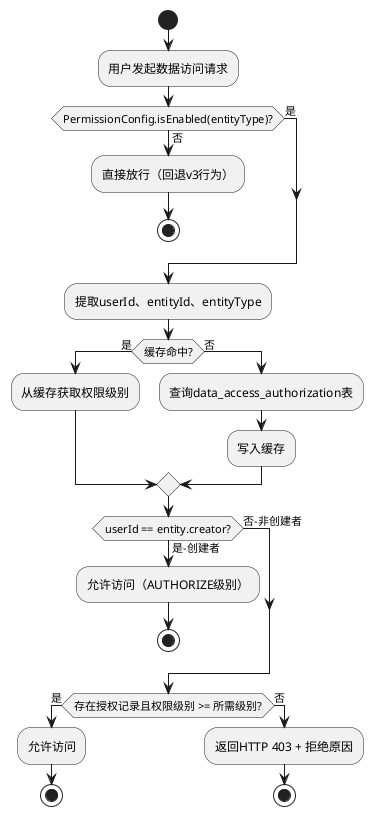

# **1. 实现模型**

## **1.1 上下文视图**

行级数据权限系统在 uctoo V4 架构中作为 RBAC3 权限体系的第二层访问控制，位于 RBAC 中间件之后、业务 Service 层之内执行。系统通过 `PermissionUtils` 公共工具类、`PermissionConfig` 配置管理、`PermissionCache` 缓存机制三大核心组件，为所有含 `creator` 字段的业务表提供统一的行级权限检查与过滤能力。



### **1.1.1 权限检查决策流程**



## **1.2 服务/组件总体架构**

### **1.2.1 核心新增组件**

| 组件 | 文件路径 | 职责 | 需求映射 |
|------|---------|------|---------|
| **PermissionLevel** | `src/app/core/PermissionLevel.cj` | 权限级别枚举（READ=1, WRITE=2, AUTHORIZE=3）及继承关系判断 | RLP-001, RLP-002 |
| **PermissionConfig** | `src/app/core/PermissionConfig.cj` | 行级权限配置管理：全局开关、表级开关、缓存TTL、热加载 | RLP-019~RLP-023, RLP-021a |
| **PermissionCache** | `src/app/core/PermissionCache.cj` | 权限缓存：TTL过期、Mutex并发安全、LRU淘汰、缓存一致性 | RLP-024~RLP-028 |
| **PermissionUtils** | `src/app/utils/PermissionUtils.cj` | 公共权限工具：权限检查、过滤条件生成、自动授权、批量检查 | RLP-002~RLP-013, RLP-041~RLP-043, RLP-048, RLP-058, RLP-059 |

### **1.2.2 现有组件修改**

| 组件 | 文件路径 | 修改区域 | 修改内容 | 需求映射 |
|------|---------|---------|---------|---------|
| **DataAccessAuthorizationDAO** | `src/app/dao/uctoo/DataAccessAuthorizationDAO.cj` | AutoCreateCode区域 | 新增4个标准化权限查询方法（每个表都需要的通用查询支持） | RLP-053 |
| **DataAccessAuthorizationService** | `src/app/services/uctoo/DataAccessAuthorizationService.cj` | 头部引入区+尾部定制开发区 | 新增授权管理业务方法（data_access_authorization表专属） | RLP-014~RLP-018 |
| **DataAccessAuthorizationController** | `src/app/controllers/uctoo/data_access_authorization/DataAccessAuthorizationController.cj` | 头部引入区+尾部定制开发区 | 新增授权管理API端点（data_access_authorization表专属） | RLP-014~RLP-018 |
| **DataAccessAuthorizationRoute** | `src/app/routes/uctoo/data_access_authorization/DataAccessAuthorizationRoute.cj` | `registerCustomRoutes()` | 注册授权管理定制路由 | RLP-014~RLP-018 |
| **RowLevelPermissionMiddleware** | `src/app/middlewares/permission/PermissionMiddleware.cj` | 现有方法实现 | 实现checkRowLevelPermission完整逻辑 | RLP-029~RLP-034 |
| **PermissionMiddleware** | `src/app/middlewares/permission/PermissionMiddleware.cj` | PermissionLevel枚举 | 关联到core/PermissionLevel.cj | RLP-001 |

### **1.2.3 业务模块集成（以entity为例）**

| 组件 | 文件路径 | 修改区域 | 修改内容 | 需求映射 |
|------|---------|---------|---------|---------|
| **EntityService** | `src/app/services/uctoo/EntityService.cj` | 头部引入区+AutoCreateCode区域 | 行级权限集成调用（标准化WithPermission方法） | RLP-035~RLP-040, RLP-049~RLP-052 |
| **EntityController** | `src/app/controllers/uctoo/entity/EntityController.cj` | 头部引入区+AutoCreateCode区域 | 标准化权限调用（调用WithPermission方法） | RLP-054 |
| **EntityRoute** | `src/app/routes/uctoo/entity/EntityRoute.cj` | `registerCustomRoutes()` | 注册行级权限中间件 | RLP-029, RLP-054 |

## **1.3 实现设计文档**

### **1.3.1 PermissionLevel — 权限级别枚举**

**文件路径**：`src/app/core/PermissionLevel.cj`（新增）

**职责**：定义行级权限级别枚举及权限继承关系判断，作为系统全局唯一的权限级别定义源。

**设计要点**：
- 枚举值 READ=1, WRITE=2, AUTHORIZE=3，整数值用于数据库存储和比较
- `hasPermission()` 方法实现权限继承判断（AUTHORIZE > WRITE > READ）
- `fromInt32()` 方法实现整数到枚举的双向映射
- 与现有 `PermissionMiddleware.cj` 中的同名枚举合并，将 PermissionMiddleware 中的枚举改为引用 `core.PermissionLevel`

**核心接口**：

```cangjie
public enum PermissionLevel {
    | READ       // 可读 = 1
    | WRITE      // 可写 = 2
    | AUTHORIZE  // 可授权 = 3

    // 获取整数值
    public func value(): Int32

    // 枚举名称
    public func toString(): String

    // 从整数构建
    public static func fromInt32(v: Int32): Option<PermissionLevel>
}

// 权限继承判断：userPermission >= requiredPermission
public func hasPermission(userPermission: PermissionLevel, required: PermissionLevel): Bool
```

**需求映射**：RLP-001（三级权限定义）、RLP-002（权限继承关系）

---

### **1.3.2 PermissionConfig — 配置管理**

**文件路径**：`src/app/core/PermissionConfig.cj`（新增）

**职责**：管理行级权限的全局开关、表级开关、缓存TTL配置，支持环境变量热加载。

**设计要点**：
- 全局开关 `ROW_LEVEL_PERMISSION_ENABLED`：默认 true
- 表级开关 `ROW_LEVEL_PERMISSION_<表名>`：优先级高于全局开关
- 缓存TTL `PERMISSION_CACHE_TTL`：默认 300秒
- 每次请求时重新读取环境变量（热加载），或设置配置刷新间隔
- 含 creator 字段的表默认开启（`ROW_LEVEL_PERMISSION_<表名>=true`）

**核心接口**：

```cangjie
public class PermissionConfig {
    // 全局行级权限开关
    public static func isRowLevelPermissionEnabled(): Bool

    // 表级行级权限开关（表级优先 > 全局）
    public static func isRowLevelPermissionEnabledForTable(entityType: String): Bool

    // 缓存TTL（秒）
    public static func getPermissionCacheTTL(): Int64

    // 缓存条目上限
    public static func getPermissionCacheMaxSize(): Int64

    // 刷新配置（从环境变量重新读取）
    public static func refreshConfig(): Unit
}
```

**配置优先级决策**：

```
表级配置 ROW_LEVEL_PERMISSION_<表名>
  ├─ 已配置为 true → 该表启用行级权限
  ├─ 已配置为 false → 该表禁用行级权限
  └─ 未配置 → 使用全局配置 ROW_LEVEL_PERMISSION_ENABLED
```

**需求映射**：RLP-019~RLP-023, RLP-021a

---

### **1.3.3 PermissionCache — 缓存机制**

**文件路径**：`src/app/core/PermissionCache.cj`（新增）

**职责**：提供行级权限的内存缓存，支持TTL过期、Mutex并发安全、LRU淘汰、缓存失效。

**设计要点**：
- 缓存键：`userId:entityType:entityId` → 权限级别
- 缓存键（列表过滤）：`userId:entityType:filter` → 授权ID集合
- 使用 `Mutex` 保护缓存的 `HashMap` 读写
- TTL 到期自动失效，查询时检查
- 授权变更时主动失效相关条目
- 缓存条目上限（默认10000），超限时淘汰最早条目
- 安全优先：缓存不可用时拒绝访问

**核心接口**：

```cangjie
public class PermissionCache {
    // 缓存条目结构
    // key: "userId:entityType:entityId", value: (permission: Int32, createdAt: Int64)

    // 查询缓存
    public static func get(userId: String, entityType: String, entityId: String): Option<Int32>

    // 写入缓存
    public static func put(userId: String, entityType: String, entityId: String, permission: Int32): Unit

    // 查询过滤缓存（用户对某entityType的授权ID列表）
    public static func getFilterCache(userId: String, entityType: String): Option<ArrayList<String>>

    // 写入过滤缓存
    public static func putFilterCache(userId: String, entityType: String, entityIds: ArrayList<String>): Unit

    // 使指定用户对指定实体的缓存失效
    public static func invalidate(userId: String, entityType: String, entityId: String): Unit

    // 使指定用户对指定entityType的所有缓存失效
    public static func invalidateByUserAndEntityType(userId: String, entityType: String): Unit

    // 使指定实体的所有用户缓存失效
    public static func invalidateByEntity(entityType: String, entityId: String): Unit

    // 清空所有缓存
    public static func clearAll(): Unit
}
```

**需求映射**：RLP-024~RLP-028

---

### **1.3.4 PermissionUtils — 公共权限工具**

**文件路径**：`src/app/utils/PermissionUtils.cj`（新增）

**职责**：提供行级权限检查、过滤条件生成、自动授权、批量检查等公共方法，所有Service通过调用此工具类集成行级权限，支持任意表名参数化。

**设计要点**：
- 所有方法接受 `entityType` 参数，禁止硬编码表名
- 先检查 `PermissionConfig.isRowLevelPermissionEnabledForTable(entityType)`，未启用直接放行
- 权限检查流程：缓存 → 创建者判断 → 授权记录查询 → 权限级别比较
- 过滤条件生成使用参数化查询，防止SQL注入
- 自动授权在数据创建成功后异步执行，失败仅记录日志不回滚
- 批量检查上限100个entityId

**核心接口**：

```cangjie
public class PermissionUtils {
    // ========== 权限检查 ==========

    // 检查用户对指定实体的READ权限
    public static func checkReadPermission(
        userId: String, entityId: String, entityType: String
    ): (Bool, String)

    // 检查用户对指定实体的WRITE权限
    public static func checkWritePermission(
        userId: String, entityId: String, entityType: String
    ): (Bool, String)

    // 检查用户对指定实体的AUTHORIZE权限
    public static func checkAuthorizePermission(
        userId: String, entityId: String, entityType: String
    ): (Bool, String)

    // 通用权限检查方法
    public static func checkUserHasPermission(
        userId: String, entityType: String, entityId: String,
        requiredPermission: PermissionLevel
    ): (Bool, String)

    // ========== 权限过滤 ==========

    // 生成行级权限过滤条件（返回WHERE子句和参数列表）
    public static func appendPermissionFilter(
        userId: String, entityType: String
    ): (String, ArrayList<String>)

    // 获取用户有权限的实体ID列表
    public static func getUserAuthorizedEntityIds(
        userId: String, entityType: String,
        requiredPermission: PermissionLevel
    ): ArrayList<String>

    // ========== 自动授权 ==========

    // 为数据创建者自动授予AUTHORIZE权限
    public static func autoGrantCreatorPermission(
        userId: String, entityId: String, entityType: String
    ): Bool

    // ========== 批量检查 ==========

    // 批量权限检查（上限100个）
    public static func batchCheckUserHasPermission(
        userId: String, entityType: String,
        entityIds: ArrayList<String>,
        requiredPermission: PermissionLevel
    ): HashMap<String, Bool>

    // ========== 授权管理 ==========

    // 创建数据访问授权（含授权者权限验证）
    public static func createDataAccessRule(
        entityType: String, entityId: String,
        userId: String, permission: PermissionLevel,
        authorizerId: String
    ): (Bool, String)

    // 删除数据访问授权
    public static func deleteDataAccessRule(
        authId: String, operatorId: String,
        entityType: String, entityId: String
    ): (Bool, String)
}
```

**`checkUserHasPermission` 详细流程**：

1. 调用 `PermissionConfig.isRowLevelPermissionEnabledForTable(entityType)` → 未启用返回 `(true, "")`
2. 调用 `PermissionCache.get(userId, entityType, entityId)` → 缓存命中且未过期则直接比较
3. 查询目标表检查 `creator == userId` → 创建者返回 `(true, "")`
4. 调用 `DataAccessAuthorizationDAO.findByUserIdAndEntityTypeAndEntityId()` 查询授权记录
5. 遍历授权记录，`hasPermission(userPermission, requiredPermission)` 判断权限继承
6. 写入缓存 `PermissionCache.put()`
7. 记录审计日志

**`appendPermissionFilter` 详细流程**：

1. 检查表级配置是否启用
2. 查询缓存 `PermissionCache.getFilterCache(userId, entityType)`
3. 缓存未命中：调用 DAO 查询用户授权记录 + creator 为 userId 的数据ID
4. 合并授权ID集合，写入缓存
5. 生成参数化 WHERE 条件：`(creator = ? OR id IN (?, ?, ...))`
6. 空权限时返回 `(1=0, [])` 确保空结果集

**需求映射**：RLP-002~RLP-013, RLP-041~RLP-043, RLP-044, RLP-047, RLP-048, RLP-058, RLP-059

---

### **1.3.5 DataAccessAuthorizationDAO — DAO层扩展**

**文件路径**：`src/app/dao/uctoo/DataAccessAuthorizationDAO.cj`（修改AutoCreateCode区域）

**修改区域**：`//#region AutoCreateCode` 与 `//#endregion AutoCreateCode` 之间的自动生成代码区域（权限查询方法是每个表都需要的通用查询支持，由crudgen模板生成）

**新增方法**：

```cangjie
// ========== 行级权限专用查询方法 ==========

// 根据用户ID、实体类型和实体ID精确查询有效授权记录
func findAuthByUserIdAndEntityTypeAndEntityId(
    userId: String, entityType: String, entityId: String
): ArrayList<DataAccessAuthorizationPO>

// 根据用户ID、实体类型查询权限级别 >= 指定值的有效授权记录
func findAuthByUserIdAndEntityTypeAndPermissionGte(
    userId: String, entityType: String, minPermission: Int32
): ArrayList<DataAccessAuthorizationPO>

// 根据实体类型和实体ID查询所有有效授权记录
func findAuthByEntityTypeAndEntityId(
    entityType: String, entityId: String
): ArrayList<DataAccessAuthorizationPO>

// 根据用户ID和实体类型查询所有有效授权记录
func findAuthByUserIdAndEntityType(
    userId: String, entityType: String
): ArrayList<DataAccessAuthorizationPO>

// 批量查询：根据用户ID、实体类型和多个实体ID查询有效授权记录
func findAuthByUserIdAndEntityTypeAndEntityIds(
    userId: String, entityType: String, entityIds: ArrayList<String>
): ArrayList<DataAccessAuthorizationPO>
```

**SQL实现要点**：
- 所有查询均附加 `AND deleted_at IS NULL` 条件
- 使用 `executor.setSql()` + 参数化查询（`${arg()}`）
- `PermissionGte` 使用 `AND permission >= ${arg(minPermission)}`

**需求映射**：RLP-053

---

### **1.3.6 DataAccessAuthorizationService — Service层扩展**

**文件路径**：`src/app/services/uctoo/DataAccessAuthorizationService.cj`（修改头部引入区+尾部定制开发区）

**头部引入区新增**：

```cangjie
import magic.app.core.PermissionLevel
import magic.app.core.PermissionConfig
import magic.app.utils.PermissionUtils
import magic.app.core.PermissionCache
```

**尾部定制开发区新增方法**（data_access_authorization表专属的授权管理业务逻辑）：

```cangjie
// ========== 行级权限授权管理方法 ==========

// 创建数据访问授权（含完整业务规则校验）
public func createAuthorization(
    entityType: String, entityId: String,
    granteeId: String, permission: PermissionLevel,
    authorizerId: String
): APIResult<DataAccessAuthorizationPO>
// 业务规则：
// 1. 验证授权者拥有AUTHORIZE权限
// 2. 禁止自授权（granteeId == authorizerId → 400）
// 3. 禁止越权授权（授权者权限 < 授予权限 → 403）
// 4. 重复授权处理（已存在相同级别返回已有记录，更高级别存在返回409）
// 5. 创建成功后失效相关缓存

// 删除数据访问授权
public func deleteAuthorization(
    authId: String, operatorId: String
): APIResult<Bool>
// 业务规则：
// 1. 验证操作者拥有AUTHORIZE权限
// 2. 软删除授权记录
// 3. 失效相关缓存

// 查询实体的所有授权记录
public func getEntityAuthorizations(
    entityType: String, entityId: String,
    operatorId: String
): APIResult<ArrayList<DataAccessAuthorizationPO>>
// 业务规则：
// 1. 验证操作者拥有READ权限
// 2. 返回该实体的所有有效授权记录
```

**需求映射**：RLP-014~RLP-018

---

### **1.3.7 DataAccessAuthorizationController — Controller层扩展**

**文件路径**：`src/app/controllers/uctoo/data_access_authorization/DataAccessAuthorizationController.cj`（修改头部引入区+尾部定制开发区）

**尾部定制开发区新增API端点**（data_access_authorization表专属的授权管理API）：

```cangjie
// POST /api/v1/uctoo/data_access_authorization/authorize
// 创建数据访问授权
public func authorize(req: HttpRequest, res: HttpResponse): Unit

// POST /api/v1/uctoo/data_access_authorization/revoke
// 删除数据访问授权
public func revoke(req: HttpRequest, res: HttpResponse): Unit

// GET /api/v1/uctoo/data_access_authorization/:entityType/:entityId/authorizations
// 查询实体授权记录
public func getAuthorizations(req: HttpRequest, res: HttpResponse): Unit
```

**需求映射**：RLP-014~RLP-017

---

### **1.3.8 DataAccessAuthorizationRoute — Route层扩展**

**文件路径**：`src/app/routes/uctoo/data_access_authorization/DataAccessAuthorizationRoute.cj`（修改 `registerCustomRoutes()` 方法）

**`registerCustomRoutes()` 新增路由注册**：

```cangjie
// 授权管理定制路由
router.post("/api/v1/uctoo/data_access_authorization/authorize", controller.authorize)
router.post("/api/v1/uctoo/data_access_authorization/revoke", controller.revoke)
router.get("/api/v1/uctoo/data_access_authorization/:entityType/:entityId/authorizations", controller.getAuthorizations)
```

**需求映射**：RLP-014~RLP-017

---

### **1.3.9 RowLevelPermissionMiddleware — 中间件完整实现**

**文件路径**：`src/app/middlewares/permission/PermissionMiddleware.cj`（修改现有 `checkRowLevelPermission` 方法）

**修改要点**：
- 引入 `PermissionConfig`、`PermissionUtils`、`PermissionLevel`（从 `core` 包）
- `checkRowLevelPermission` 方法完整实现：配置检查 → HTTP方法判断 → 权限级别映射 → `PermissionUtils` 调用
- 全局开关关闭时直接放行（RLP-030）
- 表级未启用时直接放行（RLP-033）
- 异常时安全优先，拒绝请求（RLP-034）

**完整实现逻辑**：

```cangjie
private func checkRowLevelPermission(
    user: JWTPayload, tableName: String, entityId: String, level: PermissionLevel
): Bool {
    // 1. 检查全局开关
    if (!PermissionConfig.isRowLevelPermissionEnabled()) {
        return true  // RLP-030: 全局关闭直接放行
    }

    // 2. 检查表级开关
    if (!PermissionConfig.isRowLevelPermissionEnabledForTable(tableName)) {
        return true  // RLP-033: 表级未启用直接放行
    }

    // 3. 调用PermissionUtils进行权限检查
    let (hasPermission, reason) = PermissionUtils.checkUserHasPermission(
        user.userId, tableName, entityId, level
    )

    return hasPermission
}
```

**`handle` 方法增强**：根据 HTTP 方法自动映射权限级别

```cangjie
public func handle(req: HttpRequest, res: HttpResponse, next: () -> Unit) {
    // ... 认证检查 ...
    let method = req.method
    let entityId = req.pathParams.get("id")

    if (let Some(id) <- entityId) {
        let requiredLevel = match (method) {
            case "GET" => PermissionLevel.READ     // RLP-031
            case "PUT" | "DELETE" => PermissionLevel.WRITE  // RLP-032
            case _ => PermissionLevel.READ
        }

        if (!checkRowLevelPermission(p, tableName, id, requiredLevel)) {
            res.status(403).json(APIError("40302", "无权访问此数据").toJson())
            return
        }
    }

    next()
}
```

**需求映射**：RLP-029~RLP-034, RLP-044, RLP-046

---

### **1.3.10 EntityService — 行级权限集成示例**

**文件路径**：`src/app/services/uctoo/EntityService.cj`（修改头部引入区+AutoCreateCode区域）

**头部引入区新增**：

```cangjie
// ========== 自定义引入区域（在此区域添加自定义import，不会被覆盖）==========
import magic.app.core.PermissionLevel
import magic.app.core.PermissionConfig
import magic.app.utils.PermissionUtils
```

**AutoCreateCode区域内新增方法**（每个表都需要的标准化行级权限集成代码，由crudgen模板生成）：

```cangjie
// ========== 行级权限集成方法 ==========

// 创建实体（含自动授权）
public func createWithPermission(entity: EntityPO, creatorId: String): APIResult<EntityPO> {
    // 1. 执行标准创建逻辑（调用AutoCreateCode区域的create方法）
    let result = this.create(entity, creatorId)
    // 2. 创建成功后自动为创建者授予AUTHORIZE权限
    if (result.success) {
        if (let Some(data) <- result.data) {
            let grantResult = PermissionUtils.autoGrantCreatorPermission(
                creatorId, data.id, "entity"
            )
            if (!grantResult) {
                LogUtils.warn("EntityService", "自动授权失败: entityId=${data.id}, creatorId=${creatorId}")
                // 授权失败不影响数据创建结果
            }
        }
    }
    return result
}

// 查询实体（含READ权限检查）
public func getByIdWithPermission(entityId: String, userId: String): APIResult<EntityPO> {
    // 1. 检查行级READ权限
    let (hasPermission, reason) = PermissionUtils.checkReadPermission(userId, entityId, "entity")
    if (!hasPermission) {
        return APIResult<EntityPO>(false, reason)
    }
    // 2. 执行标准查询
    return this.getById(entityId)
}

// 查询实体列表（含权限过滤）
public func getListWithPermission(page: Int32, pageSize: Int32, sort: String, filter: String, userId: String): (ArrayList<EntityPO>, Int64) {
    // 1. 生成行级权限过滤条件
    let (permWhereClause, permParams) = PermissionUtils.appendPermissionFilter(userId, "entity")
    // 2. 合并权限过滤到业务查询（附加WHERE条件）
    // ... 与现有 getListWithFilter 集成
}

// 更新实体（含WRITE权限检查）
public func updateWithPermission(entityId: String, entity: EntityPO, userId: String): APIResult<EntityPO> {
    // 1. 检查行级WRITE权限
    let (hasPermission, reason) = PermissionUtils.checkWritePermission(userId, entityId, "entity")
    if (!hasPermission) {
        return APIResult<EntityPO>(false, reason)
    }
    // 2. 执行标准更新
    return this.update(entityId, entity)
}

// 删除实体（含WRITE权限检查）
public func deleteWithPermission(entityId: String, force: Bool, userId: String): APIResult<Bool> {
    // 1. 检查行级WRITE权限
    let (hasPermission, reason) = PermissionUtils.checkWritePermission(userId, entityId, "entity")
    if (!hasPermission) {
        return APIResult<Bool>(false, reason)
    }
    // 2. 执行标准删除
    return this.delete(entityId, force)
}
```

**权限调用模式总结**（RLP-049~RLP-052标准化）：

| 操作 | 权限调用模式 | 对应需求 |
|------|------------|---------|
| create | `PermissionUtils.autoGrantCreatorPermission(userId, entityId, entityType)` | RLP-039, RLP-052 |
| getById | `PermissionUtils.checkReadPermission(userId, entityId, entityType)` | RLP-035, RLP-049 |
| getList | `PermissionUtils.appendPermissionFilter(userId, entityType)` | RLP-036, RLP-051 |
| update | `PermissionUtils.checkWritePermission(userId, entityId, entityType)` | RLP-037, RLP-050 |
| delete | `PermissionUtils.checkWritePermission(userId, entityId, entityType)` | RLP-038, RLP-050 |

---

### **1.3.11 EntityController — Controller层集成示例**

**文件路径**：`src/app/controllers/uctoo/entity/EntityController.cj`（修改头部引入区+AutoCreateCode区域）

**头部引入区新增**：

```cangjie
import magic.app.core.PermissionLevel
import magic.app.utils.PermissionUtils
```

**AutoCreateCode区域内新增/修改方法**（每个表都需要的标准化权限调用代码，由crudgen模板生成）：

Controller层通过调用Service层的 `WithPermission` 后缀方法集成行级权限，而非在Controller层直接调用PermissionUtils。这符合分层架构原则，且便于crudgen模板生成。

```cangjie
// getById 端点：调用 getByIdWithPermission
// create 端点：调用 createWithPermission
// update 端点：调用 updateWithPermission
// delete 端点：调用 deleteWithPermission
// getList 端点：调用 getListWithPermission
```

**需求映射**：RLP-054

---

### **1.3.12 crudgen模板化方案**

**目标**：将行级权限集成代码抽象为可被crudgen工具提取和复用的通用模板。

#### **1.3.12.1 creator字段检测机制**

crudgen 在生成模块时执行以下检测流程：

1. 读取 `db_info` 表元数据，获取目标表的字段列表
2. 检查字段列表中是否包含 `creator` 字段
3. 设置模板变量 `hasCreatorField = true/false`

#### **1.3.12.2 Service模板扩展（Service.cj.tpl）**

当 `hasCreatorField = true` 时，模板生成以下代码：

**头部引入区生成**：

```
// ========== 自定义引入区域（在此区域添加自定义import，不会被覆盖）==========
import magic.app.core.PermissionLevel
import magic.app.core.PermissionConfig
import magic.app.utils.PermissionUtils
```

**AutoCreateCode区域内生成**（标准化行级权限集成方法，每个表都需要的代码，由crudgen模板生成。`{{TableName}}` 和 `{{tableName}}` 为模板变量）：

```cangjie
// ========== 行级权限集成方法 ==========

public func createWithPermission(entity: {{TableName}}PO, creatorId: String): APIResult<{{TableName}}PO> {
    let result = this.create(entity, creatorId)
    if (result.success) {
        if (let Some(data) <- result.data) {
            let grantResult = PermissionUtils.autoGrantCreatorPermission(
                creatorId, data.id, "{{tableName}}"
            )
            if (!grantResult) {
                LogUtils.warn("{{TableName}}Service", "自动授权失败: entityId=${data.id}, creatorId=${creatorId}")
            }
        }
    }
    return result
}

public func getByIdWithPermission(entityId: String, userId: String): APIResult<{{TableName}}PO> {
    let (hasPermission, reason) = PermissionUtils.checkReadPermission(userId, entityId, "{{tableName}}")
    if (!hasPermission) {
        return APIResult<{{TableName}}PO>(false, reason)
    }
    return this.getById(entityId)
}

public func getListWithPermission(page: Int32, pageSize: Int32, sort: String, filter: String, userId: String): (ArrayList<{{TableName}}PO>, Int64) {
    let (permWhereClause, permParams) = PermissionUtils.appendPermissionFilter(userId, "{{tableName}}")
    // ... 与现有 getListWithFilter 集成
}

public func updateWithPermission(entityId: String, entity: {{TableName}}PO, userId: String): APIResult<{{TableName}}PO> {
    let (hasPermission, reason) = PermissionUtils.checkWritePermission(userId, entityId, "{{tableName}}")
    if (!hasPermission) {
        return APIResult<{{TableName}}PO>(false, reason)
    }
    return this.update(entityId, entity)
}

public func deleteWithPermission(entityId: String, force: Bool, userId: String): APIResult<Bool> {
    let (hasPermission, reason) = PermissionUtils.checkWritePermission(userId, entityId, "{{tableName}}")
    if (!hasPermission) {
        return APIResult<Bool>(false, reason)
    }
    return this.delete(entityId, force)
}
```

#### **1.3.12.3 DAO模板扩展（DAO.cj.tpl）**

当目标表为 `data_access_authorization` 时，在AutoCreateCode区域内生成标准化权限查询方法（见1.3.5节）。这些权限查询方法是每个表都需要的通用查询支持，属于自动生成代码的一部分。

#### **1.3.12.4 .env自动配置方案**

crudgen 在生成含 creator 字段的表的模块时，执行 `.env` 配置自动添加：

1. 读取项目 `.env` 文件
2. 检查是否已存在 `ROW_LEVEL_PERMISSION_<表名>=` 配置项
3. 若已存在，跳过（RLP-064）
4. 若不存在，查找 `.env` 中的行级权限配置区块（以 `# Row Level Permission Config` 注释标记）
5. 若配置区块存在，在区块末尾追加 `ROW_LEVEL_PERMISSION_<表名>=true`
6. 若配置区块不存在，在 `.env` 文件末尾新增区块并添加配置（RLP-065）
7. 生成配置区块格式：

```env
# ========== Row Level Permission Config ==========
ROW_LEVEL_PERMISSION_ENABLED=true
PERMISSION_CACHE_TTL=300
ROW_LEVEL_PERMISSION_entity=true
ROW_LEVEL_PERMISSION_<其他表名>=true
# ========== End Row Level Permission Config ==========
```

**需求映射**：RLP-055~RLP-065

---

### **1.3.13 PermissionConstants — 权限常量扩展**

**文件路径**：`src/app/constants/PermissionConstants.cj`（修改）

**新增常量**：

```cangjie
// ========== 行级数据权限API (type=3) ==========
public static let DATA_ACCESS_AUTHORIZATION_API = "/api/v1/uctoo/data_access_authorization"
public static let DATA_ACCESS_AUTHORIZATION_AUTHORIZE_API = "/api/v1/uctoo/data_access_authorization/authorize"
public static let DATA_ACCESS_AUTHORIZATION_REVOKE_API = "/api/v1/uctoo/data_access_authorization/revoke"
public static let DATA_ACCESS_AUTHORIZATION_LIST_API = "/api/v1/uctoo/data_access_authorization/:entityType/:entityId/authorizations"

// ========== 行级数据权限菜单 (type=1) ==========
public static let DATA_ACCESS_AUTHORIZATION_MENU = "database.uctoo.data_access_authorization"

// ========== 行级数据权限按钮 (type=2) ==========
public static let DATA_ACCESS_AUTHORIZATION_GRANT_BUTTON = "button.dataAccessAuthorization.grant"
public static let DATA_ACCESS_AUTHORIZATION_REVOKE_BUTTON = "button.dataAccessAuthorization.revoke"
public static let DATA_ACCESS_AUTHORIZATION_VIEW_BUTTON = "button.dataAccessAuthorization.view"
```

# **2. 接口设计**

## **2.1 总体设计**

### **2.1.1 接口分层架构**

行级权限系统的接口设计遵循 uctoo V4 的分层架构：

```
HTTP API (Controller层)
    ↓
业务逻辑 (Service层AutoCreateCode区域 - 标准化权限调用)
    ↓
权限工具 (PermissionUtils公共方法)
    ↓
数据访问 (DataAccessAuthorizationDAO AutoCreateCode区域 - 标准化权限查询)
    ↓
数据库 (data_access_authorization表)
```

### **2.1.2 接口分类**

| 接口类别 | 调用方 | 说明 |
|---------|--------|------|
| 授权管理API | 前端/第三方 | 创建、删除、查询授权记录的HTTP端点 |
| 权限检查内部接口 | Service层 | PermissionUtils提供的权限检查方法 |
| 权限过滤内部接口 | Service层 | PermissionUtils提供的过滤条件生成方法 |
| 自动授权内部接口 | Service层 | 创建数据后自动授权 |
| 配置管理内部接口 | PermissionConfig | 配置读取和热加载 |
| 缓存内部接口 | PermissionCache | 缓存读写和失效 |

## **2.2 接口清单**

### **2.2.1 授权管理HTTP API**

#### **POST /api/v1/uctoo/data_access_authorization/authorize**

创建数据访问授权

**请求体**：

| 字段 | 类型 | 必填 | 说明 |
|------|------|------|------|
| entity_type | String | 是 | 实体类型（表名），最大50字符 |
| entity_id | String | 是 | 实体ID |
| user_id | String | 是 | 被授权用户ID |
| permission | Int32 | 是 | 权限级别：1=READ, 2=WRITE, 3=AUTHORIZE |

**响应**：

| 状态码 | 场景 | 响应体 |
|--------|------|--------|
| 200 | 授权成功 | `{"errno":"0","errmsg":"success","data":{授权记录}}` |
| 400 | 自授权/参数错误 | `{"errno":"40001","errmsg":"不允许自授权"}` |
| 403 | 授权者权限不足 | `{"errno":"40302","errmsg":"授权者权限不足，无法授予该级别的权限"}` |
| 409 | 已存在更高级别授权 | `{"errno":"40901","errmsg":"已存在更高级别授权"}` |

**需求映射**：RLP-003, RLP-009, RLP-014, RLP-016, RLP-018

---

#### **POST /api/v1/uctoo/data_access_authorization/revoke**

删除数据访问授权

**请求体**：

| 字段 | 类型 | 必填 | 说明 |
|------|------|------|------|
| id | String | 是 | 授权记录ID |

**响应**：

| 状态码 | 场景 | 响应体 |
|--------|------|--------|
| 200 | 删除成功 | `{"errno":"0","errmsg":"success"}` |
| 403 | 操作者权限不足 | `{"errno":"40302","errmsg":"无授权权限"}` |
| 404 | 记录不存在 | `{"errno":"40401","errmsg":"授权记录不存在"}` |

**需求映射**：RLP-015

---

#### **GET /api/v1/uctoo/data_access_authorization/:entityType/:entityId/authorizations**

查询实体授权记录

**路径参数**：

| 参数 | 类型 | 说明 |
|------|------|------|
| entityType | String | 实体类型（表名） |
| entityId | String | 实体ID |

**响应**：

| 状态码 | 场景 | 响应体 |
|--------|------|--------|
| 200 | 查询成功 | `{"errno":"0","errmsg":"success","data":[授权记录列表]}` |
| 403 | 无READ权限 | `{"errno":"40302","errmsg":"无权查看此数据的授权记录"}` |

**需求映射**：RLP-017

---

### **2.2.2 内部接口（PermissionUtils）**

#### **checkReadPermission(userId, entityId, entityType) → (Bool, String)**

检查用户对指定实体的READ权限。

| 参数 | 类型 | 说明 |
|------|------|------|
| userId | String | 当前用户ID |
| entityId | String | 目标实体ID |
| entityType | String | 实体类型（表名），参数化 |
| **返回** | **(Bool, String)** | **(是否有权限, 拒绝原因)** |

**需求映射**：RLP-006, RLP-049

---

#### **checkWritePermission(userId, entityId, entityType) → (Bool, String)**

检查用户对指定实体的WRITE权限。

**需求映射**：RLP-008, RLP-050

---

#### **checkAuthorizePermission(userId, entityId, entityType) → (Bool, String)**

检查用户对指定实体的AUTHORIZE权限。

**需求映射**：RLP-009

---

#### **appendPermissionFilter(userId, entityType) → (String, ArrayList<String>)**

生成行级权限过滤条件，返回WHERE子句和参数列表。

| 参数 | 类型 | 说明 |
|------|------|------|
| userId | String | 当前用户ID |
| entityType | String | 实体类型（表名），参数化 |
| **返回** | **(String, ArrayList<String>)** | **(WHERE条件, 参数列表)** |

**返回值说明**：
- 有授权记录：`("(creator = ? OR id IN (?, ?, ...))", [userId, id1, id2, ...])`
- 仅创建者数据：`("creator = ?", [userId])`
- 无任何权限：`("1=0", [])`（确保空结果集）
- 表级未启用：`("1=1", [])`（不添加过滤）

**需求映射**：RLP-007, RLP-010~RLP-013, RLP-051

---

#### **autoGrantCreatorPermission(userId, entityId, entityType) → Bool**

为数据创建者自动授予AUTHORIZE权限。

**需求映射**：RLP-005, RLP-039, RLP-052

---

#### **batchCheckUserHasPermission(userId, entityType, entityIds, level) → HashMap<String, Bool>**

批量权限检查，上限100个entityId。

| 参数 | 类型 | 说明 |
|------|------|------|
| userId | String | 当前用户ID |
| entityType | String | 实体类型 |
| entityIds | ArrayList<String> | 实体ID列表，上限100 |
| level | PermissionLevel | 所需权限级别 |
| **返回** | **HashMap<String, Bool>** | **entityId → 是否有权限** |

**需求映射**：RLP-041~RLP-043

---

### **2.2.3 配置接口（PermissionConfig）**

| 方法 | 签名 | 说明 |
|------|------|------|
| isRowLevelPermissionEnabled | `static func () → Bool` | 全局开关 |
| isRowLevelPermissionEnabledForTable | `static func (entityType: String) → Bool` | 表级开关（优先级>全局） |
| getPermissionCacheTTL | `static func () → Int64` | 缓存TTL（秒），默认300 |
| getPermissionCacheMaxSize | `static func () → Int64` | 缓存条目上限，默认10000 |
| refreshConfig | `static func () → Unit` | 刷新配置 |

---

### **2.2.4 缓存接口（PermissionCache）**

| 方法 | 签名 | 说明 |
|------|------|------|
| get | `static func (userId, entityType, entityId) → Option<Int32>` | 查询权限缓存 |
| put | `static func (userId, entityType, entityId, permission) → Unit` | 写入权限缓存 |
| getFilterCache | `static func (userId, entityType) → Option<ArrayList<String>>` | 查询过滤缓存 |
| putFilterCache | `static func (userId, entityType, entityIds) → Unit` | 写入过滤缓存 |
| invalidate | `static func (userId, entityType, entityId) → Unit` | 失效指定条目 |
| invalidateByUserAndEntityType | `static func (userId, entityType) → Unit` | 失效用户+类型 |
| invalidateByEntity | `static func (entityType, entityId) → Unit` | 失效实体所有用户 |
| clearAll | `static func () → Unit` | 清空所有缓存 |

# **4. 数据模型**

## **4.1 设计目标**

1. **最小化新增**：核心新增4个文件（PermissionLevel、PermissionConfig、PermissionCache、PermissionUtils），其余为现有文件修改
2. **参数化设计**：所有方法支持 `entityType` 参数，同一套代码服务于所有含creator字段的表
3. **分层放置策略**：每个表都需要的标准化权限检查调用代码放置在AutoCreateCode区域内（由crudgen模板生成），仅特定表专属的业务逻辑放置在定制开发区域，自定义import放置在头部引入区，公共组件放置在独立公共文件
4. **缓存一致性**：授权变更时主动失效缓存，TTL兜底保证最终一致性

## **4.2 模型实现**

### **4.2.1 新增文件清单**

| 文件路径 | 类型 | 说明 |
|---------|------|------|
| `src/app/core/PermissionLevel.cj` | 新增 | 权限级别枚举 |
| `src/app/core/PermissionConfig.cj` | 新增 | 配置管理 |
| `src/app/core/PermissionCache.cj` | 新增 | 缓存机制 |
| `src/app/utils/PermissionUtils.cj` | 新增 | 公共权限工具 |

### **4.2.2 现有文件修改清单**

| 文件路径 | 修改区域 | 新增内容 |
|---------|---------|---------|
| `src/app/middlewares/permission/PermissionMiddleware.cj` | PermissionLevel枚举+checkRowLevelPermission方法 | 关联core/PermissionLevel，实现完整检查逻辑 |
| `src/app/dao/uctoo/DataAccessAuthorizationDAO.cj` | AutoCreateCode区域 | 5个标准化权限查询方法（每个表都需要的通用查询支持） |
| `src/app/services/uctoo/DataAccessAuthorizationService.cj` | 头部引入区+尾部定制开发区 | 授权管理业务方法（data_access_authorization表专属） |
| `src/app/controllers/uctoo/data_access_authorization/DataAccessAuthorizationController.cj` | 头部引入区+尾部定制开发区 | 授权管理API端点（data_access_authorization表专属） |
| `src/app/routes/uctoo/data_access_authorization/DataAccessAuthorizationRoute.cj` | registerCustomRoutes() | 授权管理路由注册 |
| `src/app/constants/PermissionConstants.cj` | 类体 | 行级权限常量 |
| `src/app/services/uctoo/EntityService.cj` | 头部引入区+AutoCreateCode区域 | 行级权限集成（标准化WithPermission方法，示例） |
| `src/app/controllers/uctoo/entity/EntityController.cj` | 头部引入区+AutoCreateCode区域 | 标准化权限调用（调用WithPermission方法，示例） |
| `src/app/routes/uctoo/entity/EntityRoute.cj` | registerCustomRoutes() | 行级权限中间件注册（示例） |

### **4.2.3 crudgen模板修改清单**

| 模板文件 | 修改内容 |
|---------|---------|
| `Service.cj.tpl` | 新增 `{{#if hasCreatorField}}` 条件块：头部引入区生成权限import，AutoCreateCode区域内生成标准化权限集成方法（WithPermission方法） |
| `DAO.cj.tpl` | 目标表为data_access_authorization时，AutoCreateCode区域内生成标准化权限查询方法 |
| `CrudGenerator.cj` | 新增creator字段检测逻辑；新增.env配置自动添加逻辑 |

### **4.2.4 .env配置清单**

```env
# ========== Row Level Permission Config ==========
ROW_LEVEL_PERMISSION_ENABLED=true
PERMISSION_CACHE_TTL=300
PERMISSION_CACHE_MAX_SIZE=10000
# 表级配置（含creator字段的表默认开启）
ROW_LEVEL_PERMISSION_entity=true
ROW_LEVEL_PERMISSION_data_access_authorization=true
# ... 其他表由crudgen自动添加
# ========== End Row Level Permission Config ==========
```

### **4.2.5 需求到组件完整映射**

| 需求范围 | 需求ID | 映射组件 |
|---------|--------|---------|
| 权限级别管理 | RLP-001, RLP-002 | PermissionLevel.cj |
| 权限级别管理 | RLP-003 | PermissionUtils.cj - createDataAccessRule |
| 权限检查 | RLP-004~RLP-009 | PermissionUtils.cj |
| 权限过滤 | RLP-010~RLP-013 | PermissionUtils.cj - appendPermissionFilter |
| 授权管理 | RLP-014~RLP-018 | DataAccessAuthorizationService.cj, Controller, Route |
| 配置管理 | RLP-019~RLP-023 | PermissionConfig.cj |
| 缓存机制 | RLP-024~RLP-028 | PermissionCache.cj |
| 中间件集成 | RLP-029~RLP-034 | RowLevelPermissionMiddleware.cj |
| Service层集成 | RLP-035~RLP-040 | EntityService.cj AutoCreateCode区域（模板化） |
| 批量权限检查 | RLP-041~RLP-043 | PermissionUtils.cj - batchCheckUserHasPermission |
| 安全与兼容性 | RLP-044~RLP-047 | PermissionUtils.cj, RowLevelPermissionMiddleware.cj |
| 模板化集成 | RLP-048~RLP-059 | PermissionUtils.cj, crudgen模板 |
| 模板化集成 | RLP-060~RLP-065 | crudgen/CrudGenerator.cj, Service.cj.tpl |
