# 行级数据权限系统需求规格

# **1. 组件定位**

## **1.1 核心职责**

本组件负责在 RBAC3 权限体系基础上实现行级数据权限控制，确保用户只能访问其被明确授权的数据行。

## **1.2 核心输入**

1. 用户数据访问请求（查询、更新、删除操作，携带用户身份与目标实体信息）
2. 授权管理请求（创建授权、删除授权，携带授权者、被授权者、实体、权限级别）
3. 行级权限配置变更（环境变量：全局开关、表级开关、缓存TTL）
4. 数据创建事件（新数据行创建时，自动为创建者授予AUTHORIZE权限）

## **1.3 核心输出**

1. 权限检查结果（允许/拒绝，附带拒绝原因）
2. 数据查询过滤条件（WHERE子句，限制结果集为有权限的数据行）
3. 授权记录（创建/删除授权后返回的授权信息）
4. 权限拒绝响应（HTTP 403，附带具体拒绝原因）

## **1.4 职责边界**

1. 本组件不负责用户认证（Authentication），仅负责数据访问授权（Authorization）
2. 本组件不负责角色权限（RBAC），仅负责数据行级别的访问控制
3. 本组件不负责数据加密或脱敏
4. 本组件不负责权限的UI展示和交互，仅提供后端API和中间件能力
5. 本组件的行级权限代码采用分层放置策略：(a) 每个表都需要的标准化行级权限检查代码（Service层权限检查调用、Controller层权限调用、DAO层通用权限查询方法）放置在AutoCreateCode区域内（//#region AutoCreateCode ~ //#endregion AutoCreateCode），由crudgen模板统一生成；(b) 仅特定表专属的业务逻辑（如data_access_authorization表的授权管理API）放置在定制开发区域；(c) 自定义import引入语句添加在//#region AutoCreateCode之前的头部自定义引入区域；(d) PermissionUtils/PermissionConfig/PermissionCache等公共组件放置在独立的公共文件中

# **2. 领域术语**

**行级数据权限（Row-Level Permission）**
: 基于数据行粒度的访问控制机制，控制用户对特定数据行的读、写、授权操作能力。
: 备注：区别于RBAC的角色级权限，行级权限关注的是"哪些数据行"而非"哪些功能"。

**权限级别（Permission Level）**
: 数据访问授权的等级划分，包含可读(READ=1)、可写(WRITE=2)、可授权(AUTHORIZE=3)三个级别，权限继承关系为 AUTHORIZE > WRITE > READ。

**实体（Entity）**
: 行级权限控制的业务对象，由 entity_type（表名）和 entity_id（数据行主键）唯一标识。

**授权记录（Authorization Record）**
: data_access_authorization 表中的一条记录，表示某个用户对某个实体被授予了特定级别的权限。

**授权者（Authorizer）**
: 执行授权操作的用户，必须对目标实体拥有 AUTHORIZE(3) 级别权限才能进行授权。

**被授权者（Grantee）**
: 被授予权限的用户，即授权记录中的 user_id 对应的用户。

**权限过滤条件（Permission Filter）**
: 根据当前用户的权限记录自动生成的SQL WHERE子句条件，用于限制查询结果集仅包含用户有权限的数据行。

**数据创建者（Data Creator）**
: 数据行的创建者，自动获得该数据行的 AUTHORIZE(3) 级别权限。
: 备注：这是默认无权限原则的唯一例外——创建者天然拥有全部权限。

**定制开发区域（Custom Development Zone）**
: uctoo V4 采用两层保护机制，由 `//#region AutoCreateCode` 和 `//#endregion AutoCreateCode` 标记包围的自动生成代码区域，以及保护区外的定制开发区域组成。定制开发区域包含两个部分：
: 1. **头部自定义引入区域**：位于 `//#region AutoCreateCode` 之前，标识为 `// ========== 自定义引入区域（在此区域添加自定义import，不会被覆盖）==========`，用于添加自定义 import 引入语句
: 2. **尾部定制开发方法区域**：位于 `//#endregion AutoCreateCode` 之后，标识为 `// ========== 定制开发方法（在此区域添加自定义方法）==========`，用于添加自定义方法实现
: 各层支持情况：Model层仅支持头部引入区（字段变更时需整体更新）；DAO/Service/Controller/Route层同时支持头部引入区和尾部方法区；Route层的定制化路由应写在 `registerCustomRoutes()` 方法中
: **行级权限代码放置策略**：
: 1. **AutoCreateCode区域内**（每个表都需要的标准化代码，由crudgen模板生成）：Service层的权限检查调用代码（checkReadPermission/checkWritePermission/appendPermissionFilter/autoGrantCreatorPermission）、Controller层的标准化权限调用代码、DAO层为行级权限过滤提供的通用查询支持方法
: 2. **定制开发区域**（仅特定表专属的业务逻辑）：data_access_authorization表专属的授权管理API（createAuthorization/deleteAuthorization/getEntityAuthorizations）、特殊的权限规则或定制逻辑
: 3. **头部引入区**（AutoCreateCode之前）：自定义的权限相关import语句
: 4. **独立公共文件**（src/app/core/或src/app/utils/）：PermissionUtils、PermissionConfig、PermissionCache等公共组件

**代码生成工具（crudgen）**
: 位于 `src/app/tools/crudgen` 目录的确定性代码生成工具，以 uctoo 数据库 entity 表作为模板，生成标准 CRUD 模块（Model、DAO、Service、Controller、Route）。

**模板化（Templatization）**
: 将行级权限的集成代码抽象为可被 crudgen 工具提取和复用的通用模板，使得所有含 creator 字段的数据库表都能自动生成行级权限集成代码。

**公共工具方法（Shared Utility Method）**
: 放置在 `src/app/utils/` 或 `src/app/core/` 等公共包中的方法，可被所有业务模块复用，而非在每个 Service 中内联实现。

**权限调用模式（Permission Call Pattern）**
: Service 层集成行级权限的标准化调用方式，如 getById 中调用 PermissionUtils.checkReadPermission，update/delete 中调用 PermissionUtils.checkWritePermission，getList 中调用 PermissionUtils.appendPermissionFilter。

**creator字段检测（Creator Field Detection）**
: crudgen 工具通过检测数据库表是否包含 creator 字段，自动决定是否在生成的模块中包含行级权限集成代码。

# **3. 角色与边界**

## **3.1 核心角色**

- **数据访问用户**：需要访问业务数据的普通用户，受行级权限约束
- **数据创建者**：创建业务数据的用户，自动获得该数据的AUTHORIZE权限
- **授权管理员**：对数据拥有AUTHORIZE权限的用户，可将权限授予其他用户

## **3.2 外部系统**

- **RBAC权限系统**：已有的角色权限体系，行级权限在其之后执行，作为第二道访问控制
- **ORM框架（UCTOO V4 ORM）**：DAO层的 `@DAO interface` 模式，行级权限过滤条件需与ORM查询集成
- **HTTP路由层**：Controller/Route层，行级权限API需注册到现有路由体系
- **代码生成工具（crudgen）**：确定性代码生成工具，行级权限的集成代码需能被提取为模板，支持生成包含行级权限的其他数据库表的标准CRUD模块

## **3.3 交互上下文**

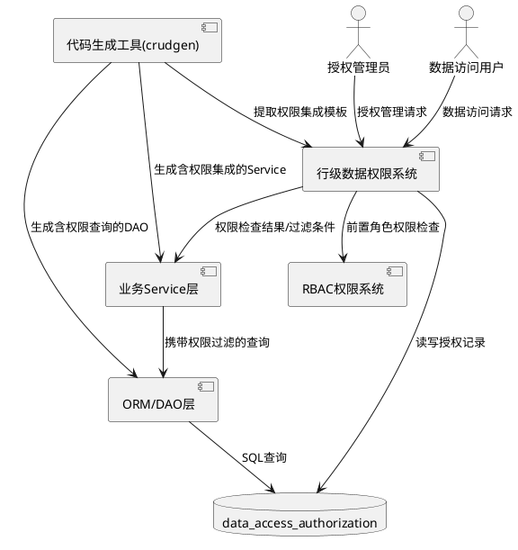

# **4. DFX约束**

## **4.1 性能**

1. 权限检查接口响应时间 ≤ 10ms（缓存命中时）
2. 权限过滤条件生成时间 ≤ 5ms
3. 权限缓存默认TTL为300秒，可通过环境变量配置
4. 单次批量权限检查支持最多100个实体ID

## **4.2 可靠性**

1. 缓存失效后必须能从数据库重新加载权限数据
2. 权限检查失败时必须返回明确的拒绝原因，不得静默放行
3. 授权操作的数据库写入与缓存更新必须保证最终一致性

## **4.3 安全性**

1. 默认无权限：未明确授权的数据，任何用户不可访问
2. 权限检查必须在数据访问之前执行，不可跳过
3. 授权操作必须验证授权者自身是否拥有AUTHORIZE权限
4. 禁止权限提升：被授权者不可获得高于授权者自身权限级别的授权
5. 行级权限全局开关关闭时（ROW_LEVEL_PERMISSION_ENABLED=false），不执行任何权限检查（回退到v3行为）

## **4.4 可维护性**

1. 自定义的权限相关import引入语句必须添加在各模块的 `//#region AutoCreateCode` 之前的头部自定义引入区域
2. 每个表都需要的标准化行级权限检查代码（Service层权限调用、Controller层权限调用、DAO层通用权限查询方法）必须放置在AutoCreateCode区域内（//#region AutoCreateCode ~ //#endregion AutoCreateCode），由crudgen模板统一生成
3. 仅特定表专属的业务逻辑（如data_access_authorization表的授权管理API）必须添加在各模块的 `//#endregion AutoCreateCode` 之后的尾部定制开发区域
4. 定制化路由必须添加在Route层的 `registerCustomRoutes()` 方法中
5. PermissionUtils/PermissionConfig/PermissionCache等公共组件必须放置在独立的公共文件（src/app/core/或src/app/utils/）中
6. 权限相关日志必须记录用户ID、实体类型、实体ID、操作类型、检查结果
7. 行级权限检查逻辑必须抽取为公共工具方法（PermissionUtils），禁止在具体Service中内联实现
8. Service层行级权限集成必须遵循统一的权限调用模式，便于crudgen模板化生成
9. 行级权限的公共方法必须支持表名参数化，使得同一套代码可服务于所有含creator字段的表

## **4.5 兼容性**

1. 行级权限默认开启（ROW_LEVEL_PERMISSION_ENABLED=true），每张含creator字段的表的配置也设置为默认开启（ROW_LEVEL_PERMISSION_<表名>=true）
2. 已有的标准CRUD API在权限开启后仍可正常工作，仅增加权限过滤
3. 权限检查失败返回HTTP 403，不改变已有API的响应格式
4. 如需回退到v3行为（无行级权限），可将ROW_LEVEL_PERMISSION_ENABLED设为false

# **5. 核心能力**

## **5.1 权限级别管理**

### **5.1.1 业务规则**

1. **权限级别定义**：系统必须支持三个权限级别，READ(1)、WRITE(2)、AUTHORIZE(3)，权限值必须为正整数且满足 3 > 2 > 1

   a. 验收条件：[查询权限级别枚举] → [返回READ=1, WRITE=2, AUTHORIZE=3，且枚举值与整数可双向映射]

2. **权限继承规则**：拥有AUTHORIZE权限的用户必须同时隐式拥有WRITE和READ权限；拥有WRITE权限的用户必须同时隐式拥有READ权限

   a. 验收条件：[用户拥有AUTHORIZE权限，检查READ权限] → [权限检查通过]
   b. 验收条件：[用户拥有WRITE权限，检查READ权限] → [权限检查通过]
   c. 验收条件：[用户拥有READ权限，检查WRITE权限] → [权限检查拒绝]

3. **禁止越权授权**：授权者只能授予不高于自身权限级别的权限

   a. 验收条件：[授权者拥有WRITE权限，尝试授予AUTHORIZE权限] → [授权失败，返回权限不足错误]

### **5.1.2 交互流程**

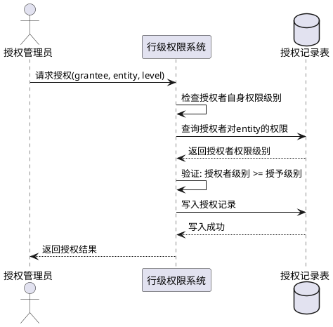

### **5.1.3 异常场景**

1. **授权者权限不足**

   a. 触发条件：授权者对目标实体的权限级别低于欲授予的权限级别
   b. 系统行为：拒绝授权操作，记录安全审计日志
   c. 用户感知：HTTP 403，错误信息"授权者权限不足，无法授予该级别的权限"

2. **重复授权**

   a. 触发条件：对同一用户和同一实体，已存在相同或更高级别的授权记录
   b. 系统行为：若已存在相同级别则返回已有记录；若已存在更高级别则拒绝降级授权
   c. 用户感知：HTTP 200 返回已有记录 或 HTTP 409 "已存在更高级别授权"

## **5.2 权限检查**

### **5.2.1 业务规则**

1. **默认无权限规则**：对于任何数据行，如果用户既不是创建者也没有被明确授权，则必须拒绝访问

   a. 验收条件：[未被授权的用户查询数据行] → [返回空结果集或HTTP 403]

2. **创建者默认权限规则**：数据行的创建者必须自动获得该数据行的AUTHORIZE(3)权限

   a. 验收条件：[用户A创建数据行X] → [用户A对X拥有AUTHORIZE权限，可读、可写、可授权]

3. **单条数据权限检查规则**：查询单条数据时，必须检查当前用户是否拥有目标实体的READ权限

   a. 验收条件：[用户请求查询实体X] → [若用户对X无READ权限，返回HTTP 403]

4. **列表数据权限过滤规则**：查询列表数据时，必须自动生成权限过滤条件，仅返回用户有READ权限的数据行

   a. 验收条件：[用户查询实体列表] → [结果集仅包含用户有READ权限的数据行，无权限的数据行不返回]

5. **写入权限检查规则**：更新或删除数据时，必须检查当前用户是否拥有目标实体的WRITE权限

   a. 验收条件：[用户请求更新实体X，但对X仅有READ权限] → [返回HTTP 403，错误信息"无写入权限"]
   b. 验收条件：[用户请求删除实体X，但对X仅有READ权限] → [返回HTTP 403，错误信息"无写入权限"]

6. **授权权限检查规则**：执行授权操作时，必须检查当前用户是否拥有目标实体的AUTHORIZE权限

   a. 验收条件：[用户请求将实体X授权给他人，但对X仅有WRITE权限] → [返回HTTP 403，错误信息"无授权权限"]

### **5.2.2 交互流程**

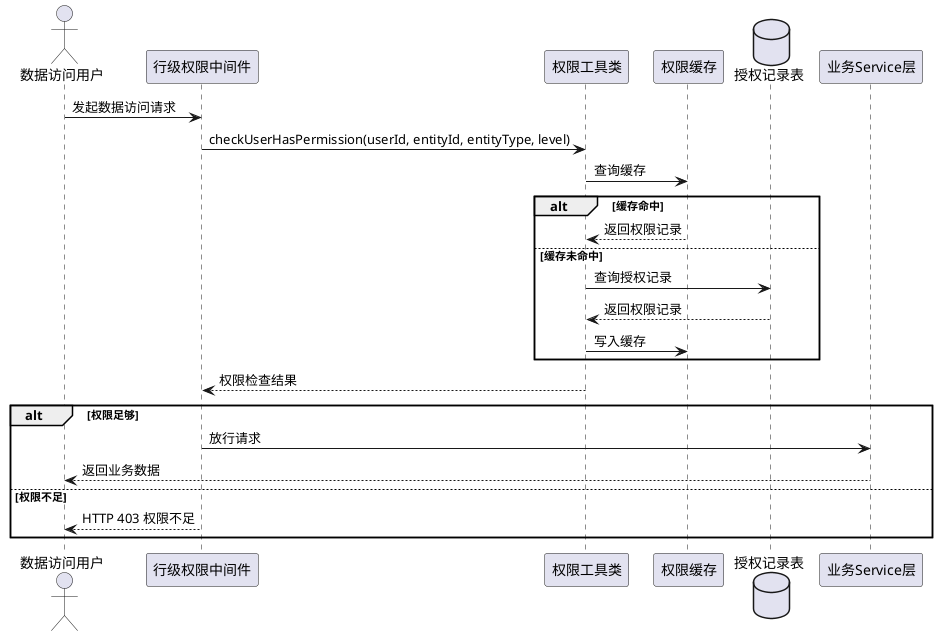

### **5.2.3 异常场景**

1. **权限检查服务不可用**

   a. 触发条件：权限缓存不可用且数据库查询失败
   b. 系统行为：遵循安全优先原则，拒绝所有数据访问请求
   c. 用户感知：HTTP 503，错误信息"权限服务暂时不可用，请稍后重试"

2. **并发授权冲突**

   a. 触发条件：两个授权者同时对同一实体进行授权操作
   b. 系统行为：以数据库最终写入结果为准，缓存失效后重新加载
   c. 用户感知：先完成的授权成功，后完成的若产生冲突返回HTTP 409

## **5.3 权限过滤**

### **5.3.1 业务规则**

1. **过滤条件生成规则**：根据当前用户对目标实体类型的权限记录，必须生成有效的SQL WHERE子句条件

   a. 验收条件：[用户对entity类型有3条授权记录] → [生成的WHERE条件包含这3个entity_id，且SQL语法正确]

2. **创建者数据包含规则**：权限过滤条件必须包含用户作为创建者创建的所有数据行

   a. 验收条件：[用户A创建了数据行X，X不在授权记录中] → [过滤条件仍包含X的ID，查询结果包含X]

3. **空权限过滤规则**：如果用户对目标实体类型没有任何授权记录且不是任何数据的创建者，则过滤条件必须排除所有数据行

   a. 验收条件：[用户无任何授权且未创建任何数据] → [查询返回空结果集]

4. **过滤条件注入防护**：生成的WHERE条件必须防止SQL注入，所有参数必须使用参数化查询

   a. 验收条件：[实体ID包含恶意SQL片段] → [生成的WHERE条件安全转义，不产生SQL注入]

### **5.3.2 交互流程**

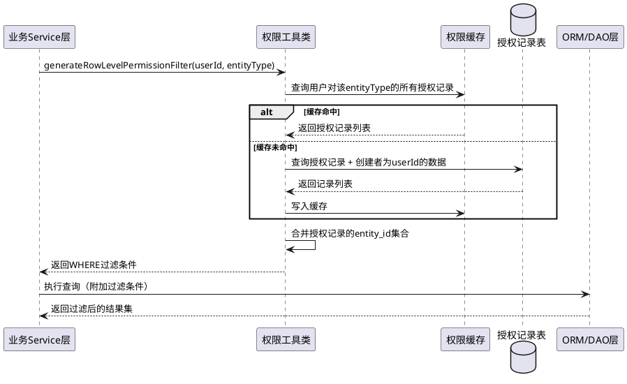

### **5.3.3 异常场景**

1. **授权记录表查询超时**

   a. 触发条件：查询授权记录时数据库响应超时
   b. 系统行为：返回最严格的过滤条件（空结果集），记录错误日志
   c. 用户感知：查询返回空结果或HTTP 500，错误信息"数据查询暂时不可用"

2. **过滤条件生成异常**

   a. 触发条件：授权记录数据异常（如entity_id为空）
   b. 系统行为：跳过异常记录，仅使用有效记录生成过滤条件，记录警告日志
   c. 用户感知：查询结果可能不完整，但不报错

## **5.4 授权管理**

### **5.4.1 业务规则**

1. **创建授权规则**：授权者必须对目标实体拥有AUTHORIZE权限才能为其他用户创建授权

   a. 验收条件：[用户A对实体X拥有AUTHORIZE权限，请求将X的READ权限授予用户B] → [授权成功，B获得X的READ权限]

2. **删除授权规则**：只有对实体拥有AUTHORIZE权限的用户才能删除该实体的授权记录

   a. 验收条件：[用户A对实体X拥有WRITE权限，请求删除X的某条授权记录] → [删除失败，返回HTTP 403]

3. **自授权禁止规则**：用户不可以为自己创建授权记录（创建者默认权限已覆盖此场景）

   a. 验收条件：[用户A请求将实体X的权限授予自己] → [返回HTTP 400，错误信息"不允许自授权"]

4. **查询实体授权记录规则**：拥有实体READ权限的用户可以查看该实体的所有授权记录

   a. 验收条件：[用户A对实体X拥有READ权限，请求查询X的授权记录] → [返回X的所有授权记录列表]

5. **授权记录不可重复规则**：同一用户对同一实体不可创建多条相同权限级别的授权记录

   a. 验收条件：[实体X对用户B已存在READ授权，再次创建READ授权] → [返回已有的授权记录，不创建新记录]

### **5.4.2 交互流程**

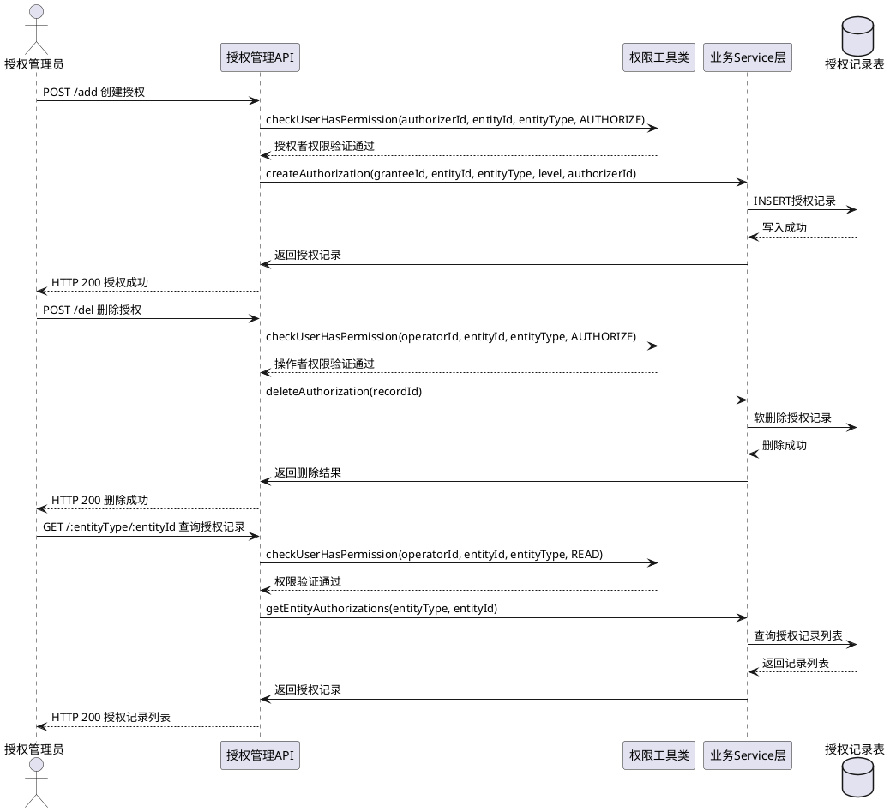

### **5.4.3 异常场景**

1. **被授权用户不存在**

   a. 触发条件：创建授权时指定的grantee用户ID不存在
   b. 系统行为：拒绝创建授权，返回错误
   c. 用户感知：HTTP 400，错误信息"目标用户不存在"

2. **目标实体不存在**

   a. 触发条件：创建授权时指定的entity_id对应的数据行不存在
   b. 系统行为：拒绝创建授权，返回错误
   c. 用户感知：HTTP 400，错误信息"目标实体不存在"

3. **删除不存在的授权记录**

   a. 触发条件：删除授权时指定的授权记录ID不存在或已被删除
   b. 系统行为：返回删除失败
   c. 用户感知：HTTP 404，错误信息"授权记录不存在"

## **5.5 配置管理**

### **5.5.1 业务规则**

1. **全局开关规则**：ROW_LEVEL_PERMISSION_ENABLED环境变量控制系统全局是否启用行级权限，默认为true

   a. 验收条件：[ROW_LEVEL_PERMISSION_ENABLED=false] → [所有数据访问不执行行级权限检查，回退到v3行为]
   b. 验收条件：[ROW_LEVEL_PERMISSION_ENABLED=true] → [所有已配置表的数据访问执行行级权限检查]

2. **表级配置规则**：ROW_LEVEL_PERMISSION_<表名>环境变量控制特定表是否启用行级权限，优先级高于全局开关，含creator字段的表默认开启（ROW_LEVEL_PERMISSION_<表名>=true）

   a. 验收条件：[全局=true, 表级=false] → [该表不执行行级权限检查]
   b. 验收条件：[全局=false, 表级=true] → [该表执行行级权限检查]
   c. 验收条件：[全局=true, 表级未配置] → [该表执行行级权限检查]
   d. 验收条件：[表含creator字段] → [默认ROW_LEVEL_PERMISSION_<表名>=true]

3. **缓存TTL配置规则**：PERMISSION_CACHE_TTL环境变量控制权限缓存的过期时间，单位为秒，默认300秒

   a. 验收条件：[PERMISSION_CACHE_TTL=600] → [权限缓存条目在600秒后过期]

4. **配置热加载规则**：环境变量变更后，配置必须在下次请求时生效，不需要重启服务

   a. 验收条件：[运行时修改环境变量，发起新请求] → [新请求使用新配置值]

### **5.5.2 交互流程**

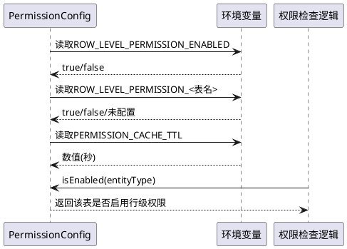

### **5.5.3 异常场景**

1. **环境变量值非法**

   a. 触发条件：PERMISSION_CACHE_TTL设置为非正整数或空值
   b. 系统行为：使用默认值300秒，记录警告日志
   c. 用户感知：权限缓存使用默认TTL，系统正常运行

2. **表名含特殊字符**

   a. 触发条件：ROW_LEVEL_PERMISSION_<表名>中的表名包含非法字符
   b. 系统行为：忽略该配置项，使用全局开关值
   c. 用户感知：该表使用全局配置，日志记录配置忽略原因

## **5.6 缓存机制**

### **5.6.1 业务规则**

1. **缓存命中规则**：权限查询时必须先检查缓存，缓存命中则直接返回，不查询数据库

   a. 验收条件：[缓存中存在用户A对实体X的权限记录] → [直接从缓存返回，不发起数据库查询]

2. **缓存失效规则**：缓存条目在TTL到期后必须失效，下次查询时从数据库重新加载

   a. 验收条件：[缓存TTL=300秒，条目创建后超过300秒] → [该缓存条目失效，重新从数据库加载]

3. **缓存一致性规则**：授权记录变更（创建/删除）时，必须使相关缓存条目失效

   a. 验收条件：[删除用户B对实体X的授权记录] → [用户B对X的缓存条目失效，下次查询从数据库加载]

4. **并发安全规则**：缓存的读写操作必须使用互斥锁（Mutex）保证并发安全

   a. 验收条件：[两个并发请求同时读写同一缓存条目] → [不产生数据竞争，结果一致]

5. **缓存内存限制规则**：缓存条目总数必须设置上限，防止内存溢出

   a. 验收条件：[缓存条目数达到上限] → [淘汰最早的缓存条目，写入新条目]

### **5.6.2 交互流程**

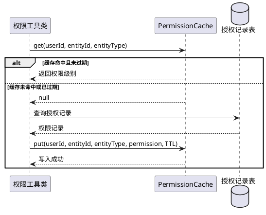

### **5.6.3 异常场景**

1. **缓存内存不足**

   a. 触发条件：缓存条目数达到上限且无法淘汰（所有条目都在TTL内）
   b. 系统行为：淘汰最早创建的条目，写入新条目
   c. 用户感知：无感知，系统正常运行

2. **缓存与数据库不一致**

   a. 触发条件：授权记录在数据库中被直接修改（绕过Service层）
   b. 系统行为：缓存TTL到期后自动从数据库重新加载
   c. 用户感知：最多在TTL时间内看到旧权限数据，TTL到期后恢复一致

## **5.7 中间件集成**

### **5.7.1 业务规则**

1. **中间件执行顺序规则**：行级权限中间件必须在RBAC权限检查之后执行

   a. 验收条件：[请求到达] → [先执行RBAC权限检查，通过后再执行行级权限检查]

2. **中间件开关规则**：当行级权限全局开关关闭时，中间件必须直接放行所有请求

   a. 验收条件：[ROW_LEVEL_PERMISSION_ENABLED=false] → [中间件对所有请求返回true（放行），回退到v3行为]

3. **中间件检查规则**：中间件的checkRowLevelPermission方法必须根据请求的HTTP方法和目标实体执行对应的权限级别检查

   a. 验收条件：[请求方法为GET，中间件检查READ权限] → [正确执行READ级别权限检查]
   b. 验收条件：[请求方法为PUT/DELETE，中间件检查WRITE权限] → [正确执行WRITE级别权限检查]

4. **表级过滤规则**：中间件必须根据PermissionConfig判断目标表是否启用行级权限，未启用的表直接放行

   a. 验收条件：[目标表未启用行级权限] → [中间件直接放行，不执行权限检查]

### **5.7.2 交互流程**

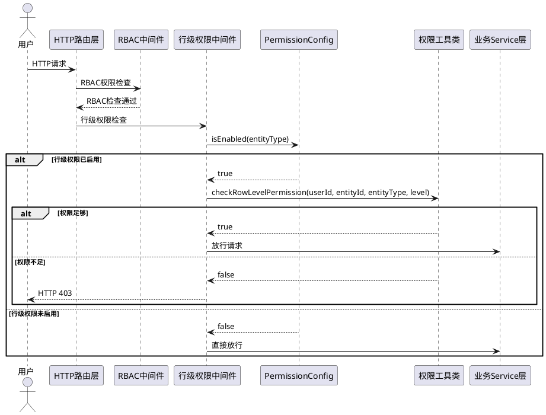

### **5.7.3 异常场景**

1. **请求中缺少实体信息**

   a. 触发条件：请求路径或参数中无法提取entity_type和entity_id
   b. 系统行为：跳过行级权限检查，放行请求，记录警告日志
   c. 用户感知：请求正常处理（该场景由RBAC兜底）

2. **中间件执行异常**

   a. 触发条件：中间件执行过程中抛出未预期异常
   b. 系统行为：遵循安全优先原则，拒绝请求，记录错误日志
   c. 用户感知：HTTP 500，错误信息"权限检查异常"

## **5.8 Service层集成**

### **5.8.1 业务规则**

1. **查询集成规则**：业务Service的查询单条方法必须在返回数据前检查行级READ权限

   a. 验收条件：[调用EntityService.find(id)] → [先检查用户对id的READ权限，有权限则返回数据，无权限则返回403]

2. **列表查询集成规则**：业务Service的查询列表方法必须附加权限过滤条件

   a. 验收条件：[调用EntityService.findAll(page)] → [自动附加权限过滤WHERE条件，仅返回有READ权限的数据]

3. **更新集成规则**：业务Service的更新方法必须在执行更新前检查行级WRITE权限

   a. 验收条件：[调用EntityService.update(entity)] → [先检查用户对entity.id的WRITE权限，有权限则更新，无权限则返回403]

4. **删除集成规则**：业务Service的删除方法必须在执行删除前检查行级WRITE权限

   a. 验收条件：[调用EntityService.delete(id)] → [先检查用户对id的WRITE权限，有权限则删除，无权限则返回403]

5. **创建集成规则**：业务Service的创建方法必须在数据创建成功后自动为创建者授予AUTHORIZE权限

   a. 验收条件：[调用EntityService.insert(entity)，创建者为用户A] → [数据创建成功后，自动创建用户A对新数据行的AUTHORIZE授权记录]

6. **集成位置规则**：行级权限代码采用分层放置策略——(a) 权限检查的import引入语句必须添加在Service类 `//#region AutoCreateCode` 之前的头部自定义引入区域；(b) 每个表都需要的标准化权限检查调用代码（createWithPermission/getByIdWithPermission/getListWithPermission/updateWithPermission/deleteWithPermission）必须添加在Service类 `//#region AutoCreateCode` ~ `//#endregion AutoCreateCode` 区域内，由crudgen模板统一生成；(c) 仅特定表专属的权限业务逻辑（如授权管理方法）添加在 `//#endregion AutoCreateCode` 之后的尾部定制开发区域

   a. 验收条件：[检查Service类代码] → [权限import语句在头部自定义引入区域内，标准化权限检查调用代码在AutoCreateCode区域内由crudgen模板生成，特定表专属业务逻辑在尾部定制开发区域内]

### **5.8.2 交互流程**

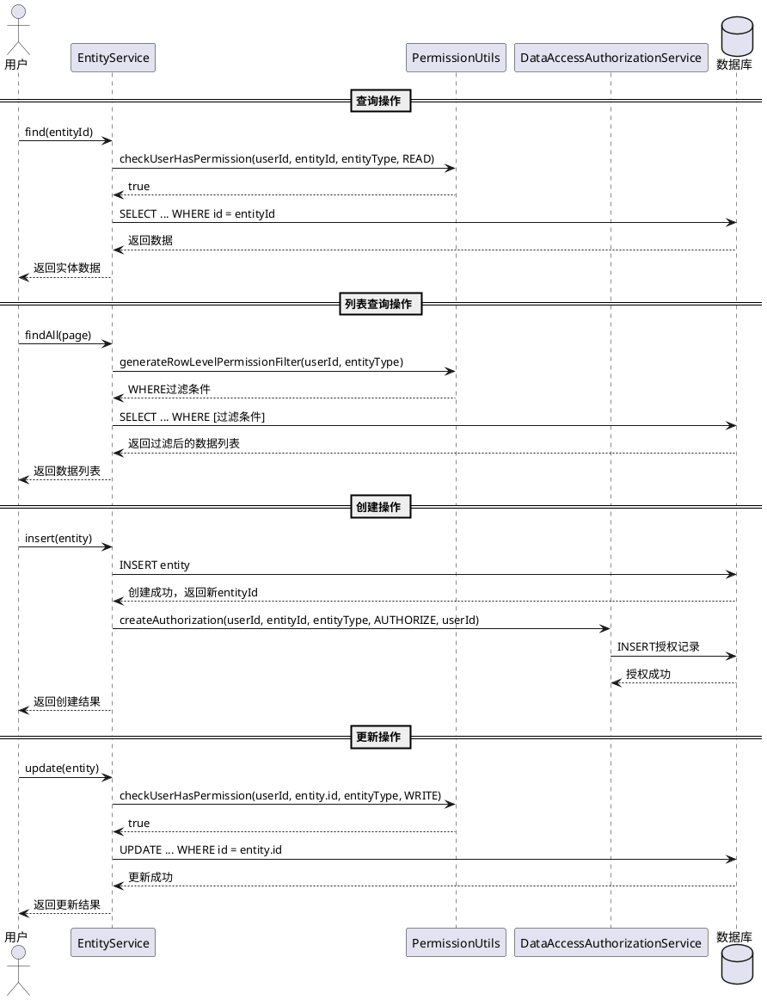

### **5.8.3 异常场景**

1. **权限检查与数据操作不一致**

   a. 触发条件：权限检查通过后，数据在操作前被其他用户删除
   b. 系统行为：数据操作返回空结果或更新0行，不视为权限错误
   c. 用户感知：HTTP 404 "数据不存在" 或 HTTP 200 返回空结果

2. **创建后授权失败**

   a. 触发条件：数据创建成功但自动授权记录写入失败
   b. 系统行为：记录错误日志，数据创建结果仍返回成功（授权可后续补偿）
   c. 用户感知：数据创建成功，但创建者可能暂时无法访问（需管理员手动授权补偿）

3. **crudgen重新生成覆盖影响**

   a. 触发条件：标准CRUD重新生成代码，可能覆盖AutoCreateCode区域
   b. 系统行为：crudgen重新生成时，AutoCreateCode区域内的标准化权限检查调用代码会随模板一起重新生成（因为权限代码已纳入模板），头部自定义引入区域和尾部定制开发区域的代码保持不变
   c. 用户感知：标准化权限检查代码随crudgen模板更新，定制业务逻辑保持不变

## **5.9 批量权限检查**

### **5.9.1 业务规则**

1. **批量检查规则**：系统必须支持一次检查多个实体ID的权限，返回每个实体的权限检查结果

   a. 验收条件：[传入100个entityId，检查READ权限] → [返回每个entityId对应的权限检查结果（true/false）]

2. **批量检查上限规则**：单次批量检查的实体ID数量不得超过100个

   a. 验收条件：[传入101个entityId] → [返回HTTP 400，错误信息"批量检查数量超过上限100"]

3. **批量检查性能规则**：批量检查必须优先从缓存获取结果，减少数据库查询次数

   a. 验收条件：[100个entityId中80个在缓存中] → [仅对20个未缓存的entityId发起数据库查询]

### **5.9.2 交互流程**

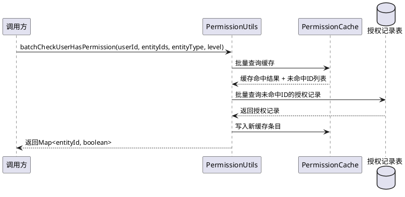

### **5.9.3 异常场景**

1. **批量检查部分失败**

   a. 触发条件：批量检查中部分entityId的数据库查询失败
   b. 系统行为：已成功的部分返回正确结果，失败的部分返回false（安全优先），记录错误日志
   c. 用户感知：返回部分结果，失败项按无权限处理

## **5.10 模板化与代码生成集成**

### **5.10.1 业务规则**

1. **公共工具方法提取规则**：行级权限检查逻辑必须抽取为公共工具方法（放置在 `src/app/utils/` 或 `src/app/core/` 中的 PermissionUtils 类），禁止在具体 Service 中内联实现权限检查逻辑

   a. 验收条件：[检查所有Service类的尾部定制开发区域] → [权限检查代码仅通过调用PermissionUtils的方法实现，不存在内联的权限判断逻辑]

2. **Service层统一权限调用模式规则**：Service层集成行级权限必须遵循标准化的调用模式——在getById中调用PermissionUtils.checkReadPermission，在update/delete中调用PermissionUtils.checkWritePermission，在getList中调用PermissionUtils.appendPermissionFilter，在create中调用PermissionUtils.autoGrantCreatorPermission

   a. 验收条件：[检查任意含creator字段的Service类] → [getById调用checkReadPermission，update/delete调用checkWritePermission，getList调用appendPermissionFilter，create调用autoGrantCreatorPermission]

3. **DAO层权限查询方法标准化规则**：DAO层权限相关查询方法必须采用标准化命名和参数模式，如 findByUserIdAndEntityTypeAndEntityId(userId, entityType, entityId)、findByUserIdAndEntityTypeAndPermissionGte(userId, entityType, minPermission)

   a. 验收条件：[检查DataAccessAuthorizationDAO] → [包含findByUserIdAndEntityTypeAndEntityId和findByUserIdAndEntityTypeAndPermissionGte方法，方法签名符合标准命名模式]

4. **Controller层权限检查调用标准化规则**：Controller层的权限检查调用模式必须标准化，采用统一的中间件或before-action模式，便于crudgen模板生成

   a. 验收条件：[检查所有含creator字段的Controller类] → [权限检查调用模式一致，均通过中间件或统一的before-action方法实现]

5. **权限集成代码分层放置规则**：行级权限集成代码采用分层放置策略——(a) 每个表都需要的标准化权限检查调用代码（Service层WithPermission方法、Controller层权限调用、DAO层通用权限查询方法）放置在AutoCreateCode区域内，由crudgen模板统一生成，是自动生成代码的一部分；(b) 仅特定表专属的业务逻辑（如data_access_authorization表的授权管理API）放置在定制开发区域（头部自定义引入区域和尾部定制开发方法区域）；(c) PermissionUtils/PermissionConfig/PermissionCache等公共组件放置在独立的公共文件中

   a. 验收条件：[crudgen重新生成某模块的标准CRUD代码] → [AutoCreateCode区域内包含标准化权限检查调用代码（由模板生成），头部自定义引入区域和尾部定制开发区域的表专属业务逻辑保持不变]

6. **creator字段自动检测规则**：crudgen工具必须能根据数据库表的db_info元数据检测creator字段是否存在，自动决定是否在生成的模块中包含行级权限集成代码

   a. 验收条件：[crudgen生成含creator字段的表模块] → [自动在Service头部自定义引入区域生成权限import语句，在AutoCreateCode区域内生成标准化行级权限集成代码（WithPermission方法）]
   b. 验收条件：[crudgen生成不含creator字段的表模块] → [不生成任何行级权限集成代码]

7. **公共方法泛型/表名参数化规则**：PermissionUtils的公共方法必须支持表名参数（entityType），使得同一套权限检查代码可服务于所有含creator字段的表，而非硬编码特定表名

   a. 验收条件：[PermissionUtils.checkReadPermission(userId, entityId, "entity", READ)] → [正确检查entity表的行级权限]
   b. 验收条件：[PermissionUtils.checkReadPermission(userId, entityId, "other_table", READ)] → [正确检查other_table表的行级权限]
   c. 验收条件：[PermissionUtils源代码中不存在硬编码的表名字符串]

8. **crudgen模板扩展规则**：crudgen的Service模板（Service.cj.tpl）必须支持条件性生成行级权限集成代码，当表含creator字段时，在头部自定义引入区域自动生成权限import语句，在AutoCreateCode区域内自动生成标准化权限检查调用代码（WithPermission方法）

   a. 验收条件：[crudgen对含creator字段的表执行生成] → [Service模板在//#region AutoCreateCode之前生成权限import语句，在//#region AutoCreateCode ~ //#endregion AutoCreateCode区域内生成标准化权限检查调用代码]

9. **DAO模板权限查询方法规则**：crudgen的DAO模板（DAO.cj.tpl）在目标表为data_access_authorization时，必须在AutoCreateCode区域内生成标准化的权限查询方法（findByUserIdAndEntityTypeAndEntityId、findByUserIdAndEntityTypeAndPermissionGte），因为这些方法是每个表都需要的通用权限查询支持

   a. 验收条件：[crudgen生成data_access_authorization模块] → [DAO在AutoCreateCode区域内包含findByUserIdAndEntityTypeAndEntityId和findByUserIdAndEntityTypeAndPermissionGte方法]

10. **crudgen自动添加.env配置规则**：crudgen代码生成工具在生成含creator字段的表的CRUD模块时，必须自动在项目 `.env` 文件中添加该表的行级权限配置（格式：`ROW_LEVEL_PERMISSION_<表名>=true`）。若 `.env` 文件中已存在该表的配置则跳过，否则在行级权限配置区块的末尾新增

   a. 验收条件：[crudgen生成含creator字段的表"entity"的模块] → [`.env` 文件中包含 `ROW_LEVEL_PERMISSION_entity=true` 配置]
   b. 验收条件：[`.env` 文件已存在 `ROW_LEVEL_PERMISSION_entity=true`] → [crudgen不重复添加该配置]
   c. 验收条件：[`.env` 文件不存在行级权限配置区块] → [crudgen在 `.env` 文件末尾新增配置区块并添加表级配置]

### **5.10.2 交互流程**

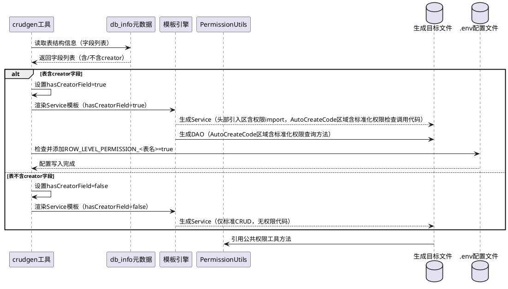

### **5.10.3 异常场景**

1. **crudgen无法检测creator字段**

   a. 触发条件：db_info元数据中缺少字段信息或字段名不匹配
   b. 系统行为：默认不生成行级权限集成代码，记录警告日志
   c. 用户感知：生成的模块仅包含标准CRUD，需手动添加权限集成代码

2. **PermissionUtils方法签名变更**

   a. 触发条件：PermissionUtils的公共方法签名发生变更，但Service定制区域仍调用旧签名
   b. 系统行为：编译时发现方法调用错误
   c. 用户感知：编译失败，需更新Service定制区域的调用代码或重新运行crudgen生成

3. **定制开发区域标记缺失**

   a. 触发条件：crudgen生成的代码中缺少定制开发区域标记
   b. 系统行为：crudgen生成代码时自动添加 `//#region AutoCreateCode` / `//#endregion AutoCreateCode` 标记，以及头部自定义引入区域和尾部定制开发方法区域的标识注释，并生成权限集成代码
   c. 用户感知：生成的代码包含完整的定制开发区域结构

4. **crudgen重新生成覆盖影响**

   a. 触发条件：用户执行crudgen重新生成模块
   b. 系统行为：crudgen识别 `//#region AutoCreateCode` / `//#endregion AutoCreateCode` 标记，覆盖AutoCreateCode区域（包含标准化权限检查调用代码的重新生成），保留头部自定义引入区域和尾部定制开发区域的代码
   c. 用户感知：标准CRUD代码和标准化权限检查代码随模板更新，定制业务逻辑保持不变

# **6. 数据约束**

## **6.1 授权记录（DataAccessAuthorization）**

1. **id**：全局唯一标识符，UUID格式，必填
2. **entity_id**：实体数据行的主键值，字符串类型，必填，不可为空
3. **entity_type**：实体类型标识，对应数据库表名，字符串类型，最大长度50，必填，不可为空
4. **user_id**：被授权用户的唯一标识符，UUID格式，必填，不可为空
5. **permission**：权限级别，整型，取值范围{1, 2, 3}，1=可读，2=可写，3=可授权，必填
6. **creator**：授权操作的创建人用户ID，UUID格式，必填
7. **created_at**：创建时间戳，必填，由系统自动填充
8. **updated_at**：最后更新时间戳，必填，由系统自动维护
9. **deleted_at**：软删除时间戳，可为空，非空表示已删除

## **6.2 权限级别（PermissionLevel）**

1. **READ**：可读权限，整数值为1，允许查看数据
2. **WRITE**：可写权限，整数值为2，允许修改和删除数据，隐式包含READ权限
3. **AUTHORIZE**：可授权权限，整数值为3，允许将权限授予其他用户，隐式包含WRITE和READ权限

## **6.3 行级权限配置（PermissionConfig）**

1. **全局开关**：布尔值，对应环境变量ROW_LEVEL_PERMISSION_ENABLED，默认true
2. **缓存TTL**：正整数，单位秒，对应环境变量PERMISSION_CACHE_TTL，默认300
3. **表级开关**：布尔值映射，键为表名，值对应环境变量ROW_LEVEL_PERMISSION_<表名>，含creator字段的表默认true，未配置时使用全局开关值

## **6.4 权限工具方法签名（PermissionUtils API）**

1. **checkReadPermission(userId, entityId, entityType)**：检查用户对指定实体的READ权限，返回布尔值
2. **checkWritePermission(userId, entityId, entityType)**：检查用户对指定实体的WRITE权限，返回布尔值
3. **checkAuthorizePermission(userId, entityId, entityType)**：检查用户对指定实体的AUTHORIZE权限，返回布尔值
4. **appendPermissionFilter(userId, entityType)**：生成用户对指定实体类型的权限过滤条件，返回WHERE子句字符串
5. **autoGrantCreatorPermission(userId, entityId, entityType)**：为数据创建者自动授予AUTHORIZE权限，返回授权结果
6. **batchCheckUserHasPermission(userId, entityIds, entityType, level)**：批量检查多个实体的权限，返回Map<entityId, boolean>

## **6.5 DAO标准化权限查询方法（DataAccessAuthorizationDAO）**

1. **findByUserIdAndEntityTypeAndEntityId(userId, entityType, entityId)**：按用户、实体类型、实体ID精确查询授权记录
2. **findByUserIdAndEntityTypeAndPermissionGte(userId, entityType, minPermission)**：按用户、实体类型查询权限级别大于等于指定值的授权记录
3. **findByEntityTypeAndEntityId(entityType, entityId)**：按实体类型和实体ID查询所有授权记录
4. **findByUserIdAndEntityType(userId, entityType)**：按用户和实体类型查询所有授权记录

# **7. EARS需求清单**

## **7.1 权限级别管理**

| 需求ID | EARS模式 | 需求描述 | 优先级 | 代码映射 |
|--------|---------|---------|--------|---------|
| RLP-001 | Ubiquitous | The 行级权限系统 shall 支持READ(1)、WRITE(2)、AUTHORIZE(3)三个权限级别，且权限值与整数可双向映射 | P0 | PermissionMiddleware.cj - PermissionLevel枚举 |
| RLP-002 | Ubiquitous | The 行级权限系统 shall 保证权限继承关系：AUTHORIZE隐式包含WRITE和READ，WRITE隐式包含READ | P0 | PermissionUtils.cj - checkUserHasPermission方法 |
| RLP-003 | If 授权者对目标实体的权限级别低于欲授予的权限级别, the 行级权限系统 shall 拒绝授权操作并返回权限不足错误 | UnwantedBehaviour | P0 | PermissionUtils.cj - createDataAccessRule方法 |

## **7.2 权限检查**

| 需求ID | EARS模式 | 需求描述 | 优先级 | 代码映射 |
|--------|---------|---------|--------|---------|
| RLP-004 | Ubiquitous | The 行级权限系统 shall 对未被授权且非创建者的用户拒绝任何数据访问 | P0 | PermissionUtils.cj - checkUserHasPermission方法 |
| RLP-005 | When 用户创建新的数据行, the 行级权限系统 shall 自动为创建者授予该数据行的AUTHORIZE(3)权限 | EventDriven | P0 | DataAccessAuthorizationService.cj - 定制开发区域 |
| RLP-006 | When 用户查询单条数据, the 行级权限系统 shall 检查用户对目标实体的READ权限，无权限则返回HTTP 403 | EventDriven | P0 | PermissionUtils.cj - checkUserHasPermission方法 |
| RLP-007 | When 用户查询列表数据, the 行级权限系统 shall 生成权限过滤条件，仅返回用户有READ权限的数据行 | EventDriven | P0 | PermissionUtils.cj - generateRowLevelPermissionFilter方法 |
| RLP-008 | When 用户更新或删除数据, the 行级权限系统 shall 检查用户对目标实体的WRITE权限，无权限则返回HTTP 403 | EventDriven | P0 | PermissionUtils.cj - checkUserHasPermission方法 |
| RLP-009 | When 用户执行授权操作, the 行级权限系统 shall 检查用户对目标实体的AUTHORIZE权限，无权限则返回HTTP 403 | EventDriven | P0 | PermissionUtils.cj - createDataAccessRule方法 |

## **7.3 权限过滤**

| 需求ID | EARS模式 | 需求描述 | 优先级 | 代码映射 |
|--------|---------|---------|--------|---------|
| RLP-010 | When 用户查询列表数据, the 行级权限系统 shall 根据用户的授权记录和创建者身份生成SQL WHERE过滤条件 | EventDriven | P0 | PermissionUtils.cj - generateRowLevelPermissionFilter方法 |
| RLP-011 | Ubiquitous | The 行级权限系统 shall 在权限过滤条件中包含用户作为创建者创建的所有数据行 | P0 | PermissionUtils.cj - generateRowLevelPermissionFilter方法 |
| RLP-012 | If 用户对目标实体类型无任何授权记录且非任何数据的创建者, the 行级权限系统 shall 返回空结果集 | UnwantedBehaviour | P0 | PermissionUtils.cj - generateRowLevelPermissionFilter方法 |
| RLP-013 | Ubiquitous | The 行级权限系统 shall 对权限过滤条件中的所有参数使用参数化查询，防止SQL注入 | P0 | PermissionUtils.cj - generateRowLevelPermissionFilter方法 |

## **7.4 授权管理**

| 需求ID | EARS模式 | 需求描述 | 优先级 | 代码映射 |
|--------|---------|---------|--------|---------|
| RLP-014 | When 授权者请求创建授权(POST /add), the 行级权限系统 shall 验证授权者拥有AUTHORIZE权限后创建授权记录 | EventDriven | P0 | DataAccessAuthorizationController.cj - 定制开发区域 |
| RLP-015 | When 用户请求删除授权(POST /del), the 行级权限系统 shall 验证操作者拥有AUTHORIZE权限后执行软删除 | EventDriven | P0 | DataAccessAuthorizationController.cj - 定制开发区域 |
| RLP-016 | If 用户请求为自己创建授权, the 行级权限系统 shall 拒绝操作并返回"不允许自授权"错误 | UnwantedBehaviour | P1 | DataAccessAuthorizationService.cj - 定制开发区域 |
| RLP-017 | When 用户请求查询实体授权记录(GET /:entityType/:entityId), the 行级权限系统 shall 验证用户拥有READ权限后返回授权记录列表 | EventDriven | P1 | DataAccessAuthorizationController.cj - 定制开发区域 |
| RLP-018 | If 同一用户对同一实体已存在相同权限级别的授权记录, the 行级权限系统 shall 返回已有记录而不创建新记录 | UnwantedBehaviour | P1 | DataAccessAuthorizationService.cj - 定制开发区域 |

## **7.5 配置管理**

| 需求ID | EARS模式 | 需求描述 | 优先级 | 代码映射 |
|--------|---------|---------|--------|---------|
| RLP-019 | Where ROW_LEVEL_PERMISSION_ENABLED为false, the 行级权限系统 shall 不执行任何行级权限检查，回退到v3行为 | Optional | P0 | PermissionConfig.cj |
| RLP-020 | Where ROW_LEVEL_PERMISSION_ENABLED为true, the 行级权限系统 shall 对所有已配置表执行行级权限检查 | Optional | P0 | PermissionConfig.cj |
| RLP-021 | While 表级配置ROW_LEVEL_PERMISSION_<表名>已设置, the 行级权限系统 shall 优先使用表级配置而非全局开关 | StateDriven | P0 | PermissionConfig.cj |
| RLP-021a | Ubiquitous | The 行级权限系统 shall 对所有含creator字段的表默认设置ROW_LEVEL_PERMISSION_<表名>=true | P0 | PermissionConfig.cj, crudgen/CrudGenerator.cj |
| RLP-022 | Ubiquitous | The 行级权限系统 shall 使用PERMISSION_CACHE_TTL环境变量配置缓存过期时间，默认300秒 | P1 | PermissionConfig.cj |
| RLP-023 | When 环境变量变更, the 行级权限系统 shall 在下次请求时使用新配置值 | EventDriven | P2 | PermissionConfig.cj |

## **7.6 缓存机制**

| 需求ID | EARS模式 | 需求描述 | 优先级 | 代码映射 |
|--------|---------|---------|--------|---------|
| RLP-024 | While 权限缓存命中且未过期, the 行级权限系统 shall 直接从缓存返回权限结果，不查询数据库 | StateDriven | P0 | PermissionCache.cj |
| RLP-025 | When 缓存条目TTL到期, the 行级权限系统 shall 在下次查询时从数据库重新加载权限数据 | EventDriven | P0 | PermissionCache.cj |
| RLP-026 | When 授权记录发生变更, the 行级权限系统 shall 使相关缓存条目失效 | EventDriven | P0 | PermissionCache.cj |
| RLP-027 | Ubiquitous | The 行级权限系统 shall 使用互斥锁（Mutex）保证缓存并发读写的安全性 | P0 | PermissionCache.cj |
| RLP-028 | If 缓存条目数达到上限, the 行级权限系统 shall 淘汰最早的缓存条目后写入新条目 | UnwantedBehaviour | P1 | PermissionCache.cj |

## **7.7 中间件集成**

| 需求ID | EARS模式 | 需求描述 | 优先级 | 代码映射 |
|--------|---------|---------|--------|---------|
| RLP-029 | Ubiquitous | The 行级权限中间件 shall 在RBAC权限检查之后执行 | P0 | RowLevelPermissionMiddleware.cj |
| RLP-030 | Where ROW_LEVEL_PERMISSION_ENABLED为false, the 行级权限中间件 shall 直接放行所有请求，回退到v3行为 | Optional | P0 | RowLevelPermissionMiddleware.cj - checkRowLevelPermission方法 |
| RLP-031 | When 请求方法为GET, the 行级权限中间件 shall 检查READ级别权限 | EventDriven | P0 | RowLevelPermissionMiddleware.cj - checkRowLevelPermission方法 |
| RLP-032 | When 请求方法为PUT或DELETE, the 行级权限中间件 shall 检查WRITE级别权限 | EventDriven | P0 | RowLevelPermissionMiddleware.cj - checkRowLevelPermission方法 |
| RLP-033 | While 目标表未启用行级权限, the 行级权限中间件 shall 直接放行请求 | StateDriven | P0 | RowLevelPermissionMiddleware.cj - checkRowLevelPermission方法 |
| RLP-034 | If 中间件执行过程中发生未预期异常, the 行级权限中间件 shall 拒绝请求并记录错误日志 | UnwantedBehaviour | P0 | RowLevelPermissionMiddleware.cj - checkRowLevelPermission方法 |

## **7.8 Service层集成**

| 需求ID | EARS模式 | 需求描述 | 优先级 | 代码映射 |
|--------|---------|---------|--------|---------|
| RLP-035 | When 业务Service执行单条查询, the 行级权限系统 shall 在返回数据前检查用户的READ权限 | EventDriven | P0 | EntityService.cj - AutoCreateCode区域 |
| RLP-036 | When 业务Service执行列表查询, the 行级权限系统 shall 附加权限过滤条件限制结果集 | EventDriven | P0 | EntityService.cj - AutoCreateCode区域 |
| RLP-037 | When 业务Service执行更新操作, the 行级权限系统 shall 在执行更新前检查用户的WRITE权限 | EventDriven | P0 | EntityService.cj - AutoCreateCode区域 |
| RLP-038 | When 业务Service执行删除操作, the 行级权限系统 shall 在执行删除前检查用户的WRITE权限 | EventDriven | P0 | EntityService.cj - AutoCreateCode区域 |
| RLP-039 | When 业务Service执行创建操作, the 行级权限系统 shall 在数据创建成功后自动为创建者授予AUTHORIZE权限 | EventDriven | P0 | EntityService.cj - AutoCreateCode区域 |
| RLP-040 | Ubiquitous | The 行级权限系统 shall 将权限import引入语句添加在Service类的头部自定义引入区域，将每个表都需要的标准化权限检查调用代码添加在AutoCreateCode区域内（由crudgen模板生成），将特定表专属的业务逻辑添加在尾部定制开发区域 | P0 | 所有Service.cj - 头部引入区/AutoCreateCode区域/尾部定制开发区 |

## **7.9 批量权限检查**

| 需求ID | EARS模式 | 需求描述 | 优先级 | 代码映射 |
|--------|---------|---------|--------|---------|
| RLP-041 | When 调用批量权限检查接口, the 行级权限系统 shall 返回每个实体ID的权限检查结果 | EventDriven | P1 | PermissionUtils.cj - batchCheckUserHasPermission方法 |
| RLP-042 | If 批量检查的实体ID数量超过100, the 行级权限系统 shall 拒绝请求并返回"批量检查数量超过上限"错误 | UnwantedBehaviour | P1 | PermissionUtils.cj - batchCheckUserHasPermission方法 |
| RLP-043 | While 执行批量权限检查, the 行级权限系统 shall 优先从缓存获取结果，仅对未缓存项查询数据库 | StateDriven | P1 | PermissionUtils.cj - batchCheckUserHasPermission方法 |

## **7.10 安全与兼容性**

| 需求ID | EARS模式 | 需求描述 | 优先级 | 代码映射 |
|--------|---------|---------|--------|---------|
| RLP-044 | Ubiquitous | The 行级权限系统 shall 遵循安全优先原则：权限检查服务不可用时拒绝所有数据访问 | P0 | PermissionUtils.cj, RowLevelPermissionMiddleware.cj |
| RLP-045 | Where ROW_LEVEL_PERMISSION_ENABLED为false, the 行级权限系统 shall 回退到v3版本的权限行为（不执行行级权限检查） | Optional | P0 | PermissionConfig.cj, RowLevelPermissionMiddleware.cj |
| RLP-046 | When 权限检查失败, the 行级权限系统 shall 返回HTTP 403状态码并附带具体拒绝原因 | EventDriven | P0 | RowLevelPermissionMiddleware.cj |
| RLP-047 | Ubiquitous | The 行级权限系统 shall 对所有权限操作记录审计日志，包含用户ID、实体类型、实体ID、操作类型、检查结果 | P1 | PermissionUtils.cj, PermissionCache.cj |

## **7.11 模板化与代码生成集成**

| 需求ID | EARS模式 | 需求描述 | 优先级 | 代码映射 |
|--------|---------|---------|--------|---------|
| RLP-048 | Ubiquitous | The 行级权限系统 shall 将权限检查逻辑抽取为公共工具方法（PermissionUtils），禁止在具体Service中内联实现 | P0 | src/app/utils/PermissionUtils.cj |
| RLP-049 | When 业务Service执行getById, the Service shall 调用PermissionUtils.checkReadPermission进行行级读权限检查 | EventDriven | P0 | EntityService.cj - AutoCreateCode区域 |
| RLP-050 | When 业务Service执行update或delete, the Service shall 调用PermissionUtils.checkWritePermission进行行级写权限检查 | EventDriven | P0 | EntityService.cj - AutoCreateCode区域 |
| RLP-051 | When 业务Service执行getList, the Service shall 调用PermissionUtils.appendPermissionFilter附加行级权限过滤条件 | EventDriven | P0 | EntityService.cj - AutoCreateCode区域 |
| RLP-052 | When 业务Service执行create, the Service shall 调用PermissionUtils.autoGrantCreatorPermission为创建者自动授权 | EventDriven | P0 | EntityService.cj - AutoCreateCode区域 |
| RLP-053 | Ubiquitous | The DataAccessAuthorizationDAO shall 在AutoCreateCode区域内提供标准化的权限查询方法：findByUserIdAndEntityTypeAndEntityId和findByUserIdAndEntityTypeAndPermissionGte | P0 | DataAccessAuthorizationDAO.cj - AutoCreateCode区域 |
| RLP-054 | Ubiquitous | The Controller层 shall 采用统一的中间件或before-action模式进行行级权限检查，便于crudgen模板生成 | P1 | 所有Controller.cj - 中间件调用 |
| RLP-055 | Ubiquitous | The 行级权限集成代码 shall 采用分层放置策略：每个表都需要的标准化权限检查调用代码放置在AutoCreateCode区域内（由crudgen模板生成），特定表专属的业务逻辑放置在定制开发区域，公共组件放置在独立公共文件 | P0 | crudgen - Service.cj.tpl, DAO.cj.tpl |
| RLP-056 | When crudgen生成含creator字段的表模块, the crudgen shall 自动在Service头部自定义引入区域生成权限import语句，在AutoCreateCode区域内生成标准化行级权限集成代码（WithPermission方法） | EventDriven | P0 | crudgen/CrudGenerator.cj, Service.cj.tpl |
| RLP-057 | When crudgen生成不含creator字段的表模块, the crudgen shall 不生成任何行级权限集成代码 | EventDriven | P0 | crudgen/CrudGenerator.cj |
| RLP-058 | Ubiquitous | The PermissionUtils的公共方法 shall 支持entityType参数，使得同一套代码可服务于所有含creator字段的表 | P0 | src/app/utils/PermissionUtils.cj |
| RLP-059 | If PermissionUtils源代码中存在硬编码的表名字符串, the 系统 shall 视为模板化验收失败 | UnwantedBehaviour | P0 | src/app/utils/PermissionUtils.cj |
| RLP-060 | When crudgen对含creator字段的表执行生成, the Service模板 shall 在//#region AutoCreateCode之前生成权限import语句，在//#region AutoCreateCode ~ //#endregion AutoCreateCode区域内生成标准化权限检查调用代码（WithPermission方法） | EventDriven | P1 | crudgen/templates/Service.cj.tpl |
| RLP-061 | When crudgen重新生成某模块, the crudgen shall 覆盖AutoCreateCode区域（包含标准化权限检查调用代码的重新生成），保留头部自定义引入区域和尾部定制开发区域的表专属业务逻辑 | EventDriven | P0 | crudgen/CrudGenerator.cj |
| RLP-062 | If db_info元数据中缺少字段信息导致无法检测creator字段, the crudgen shall 默认不生成行级权限集成代码并记录警告日志 | UnwantedBehaviour | P1 | crudgen/CrudGenerator.cj |
| RLP-063 | When crudgen生成含creator字段的表的CRUD模块, the crudgen shall 自动在 `.env` 文件中添加 `ROW_LEVEL_PERMISSION_<表名>=true` 配置 | EventDriven | P0 | crudgen/CrudGenerator.cj - envConfig方法 |
| RLP-064 | If `.env` 文件已存在该表的行级权限配置, the crudgen shall 跳过不重复添加 | UnwantedBehaviour | P0 | crudgen/CrudGenerator.cj - envConfig方法 |
| RLP-065 | If `.env` 文件不存在行级权限配置区块, the crudgen shall 在 `.env` 文件末尾新增配置区块并添加表级配置 | UnwantedBehaviour | P1 | crudgen/CrudGenerator.cj - envConfig方法 |

# **8. 需求统计**

## **8.1 需求总数**

| 需求类别 | 需求数量 | P0数量 | P1数量 | P2数量 |
|---------|---------|--------|--------|--------|
| 权限级别管理（7.1） | 3 | 3 | 0 | 0 |
| 权限检查（7.2） | 6 | 6 | 0 | 0 |
| 权限过滤（7.3） | 4 | 4 | 0 | 0 |
| 授权管理（7.4） | 5 | 2 | 3 | 0 |
| 配置管理（7.5） | 6 | 4 | 1 | 1 |
| 缓存机制（7.6） | 5 | 4 | 1 | 0 |
| 中间件集成（7.7） | 6 | 6 | 0 | 0 |
| Service层集成（7.8） | 6 | 6 | 0 | 0 |
| 批量权限检查（7.9） | 3 | 0 | 3 | 0 |
| 安全与兼容性（7.10） | 4 | 3 | 1 | 0 |
| 模板化与代码生成集成（7.11） | 18 | 12 | 5 | 1 |
| **合计** | **66** | **50** | **14** | **2** |

## **8.2 新增需求与原有需求映射**

| 新增需求ID | 对应补充需求编号 | 关联原有需求ID | 关系说明 |
|-----------|----------------|--------------|---------|
| RLP-048 | REQ-TEMPLATE-001 | RLP-035~RLP-040 | 将RLP-035~RLP-040中的内联权限检查逻辑抽取为PermissionUtils公共方法 |
| RLP-049 | REQ-TEMPLATE-002 | RLP-035 | 标准化getById中的权限调用模式 |
| RLP-050 | REQ-TEMPLATE-002 | RLP-037, RLP-038 | 标准化update/delete中的权限调用模式 |
| RLP-051 | REQ-TEMPLATE-002 | RLP-036 | 标准化getList中的权限过滤调用模式 |
| RLP-052 | REQ-TEMPLATE-002 | RLP-039 | 标准化create中的自动授权调用模式 |
| RLP-053 | REQ-TEMPLATE-003 | - | 新增：DAO层权限查询方法标准化 |
| RLP-054 | REQ-TEMPLATE-004 | RLP-029~RLP-034 | 标准化Controller层权限检查调用模式 |
| RLP-055 | REQ-TEMPLATE-005 | RLP-040 | 修正：权限集成代码分层放置策略——标准化代码在AutoCreateCode区域内，表专属逻辑在定制开发区域 |
| RLP-056 | REQ-TEMPLATE-006 | - | 新增：crudgen根据creator字段自动决定生成 |
| RLP-057 | REQ-TEMPLATE-006 | - | 新增：crudgen不含creator字段时不生成权限代码 |
| RLP-058 | REQ-TEMPLATE-007 | RLP-006~RLP-009 | PermissionUtils方法支持entityType参数化 |
| RLP-059 | REQ-TEMPLATE-007 | - | 新增：禁止硬编码表名 |
| RLP-060 | - | - | 新增：crudgen Service模板条件性生成权限代码 |
| RLP-061 | - | RLP-040 | crudgen重新生成时保留定制开发区域 |
| RLP-062 | - | - | 新增：crudgen无法检测creator字段时的容错处理 |
| RLP-063 | - | - | 新增：crudgen自动在.env文件中添加表级行级权限配置 |
| RLP-064 | - | RLP-063 | crudgen添加.env配置时的去重规则 |
| RLP-065 | - | RLP-063 | crudgen添加.env配置时无配置区块的新建规则 |
| RLP-021a | - | RLP-020 | 新增：含creator字段的表默认开启行级权限配置 |

## **8.3 EARS模式分布**

| EARS模式 | 需求数量 | 占比 |
|---------|---------|------|
| Ubiquitous | 18 | 27.3% |
| EventDriven | 29 | 43.9% |
| StateDriven | 5 | 7.6% |
| UnwantedBehaviour | 10 | 15.2% |
| Optional | 4 | 6.1% |
| **合计** | **66** | **100%** |
