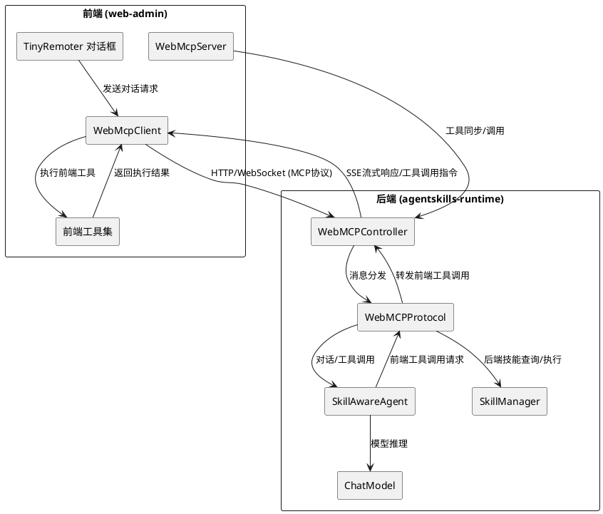
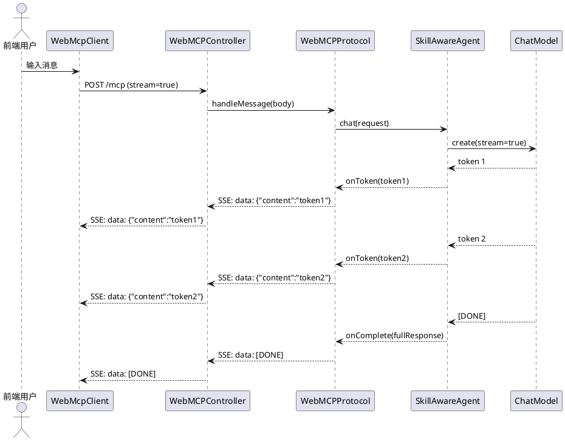
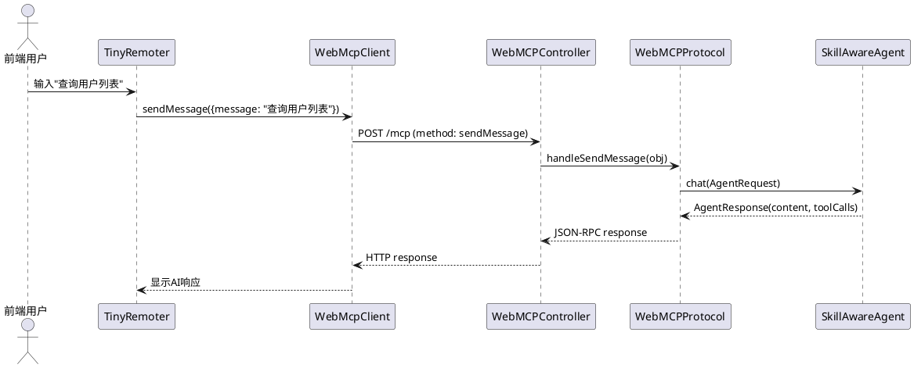
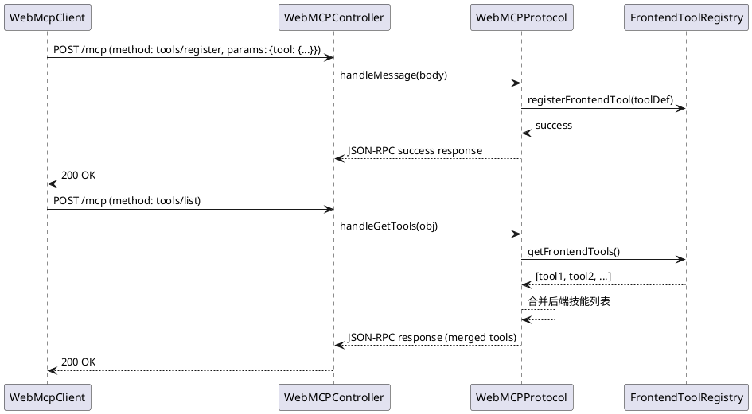
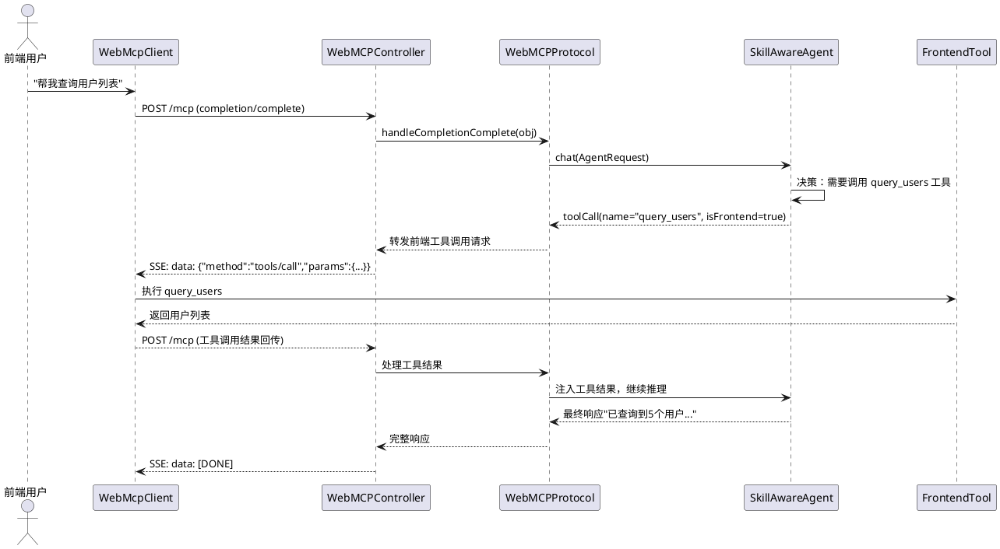
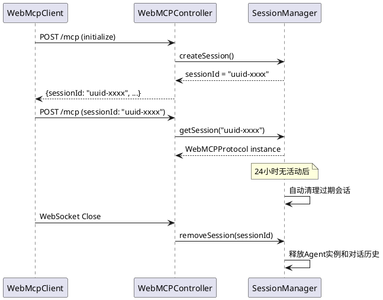
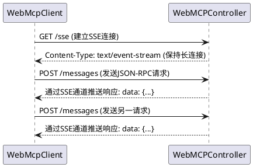

# WebMCP 完善 - 需求规格文档

## 1. 组件定位

### 1.1 核心职责

本组件负责完善 UCToo 系统中 agentskills-runtime（仓颉语言后端）与 web-admin（Vue3 前端）之间的 WebMCP 协议对接，实现 AI Agent 通过 MCP 标准协议控制 Web 应用的完整闭环，包括流式对话、工具注册与发现、前后端工具双向调用和会话管理。

### 1.2 核心输入

1. **前端 WebMcpClient 发送的 JSON-RPC 请求**：通过 StreamableHTTP 或 WebSocket 传输的 MCP 协议消息，包含 initialize、tools/list、tools/call、completion/complete 等方法调用
2. **前端注册的工具定义**：通过工具同步机制发送的前端工具元数据（名称、描述、输入模式、路由信息）
3. **后端 Agent 的 AI 响应**：SkillAwareAgent 产生的流式/非流式对话内容和工具调用请求
4. **前端工具执行结果**：前端执行工具后返回的结果数据
5. **会话管理操作请求**：会话列表、重置、远程控制等管理类请求

### 1.3 核心输出

1. **SSE 格式的流式 AI 响应**：以 `text/event-stream` 格式逐块推送的 AI 对话内容
2. **工具列表响应**：包含后端技能和前端工具的完整工具清单
3. **前端工具调用请求**：后端 Agent 决定调用前端工具时，通过 MCP 协议转发到前端的 tools/call 请求
4. **会话管理响应**：会话创建、列表、重置、关闭等操作的响应
5. **错误响应**：符合 JSON-RPC 规范的错误信息

### 1.4 职责边界

- **不负责**：AI 模型的训练和推理逻辑（由 ChatModel 和 SkillAwareAgent 承担）
- **不负责**：前端 UI 渲染和交互（由 web-admin 和 next-remoter 承担）
- **不负责**：后端技能的具体执行逻辑（由 SkillManager 和各技能实现承担）
- **不负责**：用户认证和权限控制（由系统级中间件承担，本组件仅传递会话标识）
- **不负责**：跨实例的会话持久化和分布式同步（本阶段仅支持单实例内存会话管理）

---

## 2. 领域术语

**WebMCP**
: 基于 Model Context Protocol 的 Web 通信协议，定义了 AI Agent 与 Web 应用之间的标准交互方式，支持工具发现、工具调用和对话流式传输。

**StreamableHTTP**
: MCP 协议定义的传输方式之一，通过 HTTP POST 请求发送 JSON-RPC 消息，支持 SSE（Server-Sent Events）格式的流式响应，适用于不支持 WebSocket 的场景。

**SSE（Server-Sent Events）**
: 基于 HTTP 的单向实时推送协议，服务端以 `text/event-stream` 格式逐块推送数据，每条消息以 `data:` 前缀和双换行符分隔。

**前端工具（Frontend Tool）**
: 注册在前端 Web 应用中的工具，由前端页面执行（如用户管理、角色管理等 CRUD 操作），后端 Agent 通过 MCP 协议请求前端执行并获取结果。

**后端技能（Backend Skill）**
: 注册在 agentskills-runtime 中的技能，由后端直接执行（如 HTTP 请求、文件操作等），前端通过 MCP 协议调用。

**工具同步（Tool Sync）**
: 前端将已注册的工具元数据（名称、描述、输入模式）同步到后端的过程，使后端 Agent 能够感知和发现前端工具。

**会话（Session）**
: 一个 WebMCP 连接的生命周期单元，包含独立的 Agent 实例、对话历史和工具上下文，通过 sessionId 标识。

**SkillAwareAgent**
: 具备技能调用能力的智能代理，接收用户消息后可自主决策是否调用后端技能或前端工具来完成任务。

---

## 3. 角色与边界

### 3.1 核心角色

- **前端用户**：通过 TinyRemoter 对话框与 AI Agent 交互，发送消息并接收流式响应
- **系统管理员**：管理 WebMCP 会话、监控连接状态、配置 Agent 参数

### 3.2 外部系统

- **web-admin（Vue3 前端）**：通过 WebMcpClient/WebMcpServer 与本组件通信，注册前端工具、发送对话请求、接收工具调用指令
- **SkillManager**：提供后端技能的注册、发现和执行能力
- **ChatModel**：提供 AI 大模型的对话推理能力
- **AgentLoadManager**：提供 Agent 定义的加载和管理能力
- **AgentRuntimeBridge**：提供 Agent 运行时的创建、同步和持久化能力

### 3.3 交互上下文

---

## 4. DFX约束

### 4.1 性能

- 核心接口（initialize、tools/list、completion/complete）响应时间上限：非流式请求 ≤ 5秒（不含模型推理时间），流式首块响应 ≤ 2秒
- 单实例并发会话数下限：≥ 50 个活跃会话
- SSE 流式推送间隔：≤ 500ms（每块数据到达后推送）
- 工具同步完成时间：≤ 3秒（10个工具以内）

### 4.2 可靠性

- 系统可用性目标：≥ 99.5%（单实例部署场景）
- WebSocket 断连后自动清理会话资源，无内存泄漏
- StreamableHTTP 模式下会话超时清理：最长 24 小时无活动自动释放
- 工具调用失败时返回明确的错误码和错误信息，不影响其他工具调用

### 4.3 安全性

- 所有 HTTP 端点必须设置 CORS 头，允许的源由配置控制
- OPTIONS 预检请求必须正确响应，支持跨域场景
- 会话标识使用 UUID v4 随机生成，不可预测
- 工具调用需经过技能启用状态检查，禁用的技能不可调用

### 4.4 可维护性

- 所有 WebMCP 端点请求和响应必须记录结构化日志（DEBUG 级别记录完整消息体，INFO 级别记录方法名和会话标识）
- MCP 协议方法名必须统一使用标准名称（tools/list、tools/call），旧方法名标记为废弃并在日志中记录警告
- 新增协议方法时，必须遵循 JSON-RPC 2.0 规范

### 4.5 兼容性

- 协议版本：支持 MCP 协议版本 `2025-11-25`
- 传输方式：同时支持 WebSocket 和 StreamableHTTP 两种传输
- 旧方法名兼容：getTools、invokeTool、tools/invoke 在废弃期内仍可使用，但返回 Deprecation 警告头
- 前端 SDK 兼容：与 @opentiny/next-sdk 的 WebMcpClient/WebMcpServer 接口契约保持一致

---

## 5. 核心能力

### 5.1 SSE 流式响应

#### 5.1.1 业务规则

1. **SSE 格式输出规则**：当客户端请求流式响应时（stream=true 或 Accept 包含 text/event-stream），服务端必须以 SSE 格式逐块推送数据

   a. 验收条件：[客户端发送 stream=true 的 completion/complete 请求] → [服务端返回 Content-Type: text/event-stream，每个数据块以 `data:` 前缀和双换行符分隔]

2. **流式分块规则**：AI 模型产生的响应内容必须按生成进度逐块推送，不得等待完整响应后一次性发送

   a. 验收条件：[AI 模型逐 token 生成响应] → [服务端在每个 token 或语义块生成后立即推送 SSE 事件]

3. **流式结束标记规则**：流式响应结束时必须发送 `[DONE]` 标记事件

   a. 验收条件：[AI 模型完成响应生成] → [服务端发送 `data: [DONE]\n\n` 事件后关闭流]

4. **禁止项**：禁止在流式模式下使用 `spawn + res.send()` 发送完整响应体

   a. 验收条件：[流式请求到达] → [不得出现等待完整响应后才发送的行为]

#### 5.1.2 交互流程

#### 5.1.3 异常场景

1. **流式传输中断**

   a. 触发条件：网络中断或客户端断开连接导致 SSE 流中断

   b. 系统行为：检测到连接断开后停止模型推理，释放资源，记录日志

   c. 用户感知：前端显示"响应中断"提示，已接收的内容保留显示

2. **模型推理超时**

   a. 触发条件：AI 模型推理时间超过配置的超时阈值

   b. 系统行为：发送超时错误事件 `data: {"error":"timeout"}`，然后发送 `[DONE]`

   c. 用户感知：前端显示"响应超时"提示

### 5.2 AI 对话闭环

#### 5.2.1 业务规则

1. **sendMessage 方法对话规则**：当客户端通过 sendMessage 方法发送对话消息时，服务端必须调用 SkillAwareAgent 进行 AI 推理并返回响应

   a. 验收条件：[客户端发送 sendMessage 请求包含 message 字段] → [服务端调用 SkillAwareAgent.chat() 处理消息并返回 AI 响应]

2. **completion/complete 方法对话规则**：当客户端通过 completion/complete 方法发送对话消息时，服务端必须同样调用 SkillAwareAgent 进行 AI 推理

   a. 验收条件：[客户端发送 completion/complete 请求包含 messages 字段] → [服务端调用 SkillAwareAgent.chat() 处理消息并返回 AI 响应]

3. **对话方法统一规则**：sendMessage 和 completion/complete 方法必须共享相同的 Agent 实例和对话历史，确保多轮对话上下文一致

   a. 验收条件：[同一会话中交替使用 sendMessage 和 completion/complete] → [Agent 保持相同的对话历史和上下文连续性]

4. **禁止项**：禁止 sendMessage 方法返回"WebMCP protocol does not support direct model calls"而不调用 AI 模型

   a. 验收条件：[sendMessage 请求到达] → [必须调用 SkillAwareAgent 或 ChatModel 进行推理]

#### 5.2.2 交互流程

#### 5.2.3 异常场景

1. **Agent 实例不可用**

   a. 触发条件：SkillAwareAgent 初始化失败或为空

   b. 系统行为：降级到直接调用 ChatModel 推理，在响应中标记降级标志

   c. 用户感知：用户收到 AI 响应但无法使用技能调用能力

2. **ChatModel 不可用**

   a. 触发条件：ChatModel 初始化失败或推理调用异常

   b. 系统行为：返回 JSON-RPC 错误响应，错误码 -32603

   c. 用户感知：前端显示"AI 服务暂时不可用"

### 5.3 前端工具注册与同步

#### 5.3.1 业务规则

1. **工具注册协议规则**：当客户端发送 `tools/register` 方法请求时，服务端必须接受并存储前端工具定义，使其可被 Agent 感知和发现

   a. 验收条件：[客户端发送 `tools/register` 请求包含工具名称、描述、inputSchema] → [服务端存储工具定义并在后续 tools/list 响应中包含该工具]

2. **工具列表合并规则**：当客户端请求工具列表时，服务端必须返回后端技能和前端已注册工具的合并列表

   a. 验收条件：[客户端发送 tools/list 请求] → [返回结果包含后端技能和已同步的前端工具，前端工具带有 `isFrontendTool: true` 标记]

3. **工具注册信息完整性规则**：前端工具定义必须包含 name、description、inputSchema 三个必填字段，route 字段为可选

   a. 验收条件：[前端工具注册请求缺少 description 字段] → [服务端返回错误响应提示缺少必填字段]

4. **工具重复注册规则**：当同一工具名称重复注册时，后注册的定义覆盖先前的定义

   a. 验收条件：[先后两次注册同名工具"query_users"] → [tools/list 返回的工具列表中只有最后一次注册的定义]

5. **禁止项**：禁止使用 MCP 协议标准中不存在的 `registerTool` 方法名

   a. 验收条件：[前端工具同步请求] → [必须使用 `tools/register` 作为方法名]

#### 5.3.2 交互流程

#### 5.3.3 异常场景

1. **工具注册请求格式错误**

   a. 触发条件：tools/register 请求的 params.tool 字段缺失或格式不合法

   b. 系统行为：返回 JSON-RPC 错误响应，错误码 -32602（Invalid params）

   c. 用户感知：前端控制台显示工具注册失败的错误信息

2. **工具同步超时**

   a. 触发条件：前端在初始化阶段同步工具时后端未响应

   b. 系统行为：前端重试工具同步（最多3次），每次间隔递增

   c. 用户感知：工具列表可能暂时不完整，重试后恢复

### 5.4 前端工具调用闭环

#### 5.4.1 业务规则

1. **前端工具调用转发规则**：当后端 Agent 决定调用前端工具时，服务端必须通过 MCP 协议将工具调用请求转发到前端执行，并等待前端返回执行结果

   a. 验收条件：[Agent 调用前端工具"query_users"] → [服务端通过 WebSocket 或 SSE 向前端发送 tools/call 请求，前端执行后返回结果]

2. **前端工具标识规则**：前端工具在工具列表中必须带有 `isFrontendTool: true` 标记和 `route` 属性，使 Agent 和前端能区分工具类型

   a. 验收条件：[tools/list 返回前端工具] → [工具对象包含 `annotations.isFrontendTool: true` 和 `annotations.route` 字段]

3. **工具调用超时规则**：前端工具调用必须设置超时时间，超时后返回错误响应

   a. 验收条件：[前端工具调用超过180秒未返回结果] → [服务端返回工具调用超时错误]

4. **工具调用结果回传规则**：前端工具执行完成后，结果必须回传给 Agent，使 Agent 能继续推理

   a. 验收条件：[前端工具执行完成返回结果] → [结果注入 Agent 上下文，Agent 继续生成后续响应]

5. **禁止项**：禁止后端 tools/call 方法仅查找后端技能而忽略前端工具

   a. 验收条件：[tools/call 请求的工具名不在后端技能列表中] → [必须检查前端工具注册表，若存在则转发到前端执行]

#### 5.4.2 交互流程

#### 5.4.3 异常场景

1. **前端工具不可达**

   a. 触发条件：后端转发前端工具调用请求时，前端连接已断开

   b. 系统行为：返回工具调用失败错误，Agent 收到错误信息后可决定重试或换用其他方式

   c. 用户感知：Agent 回复"无法执行该操作，请检查页面连接状态"

2. **前端工具执行异常**

   a. 触发条件：前端工具执行过程中抛出异常

   b. 系统行为：前端返回错误信息，后端将错误信息传递给 Agent

   c. 用户感知：Agent 回复"工具执行失败：[具体错误信息]"

### 5.5 会话管理

#### 5.5.1 业务规则

1. **会话标识生成规则**：每个 WebMCP 连接必须生成唯一的 sessionId，不得使用硬编码值

   a. 验收条件：[新的 StreamableHTTP 连接建立] → [服务端生成 UUID v4 格式的 sessionId，不同连接的 sessionId 不同]

2. **会话隔离规则**：不同会话必须拥有独立的 Agent 实例和对话历史，互不干扰

   a. 验收条件：[用户A和用户B同时连接] → [各自的对话上下文完全隔离，Agent 响应基于各自的对话历史]

3. **WebSocket 会话清理规则**：当 WebSocket 连接断开时，必须从会话映射表中移除该会话并释放资源

   a. 验收条件：[WebSocket 连接收到 Close 帧] → [会话从 _sessions 中移除，Agent 实例被释放]

4. **StreamableHTTP 会话超时清理规则**：StreamableHTTP 模式下的会话在超过配置的超时时间无活动后，必须自动清理

   a. 验收条件：[StreamableHTTP 会话超过24小时无请求] → [会话从 _sessions 中移除，Agent 实例被释放]

5. **会话恢复规则**：StreamableHTTP 模式下，客户端可以通过 sessionId 恢复之前的会话上下文

   a. 验收条件：[客户端携带已有 sessionId 请求] → [服务端复用对应的 WebMCPProtocol 实例，保持对话历史连续]

6. **禁止项**：禁止所有 StreamableHTTP 请求共享同一个硬编码 sessionId

   a. 验收条件：[StreamableHTTP 连接请求] → [不得使用 "webmcp-default" 作为 sessionId]

#### 5.5.2 交互流程

#### 5.5.3 异常场景

1. **会话标识冲突**

   a. 触发条件：两个连接生成了相同的 sessionId（极低概率）

   b. 系统行为：后创建的会话覆盖先前的会话，先前会话的请求返回会话无效错误

   c. 用户感知：先前连接的用户收到"会话已失效"提示

2. **会话内存泄漏**

   a. 触发条件：StreamableHTTP 会话持续创建但未被清理

   b. 系统行为：超过最大会话数限制时拒绝新连接，返回 503 错误

   c. 用户感知：新用户无法建立连接

### 5.6 MCP 协议方法名统一

#### 5.6.1 业务规则

1. **标准方法名规则**：MCP 协议方法必须统一使用标准名称 tools/list 和 tools/call

   a. 验收条件：[客户端发送 tools/list 请求] → [服务端正常处理并返回工具列表]

2. **废弃方法名兼容规则**：旧方法名（getTools、listTools、invokeTool、tools/invoke）在废弃期内仍可使用，但响应头必须包含 Deprecation 警告

   a. 验收条件：[客户端发送 getTools 请求] → [服务端正常处理，响应头包含 `Deprecation: true`，日志记录 WARN 级别警告]

3. **废弃方法名日志规则**：当使用废弃方法名时，服务端必须记录 WARN 级别日志，包含废弃方法名和建议的标准方法名

   a. 验收条件：[getTools 请求到达] → [日志输出 "Deprecated method 'getTools', use 'tools/list' instead"]

4. **禁止项**：禁止新增非标准方法名，所有新方法必须遵循 MCP 协议规范

   a. 验收条件：[新增协议方法] → [方法名必须符合 `domain/action` 格式]

### 5.7 SSE 传输端点

#### 5.7.1 业务规则

1. **SSE 端点规则**：服务端必须提供 GET /api/v1/uctoo/webmcp/sse 端点，支持 SSE 传输通道

   a. 验收条件：[客户端发送 GET /api/v1/uctoo/webmcp/sse 请求] → [服务端返回 Content-Type: text/event-stream，保持长连接]

2. **SSE 消息端点规则**：服务端必须提供 POST /api/v1/uctoo/webmcp/messages 端点，用于通过 SSE 通道发送的客户端消息

   a. 验收条件：[客户端发送 POST /api/v1/uctoo/webmcp/messages 包含 JSON-RPC 请求] → [服务端处理请求并通过 SSE 通道推送响应]

3. **SSE 会话关联规则**：SSE 传输必须支持会话标识，通过查询参数或请求头传递 sessionId

   a. 验收条件：[SSE 连接携带 sessionId 参数] → [服务端将消息关联到正确的会话]

#### 5.7.2 交互流程

#### 5.7.3 异常场景

1. **SSE 连接超时**

   a. 触发条件：SSE 长连接超过配置的超时时间无消息交互

   b. 系统行为：服务端发送心跳事件保持连接，若客户端无响应则关闭连接

   c. 用户感知：前端自动重连，用户无感知

### 5.8 会话管理 REST API

#### 5.8.1 业务规则

1. **会话列表 API 规则**：服务端必须提供 GET /api/v1/uctoo/webmcp/sessions 端点，返回所有活跃会话的列表

   a. 验收条件：[管理员发送 GET /api/v1/uctoo/webmcp/sessions] → [返回包含 sessionId、clientId、status、createdAt 的会话列表]

2. **会话重置 API 规则**：服务端必须提供 POST /api/v1/uctoo/webmcp/sessions/{sessionId}/reset 端点，重置指定会话的对话历史

   a. 验收条件：[管理员发送 POST 重置请求] → [指定会话的 Agent 对话历史被清空，会话保持活跃]

3. **远程控制 API 规则**：服务端必须提供 GET /api/v1/uctoo/webmcp/remoter 端点，返回远程控制连接信息

   a. 验收条件：[客户端请求远程控制信息] → [返回包含 sessionId、token、remoteUrl 的连接信息]

4. **工具列表 API 规则**：服务端必须提供 GET /api/v1/uctoo/webmcp/tools 端点，返回所有可用工具的列表

   a. 验收条件：[管理员发送 GET /api/v1/uctoo/webmcp/tools] → [返回包含后端技能和前端工具的完整列表]

5. **客户端信息 API 规则**：服务端必须提供 GET /api/v1/uctoo/webmcp/client 端点，返回当前连接的客户端信息

   a. 验收条件：[管理员发送 GET /api/v1/uctoo/webmcp/client] → [返回包含客户端名称、版本、连接状态的客户端信息]

### 5.9 CORS 与预检请求处理

#### 5.9.1 业务规则

1. **统一 CORS 处理规则**：所有 WebMCP 端点必须设置统一的 CORS 响应头

   a. 验收条件：[任何 WebMCP 端点收到跨域请求] → [响应头包含 Access-Control-Allow-Origin、Access-Control-Allow-Methods、Access-Control-Allow-Headers]

2. **OPTIONS 预检请求处理规则**：所有 WebMCP 端点必须正确处理 OPTIONS 预检请求

   a. 验收条件：[客户端发送 OPTIONS 请求到任意 WebMCP 端点] → [服务端返回 204 No Content 及正确的 CORS 头]

3. **CORS 配置化规则**：允许的源、方法和头必须支持通过配置文件或环境变量设置

   a. 验收条件：[修改 CORS 配置为特定域名] → [只有配置的域名能通过跨域请求]

---

## 6. 数据约束

### 6.1 WebMCP 请求

1. **jsonrpc**：必须为 "2.0"
2. **method**：必须为 MCP 协议定义的标准方法名，格式为 `domain/action`
3. **id**：可选，字符串或数字类型，用于请求-响应关联；通知类请求无此字段
4. **params**：可选，对象类型，包含方法调用所需的参数

### 6.2 WebMCP 响应

1. **jsonrpc**：必须为 "2.0"
2. **result**：成功响应时必须包含，对象类型
3. **error**：错误响应时必须包含，对象类型，包含 code（整数）和 message（字符串）
4. **id**：必须与请求中的 id 一致

### 6.3 工具定义

1. **name**：必填，字符串，工具的唯一标识符，全局唯一（后端技能和前端工具不可重名）
2. **description**：必填，字符串，工具的功能描述
3. **inputSchema**：必填，对象，符合 JSON Schema 规范的参数定义，必须包含 type（"object"）、properties、additionalProperties（false）
4. **annotations**：可选，对象，包含 isFrontendTool（布尔值，前端工具为 true）、route（字符串，前端工具所在页面路由）

### 6.4 SSE 事件

1. **event**：可选，字符串，事件类型（默认为 "message"）
2. **data**：必填，字符串，JSON 格式的事件数据
3. **id**：可选，字符串，事件标识符，用于客户端重连时恢复
4. **格式**：每条事件以 `data: {json}\n\n` 格式发送，结束事件为 `data: [DONE]\n\n`

### 6.5 会话信息

1. **sessionId**：UUID v4 格式字符串，全局唯一
2. **clientId**：字符串，客户端标识，由前端在 initialize 时提供
3. **status**：枚举值，可选值为 "active"、"idle"、"closed"
4. **createdAt**：ISO 8601 格式时间戳，会话创建时间
5. **lastActivityAt**：ISO 8601 格式时间戳，最后活动时间，用于超时清理判断

---

## 7. 需求追踪矩阵

| 需求ID | 对应问题 | 优先级 | 需求标题 |
|--------|---------|--------|---------|
| REQ-01 | 问题1 | P0 | SSE 流式响应实现 |
| REQ-02 | 问题2 | P0 | AI 对话闭环（sendMessage 方法） |
| REQ-03 | 问题3 | P0 | 前端工具注册与同步机制 |
| REQ-04 | 问题4 | P0 | StreamableHTTP 会话标识动态化 |
| REQ-05 | 问题8 | P0 | 前端工具调用闭环 |
| REQ-06 | 问题5 | P1 | MCP 协议方法名统一 |
| REQ-07 | 问题6 | P1 | SSE 传输端点 |
| REQ-08 | 问题7 | P1 | 会话管理 REST API |
| REQ-09 | 问题9 | P1 | 会话清理机制 |
| REQ-10 | 问题10 | P1 | CORS 与 OPTIONS 预检请求统一处理 |

---

## 8. EARS 格式需求清单

### REQ-01：SSE 流式响应实现 [P0]

**Ubiquitous**：The WebMCP 服务端 shall 以 `text/event-stream` 格式逐块推送流式 AI 响应数据。

**Event-Driven**：When 客户端发送 stream=true 的请求，the WebMCP 服务端 shall 将 AI 模型生成的每个 token 或语义块以 SSE 事件格式立即推送到客户端。

**Event-Driven**：When AI 模型完成响应生成，the WebMCP 服务端 shall 发送 `data: [DONE]\n\n` 结束标记事件。

**Unwanted Behaviour**：If 流式传输过程中连接中断，the WebMCP 服务端 shall 停止模型推理、释放资源并记录日志。

**State-Driven**：While 流式响应正在进行中，the WebMCP 服务端 shall 保持 HTTP 连接不关闭，持续推送增量数据。

### REQ-02：AI 对话闭环 [P0]

**Ubiquitous**：The WebMCP 服务端 shall 通过 SkillAwareAgent 处理所有对话请求并返回 AI 推理结果。

**Event-Driven**：When 客户端发送 sendMessage 方法请求，the WebMCP 服务端 shall 调用 SkillAwareAgent.chat() 处理消息并返回 AI 响应。

**Event-Driven**：When 客户端发送 completion/complete 方法请求，the WebMCP 服务端 shall 调用 SkillAwareAgent.chat() 处理消息并返回 AI 响应。

**Unwanted Behaviour**：If SkillAwareAgent 不可用，the WebMCP 服务端 shall 降级到直接调用 ChatModel 推理并在响应中标记降级状态。

**Unwanted Behaviour**：If ChatModel 也不可用，the WebMCP 服务端 shall 返回 JSON-RPC 错误响应（错误码 -32603）。

### REQ-03：前端工具注册与同步机制 [P0]

**Event-Driven**：When 客户端发送 `tools/register` 方法请求，the WebMCP 服务端 shall 存储前端工具定义使其可被 Agent 感知和发现。

**Event-Driven**：When 客户端发送 tools/list 方法请求，the WebMCP 服务端 shall 返回后端技能和前端已注册工具的合并列表。

**Unwanted Behaviour**：If 前端工具注册请求缺少必填字段（name、description、inputSchema），the WebMCP 服务端 shall 返回 JSON-RPC 错误响应（错误码 -32602）。

**State-Driven**：While 前端工具已注册且未注销，the WebMCP 服务端 shall 在所有后续的 tools/list 响应中包含该工具。

**Optional**：Where 前端工具定义包含 route 字段，the WebMCP 服务端 shall 在工具的 annotations 中保留该路由信息。

### REQ-04：StreamableHTTP 会话标识动态化 [P0]

**Ubiquitous**：The WebMCP 服务端 shall 为每个 StreamableHTTP 连接生成唯一的 sessionId。

**Event-Driven**：When 新的 StreamableHTTP 连接建立且未携带 sessionId，the WebMCP 服务端 shall 生成 UUID v4 格式的 sessionId 并创建新的 WebMCPProtocol 实例。

**Event-Driven**：When StreamableHTTP 请求携带已有 sessionId，the WebMCP 服务端 shall 复用对应的 WebMCPProtocol 实例以保持会话连续性。

**Unwanted Behaviour**：If 所有 StreamableHTTP 请求共享同一个硬编码 sessionId，the WebMCP 服务端 shall 拒绝此行为并确保每个连接使用独立会话。

### REQ-05：前端工具调用闭环 [P0]

**Event-Driven**：When 后端 Agent 决定调用前端工具，the WebMCP 服务端 shall 通过 MCP 协议将工具调用请求转发到前端执行。

**Event-Driven**：When 前端工具执行完成返回结果，the WebMCP 服务端 shall 将结果注入 Agent 上下文使 Agent 继续推理。

**Unwanted Behaviour**：If 前端工具调用超过30秒未返回结果，the WebMCP 服务端 shall 返回工具调用超时错误。

**Unwanted Behaviour**：If tools/call 请求的工具名不在后端技能列表中但在前端工具注册表中，the WebMCP 服务端 shall 转发到前端执行而非返回"工具未找到"错误。

**State-Driven**：While 前端工具调用正在进行中，the WebMCP 服务端 shall 保持等待状态，不关闭连接。

### REQ-06：MCP 协议方法名统一 [P1]

**Ubiquitous**：The WebMCP 服务端 shall 使用 MCP 协议标准方法名 tools/list 和 tools/call 作为主要接口。

**Event-Driven**：When 客户端使用废弃方法名（getTools、listTools、invokeTool、tools/invoke）发送请求，the WebMCP 服务端 shall 正常处理请求但在响应头中包含 Deprecation 警告并在日志中记录 WARN 级别信息。

**Unwanted Behaviour**：If 新增非标准方法名，the WebMCP 服务端 shall 拒绝实现，所有新方法必须遵循 `domain/action` 格式。

### REQ-07：SSE 传输端点 [P1]

**Event-Driven**：When 客户端发送 GET /api/v1/uctoo/webmcp/sse 请求，the WebMCP 服务端 shall 返回 Content-Type: text/event-stream 的长连接响应。

**Event-Driven**：When 客户端发送 POST /api/v1/uctoo/webmcp/messages 请求，the WebMCP 服务端 shall 处理请求并通过关联的 SSE 通道推送响应。

**State-Driven**：While SSE 连接处于活跃状态，the WebMCP 服务端 shall 定期发送心跳事件以保持连接。

### REQ-08：会话管理 REST API [P1]

**Event-Driven**：When 管理员发送 GET /api/v1/uctoo/webmcp/sessions 请求，the WebMCP 服务端 shall 返回所有活跃会话的列表。

**Event-Driven**：When 管理员发送 POST /api/v1/uctoo/webmcp/sessions/{sessionId}/reset 请求，the WebMCP 服务端 shall 重置指定会话的对话历史但保持会话活跃。

**Event-Driven**：When 管理员发送 GET /api/v1/uctoo/webmcp/tools 请求，the WebMCP 服务端 shall 返回所有可用工具（后端技能+前端工具）的列表。

**Event-Driven**：When 客户端发送 GET /api/v1/uctoo/webmcp/remoter 请求，the WebMCP 服务端 shall 返回远程控制连接信息。

### REQ-09：会话清理机制 [P1]

**Event-Driven**：When WebSocket 连接断开，the WebMCP 服务端 shall 从会话映射表中移除该会话并释放 Agent 实例资源。

**Event-Driven**：When StreamableHTTP 会话超过24小时无活动，the WebMCP 服务端 shall 自动清理该会话并释放资源。

**Unwanted Behaviour**：If 会话数量超过最大限制（可配置，默认100），the WebMCP 服务端 shall 拒绝新连接并返回 503 Service Unavailable 错误。

**State-Driven**：While 会话处于活跃状态，the WebMCP 服务端 shall 更新该会话的最后活动时间戳。

### REQ-10：CORS 与 OPTIONS 预检请求统一处理 [P1]

**Ubiquitous**：The WebMCP 服务端 shall 为所有端点设置统一的 CORS 响应头。

**Event-Driven**：When 客户端发送 OPTIONS 预检请求到任意 WebMCP 端点，the WebMCP 服务端 shall 返回 204 No Content 及正确的 CORS 头。

**Optional**：Where CORS 配置通过环境变量或配置文件指定了允许的源，the WebMCP 服务端 shall 仅允许配置的源通过跨域请求。

---

## 9. 接口需求

### 9.1 MCP 协议端点（JSON-RPC over HTTP/WebSocket）

| 端点 | 方法 | 传输方式 | 说明 |
|------|------|---------|------|
| /api/v1/uctoo/webmcp/mcp | GET | WebSocket | WebSocket 连接建立 |
| /api/v1/uctoo/webmcp/mcp | POST | StreamableHTTP | JSON-RPC 请求处理 |
| /api/v1/webmcp/mcp | GET | WebSocket | WebSocket 连接建立（兼容路径） |
| /api/v1/webmcp/mcp | POST | StreamableHTTP | JSON-RPC 请求处理（兼容路径） |

### 9.2 SSE 传输端点

| 端点 | 方法 | 说明 |
|------|------|------|
| /api/v1/uctoo/webmcp/sse | GET | 建立 SSE 长连接 |
| /api/v1/uctoo/webmcp/messages | POST | 通过 SSE 通道发送消息 |

### 9.3 会话管理 REST API

| 端点 | 方法 | 说明 |
|------|------|------|
| /api/v1/uctoo/webmcp/sessions | GET | 获取活跃会话列表 |
| /api/v1/uctoo/webmcp/sessions/count | GET | 获取活跃会话数量 |
| /api/v1/uctoo/webmcp/sessions/{sessionId}/reset | POST | 重置指定会话 |
| /api/v1/uctoo/webmcp/tools | GET | 获取所有可用工具列表 |
| /api/v1/uctoo/webmcp/client | GET | 获取当前客户端信息 |
| /api/v1/uctoo/webmcp/remoter | GET | 获取远程控制连接信息 |
| /api/v1/uctoo/webmcp/health | GET | 健康检查 |

### 9.4 MCP 协议方法

| 方法名 | 类型 | 说明 |
|--------|------|------|
| initialize | 请求 | 初始化会话，协商协议版本和能力 |
| tools/list | 请求 | 获取所有可用工具（后端技能+前端工具） |
| tools/call | 请求 | 调用指定工具（后端技能或前端工具） |
| tools/register | 请求 | 注册前端工具定义 |
| sendMessage | 请求 | 发送对话消息（流式/非流式） |
| completion/complete | 请求 | 完成对话并返回响应 |
| listSessions | 请求 | 列出会话 |
| closeSession | 请求 | 关闭会话 |
| notifications/initialized | 通知 | 初始化完成通知 |
| notifications/cancelled | 通知 | 请求取消通知 |
| notifications/progress | 通知 | 进度通知 |
| notifications/message | 通知 | 消息通知 |

---

## 10. 约束条件

### 10.1 技术栈约束

- **后端语言**：仓颉（Cangjie），文件扩展名 .cj
- **后端框架**：Fountain + CangjieMagic（HTTP 服务器、路由、WebSocket）
- **前端框架**：Vue 3 + TypeScript + Vite
- **前端组件库**：@opentiny/vue（TinyVue）、@opentiny/next-sdk（WebMcpClient/WebMcpServer）、@opentiny/next-remoter（TinyRemoter）
- **前端状态管理**：Pinia + pinia-orm
- **通信协议**：JSON-RPC 2.0 over WebSocket / StreamableHTTP / SSE
- **MCP 协议版本**：2025-11-25

### 10.2 兼容性约束

- 后端代码必须兼容仓颉语言标准库和 stdx 扩展库的 JSON、HTTP、WebSocket API
- 前端代码必须兼容 @opentiny/next-sdk 的 WebMcpClient/WebMcpServer 接口契约
- 不得引入与现有技术栈不兼容的第三方依赖

### 10.3 部署约束

- 单实例部署，会话存储在内存中（HashMap）
- 后续版本可扩展为分布式会话存储（Redis/数据库），但本阶段不实现

### 10.4 命名约束

- 数据库列名使用 snake_case（deleted_at, updated_at, created_at）
- 仓颉代码使用 camelCase（createdAt, updatedAt）
- MCP 协议方法名使用 `domain/action` 格式（tools/list, tools/call）
- REST API 路径使用 kebab-case（/api/v1/uctoo/webmcp/sessions）